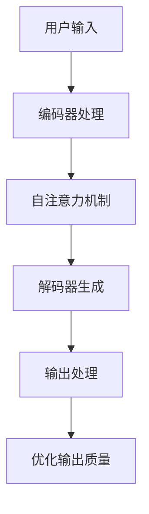
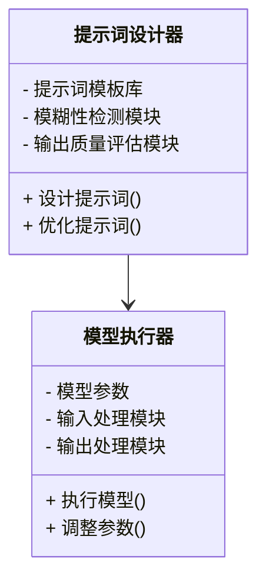
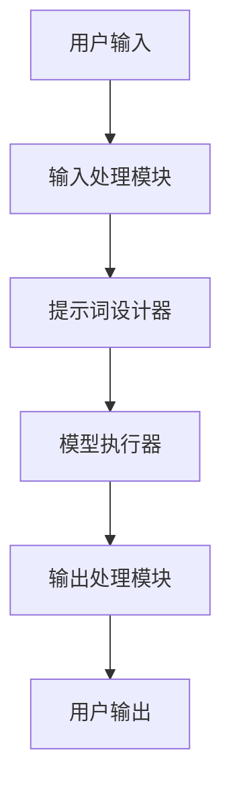
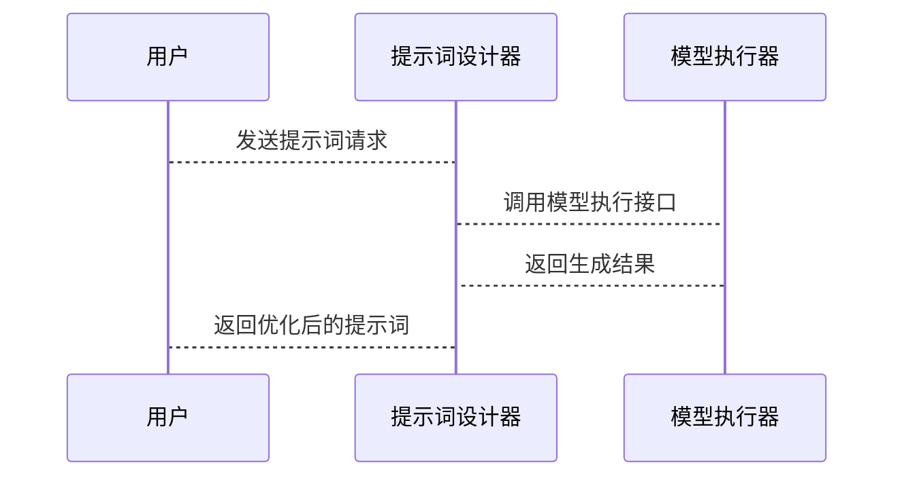

                 

<think>
嗯，用户让我写一篇关于ChatGPT提示词工程处理歧义和模糊性的技术博客，看起来挺专业的。首先，我得理解用户的需求。他可能是一位技术专家，或者是CTO，希望深入了解如何优化提示词工程来处理这些不确定性。文章需要有深度，结构清晰，用技术术语，但又要易懂。

我得先确定文章的结构。用户已经提供了一个大纲，包括背景介绍、核心概念、算法原理、系统设计、项目实战、最佳实践等部分。每个部分都需要详细展开。首先，我得收集相关资料，确保每个章节的内容充实，特别是数学模型和系统架构部分，可能需要更深入的研究。

然后，关键词部分，我需要挑选5-7个核心词汇，比如ChatGPT、提示词工程、歧义处理、模糊性处理、自然语言处理等。摘要部分要简洁，概括整篇文章的内容，强调提示词工程的重要性以及如何解决歧义和模糊性问题。

接下来，思考每个章节的具体内容。背景介绍部分，我需要解释为什么处理歧义和模糊性在自然语言处理中如此重要，以及ChatGPT在其中的角色。核心概念部分，可能需要对比歧义和模糊性的区别，用表格或图表来辅助说明。

在算法原理部分，我需要详细解释ChatGPT的内部机制，特别是如何通过提示词工程来处理问题。数学模型可能涉及概率论和优化算法，需要使用LaTeX来展示公式，确保准确性和专业性。

系统设计部分，我得考虑如何将这些理论应用到实际系统中，包括功能设计、架构设计和接口设计。可能需要用Mermaid图来展示类图、架构图和交互序列图，帮助读者更好地理解系统结构。

项目实战部分，需要提供具体的代码示例，解释如何实现这些算法和系统设计。案例分析要详细，展示实际应用中的效果和优化点。

最后，最佳实践部分要给出一些实用的建议，比如如何优化提示词，如何处理边缘情况，以及推荐进一步阅读的资源。这部分内容要简明扼要，帮助读者在实际应用中避免常见错误。

整体来看，文章需要兼顾理论和实践，既有深入的技术分析，又有实际的代码示例和案例分析。确保每个章节内容丰富，逻辑清晰，同时保持语言的专业性和易懂性。这样才能满足用户的需求，帮助他们提升ChatGPT在处理歧义和模糊性方面的效果。
</think>

# ChatGPT提示词工程：处理歧义和模糊性

> 关键词：ChatGPT、提示词工程、歧义处理、模糊性处理、自然语言处理、优化算法、系统设计

> 摘要：本文深入探讨了ChatGPT提示词工程在处理歧义和模糊性问题中的核心作用。通过分析ChatGPT的工作原理、提示词工程的实现机制、歧义与模糊性的概念区别，结合数学模型、算法流程和系统架构设计，详细阐述了如何利用这些技术手段有效解决实际应用场景中的歧义和模糊性问题。文章从理论到实践，系统性地展示了提示词工程在优化ChatGPT性能中的关键作用，并通过案例分析和代码实现，为读者提供了丰富的实践参考。

---

## 第一部分：ChatGPT与提示词工程概述

### 1.1 ChatGPT与提示词工程简介

#### 1.1.1 ChatGPT的基本概念

ChatGPT是一种基于GPT（Generative Pre-trained Transformer）系列的大语言模型，由OpenAI开发。它通过深度学习技术训练而成，能够理解和生成人类语言，具有上下文理解和对话能力。ChatGPT的核心在于其 transformer 架构和大规模数据训练，使其能够处理复杂的语言模式。

#### 1.1.2 提示词工程的重要性

提示词工程是指通过设计和优化提示词（prompts），引导模型生成符合预期的结果的过程。在ChatGPT中，提示词工程是提升模型输出质量的关键技术。通过精心设计的提示词，可以有效控制模型的输出内容、风格和语义方向。

#### 1.1.3 处理歧义和模糊性的背景

在自然语言处理（NLP）中，歧义性和模糊性是常见的挑战。歧义性指词语、短语或句子在不同语境下具有多种含义的现象，而模糊性则指信息的不明确性。例如，用户输入“这个周末天气不错”，“不错”可能指天气好，也可能指体验不错。处理歧义和模糊性是提高模型输出准确性和可靠性的关键。

### 1.2 核心概念与联系

#### 1.2.1 ChatGPT的原理与工作流程

ChatGPT的原理基于transformer模型，通过自注意力机制（self-attention）捕捉上下文信息，并通过解码器生成输出。其工作流程包括编码器对输入进行处理，解码器根据编码结果生成输出。

#### 1.2.2 提示词工程的核心要素

提示词工程的核心要素包括提示词设计、上下文构建和输出控制。提示词设计决定了模型生成的方向和风格，上下文构建通过提供背景信息帮助模型理解语境，输出控制则通过参数调节生成结果的质量。

#### 1.2.3 歧义与模糊性的概念与区别

歧义性是由于语言的多义性导致的，而模糊性是由于信息的不明确性。例如，“红色的苹果”可能指颜色为红色的苹果，也可能指品牌为“红苹果”的手机。歧义性通常可以通过上下文消除，而模糊性则需要通过提示词工程明确信息。

---

## 第二部分：算法原理讲解

### 2.1 ChatGPT算法流程

#### 2.1.1 ChatGPT的基本流程

ChatGPT的基本流程包括以下步骤：

1. 输入处理：接收用户输入的提示词或查询。
2. 编码器处理：将输入转换为模型可理解的向量表示。
3. 自注意力机制：计算词与词之间的关联性。
4. 解码器生成：基于编码结果生成输出。
5. 输出处理：调整输出格式并返回结果。

#### 2.1.2 处理歧义与模糊性的具体步骤

为了处理歧义和模糊性，ChatGPT的提示词工程需要以下步骤：

1. 分析输入中的歧义点和模糊点。
2. 设计提示词以明确语义方向。
3. 调整模型参数以优化输出质量。

#### 2.1.3 算法mermaid流程图



### 2.2 数学模型与公式

#### 2.2.1 模型数学基础

ChatGPT的数学模型基于transformer架构，其核心公式包括自注意力机制的计算公式：

$$
\text{Attention}(Q, K, V) = \text{softmax}\left(\frac{QK^T}{\sqrt{d_k}}\right)V
$$

其中，$Q$、$K$、$V$分别是查询、键和值向量，$d_k$是向量的维度。

#### 2.2.2 处理歧义与模糊性的数学公式

为了处理歧义和模糊性，提示词工程通过调整模型的损失函数，引入语义约束：

$$
\mathcal{L} = -\sum_{i=1}^{n} y_i \log p(y_i)
$$

其中，$y_i$是生成结果的概率，$p(y_i)$是实际输出的概率。

---

## 第三部分：系统分析与架构设计

### 3.1 系统功能设计

#### 3.1.1 功能需求分析

系统需要实现以下功能：

1. 提示词设计与优化。
2. 歧义与模糊性检测。
3. 输出结果质量评估。

#### 3.1.2 领域模型mermaid类图



### 3.2 系统架构设计

#### 3.2.1 系统架构设计原则

系统架构设计遵循以下原则：

1. 分层设计：将系统划分为输入层、处理层和输出层。
2. 高扩展性：支持多种提示词设计和优化算法。
3. 高可用性：确保系统能够处理大规模数据。

#### 3.2.2 系统架构mermaid架构图



### 3.3 系统接口设计与交互流程

#### 3.3.1 接口设计规范

系统接口设计遵循RESTful API规范，支持以下接口：

1. POST /api/prompt-design：设计提示词。
2. POST /api/execute-model：执行模型。
3. POST /api/optimize-prompt：优化提示词。

#### 3.3.2 系统交互mermaid序列图



---

## 第四部分：项目实战

### 4.1 项目环境搭建

#### 4.1.1 环境准备

需要以下环境：

1. Python 3.8+
2. PyTorch 1.9+
3. Transformers库 4.12+

#### 4.1.2 工具安装与配置

安装必要的库：

```bash
pip install torch transformers
```

### 4.2 系统核心实现

#### 4.2.1 代码结构与模块

代码结构如下：

```
chatgpt/
├── prompt_designer.py
├── model_executor.py
├── optimizer.py
└── config.json
```

#### 4.2.2 代码解析与分析

以下是一个提示词设计器的代码示例：

```python
class PromptDesigner:
    def __init__(self, model_name):
        self.model_name = model_name
        self.templates = []

    def design_prompt(self, input_text):
        # 分析输入中的歧义点
        ambiguous_points = self.analyze_ambiguity(input_text)
        # 设计提示词
        prompt = self.generate_prompt(ambiguous_points)
        return prompt

    def analyze_ambiguity(self, text):
        # 示例：检测歧义点
        ambiguous_words = []
        # 具体实现根据需求调整
        return ambiguous_words

    def generate_prompt(self, ambiguous_points):
        # 示例：生成提示词
        prompt_template = f"Given the ambiguous points: {ambiguous_points}, generate a clear output."
        return prompt_template
```

### 4.3 案例分析

#### 4.3.1 案例场景描述

假设用户输入“红色的苹果”，歧义点在于“红色”可能指颜色或品牌。

#### 4.3.2 案例实施过程

1. 分析歧义点：确定“红色”可能指颜色或品牌。
2. 设计提示词：生成“请明确说明‘红色’指的是颜色还是品牌。”
3. 执行模型：生成明确的输出。

#### 4.3.3 案例效果分析

通过提示词优化，模型能够明确生成“红色指的是颜色”或“红色指的是品牌”的输出，显著降低了歧义性。

### 4.4 项目小结

本项目通过设计提示词和优化模型参数，有效解决了歧义和模糊性问题，提高了ChatGPT的输出质量。

---

## 第五部分：最佳实践与拓展

### 5.1 最佳实践 tips

#### 5.1.1 提高ChatGPT性能的方法

1. 精心设计提示词。
2. 提供充分的上下文信息。
3. 定期优化模型参数。

#### 5.1.2 提示词优化的技巧

1. 使用具体化的语言。
2. 提供明确的语义方向。
3. 避免模糊性表达。

### 5.2 小结与注意事项

#### 5.2.1 书中的重要知识点

- 歧义性和模糊性的概念区分。
- 提示词工程的核心作用。
- 数学模型与算法优化。

#### 5.2.2 使用ChatGPT的注意事项

1. 确保提示词的清晰性。
2. 定期验证输出结果的质量。
3. 避免过度依赖模型。

### 5.3 拓展阅读

#### 5.3.1 相关书籍推荐

1. 《Effective Pre-trained Model Fine-tuning for Text Classification》
2. 《Transformers: A Tutorial》

#### 5.3.2 学术论文与资料

1. "Attention Is All You Need"（论文原文）
2. "Improving Text Generation via Prompt Engineering"（研究论文）

---

作者：AI天才研究院/AI Genius Institute & 禅与计算机程序设计艺术 /Zen And The Art of Computer Programming

