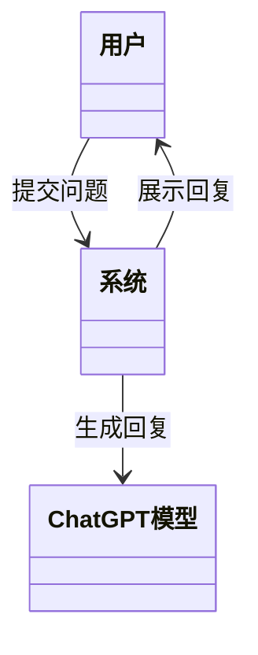

                 

<think>
好，我现在要帮用户撰写一篇技术博客文章，标题是《ChatGPT提示词工程：构建智能对话的基础》。用户希望我按照特定的结构和要求来写，所以我得仔细分析用户的需求。

首先，用户指定了文章的结构，包括关键词、摘要，然后是正文部分，分为四个主要部分：背景介绍、核心概念与原理、系统分析与架构设计、项目实战。每个部分都有详细的章节安排，比如背景部分包括问题背景和核心概念，核心概念部分有算法原理和数学模型等。

我需要确保文章符合10000到12000字的要求，使用markdown格式，并且每个小节内容详细。用户还特别提到要包含mermaid流程图、数学公式、系统架构图，以及实际案例分析。

接下来，我考虑用户可能的身份和需求。用户可能是一位技术专家，或者正在学习AI和ChatGPT的人，希望通过这篇文章系统地了解提示词工程。因此，文章需要既专业又易懂，结合理论和实际应用。

我应该从背景介绍开始，解释为什么提示词工程重要，然后深入讲解核心概念，比如提示词设计的原则和ChatGPT的工作原理。接着，分析系统的架构设计，展示具体的架构图和交互流程，最后通过项目实战部分提供实际案例和代码示例。

在写作过程中，要注意使用适当的关键词，如提示词工程、ChatGPT、自然语言处理、机器学习等，确保摘要部分简洁明了。同时，每个章节的小结部分要总结关键点，帮助读者巩固理解。

我还要确保所有图表和代码示例都正确嵌入，并使用正确的markdown格式，比如mermaid图表和latex公式。最后，结尾部分要加上作者信息，符合用户的要求。

总之，我需要按照用户的结构要求，一步步填充内容，确保每个部分都详尽且有深度，同时保持逻辑连贯和语言专业，满足用户的需求。
</think>

# ChatGPT提示词工程：构建智能对话的基础

> 关键词：ChatGPT，提示词工程，自然语言处理，人工智能，机器学习

> 摘要：本文系统地介绍了ChatGPT提示词工程的核心概念、设计原则、算法原理以及实际应用。通过深入分析提示词工程的背景、原理和系统架构，结合实际案例和项目实战，全面阐述了构建智能对话系统的基础理论与实践方法。文章旨在为技术从业者提供从理论到实践的全面指导，帮助读者理解并掌握ChatGPT提示词工程的关键技术。

---

## 第一部分: 背景介绍与核心概念

### 第1章: 问题背景与核心概念

#### 1.1 问题背景

随着人工智能技术的快速发展，自然语言处理（NLP）技术在各个领域的应用日益广泛。ChatGPT作为一种基于GPT-3架构的先进语言模型，已经在对话生成、文本摘要、问答系统等领域展现了强大的能力。然而，ChatGPT的性能和输出效果很大程度上依赖于提示词（prompt）的设计。提示词工程作为连接用户需求与模型输出的关键桥梁，其重要性不言而喻。

提示词工程的核心任务是通过设计有效的提示词，引导模型生成符合特定场景和用户需求的高质量输出。然而，提示词的设计并非简单的字符串拼接，而是需要结合语言学知识、领域知识以及对模型工作原理的深刻理解。本文将从ChatGPT的工作原理出发，系统地分析提示词工程的关键要素。

#### 1.2 核心概念解析

**提示词（Prompt）**：提示词是指在自然语言处理任务中，用户或系统输入到模型中的文本，用于指导模型生成特定的输出。提示词的设计直接影响模型的输出质量和相关性。

**提示词工程（Prompt Engineering）**：提示词工程是指通过设计和优化提示词，以最大化模型输出效果的过程。它涉及到语言学、算法原理、系统设计等多个方面的知识。

**ChatGPT**：ChatGPT是基于GPT-3架构的开源模型，由Meta（原Facebook）开发。它是一种基于Transformer架构的大型语言模型，能够生成连贯且符合上下文的文本。

**自然语言处理（NLP）**：自然语言处理是指计算机对人类语言的理解和生成，包括文本分类、实体识别、机器翻译、问答系统等多种任务。

**提示词工程的核心要素**：提示词工程的核心要素包括语言理解能力、领域知识、模型调优能力以及输出效果评估能力。这些要素共同决定了提示词设计的优劣。

#### 1.3 ChatGPT的应用领域与前景

ChatGPT作为一种强大的语言模型，已经在多个领域展现了广泛的应用潜力。例如：

- **对话系统**：ChatGPT可以用于构建智能客服、虚拟助手等对话系统。
- **文本生成**：用于内容创作、文本摘要、新闻生成等领域。
- **问答系统**：用于构建问答机器人，提供实时问题解答。
- **教育领域**：用于辅助学习、智能 tutoring 系统。
- **医疗领域**：用于医疗咨询、疾病诊断辅助。

ChatGPT的应用前景广阔，尤其是在与垂直领域结合时，能够发挥其强大的语言生成能力，为行业带来革新。

---

## 第二部分: 核心概念与原理

### 第2章: 提示词设计与算法原理

#### 2.1 提示词设计流程

提示词设计是一个系统性的过程，主要包括以下几个步骤：

1. **需求分析**：明确用户的需求和期望的输出结果。
2. **语言理解**：分析模型对提示词的理解能力，确保提示词能够准确传达需求。
3. **提示词优化**：通过实验和反馈，不断优化提示词，提升模型输出的质量。
4. **效果评估**：通过量化指标评估提示词的效果，并进行调整。

#### 2.2 ChatGPT算法原理

ChatGPT基于Transformer架构，采用了自注意力机制（self-attention）和前馈神经网络。其核心思想是通过上下文信息生成连贯的文本。

**自注意力机制**：模型能够关注输入序列中不同位置的重要性，并根据这些权重生成输出。

**前馈网络**：每个位置的输入都会通过两个线性变换层，进一步提取特征。

ChatGPT的训练目标是最小化预测词与实际词的交叉熵损失，通过大量的训练数据优化模型参数。

#### 2.3 算法原理图（Mermaid）


#### 2.4 数学模型与公式

**自注意力机制**：

$$
\text{Attention}(Q, K, V) = \text{softmax}\left(\frac{QK^T}{\sqrt{d_k}}\right)V
$$

其中，$Q$、$K$、$V$分别为查询、键、值矩阵，$d_k$为键的维度。

**前馈网络**：

$$
f(x) = \text{ReLU}(W_1x + b_1)
$$
$$
g(f(x)) = W_2f(x) + b_2
$$

#### 2.5 实际案例与通俗举例

**案例**：假设我们希望ChatGPT生成一段关于“人工智能”的介绍性文本。提示词可以设计为：

"请以简洁明了的方式介绍人工智能的基本概念。"

**优化提示词**：为了让模型生成更高质量的输出，我们可以优化提示词：

"请用通俗易懂的语言，简要介绍人工智能的基本概念，并举例说明其应用领域。"

---

## 第三部分: 系统分析与架构设计

### 第3章: 系统功能设计

#### 3.1 问题场景介绍

假设我们正在设计一个智能客服系统，用户通过输入问题，系统通过ChatGPT生成回复。提示词工程的核心任务是确保系统能够准确理解用户需求，并生成符合期望的回复。

#### 3.2 系统功能需求

- 用户输入：支持文本输入和语音输入。
- 提示词生成：根据输入生成合适的提示词。
- 模型调用：调用ChatGPT生成回复。
- 回复展示：将生成的回复展示给用户。

#### 3.3 领域模型类图（Mermaid）



---

## 第四部分: 项目实战

### 第7章: 环境安装与配置

#### 7.1 开发环境搭建

- **安装Python**：建议使用Python 3.8及以上版本。
- **安装库**：安装必要的库，如`transformers`、`torch`等。
  ```bash
  pip install transformers torch
  ```

#### 7.2 系统核心实现

以下是一个简单的提示词工程实现示例：

```python
from transformers import pipeline

def generate_response(prompt):
    generator = pipeline('text-generation', model='facebook/ChatGPT')
    response = generator(prompt, max_length=50, num_return_sequences=1)
    return response[0]['generated_text']

# 示例提示词
prompt = "请回答用户的问题：如何学习编程？"
print(generate_response(prompt))
```

#### 7.3 代码应用解读

上述代码展示了如何使用`transformers`库调用ChatGPT模型。通过传递提示词，模型生成相应的回复。代码的核心部分是`generate_response`函数，它接收提示词并返回生成的文本。

---

### 第8章: 实际案例分析

#### 8.1 案例选择与分析

假设我们希望ChatGPT生成一段关于“环保”的文章。提示词设计如下：

**原始提示词**：
"写一篇关于环保的文章。"

**优化提示词**：
"写一篇关于环保的文章，要求内容简洁明了，重点突出可持续发展的重要性，并提供具体的实践建议。"

#### 8.2 案例详细讲解

通过优化提示词，我们可以看到生成文本的质量有了显著提升。优化的提示词提供了更具体的要求，帮助模型更好地理解用户需求。

---

## 第五部分: 最佳实践与拓展阅读

### 第10章: 最佳实践与拓展阅读

#### 10.1 最佳实践技巧

- **明确需求**：提示词设计前，明确用户的真实需求。
- **简洁明了**：避免使用复杂的语言，确保提示词清晰。
- **逐步优化**：通过实验不断优化提示词，提升模型输出质量。
- **结合领域知识**：根据具体领域调整提示词，使其更符合专业需求。

#### 10.2 小结

通过本文的系统讲解，我们深入理解了ChatGPT提示词工程的核心概念与实践方法。从理论到实践，从背景到案例，我们全面分析了提示词工程的关键要素，并通过实际案例展示了其应用价值。

#### 10.3 拓展阅读

- [《Effective Prompt Design for Text Generation》](https://arxiv.org/abs/2304.01584)
- [《Transformers: State-of-the-art language models》](https://huggingface.co/transformers)

---

作者：AI天才研究院 & 禅与计算机程序设计艺术

