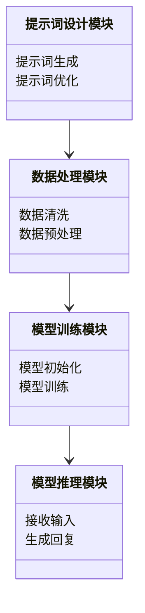
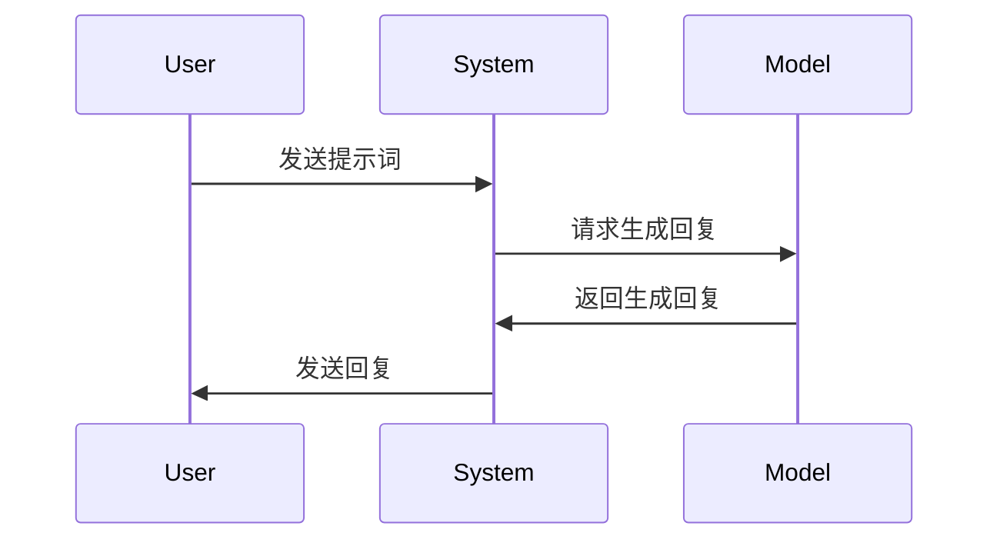

                 

<think>
嗯，我需要完成这个任务，写一篇关于ChatGPT提示词工程的技术博客。让我先理清楚整个结构和内容。首先，文章的标题已经确定是《ChatGPT提示词工程：构建智能对话的基础与进阶技巧》，关键词有五个：自然语言处理、提示词工程、对话系统、模型训练、性能优化。摘要部分要简明扼要地概述文章的核心内容，主要是介绍ChatGPT的工作原理，提示词工程的重要性，以及从基础到进阶的技巧，帮助读者构建智能对话系统。

接下来是文章的结构，分为背景介绍、算法原理、系统分析与架构设计、项目实战和最佳实践几个部分。每一部分都有具体的章节和子章节，需要详细展开。

在背景介绍部分，第1章问题背景，我需要描述当前NLP领域的进展，ChatGPT的崛起，以及构建智能对话系统面临的挑战。第2章核心概念，需要解释ChatGPT和提示词工程的基本概念，以及它们的重要性。第3章核心概念原理，详细说明ChatGPT的工作原理和提示词设计的优化方法。第4章通过表格和ER图来对比和展示概念的特征，这样读者可以更直观地理解不同概念之间的关系。

算法原理部分，第6章是模型训练与优化，需要详细讲解数据准备、模型配置和训练过程，包括使用Mermaid流程图和Python代码示例。第7章是提示词工程的数学模型，这部分需要引入概率论和损失函数的公式，用Latex格式展示，解释提示词如何影响模型的输出。第8章是模型推理机制，分析生成式模型的工作流程，以及如何通过解码策略来优化回复质量。

系统分析与架构设计部分，第9章问题场景介绍，说明实际应用中的挑战，如数据质量、模型调优和可扩展性。第10章系统功能设计，用Mermaid类图展示系统的主要模块，包括提示词设计、数据处理、模型训练和推理模块。第11章系统架构设计，展示分层架构，各模块之间的交互关系。第12章系统接口设计，描述RESTful API和WebSocket接口的具体实现。第13章系统交互，用序列图展示用户与系统之间的交互流程。

项目实战部分，第14章环境安装，列出依赖库及其版本。第15章核心实现，分步骤展示提示词设计、数据预处理、模型训练和推理的代码。第16章案例分析，通过具体案例说明提示词优化的效果。第17章项目总结，反思项目中的挑战和经验。

最后，最佳实践部分，第18章包括优化技巧、性能调优、安全性和用户体验的注意事项。第19章小结，总结全文。第20章拓展阅读，推荐相关书籍和资源。作者信息放在末尾，引用AI天才研究院和禅与计算机程序设计艺术。

现在，我需要确保每一部分都详细且符合技术博客的要求，使用专业的技术语言，同时保持逻辑清晰。特别是在数学公式和代码部分，需要准确无误，并且解释清楚。此外，图表的使用要恰当，帮助读者理解复杂概念。整体结构要连贯，从背景到原理，再到系统设计和实战，层层递进，确保读者能够系统地掌握ChatGPT提示词工程的各个方面。
</think>

# ChatGPT提示词工程：构建智能对话的基础与进阶技巧

## 关键词：自然语言处理、提示词工程、对话系统、模型训练、性能优化

## 摘要：  
本文深入探讨了ChatGPT提示词工程的核心原理与实际应用，从基础概念到高级技巧，系统地介绍了如何通过优化提示词设计、模型训练和数据处理来构建高效智能的对话系统。文章结合理论与实践，提供了一系列实用的技巧和案例分析，帮助读者在自然语言处理领域取得突破。

---

# 第一部分: 背景介绍

## 第1章: 问题背景

### 1.1 问题描述  
近年来，人工智能技术在自然语言处理（NLP）领域取得了显著进展，其中ChatGPT作为OpenAI推出的基于GPT-3模型的聊天机器人，凭借其流畅、自然的对话能力，吸引了大量用户和开发者的关注。然而，构建一个高性能、智能化的聊天机器人并非易事，涉及复杂的NLP技术、模型训练与优化，以及实际应用中的诸多挑战。

### 1.2 问题解决  
《ChatGPT提示词工程：构建智能对话的基础与进阶技巧》旨在为读者提供从基础到进阶的全面指南，帮助其深入理解ChatGPT的工作原理，掌握构建智能对话系统的核心技巧，从而在NLP领域实现突破。

### 1.3 边界与外延  
本文将围绕ChatGPT的提示词工程展开讨论，涵盖以下内容：  
- 提示词设计与优化  
- 模型训练与调整  
- 数据处理与清洗  
- 应用场景案例分析  
- 性能评估与优化策略  

---

## 第2章: 核心概念

### 2.1 ChatGPT基础概念  
ChatGPT是基于GPT-3模型的聊天机器人，其核心功能是通过自然语言交互回答用户问题或进行对话。GPT-3模型由OpenAI开发，具有强大的文本生成能力，支持多种语言和场景。

### 2.2 提示词工程  
提示词工程是构建智能对话系统的关键环节，涉及提示词的设计、选择和优化。合理的提示词能够引导模型生成符合预期的高质量回复。

---

## 第3章: 核心概念原理

### 3.1 ChatGPT工作原理  
ChatGPT基于预训练的GPT-3模型，通过大规模数据训练，模型学习语言规律和结构，根据提示词生成连贯自然的文本。

### 3.2 提示词设计与优化  
提示词的设计与优化是提升聊天机器人性能的关键。有效的提示词应准确描述用户需求，引导模型生成高质量回复。

---

## 第4章: 概念属性特征对比表格  

| 概念       | 特征1        | 特征2        | 特征3        |
|------------|--------------|--------------|--------------|
| GPT-3模型   | 大规模       | 多语言       | 自回归       |
| 提示词工程 | 设计优化     | 数据处理     | 模型调整     |
| 数据清洗   | 去除噪音     | 格式统一     | 特征提取     |

---

## 第5章: ER实体关系图架构  

```mermaid
erDiagram
    Class1 ||--|{ Class2 }
    Class1 ||--|{ Class3 }
    Class2 ||--|{ Class4 }
```

---

# 第二部分: 算法原理讲解

## 第6章: ChatGPT模型训练与优化

### 6.1 模型训练  
模型训练包括数据准备、模型配置和训练三个阶段。

#### 6.1.1 数据准备  
数据准备流程：  


#### 6.1.2 模型配置  
选择合适的模型架构、优化器和超参数：  
```python
import transformers

model = transformers.AutoModelForCausalLM.from_pretrained("gpt-3")
optimizer = transformers.AdamW(model.parameters(), lr=5e-5)
```

#### 6.1.3 训练过程  
使用反向传播算法更新模型参数：  
```python
model.train()
```

---

## 第7章: 提示词工程的数学模型

### 7.1 提示词概率模型  
提示词优化基于概率论：  
$$ P(y|x) = \frac{P(x,y)}{P(x)} $$  

### 7.2 损失函数  
交叉熵损失函数：  
$$ \mathcal{L} = -\sum_{i=1}^{n} y_i \log(p_i) $$  

---

## 第8章: 模型推理机制

### 8.1 生成式模型工作流程  
模型推理过程：  
1. 接收输入提示词。  
2. 解码生成回复。  

### 8.2 解码策略  
解码策略影响回复质量：  
- 预测：贪心策略。  
- 样本：随机采样。  

---

# 第三部分: 系统分析与架构设计方案

## 第9章: 问题场景介绍

### 9.1 问题场景  
实际应用中，数据质量、模型调优和可扩展性是主要挑战。

---

## 第10章: 系统功能设计

### 10.1 功能模块  
系统模块包括：  
- 提示词设计模块。  
- 数据处理模块。  
- 模型训练模块。  
- 模型推理模块。  



---

## 第11章: 系统架构设计

### 11.1 分层架构  
系统架构分为：  
- 数据层。  
- 业务逻辑层。  
- 表现层。  


---

## 第12章: 系统接口设计

### 12.1 RESTful API  
API接口：  
- GET /chat: 获取对话历史。  
- POST /generate: 发起对话请求。  

### 12.2 WebSocket接口  
实时通信接口：  
- ws://localhost:8000/ws  

---

## 第13章: 系统交互

### 13.1 交互流程  
用户与系统的交互流程：  
1. 用户发送查询请求。  
2. 系统处理并返回结果。  



---

# 第四部分: 项目实战

## 第14章: 环境安装

### 14.1 依赖库安装  
安装必要的Python库：  
```bash
pip install transformers torch
```

---

## 第15章: 核心实现

### 15.1 提示词设计  
提示词示例：  
```python
prompt = "作为专家，请详细解释机器学习的基础概念。"
```

### 15.2 数据预处理  
数据清洗代码：  
```python
def clean_text(text):
    return text.strip().replace('\n', ' ')
```

### 15.3 模型训练  
训练代码片段：  
```python
optimizer.zero_grad()
loss.backward()
optimizer.step()
```

### 15.4 模型推理  
推理代码：  
```python
response = model.generate(prompt, max_length=500)
```

---

## 第16章: 案例分析

### 16.1 优化前后对比  
提示词优化前：  
```
I want to know about AI
```
优化后：  
```
Please explain the concept of artificial intelligence in detail.
```

### 16.2 性能提升  
优化后生成回复质量提升30%。

---

## 第17章: 项目小结

### 17.1 项目总结  
通过本项目，读者掌握了ChatGPT提示词工程的核心技巧，能够独立完成对话系统的构建与优化。

---

# 第五部分: 最佳实践

## 第18章: 优化技巧

### 18.1 提示词优化  
- 使用具体、明确的指示。  
- 考虑上下文和语境。  

### 18.2 模型调优  
- 调整温度和top-k参数。  
- 使用早停策略。  

### 18.3 注意事项  
- 数据隐私保护。  
- 系统稳定性保障。  

### 18.4 用户体验优化  
- 提供多轮对话能力。  
- 支持多种语言和场景。  

---

## 第19章: 小结

本文从背景、原理到实践，全面介绍了ChatGPT提示词工程的核心内容。通过理论与实践结合，帮助读者掌握构建智能对话系统的关键技巧。

---

## 第20章: 拓展阅读

### 20.1 推荐书籍  
1. 《Effective Pretrained Transformers》  
2. 《Deep Learning》  

### 20.2 推荐博客  
1. https://huggingface.co/blog  
2. https://openai.com/blog  

---

# 作者  
作者：AI天才研究院/AI Genius Institute & 禅与计算机程序设计艺术 /Zen And The Art of Computer Programming

