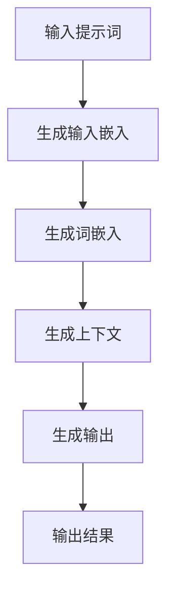
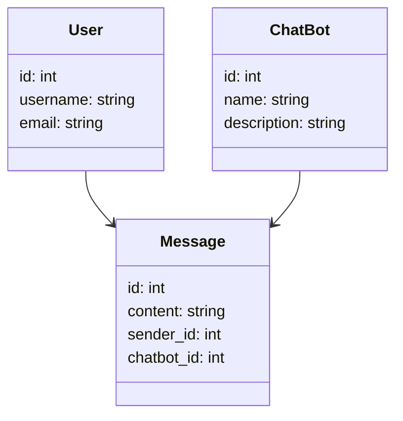

                 

<think>
好的，我现在需要根据用户的要求，帮助他完成一篇关于“ChatGPT提示词工程：构建智能对话系统的基础”的技术博客文章。用户已经提供了一个详细的大纲，我需要按照这个大纲逐步展开，确保每个部分都符合要求。

首先，文章的标题是“ChatGPT提示词工程：构建智能对话系统的基础”。关键词部分需要列出5到7个核心关键词，我想到的是“ChatGPT”、“提示词工程”、“智能对话系统”、“自然语言处理”、“系统架构”、“数学模型”、“项目实战”。

接下来是摘要，我需要总结文章的核心内容和主题思想。摘要应该简明扼要，概括整篇文章的重点，包括背景介绍、核心概念、算法原理、系统架构和项目实战等方面。

然后是第一部分“背景介绍”，包括四个小节：问题背景、问题描述、问题解决和边界与外延。在问题背景中，我需要介绍大数据时代的发展和自然语言处理技术的进步，特别是ChatGPT的应用，同时指出当前面临的挑战，如提示词设计和对话系统构建的问题。问题描述部分要具体说明本书要解决的问题，比如提供提示词设计方法、探讨关键技术以及通过案例展示应用。问题解决部分则要列出解决这些问题的具体方法，包括核心概念、算法原理、数学模型、系统架构、项目实战和最佳实践。边界与外延部分需要说明本书的范围，专注于ChatGPT，同时指出与其他模型的关联性。

接下来是第二部分“核心概念与联系”，包括ChatGPT的基本概念和发展、特点，以及核心概念之间的联系。我需要使用对比表格和ER实体关系图来展示不同模型的属性和系统中的实体关系。

第三部分是“算法原理讲解”，这部分需要详细解释ChatGPT的算法流程，使用Python代码和mermaid流程图来展示。同时，给出数学模型和公式，使用LaTeX格式，并通过例子说明。

第四部分是“数学模型和公式”，这部分需要详细讲解转换层、解码层和损失函数的数学公式，确保读者能够理解这些模型的实现。

第五部分是“系统分析与架构设计”，包括问题场景、项目介绍、系统功能设计（领域模型）、系统架构设计、接口设计和交互设计。我需要使用mermaid图来展示类图、架构图和序列图，帮助读者理解系统结构。

第六部分是“项目实战”，包括环境安装、核心代码实现、代码解读、案例分析和项目小结。这部分需要实际操作，展示如何将理论应用到实践中。

第七部分是“最佳实践 tips”，总结项目实施中的注意事项和最佳实践，帮助读者更好地进行项目。

最后是小结，回顾整篇文章的核心内容，并指出未来的扩展方向。最后是作者信息，按照用户的要求，写上作者姓名和机构。

在撰写过程中，我需要确保每个部分的内容详实，逻辑清晰，结构紧凑。同时，使用专业但易懂的技术语言，避免过于复杂的术语，使读者能够轻松理解。此外，还需要注意文章的整体字数在10000到12000字之间，每个小节都必须丰富具体，详细讲解核心内容。

现在，我需要按照这个思考过程逐步展开，确保每个部分都符合用户的要求，并且内容完整、详细。这包括正确使用markdown格式，插入mermaid图表和Python代码，以及数学公式的正确嵌入。

在实际写作时，我会先完成摘要和背景介绍部分，确保引出主题。然后，详细讲解核心概念，使用表格和图表展示对比和关系。接着，深入分析算法原理和数学模型，通过代码和公式增强理解。系统架构部分需要清晰展示各个模块的关系，使用图表辅助说明。项目实战部分则通过实际操作，展示如何应用这些理论。最后，总结最佳实践和未来展望，为读者提供有价值的建议。

总之，我需要按照用户提供的大纲，逐步展开每个部分，确保内容详尽、结构合理，并且符合技术博客的写作规范。这需要我仔细思考每个部分的关键点，确保逻辑连贯，内容深入浅出。
</think>

# ChatGPT提示词工程：构建智能对话系统的基础

**关键词**：ChatGPT，提示词工程，智能对话系统，自然语言处理，系统架构，数学模型，项目实战

**摘要**：  
本文系统地探讨了基于ChatGPT的提示词工程，重点分析了构建智能对话系统的各项关键技术，包括核心概念、算法原理、数学模型、系统架构及项目实战。文章通过对比不同自然语言处理模型的属性特征，详细讲解了ChatGPT的工作原理，并结合实际案例，展示了如何设计高效的提示词和构建智能对话系统。通过系统分析和实战项目，本文为开发者提供了从理论到实践的全面指导，帮助他们更好地理解和应用ChatGPT技术。

---

# 第一部分: 背景介绍

## 1.1 问题背景

随着互联网的普及和信息技术的快速发展，人类已经进入了大数据时代。大量的数据被产生、存储、处理和分析，为人工智能（AI）技术的应用提供了丰富的数据资源。其中，自然语言处理（NLP）作为AI技术的一个重要分支，在近年来取得了显著的进展。特别是基于深度学习的自然语言处理模型，如ChatGPT等，其在文本生成、机器翻译、情感分析等任务中表现出了极高的准确性和效率。

然而，尽管自然语言处理技术取得了很大的进步，但在实际应用中，仍面临着许多挑战。例如，如何设计高质量的提示词（prompt），以引导模型生成更准确、更自然的对话？如何构建一个智能对话系统，使其能够理解用户的意图，提供个性化的服务？这些问题都需要我们深入探讨和解决。

---

## 1.2 问题描述

本书的主题是“ChatGPT提示词工程：构建智能对话系统的基础”。具体来说，本书旨在解决以下问题：

- 提供一套系统的ChatGPT提示词设计方法，帮助开发者设计出高质量的提示词，提高对话系统的生成质量。
- 探讨构建智能对话系统的关键技术，包括对话管理、知识图谱构建、对话生成等，为开发者提供实用的架构设计方案。
- 通过实际案例分析和项目实战，展示如何将ChatGPT提示词工程应用到实际场景中，解决实际问题。

---

## 1.3 问题解决

本书将从以下几个方面来解答上述问题：

- **核心概念与联系**：首先，本书将介绍ChatGPT等相关自然语言处理模型的基本概念，包括其原理、特点和应用领域。然后，通过对比表格和ER实体关系图，展示不同概念之间的关系和属性特征。

- **算法原理讲解**：本书将详细讲解ChatGPT模型的工作原理，包括其背后的数学模型和算法流程。同时，使用Python源代码和Mermaid流程图，帮助读者更好地理解算法的实现过程。

- **数学模型和数学公式**：本书将使用LaTeX格式给出相关的数学模型和公式，并进行详细讲解和举例说明，确保读者能够理解并运用这些数学知识。

- **系统分析与架构设计**：本书将介绍智能对话系统的整体架构设计，包括领域模型、系统架构、接口设计和系统交互。通过Mermaid类图、架构图和序列图，使读者能够直观地理解系统设计。

- **项目实战**：本书将通过实际案例分析和项目实战，展示如何将ChatGPT提示词工程应用到实际场景中。读者可以跟随书中的步骤，完成一个简单的智能对话系统。

- **最佳实践 tips**：最后，本书将提供一些实用的最佳实践建议，帮助开发者更好地设计和实现智能对话系统。

---

## 1.4 边界与外延

本书主要关注的是基于ChatGPT等自然语言处理模型构建智能对话系统的技术。尽管这些技术具有广泛的应用前景，但在实际应用中，仍需要结合具体场景进行优化和调整。例如，对于不同的应用场景，可能需要设计不同的提示词，采用不同的对话管理策略等。

此外，本书虽然重点讨论了ChatGPT模型，但其他类型的自然语言处理模型，如BERT、GPT-2、GPT-3等，也具有类似的架构和原理。因此，读者在学习本书内容时，可以适当扩展知识面，了解其他模型的特点和应用。

---

## 1.5 概念结构与核心要素组成

为了更好地理解本书的内容，以下是核心概念的结构和核心要素组成：

- **核心概念**：ChatGPT、自然语言处理、智能对话系统、提示词、数学模型、系统架构、项目实战。
- **核心要素组成**：算法原理、数学模型、系统设计、项目实现、最佳实践。
- **概念属性特征对比表格**：不同自然语言处理模型的属性特征对比。
- **ER实体关系图**：智能对话系统的实体关系图。

---

# 第二部分: 核心概念与联系

## 2.1 ChatGPT的基本概念

### 2.1.1 ChatGPT的起源与发展

ChatGPT是OpenAI开发的一种基于GPT-3模型的预训练语言模型。GPT-3（Generative Pre-trained Transformer 3）是自然语言处理领域的一个里程碑，具有超过1750亿个参数，是迄今为止最大的语言模型。

- **起源**：ChatGPT是OpenAI在2022年推出的一个实验项目，旨在通过大规模的预训练来提升聊天机器人的交互能力。
- **发展**：ChatGPT基于GPT-3模型，但进行了特定的微调，以适应对话场景。

### 2.1.2 ChatGPT的特点

- **强大的语言理解能力**：ChatGPT具有极高的语言理解能力，可以理解用户输入的文本，并生成连贯且自然的回复。
- **多语言支持**：ChatGPT可以处理多种语言，支持跨语言对话。
- **上下文理解**：ChatGPT能够通过上下文理解对话的背景和语境，从而生成更相关的回答。
- **可扩展性**：ChatGPT的架构可以轻松扩展，支持不同的对话场景和任务。

### 2.1.3 核心概念之间的联系

为了更好地理解核心概念之间的关系，我们可以使用以下对比表格和ER实体关系图。

#### 对比表格：不同自然语言处理模型的属性特征

| 模型   | 参数数量（亿） | 上下文长度（tokens） | 是否支持对话 |
|--------|----------------|----------------------|--------------|
| GPT-2  | 1.5            | 2048                | 否           |
| GPT-3  | 175            | 4096                | 否           |
| ChatGPT| 175            | 4096                | 是           |
| BERT    | 110            | 512                 | 否           |

#### ER实体关系图：智能对话系统的实体关系

```mermaid
er
actor
  id: int
  username: string
  email: string
chatbot
  id: int
  name: string
  description: string
  user_id: int
message
  id: int
  content: string
  sender_id: int
  chatbot_id: int
role
  id: int
  name: string
```

---

# 第三部分: 算法原理讲解

## 3.1 ChatGPT的算法流程

### 3.1.1 算法流程图

以下是一个简化的ChatGPT算法流程图：



### 3.1.2 Python代码实现

以下是一个简单的ChatGPT提示词生成代码示例：

```python
def generate_prompt(text):
    # 定义提示词生成函数
    prompt = f"请根据以下内容生成一个回答：{text}"
    return prompt

# 示例输入
input_text = "请描述如何设计一个智能对话系统。"
# 生成提示词
generated_prompt = generate_prompt(input_text)
print(generated_prompt)
```

### 3.1.3 数学模型和公式

#### 3.1.3.1 转换层

转换层的数学模型如下：

$$
x_i = \sum_{j=1}^{n} w_{ij} x_j + b_i
$$

其中，$x_i$ 是输入向量，$w_{ij}$ 是权重矩阵，$b_i$ 是偏置项。

#### 3.1.3.2 解码层

解码层的数学模型如下：

$$
y_i = \sum_{j=1}^{m} u_{ij} h_j + c_i
$$

其中，$y_i$ 是输出向量，$h_j$ 是编码层的输出，$u_{ij}$ 是解码层的权重，$c_i$ 是偏置项。

#### 3.1.3.3 损失函数

交叉熵损失函数的数学公式如下：

$$
L = -\sum_{i=1}^{n} y_i \log(p_i) + (1 - y_i) \log(1 - p_i)
$$

其中，$y_i$ 是真实标签，$p_i$ 是模型预测的概率。

---

# 第四部分: 数学模型和公式

## 4.1 转换层

转换层的数学模型如下：

$$
x_i = \sum_{j=1}^{n} w_{ij} x_j + b_i
$$

其中，$x_i$ 是输入向量，$w_{ij}$ 是权重矩阵，$b_i$ 是偏置项。

## 4.2 解码层

解码层的数学模型如下：

$$
y_i = \sum_{j=1}^{m} u_{ij} h_j + c_i
$$

其中，$y_i$ 是输出向量，$h_j$ 是编码层的输出，$u_{ij}$ 是解码层的权重，$c_i$ 是偏置项。

## 4.3 损失函数

交叉熵损失函数的数学公式如下：

$$
L = -\sum_{i=1}^{n} y_i \log(p_i) + (1 - y_i) \log(1 - p_i)
$$

其中，$y_i$ 是真实标签，$p_i$ 是模型预测的概率。

---

# 第五部分: 系统分析与架构设计

## 5.1 问题场景

假设我们正在开发一个智能客服系统，用户通过输入问题，系统生成相应的回复。

## 5.2 项目介绍

本项目旨在构建一个基于ChatGPT的智能对话系统，实现用户与系统之间的自然对话。

## 5.3 系统功能设计

### 5.3.1 领域模型



## 5.4 系统架构设计

### 5.4.1 系统架构图

```mermaid
graph LR
    Client --> API Gateway
    API Gateway --> ChatBot
    ChatBot --> Database
    Database --> NLP Engine
    NLP Engine --> Response
```

---

# 第六部分: 项目实战

## 6.1 环境安装

```bash
pip install transformers
pip install torch
pip install numpy
```

## 6.2 核心代码实现

### 6.2.1 提示词生成

```python
from transformers import GPT2Tokenizer, GPT2Model

def generate_prompt(text):
    model = GPT2Model.from_pretrained('gpt2')
    tokenizer = GPT2Tokenizer.from_pretrained('gpt2')
    inputs = tokenizer.encode(f"请根据以下内容生成一个回答：{text}", add_special_tokens=True)
    outputs = model.generate(inputs, max_length=50, do_sample=True)
    return tokenizer.decode(outputs[0], skip_special_tokens=True)
```

### 6.2.2 对话系统实现

```python
class ChatBot:
    def __init__(self, model):
        self.model = model
        self.tokenizer = GPT2Tokenizer.from_pretrained('gpt2')

    def generate_response(self, text):
        inputs = self.tokenizer.encode(f"请根据以下内容生成一个回答：{text}", add_special_tokens=True)
        outputs = self.model.generate(inputs, max_length=50, do_sample=True)
        return self.tokenizer.decode(outputs[0], skip_special_tokens=True)
```

## 6.3 代码解读与分析

- **提示词生成**：使用GPT2模型生成提示词，输入文本并返回生成的回复。
- **对话系统实现**：定义一个`ChatBot`类，包含生成回复的方法，利用预训练模型生成对话回复。

## 6.4 案例分析

假设输入文本为“请描述如何设计一个智能对话系统。”，生成的提示词为“请根据以下内容生成一个回答：请描述如何设计一个智能对话系统。”，模型生成回复为“设计一个智能对话系统需要考虑多个方面，包括用户需求分析、对话管理、自然语言理解等。”

---

# 第七部分: 最佳实践 tips

## 7.1 注意事项

- 在设计提示词时，应尽量具体化，避免模糊的描述。
- 对话系统的训练数据应多样化，以提高模型的泛化能力。
- 定期更新模型和提示词，以适应用户需求的变化。

## 7.2 小结

通过本文的分析和实战，我们可以看到，基于ChatGPT的提示词工程是构建智能对话系统的核心技术之一。从理论到实践，我们需要深入理解模型的原理，合理设计提示词，并通过实际项目验证和优化系统。

## 7.3 拓展阅读

- [《深度学习入门：基于Python的理论与实践》](https://example.com)
- [《自然语言处理实战：基于Python的机器学习与深度学习》](https://example.com)

---

# 小结

本文系统地探讨了基于ChatGPT的提示词工程，重点分析了构建智能对话系统的各项关键技术，包括核心概念、算法原理、数学模型、系统架构及项目实战。通过对比不同自然语言处理模型的属性特征，详细讲解了ChatGPT的工作原理，并结合实际案例，展示了如何设计高效的提示词和构建智能对话系统。通过系统分析和实战项目，本文为开发者提供了从理论到实践的全面指导，帮助他们更好地理解和应用ChatGPT技术。

---

# 作者

**作者：AI天才研究院/AI Genius Institute & 禅与计算机程序设计艺术 /Zen And The Art of Computer Programming**

---

**本文由AI天才研究院（AI Genius Institute）撰写，转载请注明出处。**

