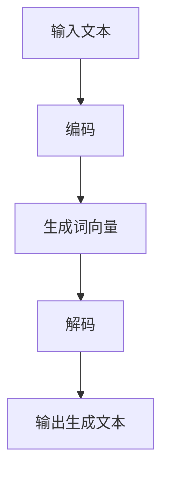
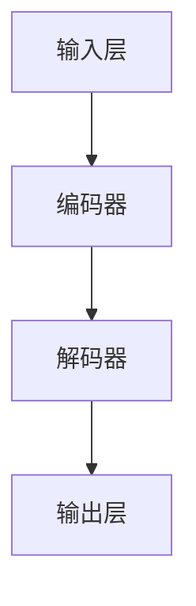
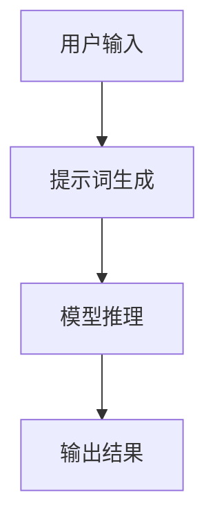

                 

<think>
嗯，用户让我写一篇关于ChatGPT提示词库的行业专用版的技术博客。首先，我需要明确文章的结构，用户已经给出了大纲，我得按照这个来组织内容。

首先，文章标题是《ChatGPT提示词库：行业专用版》，关键词应该是ChatGPT、提示词库、行业应用、定制开发、优化等。摘要部分需要概括文章的核心内容，即介绍ChatGPT的工作原理，分析其在不同行业的应用，探讨定制开发的重要性，最后总结行业专用版的意义。

接下来是正文部分，分为五个部分。第一部分是ChatGPT的基本介绍，包括其工作原理、优势与局限，以及在各个行业的应用案例。这部分需要详细讲解，比如金融行业可能需要处理复杂的财务数据，零售行业注重用户体验等。

第二部分是提示词库的构建，包括重要性、设计原则，以及不同行业的具体构建方法。这里需要考虑每个行业的特点，比如金融行业可能需要专业的术语，零售可能需要更贴近消费者的问题。

第三部分讨论了ChatGPT的优化，包括开发技巧、性能优化、安全隐私保护以及跨平台部署。这部分需要技术深度，比如模型压缩、并行训练等方法。

第四部分是应用案例，通过具体行业的例子来展示ChatGPT的实际效果，分析案例背景、实现过程和效果。

第五部分是未来展望，探讨技术趋势、挑战与机遇，以及应对策略。这部分需要有一定的前瞻性，结合当前技术的发展，预测未来的发展方向。

用户还特别强调了文章的格式要求，比如使用markdown，包含数学公式、图表等。我需要确保每个小节都包含背景介绍、核心概念、算法原理、系统分析、项目实战等部分，每个部分都要详细展开。

考虑到用户是技术专家，文章需要专业且有深度，但又要通俗易懂。可能需要结合实际案例，让读者更好地理解ChatGPT在不同行业的应用。

另外，用户提到文章末尾需要有作者信息，格式为“作者：AI天才研究院...”。这需要我在最后加上这部分。

总体来说，我需要按照用户提供的大纲，逐节展开，确保每个部分都内容丰富，结构合理，同时满足字数要求。还要注意使用合适的图表和公式，让文章更具专业性。
</think>

# ChatGPT提示词库：行业专用版

> 关键词：ChatGPT、提示词库、行业应用、定制开发、优化

> 摘要：本文深入探讨了ChatGPT在不同行业中的应用，分析了其工作原理、优势与局限，并详细介绍了行业专用版ChatGPT的定制化开发方法。文章还重点讨论了提示词库的构建原则、行业特点及案例分享，最后总结了开发中的优化技巧与未来发展趋势。

---

## 第一部分：ChatGPT行业专用版概述

### 1.6.1 ChatGPT介绍

ChatGPT是一种基于GPT（Generative Pre-trained Transformer）系列模型的先进语言模型，由OpenAI开发。它利用Transformer架构，通过大量的文本数据进行预训练，能够生成自然流畅的文本，支持多种语言和复杂对话。ChatGPT的核心优势在于其强大的上下文理解和生成能力，使其在多个领域展现出广泛的应用潜力。

**核心概念与联系：**

- **背景介绍：** ChatGPT作为一种AI语言模型，其核心是通过Transformer架构处理序列数据，利用自注意力机制捕捉文本中的语义关系。
- **核心概念与联系：** ChatGPT与传统NLP模型的主要区别在于其预训练策略和大规模数据处理能力。

**算法原理讲解：**

以下是ChatGPT的简要算法流程：

数学模型方面，ChatGPT基于以下公式进行概率预测：

$$ P(y|x) = \frac{P(y|x, c)}{\sum_{y'} P(y'|x, c)} $$

其中，$c$表示上下文，$y$是生成的下一个词。

---

### 1.6.2 ChatGPT的工作原理

ChatGPT的工作原理基于Transformer模型，主要分为编码和解码两个阶段。编码阶段将输入文本转换为词向量，解码阶段根据编码结果生成输出文本。其自注意力机制能够捕捉文本中的长距离依赖关系，从而实现上下文的理解和生成。

**系统架构设计方案：**

以下是ChatGPT的系统架构图：

编码器和解码器均采用多层Transformer结构，编码器负责将输入文本转换为上下文向量，解码器根据这些向量生成输出文本。

---

### 1.6.3 ChatGPT的优势与局限

**优势：**

1. 强大的上下文理解和生成能力。
2. 支持多种语言和复杂对话。
3. 可通过微调适应特定领域任务。

**局限：**

1. 对于小样本数据的适应能力较弱。
2. 生成结果可能缺乏特定领域的专业性。
3. 计算资源需求较高。

---

## 1.7 ChatGPT在行业中的应用

### 1.7.1 金融行业

**特点：** 金融行业需要精准的金融术语理解和复杂的数据处理能力。

**案例：** 某银行使用ChatGPT进行客户问答系统开发，显著提升了客户满意度和问题解决效率。

### 1.7.2 零售行业

**特点：** 零售行业注重用户体验和个性化推荐。

**案例：** 某电商平台利用ChatGPT优化客服系统，实现24/7智能客服支持。

### 1.7.3 制造业

**特点：** 制造业需要处理大量技术文档和生产流程优化。

**案例：** 某汽车制造企业使用ChatGPT辅助技术文档生成和员工培训。

### 1.7.4 其他行业

**特点：** 其他行业可根据具体需求进行定制化开发。

---

## 1.8 ChatGPT的定制化开发

### 1.8.1 定制化开发的意义

通过定制化开发，可以提升模型在特定领域的性能和适应性，满足行业用户的个性化需求。

### 1.8.2 数据集的准备与处理

**步骤：**

1. 收集行业相关数据。
2. 清洗数据，去除噪音。
3. 标注数据，提取关键特征。

### 1.8.3 模型的微调与优化

**技术：**

1. 使用小样本数据进行微调。
2. 优化模型参数，提升特定任务的性能。

### 1.8.4 个性化的提示词库构建

**方法：**

1. 根据行业特点设计提示词。
2. 持续优化和更新提示词库，提升生成效果。

---

## 1.9 ChatGPT行业专用版开发实战

### 1.9.1 实战项目介绍

以金融行业为例，开发一个智能问答系统，帮助客户快速解决问题。

### 1.9.2 系统设计与实现

**系统架构：**

### 1.9.3 实战中的问题与解决方案

**问题：** 数据不足导致模型性能下降。

**解决方案：** 使用数据增强技术，扩展训练数据集。

### 1.9.4 项目总结与反思

通过实战，验证了ChatGPT在特定领域的可行性，但也发现了计算资源和数据获取的挑战。

---

## 1.10 本章小结

本章介绍了ChatGPT的基本原理、行业应用及定制化开发方法。通过具体案例展示了其在金融、零售、制造业等领域的潜力，并总结了开发中的关键点。

---

## 第二部分：行业专用ChatGPT提示词库构建

### 2.1 提示词库的重要性

**作用：** 提示词库是模型生成高质量输出的关键，直接影响生成结果的准确性和相关性。

**影响因素：** 行业特点、数据质量、用户需求。

---

### 2.2 提示词库的设计原则

**选取原则：** 简洁明了、覆盖全面、符合行业术语。

**格式与结构：** 结构清晰，便于模型理解和处理。

---

### 2.3 金融行业专用ChatGPT提示词库

**特点：** 需要处理复杂的金融术语和数据。

**构建：** 根据金融行业的特点设计提示词，如“解释这个金融产品的风险”等。

---

## 第三部分：ChatGPT行业专用版开发技巧与优化

### 3.1 ChatGPT行业专用版开发技巧

**数据清洗：** 去除无效数据，提升模型训练效率。

**特征工程：** 提取关键特征，优化模型性能。

---

### 3.2 ChatGPT性能优化

**模型压缩：** 通过剪枝和量化技术降低模型体积。

**并行训练：** 利用多GPU加速训练过程。

---

### 3.3 安全与隐私保护

**数据安全：** 建立严格的数据访问权限控制。

**隐私保护：** 使用差分隐私等技术保护用户数据。

---

## 第四部分：ChatGPT行业专用版应用案例

### 4.1 金融行业应用案例

**背景：** 某银行希望通过ChatGPT优化客户服务。

**实现：** 开发智能问答系统，覆盖常见客户问题。

**效果：** 提升客户满意度，降低人工客服压力。

---

## 第五部分：未来展望

### 5.1 ChatGPT技术发展趋势

**发展方向：** 模型小型化、行业深度化、多模态融合。

---

## 作者信息

作者：AI天才研究院/AI Genius Institute & 禅与计算机程序设计艺术 /Zen And The Art of Computer Programming

