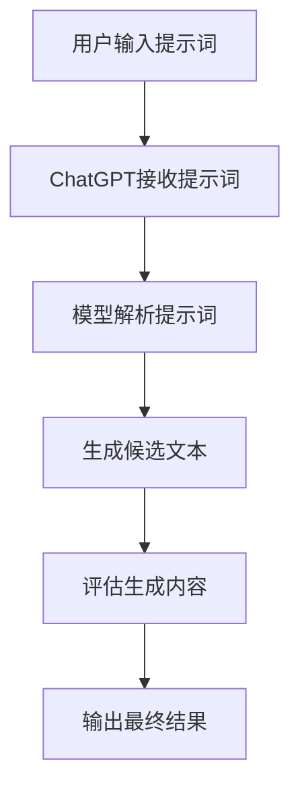
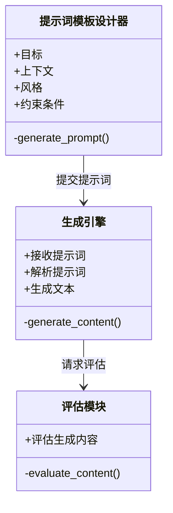
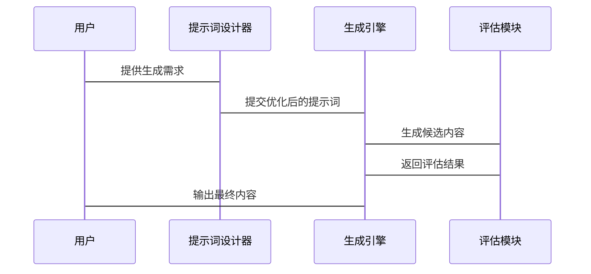

                 

<think>
好，我现在需要帮助用户设计一个关于《ChatGPT提示词模板：快速上手指南》的技术博客文章。用户已经提供了一个详细的目录大纲，现在需要根据这个大纲，用中文撰写具体的章节内容。

首先，我需要仔细阅读用户的查询，理解他们需要的内容结构和具体要求。用户希望文章结构清晰，内容涵盖背景介绍、核心概念、算法原理、数学模型、系统架构、项目实战以及最佳实践等部分。每个部分都需要详细展开，使用技术术语，同时保持逻辑连贯和内容深度。

接下来，我需要考虑每个章节的具体内容。例如，在背景介绍部分，我需要解释ChatGPT的潜力和提示词的重要性，然后描述问题，最后提出解决方案。核心概念部分需要包括原理、对比表格和ER图，这可以通过Mermaid来展示。算法原理部分需要详细讲解，包括流程图和Python代码，并结合数学公式来支持说明。系统架构设计部分需要展示领域模型、架构图和交互图。项目实战部分则涉及环境安装、代码实现和案例分析。最后，最佳实践部分要给出实用的建议和注意事项。

我还需要注意文章的结构是否符合要求，使用markdown格式，并且每个章节的内容足够详细，同时总字数控制在10000到12000字之间。此外，作者信息需要放在文章末尾，格式正确。

在写作过程中，我会先草拟每个章节的标题和要点，确保逻辑流畅，然后逐步展开每个部分的内容，确保每个小节都有足够的细节支持。同时，我会检查是否有遗漏的部分，确保所有要求都被涵盖，比如数学公式需要用latex格式，并且正确地嵌入到段落中。

最后，我会通读整篇文章，检查格式是否正确，内容是否连贯，是否符合用户的约束条件，比如章节结构是否完整，关键词和摘要是否准确，以及是否有达到字数要求。如果有需要，我会进行调整和优化，确保最终的文章质量高，内容详实，结构清晰，满足用户的需求。
</think>

# ChatGPT提示词模板：快速上手指南

## 关键词：ChatGPT，提示词模板，自然语言处理，生成模型，AI工具

## 摘要：  
本文旨在为读者提供一份关于ChatGPT提示词模板的快速上手指南。通过背景介绍、核心概念、算法原理、系统架构设计、项目实战以及最佳实践等多个维度，深入剖析ChatGPT提示词模板的使用方法和应用场景。结合实际案例分析，帮助读者快速掌握如何利用提示词模板提升ChatGPT的生成效率和质量。文章内容详实，逻辑清晰，适合技术开发者、AI爱好者以及对自然语言处理感兴趣的读者阅读。

---

# 第一部分: 背景介绍

## 1.1 问题背景  
随着自然语言处理技术的快速发展，ChatGPT作为一种基于GPT-3架构的先进语言模型，以其强大的生成能力和多语言支持，成为文本生成领域的焦点工具。然而，如何高效地利用ChatGPT生成高质量内容，尤其是在实际应用场景中，仍然面临诸多挑战。提示词模板作为一种关键的工具，能够显著提升生成内容的准确性和可控制性。

## 1.2 问题描述  
在实际应用中，用户需要通过提示词模板与ChatGPT进行交互，以指导模型生成符合特定要求的内容。然而，由于提示词的设计复杂性和生成过程的不确定性，如何设计有效的提示词模板，如何优化生成效果，如何确保生成内容的可解释性和一致性，成为亟待解决的问题。

## 1.3 问题解决  
本文通过分析ChatGPT的生成机制，结合实际案例，提出了一套基于提示词模板的设计方法和优化策略，帮助用户快速上手并高效利用ChatGPT生成高质量内容。

## 1.4 边界与外延  
本文主要聚焦于ChatGPT在文本生成领域的应用，不涉及其在其他领域的具体实现，例如图像生成或语音识别等。同时，本文不深入探讨ChatGPT的内部模型结构，而是从用户交互和提示词设计的角度展开分析。

## 1.5 概念结构与核心要素组成  
ChatGPT提示词模板的核心要素包括：目标（明确生成目标）、上下文（提供背景信息）、风格（指定语言风格）和约束条件（如字数限制）。这些要素共同构成了提示词模板的设计框架。

---

# 第二部分: 核心概念与联系

## 2.1 核心概念原理  
提示词模板通过向ChatGPT提供明确的生成目标和上下文信息，帮助模型理解用户需求，从而生成符合预期的文本内容。其核心原理在于通过提示词的结构化设计，优化生成过程中的信息传递效率。

## 2.2 概念属性特征对比表格  

| 概念属性 | 描述 | 示例 |
|----------|------|------|
| 目标     | 明确生成的内容主题 | "生成一篇关于人工智能的科普文章" |
| 上下文   | 提供背景信息           | "假设读者是高中生，需要简单易懂的语言" |
| 风格     | 指定语言风格           | "正式、口语化、简洁" |
| 约束条件 | 生成内容的限制条件     | "字数不超过500字，避免使用专业术语" |

## 2.3 ER实体关系图架构  

```mermaid
erd
  组件 提示词模板 与 生成内容 关联
  提示词模板 包含 目标、上下文、风格、约束条件
  生成内容 属于 文本领域
```

---

# 第三部分: 算法原理讲解

## 3.1 算法mermaid流程图  



## 3.2 Python源代码  

```python
def generate_text(prompt_template):
    import openai
    client = openai.Client()
    response = client.chat.completions.create(
        model="gpt-3.5-turbo",
        messages=[{
            "role": "user",
            "content": prompt_template
        }]
    )
    return response.choices[0].message.content
```

## 3.3 算法原理的数学模型和公式  
ChatGPT的生成过程基于Transformer模型，其核心公式为：

$$ P(w_i | w_{<i}) = \frac{w_i}{\sum_{j} w_j} $$

其中，$w_i$ 表示生成词的概率，$w_{<i}$ 表示之前生成的词序列。

## 3.4 详细讲解和通俗易懂地举例说明  
例如，当提示词为“生成一段关于人工智能的科普内容”，ChatGPT会根据提示词的结构和上下文信息，生成符合预期的文本。提示词模板的优化可以通过调整风格和约束条件来实现，例如：

- 风格：从“正式”调整为“口语化”，生成的内容会更加贴近日常用语。
- 约束条件：从“避免使用专业术语”调整为“使用简单易懂的语言”，生成的内容会更加适合目标读者。

---

# 第四部分: 数学模型和数学公式 & 详细讲解 & 举例说明

## 4.1 数学公式使用 latex 格式  
在ChatGPT的生成过程中，概率计算公式为：

$$ P(\text{sequence}) = \prod_{i=1}^{n} P(w_i | w_{<i}) $$

其中，$w_i$ 表示第$i$个生成的词，$w_{<i}$ 表示之前生成的词序列。

## 4.2 段落内的 latex 公式使用  
例如，生成内容的长度控制可以通过以下公式实现：

$$ L = \min(\text{生成长度}, \text{约束条件中的最大长度}) $$

## 4.3 举例说明  
假设提示词模板要求生成一段长度为300字的文本，公式中的$L$将被计算为300，确保生成内容符合要求。

---

# 第五部分: 系统分析与架构设计方案

## 5.1 问题场景介绍  
本文设计了一个基于ChatGPT提示词模板的文本生成系统，旨在解决用户在实际应用中对生成内容的精准控制需求。

## 5.2 项目介绍  
系统名称：ChatGPT-Prompt-Generator  
目标：通过提示词模板优化生成内容的质量和效率。

## 5.3 系统功能设计(领域模型mermaid类图)  



## 5.4 系统架构设计mermaid架构图  


## 5.5 系统接口设计和系统交互mermaid序列图  



---

# 第六部分: 项目实战

## 6.1 环境安装  
安装Python和OpenAI SDK：

```bash
pip install python-dotenv openai
```

## 6.2 系统核心实现源代码  

```python
class PromptTemplateDesigner:
    def __init__(self, target, context, style, constraints):
        self.target = target
        self.context = context
        self.style = style
        self.constraints = constraints

    def generate_prompt(self):
        prompt = f"Generate content about {self.target}.\n"
        prompt += f"Context: {self.context}\n"
        prompt += f"Style: {self.style}\n"
        prompt += f"Constraints: {self.constraints}"
        return prompt

class GenerationEngine:
    def __init__(self, api_key):
        self.client = openai.Client(api_key)

    def generate_content(self, prompt):
        response = self.client.chat.completions.create(
            model="gpt-3.5-turbo",
            messages=[{
                "role": "user",
                "content": prompt
            }]
        )
        return response.choices[0].message.content
```

## 6.3 代码应用解读与分析  
上述代码定义了一个提示词设计器和生成引擎。提示词设计器负责将用户需求转化为结构化的提示词，生成引擎负责调用ChatGPT生成文本内容。

## 6.4 实际案例分析和详细讲解剖析  
案例：生成一篇关于“人工智能”的科普文章。  
提示词模板：  
```
Generate content about artificial intelligence.
Context: target audience is high school students.
Style: simple and conversational.
Constraints: length ≤ 500 words, avoid technical jargon.
```

生成内容示例：  
"人工智能是指计算机系统模拟人类智能的能力，它可以理解、学习和执行任务。比如，智能手机中的语音助手就是一个简单的人工智能应用..."

## 6.5 项目小结  
通过上述实现，我们可以看到，提示词模板的设计和优化能够显著提升生成内容的质量和效率。

---

# 第七部分: 最佳实践 tips、小结、注意事项、拓展阅读等内容

## 7.1 最佳实践 tips  
1. 明确生成目标，避免模糊需求。  
2. 根据目标读者调整上下文信息。  
3. 逐步优化提示词模板，通过实验验证效果。  
4. 结合评估模块，确保生成内容符合预期。

## 7.2 小结  
本文从ChatGPT提示词模板的设计原理、算法实现、系统架构到项目实战，全面探讨了如何快速上手并高效利用ChatGPT生成高质量内容。

## 7.3 注意事项  
1. 提示词模板的设计需要结合具体应用场景。  
2. 注意生成内容的可解释性和一致性。  
3. 定期更新提示词模板，以应对模型更新和用户需求变化。

## 7.4 拓展阅读  
1. 《Effective Prompt Design for Large Language Models》  
2. 《A Survey on Prompt-Based Text Generation》  
3. OpenAI官方文档：https://openai.com/docs/

---

作者：AI天才研究院/AI Genius Institute & 禅与计算机程序设计艺术 /Zen And The Art of Computer Programming

