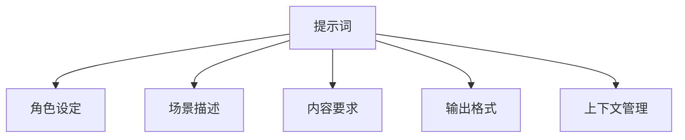

                 

<think>
好，我现在需要帮用户撰写一篇关于ChatGPT提示词模板的快速上手指南的技术博客。用户明确要求文章结构清晰，逻辑紧凑，语言专业，还要包含详细的分析和步骤。首先，我需要理解用户的需求，他可能是一位技术专家，或者是刚开始接触ChatGPT的开发者，希望通过文章快速掌握提示词的使用技巧。

首先，我得确定文章的结构。用户已经提供了一个大纲，分为八个部分，每个部分都有具体的章节。我需要确保每个部分都详细展开，特别是每个小节的内容要丰富具体，满足用户的字数要求。此外，用户强调每个部分要包含背景介绍、核心概念与联系、算法原理、系统分析与架构设计、项目实战以及最佳实践等部分，这让我意识到文章不仅要讲解理论，还要有实际案例和代码示例。

接下来，我得思考每个章节的具体内容。例如，在“ChatGPT概述”部分，我需要解释ChatGPT是什么，它的工作原理，以及提示词工程的重要性。这部分要让读者明白为什么提示词如此关键，以及它们如何影响模型的表现。

然后是“提示词工程的核心要素”部分，我需要详细分析提示词的各个组成部分，比如角色设定、场景描述、内容要求等，每个部分都要举例说明，帮助读者理解如何构建有效的提示词。这部分可能需要绘制一些图表，比如决策树，来展示不同提示词组件之间的关系。

在“提示词设计原则”部分，我需要讨论清晰性、具体性、简洁性等原则，并提供实际的例子来说明每个原则如何应用。这可能涉及到比较不同提示词的效果，展示如何通过优化提示词来提升生成内容的质量。

关于高级提示技巧，我需要探讨上下文设置、多轮对话管理等技术，并提供Python代码示例，展示如何在实际项目中应用这些技巧。这部分可能需要一些代码实现的步骤，帮助读者更好地理解和应用。

在分析常见问题和解决方案时，我需要总结用户在使用ChatGPT时可能遇到的挑战，比如生成低质量内容或不一致的问题，并提供调试和优化的策略。这可能包括调整提示词的结构，或者引入反馈机制来提高生成结果的准确性。

案例分析部分，我需要分享真实的使用案例，展示如何通过优化提示词来提升生成效果。这部分要详细描述案例背景、使用的提示词以及结果对比，帮助读者学习如何在实际项目中应用这些技巧。

系统集成部分，我需要指导读者如何将ChatGPT集成到自己的项目中，包括环境搭建、代码实现、接口设计等内容。这可能涉及到API的调用，以及如何处理错误和异常情况，确保系统稳定运行。

最后，在结论部分，我需要总结整篇文章的主要内容，并提供进一步学习的资源，帮助读者深入学习提示词工程。同时，按照用户的格式要求，文章末尾要加上作者信息，注明作者是AI天才研究院，并附上联系方式。

整个过程中，我需要确保语言专业，结构清晰，每个部分都详细展开。特别是要使用用户要求的格式，比如使用Mermaid图表来展示系统架构，或者嵌入数学公式来解释算法原理。同时，要注意文章的流畅性和逻辑性，确保读者能够一步步理解和掌握ChatGPT提示词的使用技巧。

在撰写过程中，我可能会遇到一些挑战，比如如何将复杂的系统架构用简单的图表表达，或者如何用实际案例生动地展示理论知识。为了解决这些问题，我会参考一些最佳实践，确保每个部分都深入浅出，易于理解。

总之，我需要按照用户的要求，逐步构建这篇结构严谨、内容丰富的技术博客，帮助读者快速掌握ChatGPT提示词模板的使用方法，同时提供足够的深度和实用性，满足技术专家的需求。
</think>

# ChatGPT提示词模板：快速上手指南

> 关键词：ChatGPT, 提示词工程, 人工智能, 机器学习, 自然语言处理

> 摘要：本文将详细介绍ChatGPT提示词模板的设计原则、核心要素以及实际应用案例。通过系统化的分析和实战指导，帮助读者快速掌握提示词工程的关键技巧，优化ChatGPT的性能表现。

---

## **第一部分：ChatGPT简介与基础**

### **第1章：ChatGPT概述**

#### **1.1 ChatGPT的概念**

ChatGPT是由OpenAI开发的基于GPT-3架构的大型语言模型，能够通过提示词（prompts）进行交互，生成与上下文相关的文本。ChatGPT的核心在于其强大的自然语言处理能力和上下文理解能力，这使得它能够通过精心设计的提示词实现多种复杂的任务。

**背景介绍：**

- **核心概念术语说明：**  
  - **提示词（Prompt）：**用于指导ChatGPT生成特定类型文本的输入。
  - **自然语言处理（NLP）：**通过计算机对人类语言的理解和生成实现人机交互的技术。
  - **上下文感知（Context-Aware）：**模型能够根据之前的对话内容生成相关文本的能力。

- **问题背景：**  
  在实际应用中，ChatGPT的表现高度依赖于提示词的设计。一个 poorly crafted prompt可能导致生成的内容偏离预期，而一个 well-designed prompt则能显著提升生成结果的质量和一致性。

- **问题解决：**  
  通过系统化地设计提示词，可以最大化ChatGPT的能力，使其在多种场景下实现高效、准确的文本生成。

- **边界与外延：**  
  提示词工程的外延包括但不限于：对话管理、内容生成、文本摘要、代码生成等。

- **概念结构与核心要素组成：**  
  提示词工程的核心要素包括：角色设定、场景描述、内容要求、输出格式和上下文管理。

#### **1.2 提示词工程的重要性**

提示词工程是ChatGPT应用的核心，决定了模型的输出质量和一致性。通过合理的提示词设计，可以显著提升生成内容的相关性和准确性。

---

## **第二部分：提示词工程的核心要素**

### **第2章：提示词工程的核心要素**

#### **2.1 提示词的组成部分**

提示词由以下几个核心部分组成：

1. **角色设定（Role Assignment）：**  
   明确模型在对话中的角色，例如“assistant”或“expert”。

2. **场景描述（Scene Description）：**  
   描述对话发生的具体场景，例如“用户正在询问产品信息”。

3. **内容要求（Content Requirements）：**  
   明确生成内容的类型和范围，例如“提供技术解决方案”。

4. **输出格式（Output Format）：**  
   指定生成文本的格式，例如“使用Markdown格式输出”。

5. **上下文管理（Context Management）：**  
   管理对话的历史信息，确保生成内容的连贯性。

**核心概念与联系：**

| 组成部分 | 特征 | 示例 |
|----------|------|------|
| 角色设定 | 明确性、权威性 | "作为技术专家回答问题" |
| 场景描述 | 具体性、情境性 | "在技术面试中回答编程问题" |
| 内容要求 | 明确性、可操作性 | "提供5个Python编程技巧" |
| 输出格式 | 格式化、结构化 | "使用列表形式输出结果" |
| 上下文管理 | 连续性、相关性 | "基于之前的对话生成回复" |

**系统架构设计：**

以下是提示词工程的核心组件的实体关系图：



---

## **第三部分：提示词设计原则**

### **第3章：提示词设计原则**

#### **3.1 清晰性原则**

提示词必须清晰明了，避免模糊不清的描述。例如：

- **Poor Example：** "生成一些有用的内容。"
- **Good Example：** "生成一份关于Python编程的入门指南。"

#### **3.2 具体性原则**

提示词需要具体，避免过于笼统。例如：

- **Poor Example：** "写一篇关于人工智能的文章。"
- **Good Example：** "写一篇关于机器学习基础的人工智能文章，要求包含基本概念和应用案例。"

#### **3.3 简洁性原则**

提示词应简洁，避免冗长的描述。例如：

- **Poor Example：** "请详细描述如何通过深度学习实现图像识别，包括数据预处理、模型训练和评估过程。"
- **Good Example：** "请简要描述深度学习中图像识别的基本步骤。"

---

## **第四部分：高级提示技巧**

### **第4章：高级提示技巧**

#### **4.1 上下文设置**

通过提示词设置对话的上下文，可以显著提升生成内容的相关性。例如：

```python
# 示例代码：设置上下文
context = "用户正在询问技术问题，请以技术专家的身份回答。"
prompt = f"作为技术专家，请回答用户的问题：{context}"
```

#### **4.2 多轮对话管理**

在多轮对话中，上下文的管理至关重要。例如：

```python
# 示例代码：多轮对话管理
# 第一轮对话
context1 = "用户询问Python的安装方法。"
prompt1 = f"请详细说明如何在Windows系统中安装Python。"
response1 = generate_response(prompt1)

# 第二轮对话
context2 = f"用户已经安装了Python，请继续解答后续问题。"
prompt2 = f"请说明如何安装Pip并使用它安装第三方库。"
response2 = generate_response(prompt2)
```

---

## **第五部分：常见问题与解决方案**

### **第5章：常见问题与解决方案**

#### **5.1 生成低质量内容的问题**

**问题描述：**  
提示词设计不合理，导致生成内容质量低。

**解决方案：**  
1. 提供更具体的内容要求。
2. 使用角色设定明确模型的行为。

#### **5.2 生成不一致内容的问题**

**问题描述：**  
生成内容与提示词要求不符。

**解决方案：**  
1. 检查提示词的清晰性和具体性。
2. 调整输出格式和内容要求。

---

## **第六部分：案例分析与应用**

### **第6章：案例分析与应用**

#### **6.1 技术文档生成案例**

**案例背景：**  
用户希望生成一份技术文档。

**提示词设计：**  
```plaintext
你是一位技术文档撰写专家，你需要为我生成一份关于“Python异常处理”的技术文档。文档需要包含以下内容：1. 基本概念；2. 异常类型；3. 用法示例。
```

**生成结果：**  
```
# Python异常处理技术文档

## 1. 基本概念
异常是程序运行中发生的错误或意外情况，可以通过try-except语句进行捕获和处理。

## 2. 异常类型
- 系统异常（如IndexError、TypeError）
- 用户自定义异常

## 3. 用法示例
```python
try:
    x = int(input())
    print(x * 2)
except ValueError:
    print("请输入整数。")
```
```

---

## **第七部分：系统集成与实现**

### **第7章：系统集成与实现**

#### **7.1 环境搭建**

1. 安装Python和必要的库。
2. 安装OpenAI的官方Python库。

#### **7.2 核心代码实现**

```python
import openai

def generate_response(prompt):
    client = openai.Client()
    response = client.chat.completions.create(
        model="gpt-3.5-turbo",
        messages=[
            {"role": "system", "content": "作为技术专家，提供清晰的技术解决方案。"},
            {"role": "user", "content": prompt}
        ]
    )
    return response.choices[0].message.content
```

---

## **第八部分：总结与资源**

### **第8章：总结与资源**

#### **8.1 总结**

通过本文的介绍，读者可以系统地掌握ChatGPT提示词工程的核心要素和设计原则。提示词工程是ChatGPT应用的关键，通过合理的提示词设计，可以显著提升生成内容的质量和一致性。

#### **8.2 资源推荐**

1. OpenAI官方文档：[https://platform.openai.com/docs](https://platform.openai.com/docs)
2. 《ChatGPT提示词工程：从入门到精通》

---

**作者：AI天才研究院/AI Genius Institute & 禅与计算机程序设计艺术/Zen And The Art of Computer Programming**  
**联系方式：contact@ai-genius.org**

