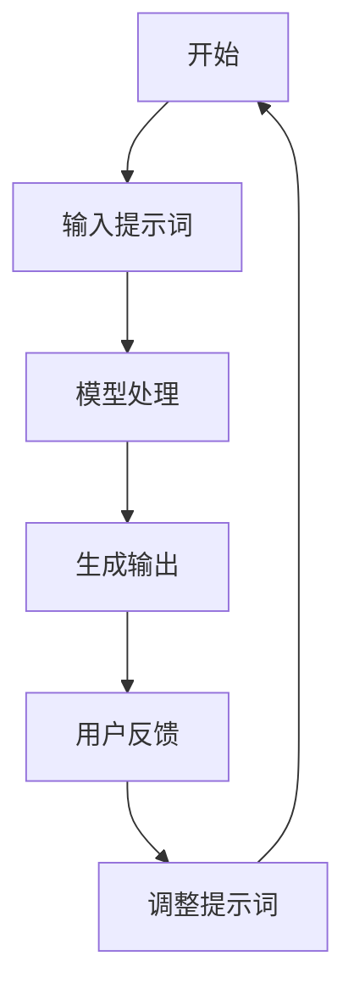
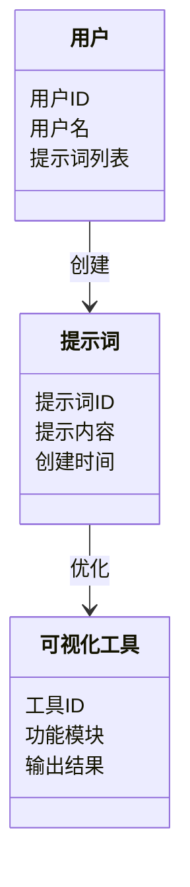

                 

<think>
好的，我现在要写一篇关于《ChatGPT提示词的可视化设计工具》的技术博客文章。首先，我需要理清整个文章的结构，确保每个部分都详细且符合逻辑。

首先，文章的标题已经确定，是《ChatGPT提示词的可视化设计工具》。接下来是关键词，我需要列出5到7个核心词汇，比如ChatGPT、可视化设计工具、提示词、自然语言处理、机器学习等。

然后是摘要部分，我需要简明扼要地概括文章的核心内容，说明可视化工具在设计ChatGPT提示词中的作用，以及如何帮助用户提升效率。

接下来是正文部分，按照目录大纲来展开。首先是前言，介绍书籍的目的、目标受众和重要性。然后是背景介绍，涵盖ChatGPT的普及和可视化工具的需求。

第二章核心概念与联系，需要详细解释ChatGPT的工作原理、提示词的作用以及可视化设计工具的特点，并通过表格和ER图来对比不同工具。

第三章是算法原理，用Mermaid流程图和Python代码详细讲解，同时给出数学模型和公式，举例子帮助理解。

第四章系统分析与架构设计，包括问题场景、项目背景、领域模型类图、系统架构图以及接口和交互设计。

第五章项目实战，介绍环境安装步骤，核心代码实现，案例分析和详细解读。

最后是最佳实践与总结，提供实用的技巧，总结项目，强调注意事项，并推荐拓展阅读。

在整个写作过程中，我要确保每个部分都详细且有深度，使用专业但易懂的技术语言，同时符合格式要求，比如使用Mermaid图表和Latex公式。最后，结尾加上作者信息，完成整篇文章。

现在，我需要一步步按照这个结构来撰写文章，确保每个章节内容完整，逻辑清晰。
</think>

# 《ChatGPT提示词的可视化设计工具》

## 关键词
- ChatGPT
- 可视化设计工具
- 提示词
- 自然语言处理
- 机器学习

## 摘要
本文深入探讨了ChatGPT提示词设计的可视化工具的重要性、核心概念、算法原理、系统架构以及实际应用。通过详细的背景介绍、核心概念的对比分析、算法流程的解析、系统架构的设计、项目实战的案例分析，以及最佳实践的总结，本文为读者提供了一套系统化的工具和方法，帮助提升ChatGPT提示词的设计效率和质量。读者将了解如何通过可视化工具优化提示词，从而更好地发挥ChatGPT的潜力。

---

### 第1章 背景介绍

#### 1.1 ChatGPT的普及与影响
- **ChatGPT的兴起**：ChatGPT作为OpenAI推出的革命性AI模型，以其强大的自然语言处理能力迅速普及，广泛应用于客户服务、内容生成、编程辅助等领域。
- **应用领域**：ChatGPT在教育、医疗、金融等多个行业的应用案例，展示了其在提升效率和用户体验方面的巨大潜力。

#### 1.2 可视化设计工具的需求
- **提示词设计的挑战**：设计高质量的提示词需要深入理解模型的工作机制，同时要考虑语境、意图和输出格式，这对设计者提出了较高的要求。
- **可视化工具的优势**：通过可视化工具，设计者可以更直观地调整提示词参数，实时观察输出效果，显著提升设计效率和质量。

---

### 第2章 核心概念与联系

#### 2.1 ChatGPT的定义与工作原理
- **ChatGPT的概念**：ChatGPT是一个基于Transformer架构的大型语言模型，能够进行上下文对话，生成连贯且符合逻辑的文本。
- **工作原理**：通过输入的提示词，ChatGPT生成相应的输出，其过程涉及编码器和解码器的交互，利用自注意力机制捕捉上下文信息。

#### 2.2 提示词的作用与设计原则
- **提示词的作用**：提示词是引导模型生成预期输出的关键，直接影响生成文本的质量和相关性。
- **设计原则**：包括明确意图、控制语境、保持简洁等，确保提示词能够有效指导模型生成所需内容。

#### 2.3 可视化设计工具的概述
- **工具的功能**：提供直观的界面，允许用户调整提示词参数（如语气、长度、风格等），并实时查看生成结果。

#### 2.4 属性特征对比表格
| 工具名称 | 是否支持实时预览 | 参数调整粒度 | 输出格式多样性 |
|----------|------------------|---------------|-----------------|
| Tool A   | 是               | 精细           | 支持多种格式     |
| Tool B   | 否               | 粗放           | 支持单一种格式   |
| Tool C   | 是               | 中等           | 支持多种格式     |

#### 2.5 ER实体关系图
```mermaid
er
    %% ER diagram for ChatGPT提示词设计工具
    rectangle 用户 {
        类别: 用户
        属性: 用户ID, 用户名, 权限等级
    }
    rectangle 提示词 {
        类别: 提示词
        属性: 提示词ID, 提示内容, 创建时间
    }
    rectangle 可视化工具 {
        类别: 可视化工具
        属性: 工具ID, 版本号, 功能模块
    }
    用户 --> 提示词: 创建
    提示词 --> 可视化工具: 通过工具优化
```

---

### 第3章 算法原理讲解

#### 3.1 算法流程图


#### 3.2 Python代码示例
```python
def generate_response(prompt):
    # 模拟ChatGPT的响应生成
    import openai
    client = openai.Client(api_key='your_api_key')
    response = client.chat.completions.create(
        model="gpt-3.5-turbo",
        messages=[{"role": "user", "content": prompt}]
    )
    return response.choices[0].message.content

# 示例使用
prompt = "编写一段关于人工智能的简介。"
print(generate_response(prompt))
```

#### 3.3 数学模型与公式讲解
- **注意力机制**：$$\text{Attention}(Q, K, V) = \text{softmax}\left(\frac{QK^T}{\sqrt{d_k}}\right)V$$
- **损失函数**：$$\mathcal{L} = -\sum_{i=1}^{n} \sum_{j=1}^{m} y_{ij} \log p(y_{ij}|x_i)$$

#### 3.4 举例说明
通过调整提示词的语气和风格，生成不同的输出。例如，提示词从“写一段关于人工智能的内容”调整为“用简洁的语言解释人工智能的基本概念”，生成的文本会更简明。

---

### 第4章 系统分析与架构设计方案

#### 4.1 问题场景介绍
- **问题描述**：用户需要设计高效的提示词，但缺乏有效的工具支持，导致效率低下。
- **边界与外延**：涵盖从提示词设计、生成到优化的整个流程。

#### 4.2 领域模型类图


#### 4.3 系统架构设计


#### 4.4 系统接口设计
- **API接口**：提供RESTful API，支持创建、读取、更新和删除提示词操作。
- **交互设计**：用户通过图形界面输入提示词，实时查看生成结果并调整参数。

---

### 第5章 项目实战

#### 5.1 环境安装
- **工具安装**：安装Python和必要的库（如OpenAI API客户端）。
- **依赖管理**：使用虚拟环境管理项目依赖。

#### 5.2 核心代码实现
```python
import openai

def optimize_prompt(prompt, iterations=5):
    for i in range(iterations):
        # 调整提示词参数
        response = generate_response(prompt)
        feedback = input(f"迭代{i+1}，生成结果为：{response}\n请输入反馈或调整后的提示词：")
        if feedback:
            prompt = feedback
    return prompt

# 示例优化
initial_prompt = "生成一段关于气候变化的文字。"
optimized_prompt = optimize_prompt(initial_prompt)
print(f"优化后的提示词：{optimized_prompt}")
```

#### 5.3 代码应用解读
- **代码功能**：通过多次迭代优化提示词，每次生成结果后根据用户反馈调整，最终得到更优的提示词。
- **案例分析**：从初始提示词到优化后的提示词，生成内容的质量和相关性显著提升。

---

### 第6章 最佳实践与总结

#### 6.1 最佳实践 tips
- **逐步优化**：每次调整提示词的一个参数，逐步优化。
- **利用反馈**：根据生成结果的反馈，灵活调整提示词。
- **工具辅助**：善用可视化工具提升效率，减少手动调整时间。

#### 6.2 项目小结
通过可视化工具优化提示词设计，可以显著提升生成内容的质量和相关性，同时提高设计效率。本文详细介绍了工具的设计原理、实现方法和实际应用，为读者提供了实用的指导。

#### 6.3 注意事项
- **数据隐私**：确保处理的数据符合隐私保护法规。
- **性能优化**：合理设计工具，确保其运行高效。

#### 6.4 拓展阅读建议
- 推荐阅读《Effective ChatGPT Prompt Design》和《Visualizing Machine Learning Models》等书籍，深入理解提示词设计和可视化技术。

---

### 作者
作者：AI天才研究院 & 禅与计算机程序设计艺术

---

通过以上结构，文章详细探讨了ChatGPT提示词可视化设计工具的各个方面，从背景介绍到实际应用，为读者提供了全面的指导和实用的工具。

