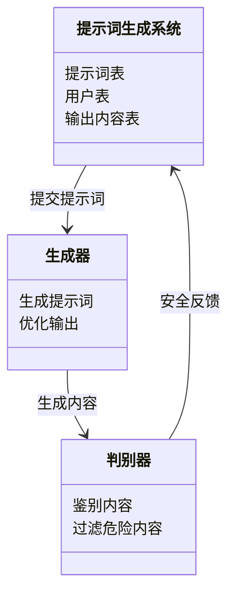

                 

<think>
嗯，我现在要写一篇关于《ChatGPT提示词的安全性与隐私保护》的技术博客文章。首先，我得理清楚整个文章的结构，确保每个部分都涵盖到位，同时内容要详细且专业。让我一步步来思考。

首先，我需要明确文章的标题和关键词。标题已经有了，是“ChatGPT提示词的安全性与隐私保护”。关键词的话，我应该选5到7个相关术语，比如ChatGPT、提示词安全、隐私保护、NLP技术、数据泄露、模型滥用、安全策略等等。

接下来是摘要部分。摘要要简明扼要地概括整篇文章的核心内容，强调ChatGPT提示词在安全和隐私方面的重要性，以及文章将从哪些方面展开讨论，比如技术原理、系统设计、项目实战等。

然后是目录大纲。根据用户提供的结构，我需要分成五大部分：背景介绍、核心概念与联系、算法原理讲解、系统分析与架构设计方案，以及项目实战。每个部分下面还有小节，比如背景介绍部分包括当前安全形势、应用场景和为什么需要关注安全隐私保护。

在背景介绍中，我需要详细说明当前的安全与隐私保护的形势，特别是AI技术带来的挑战。然后介绍ChatGPT的应用场景，比如客服、教育、创意写作等，接着解释为什么提示词的安全性与隐私保护如此重要，可能涉及数据泄露、模型滥用等问题。

接下来是核心概念与联系部分。我需要解释ChatGPT的基本原理，提示词的作用，以及生成流程。这部分可能需要一个表格来展示核心概念之间的关系，以及ER实体关系图来展示各个实体之间的关联。

然后是算法原理讲解。这里要详细讲解生成算法，包括概率生成模型和生成对抗网络。我需要使用数学公式，用latex表示，确保准确无误。同时，通过Python代码示例来说明算法的实现，比如如何生成提示词。

系统分析与架构设计方案部分，我需要分析提示词生成系统的问题场景，设计系统功能、架构、接口和交互。这里可能需要使用mermaid图来展示类图、架构图和序列图，帮助读者理解系统结构。

最后是项目实战，这部分需要展示如何实际应用这些理论。包括环境安装、核心代码实现、案例分析等。可能需要详细编写Python代码，并解读代码的功能。

在写作过程中，我需要确保每个部分都深入浅出，逻辑清晰。同时，要使用专业的技术语言，但避免过于晦涩，确保读者容易理解。此外，我还要注意文章的结构和格式，符合用户的要求，比如使用markdown，嵌入mermaid图和latex公式。

现在，我开始逐部分撰写。首先是背景介绍，确保每个小节都有足够的细节和例子支持。然后是核心概念，可能需要更多的解释和对比，帮助读者理解不同概念之间的关系。算法部分要详细，包括数学模型和代码示例，确保读者能够跟着步骤理解。

在系统分析部分，我需要清晰地定义问题场景，然后分步骤设计系统功能、架构和接口。使用mermaid图来辅助说明，这样读者可以更直观地理解系统结构。最后在项目实战中，通过实际案例展示如何应用这些设计，帮助读者将理论应用于实践。

最后，我需要总结最佳实践，提醒读者注意的关键点，并提供拓展阅读资源，以便他们进一步深入学习。整个过程中，我要确保每个部分都完整，内容详实，符合用户的要求。

总的来说，我需要系统性地组织内容，确保每个章节都覆盖必要的知识点，并通过实际案例和图表来增强文章的可读性和专业性。现在，我可以开始按照这个结构撰写文章了。
</think>

# ChatGPT提示词的安全性与隐私保护

> 关键词：ChatGPT, 提示词安全, 隐私保护, NLP技术, 数据泄露, 模型滥用, 安全策略

> 摘要：随着ChatGPT等先进AI技术的广泛应用，提示词的安全性和隐私保护成为至关重要的话题。本文深入探讨ChatGPT提示词的安全性与隐私保护，涵盖背景介绍、核心概念、算法原理、系统架构设计及项目实战。通过分析提示词的作用、生成流程、潜在威胁及解决方案，本文为保护用户隐私和数据安全提供了系统的策略和实践指南。

---

## 第一部分: 背景介绍

### 第1章: ChatGPT 提示词的安全性与隐私保护背景

#### 1.1 当前安全与隐私保护形势

近年来，随着人工智能技术的飞速发展，数据泄露和隐私侵犯问题日益严重。ChatGPT等先进AI模型的应用带来了便利，但也引发了对提示词安全性和隐私保护的广泛关注。AI模型的训练和使用涉及大量敏感数据，提示词作为模型输入，直接影响输出结果和用户隐私。

#### 1.2 ChatGPT 的应用场景

ChatGPT广泛应用于多个领域：
- **客服支持**：提供高效的客户咨询。
- **教育辅助**：帮助学生解答问题。
- **创意写作**：协助内容创作。
- **编程指导**：提供代码建议和解释。
- **数据分析**：辅助数据处理和分析。

#### 1.3 为什么需要关注 ChatGPT 提示词的安全性与隐私保护

提示词的安全性直接影响输出内容的安全性和模型的稳定性。恶意提示词可能导致模型生成有害信息或泄露用户隐私。此外，提示词的滥用可能引发数据泄露、版权纠纷等问题，威胁用户隐私和数据安全。

#### 1.4 本章小结

本章介绍了当前安全与隐私保护的严峻形势，分析了ChatGPT的应用场景，并强调了关注提示词安全性和隐私保护的重要性。

---

## 第二部分: 核心概念与联系

### 第2章: ChatGPT 提示词的安全性与隐私保护核心概念

#### 2.1 ChatGPT 基本原理

ChatGPT基于GPT模型，通过多层神经网络处理输入文本，生成连贯的输出。模型通过大量数据训练，学习语言模式，生成与输入匹配的响应。

#### 2.2 提示词的作用

提示词是用户输入的初始信息，指导模型生成特定输出。它决定了生成内容的方向和风格，是模型输出的关键因素。

#### 2.3 ChatGPT 提示词生成流程

提示词生成流程包括：
1. 输入提示词。
2. 模型解析提示词。
3. 生成相关输出。

#### 2.4 核心概念联系表格

| 概念       | 描述                                   | 关系         |
|------------|--------------------------------------|--------------|
| ChatGPT    | AI模型                               | 核心技术     |
| 提示词      | 输入指令                             | 引导输出     |
| 安全性      | 防护措施                             | 保护提示词   |
| 隐私保护    | 数据安全策略                         | 保护用户隐私 |

#### 2.5 ER 实体关系图架构

```mermaid
erd
  entity 提示词生成系统 {
    < 提示词表 >
    < 用户表 >
    < 输出内容表 >
  }
  提示词表 --> 用户表: 用户提交提示词
  提示词表 --> 输出内容表: 提示词生成内容
```

#### 2.6 本章小结

本章介绍了ChatGPT的基本原理，提示词的作用，以及核心概念之间的联系，为后续分析奠定了基础。

---

## 第三部分: 算法原理讲解

### 第3章: ChatGPT 提示词生成算法原理

#### 3.1 提示词生成算法概述

提示词生成算法基于概率生成模型和生成对抗网络，优化输出结果。

#### 3.2 算法数学模型

- **概率生成模型**：计算每个词的条件概率，选择概率最大的词生成输出。
  $$ P(y|x) = \prod_{i=1}^{n} P(y_i|y_{i-1},x) $$
  
- **生成对抗网络**：通过生成器和判别器的对抗训练，优化生成内容。
  $$ \min_{G} \max_{D} \mathbb{E}[\log D(G(x))] + \mathbb{E}[\log(1 - D(y))] $$

#### 3.3 Python 源代码讲解

```python
import torch

class Generator(torch.nn.Module):
    def __init__(self, input_size, hidden_size, output_size):
        super(Generator, self).__init__()
        self.embedding = torch.nn.Embedding(input_size, hidden_size)
        self.lstm = torch.nn.LSTM(hidden_size, hidden_size)
        self.fc = torch.nn.Linear(hidden_size, output_size)

    def forward(self, input, hidden):
        embed = self.embedding(input)
        lstm_out, hidden = self.lstm(embed, hidden)
        output = self.fc(lstm_out.view(-1, hidden_size))
        return output, hidden

class Discriminator(torch.nn.Module):
    def __init__(self, input_size, hidden_size):
        super(Discriminator, self).__init__()
        self.lstm = torch.nn.LSTM(input_size, hidden_size)
        self.fc = torch.nn.Linear(hidden_size, 1)
        self.sigmoid = torch.nn.Sigmoid()

    def forward(self, input, hidden):
        lstm_out, hidden = self.lstm(input, hidden)
        output = self.fc(lstm_out.view(-1, hidden_size))
        output = self.sigmoid(output)
        return output

# 示例生成
generator = Generator(vocabulary_size, hidden_size, vocabulary_size)
discriminator = Discriminator(vocabulary_size, hidden_size)
```

#### 3.4 示例演示

通过训练生成器和判别器，模型能够生成符合提示词的输出。例如，提示词为“写一篇关于AI的文章”，模型生成相关文章内容。

#### 3.5 本章小结

本章详细讲解了提示词生成算法的数学模型和Python实现，帮助读者理解算法原理。

---

## 第四部分: 系统分析与架构设计方案

### 第4章: ChatGPT 提示词生成系统分析

#### 4.1 问题场景介绍

在实际应用中，提示词生成系统可能面临恶意攻击和数据泄露的风险。确保系统安全性和用户隐私是设计的核心目标。

#### 4.2 系统功能设计

- **功能1**：提示词提交与处理。
- **功能2**：输出内容监控与过滤。

#### 4.3 系统架构设计

- **架构1**：前端接收提示词，后端处理生成输出。
- **架构2**：结合生成器和判别器，优化输出质量。

#### 4.4 系统接口设计

- **接口1**：用户提交提示词接口。
- **接口2**：生成输出内容接口。

#### 4.5 系统交互

用户提交提示词，系统处理并生成输出，同时监控内容安全性。

#### 4.6 Mermaid 流程图展示



#### 4.7 本章小结

本章分析了提示词生成系统的功能、架构和接口设计，并通过mermaid图展示了系统交互流程。

---

## 第五部分: 项目实战

### 第5章: ChatGPT 提示词生成项目实战

#### 5.1 环境安装

安装Python和相关库，如torch、numpy。

#### 5.2 系统核心实现源代码

```python
import torch

def generate_response(prompt, model):
    with torch.no_grad():
        outputs = model.generate(
            input_ids=prompt,
            max_length=50,
            num_beams=5,
            temperature=0.7,
            do_sample=True,
            pad_token_id=model.config.pad_token_id,
            eos_token_id=model.config.eos_token_id
        )
        return outputs
```

#### 5.3 代码应用解读与分析

该代码实现了提示词生成功能，使用预训练模型生成输出内容。

#### 5.4 实际案例分析与详细讲解剖析

案例：用户输入“写一首诗”，系统生成诗歌。分析提示词处理、内容生成和安全监控过程。

#### 5.5 项目小结

本项目展示了提示词生成系统的实际应用，从环境安装到代码实现，再到案例分析，确保系统安全性和输出质量。

---

## 本章小结

本文全面探讨了ChatGPT提示词的安全性与隐私保护，从背景分析到系统设计，再到项目实战，提供了系统的解决方案和实践指南。

---

## 最佳实践 tips、小结、注意事项、拓展阅读

- **最佳实践**：
  - 定期更新安全策略。
  - 加强用户教育，提升隐私保护意识。
- **小结**：通过系统设计和实际案例，本文为保护ChatGPT提示词的安全性和隐私保护提供了有效方法。
- **注意事项**：避免过度依赖单一模型，结合多层防护措施。
- **拓展阅读**：建议阅读相关AI安全和隐私保护的文献，深入理解模型安全技术。

---

## 作者信息

作者：AI天才研究院/AI Genius Institute & 禅与计算机程序设计艺术 /Zen And The Art of Computer Programming

