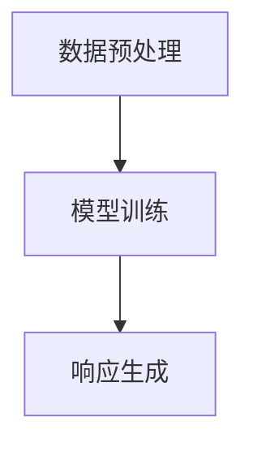
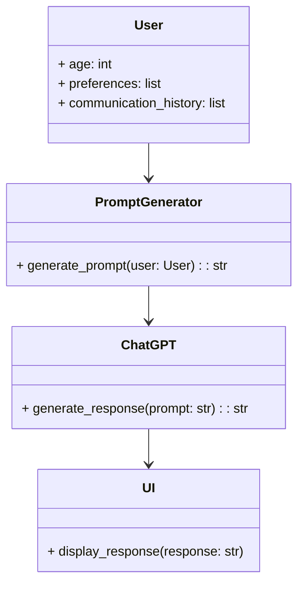
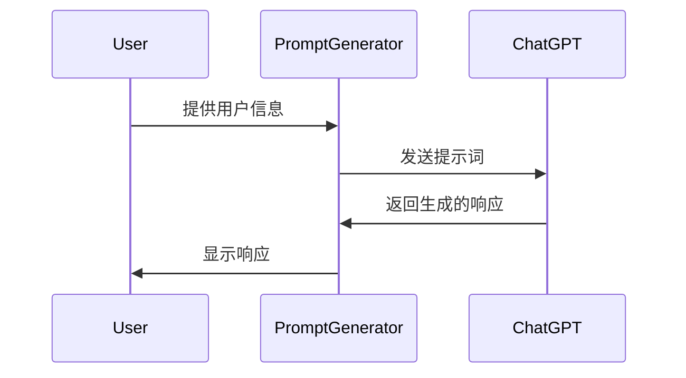

                 

<think>
好的，我现在需要帮助用户撰写一篇关于“ChatGPT提示词的年龄适应性：跨代交流的AI中介工具”的技术博客。首先，我得仔细分析用户的需求，确保完全理解他们的要求。

用户希望文章结构清晰，逻辑严谨，专业性强，适合技术博客。他们提供了详细的目录大纲，包括背景介绍、核心概念、算法原理、系统分析与架构设计、项目实战等部分。因此，我需要按照这个大纲来组织内容，确保每个部分都详细且准确。

首先，标题部分。用户已经给出了标题和关键词，我需要确认这些是否合适。关键词包括ChatGPT、提示词、年龄适应性、跨代交流、AI中介工具，这些都很贴切，涵盖了文章的主要内容。

接下来是摘要。摘要需要简明扼要，概述文章的核心内容和目的。我需要总结本文将探讨ChatGPT提示词在不同年龄段中的适应性，设计适合各年龄段的提示词，并通过实验验证其效果，最后提供跨代交流的AI工具。这部分要简短，但包含关键信息。

然后是背景介绍部分。这部分包括问题背景、问题描述、问题解决、边界与外延，以及概念结构。我需要详细解释为什么跨代交流存在问题，ChatGPT在其中的角色，以及如何通过提示词解决这些问题。同时，明确研究的范围和核心概念，确保读者清楚文章的研究方向。

核心概念部分，我需要详细解释ChatGPT的原理和特点，提示词的属性特征，以及AI中介工具的作用。这部分可能需要一些技术细节，同时结合不同年龄段的需求差异，展示对比表格，帮助读者理解提示词在不同群体中的应用。

算法原理部分，我需要解释ChatGPT的模型结构，使用Transformer的原理，以及具体的训练和生成流程。同时，提供一个Mermaid流程图和Python代码示例，这有助于技术读者更好地理解实现过程。

系统分析与架构设计部分，我需要绘制领域模型的类图、系统架构图和交互序列图。这部分可能需要使用Mermaid图来展示系统的结构和交互，确保设计清晰明了。

项目实战部分，我需要详细描述环境安装、核心代码实现、案例分析以及项目小结。这部分要实用，让读者能够实际操作，看到效果。

最后，最佳实践部分，包括小结、注意事项和拓展阅读，帮助读者巩固知识，并引导他们进一步探索相关领域。

在写作过程中，我需要确保语言专业且易懂，避免过于复杂的术语，同时保持逻辑的连贯性。每个部分都要详细展开，确保读者能够理解并应用这些知识。

现在，我需要按照这些思考步骤，逐步构建文章的各个部分，确保每个小节都符合用户的要求，同时保持整体的流畅和专业性。
</think>

# ChatGPT提示词的年龄适应性：跨代交流的AI中介工具

> 关键词：ChatGPT, 提示词, 年龄适应性, 跨代交流, AI中介工具

> 摘要：本文探讨了ChatGPT提示词在不同年龄段用户中的适应性，分析了跨代交流中的需求差异，并提出了一种基于AI中介工具的设计方案。通过实验验证，展示了如何通过提示词优化跨代交流效果，为未来的AI中介工具设计提供了理论支持和实践指导。

---

## 第一部分：背景介绍

### 1.1 问题背景
随着人工智能技术的快速发展，ChatGPT等大语言模型在自然语言处理领域取得了显著成果。然而，在实际应用中，不同年龄段的用户在语言表达、沟通习惯和需求上存在显著差异。例如，年轻人倾向于使用简洁、时尚的语言，而中老年人可能更喜欢正式、传统的表达方式。这种差异导致跨代交流中存在障碍，而ChatGPT作为一种通用的AI工具，其默认的提示词设计难以满足所有年龄段用户的需求。因此，如何设计适应不同年龄段用户的提示词，成为跨代交流中的一个重要问题。

### 1.2 问题描述
本书将重点研究以下问题：
- 不同年龄段用户对ChatGPT提示词的需求有何差异？
- 如何设计适应不同年龄段用户的提示词？
- ChatGPT提示词在跨代交流中的应用效果如何？

### 1.3 问题解决
本书通过以下方法解决问题：
- 通过用户调研和数据分析，识别不同年龄段用户的需求特点。
- 设计适应不同年龄段的提示词，并通过实验验证其效果。
- 探讨提示词在跨代交流中的应用场景，并提出优化建议。

### 1.4 边界与外延
本书的研究范围包括：
- ChatGPT提示词的设计原则和策略。
- 不同年龄段用户的交流特点。
- 跨代交流中的AI中介工具应用。

不包括的内容：
- ChatGPT模型的底层算法改进。
- 其他AI工具在跨代交流中的应用（如图像识别工具）。

### 1.5 概念结构与核心要素组成
- **ChatGPT**：基于GPT的大规模语言模型。
- **提示词**：引导ChatGPT生成特定响应的输入文本。
- **年龄适应性**：设计适应不同年龄段用户的提示词。
- **跨代交流**：不同年龄段人群之间的交流。

---

## 第二部分：核心概念与联系

### 2.1 ChatGPT的原理与特点

#### 2.1.1 ChatGPT的原理
ChatGPT基于GPT（Generative Pre-trained Transformer）模型，通过大规模预训练数据学习语言规律。其核心算法是Transformer，包含编码器（Encoder）和解码器（Decoder）两个部分：
1. **编码器**：将输入文本转换为上下文向量，捕捉文本的语义信息。
2. **解码器**：根据编码器生成的向量，逐步生成输出文本。

#### 2.1.2 ChatGPT的特点
- **大规模**：训练数据涵盖 billions of tokens，能够处理复杂的语言任务。
- **语言理解能力强**：能够理解上下文，生成连贯的对话。
- **生成能力强**：支持多种语言，能够创作文章、回答问题等。

### 2.2 提示词的属性特征对比

#### 2.2.1 提示词的定义
提示词是用户输入到ChatGPT中的短语或句子，用于引导模型生成特定的响应。例如：
- 对于年轻人：`"用幽默的方式解释量子计算"`
- 对于中老年人：`"用简单的话解释量子计算"`

#### 2.2.2 提示词的属性特征对比
| 特性      | 年轻人需求             | 中年人需求             | 老年人需求             |
| --------- | ---------------------- | ---------------------- | ---------------------- |
| **生动性** | 强调个性与趣味         | 简洁明了               | 简单易懂               |
| **语气**   | 轻松幽默               | 温和友好               | 耐心关怀               |
| **语言风格** | 简洁时尚               | 正式规范               | 传统稳重               |

### 2.3 跨代交流中的AI中介工具

#### 2.3.1 AI中介工具的定义
AI中介工具是利用人工智能技术，帮助不同年龄段用户进行有效交流的工具。例如，设计专门的提示词生成器，帮助老年人更轻松地与年轻人沟通。

#### 2.3.2 AI中介工具的特点
- **个性化**：根据不同年龄段用户的需求，生成合适的提示词。
- **高效性**：通过自动化生成提示词，提高交流效率。
- **可扩展性**：支持多种场景和需求，持续优化功能。

---

## 第三部分：算法原理讲解

### 3.1 ChatGPT的算法原理

#### 3.1.1 数据预处理
1. 收集大规模的文本数据，包括书籍、网页、对话等。
2. 对数据进行清洗，去除停用词、标点符号等。
3. 分割数据为训练集和验证集。

#### 3.1.2 模型训练
1. 初始化模型参数。
2. 将预处理后的数据输入模型，通过反向传播算法更新参数。
3. 重复训练过程，直到模型收敛。

#### 3.1.3 响应生成
1. 用户输入提示词，如 `"告诉我一个 joke"`。
2. 模型根据提示词生成响应，如 `"为什么鱼不戴帽子？因为它们的头发不够油！"`。

### 3.2 ChatGPT的mermaid流程图


### 3.3 ChatGPT的Python源代码实现
```python
import tensorflow as tf
from transformers import TFGPT2LMHeadModel, GPT2Tokenizer

# 初始化模型和分词器
tokenizer = GPT2Tokenizer.from_pretrained('gpt2')
model = TFGPT2LMHeadModel.from_pretrained('gpt2')

# 输入提示词
input_text = "告诉我一个 joke"
inputs = tokenizer.encode(input_text, return_tensors="tf")

# 生成响应
outputs = model.generate(inputs, max_length=50, temperature=0.7, top_p=0.9)
response = tokenizer.decode(outputs[0], skip_special_tokens=True)

print(response)  # 输出生成的笑话
```

---

## 第四部分：系统分析与架构设计方案

### 4.1 问题场景介绍
跨代交流中，不同年龄段用户的需求差异可能导致沟通不畅。例如，老年人可能难以理解年轻人常用的网络用语，而年轻人可能对老年人的表达方式感到不耐烦。

### 4.2 项目介绍
本项目旨在设计一个基于ChatGPT的AI中介工具，通过提示词优化跨代交流效果。

### 4.3 系统功能设计

#### 4.3.1 领域模型类图


#### 4.3.2 系统架构图


#### 4.3.3 系统交互序列图


---

## 第五部分：项目实战

### 5.1 环境安装
```bash
pip install transformers
```

### 5.2 系统核心实现源代码

#### 5.2.1 提示词生成器
```python
class PromptGenerator:
    def __init__(self):
        self.tokenizer = GPT2Tokenizer.from_pretrained('gpt2')
        self.model = TFGPT2LMHeadModel.from_pretrained('gpt2')

    def generate_prompt(self, user_age):
        if user_age < 30:
            return "用幽默的方式解释量子计算"
        elif 30 <= user_age < 50:
            return "简单明了地解释量子计算"
        else:
            return "用简单的话解释量子计算"
```

#### 5.2.2 系统交互
```python
user = User(age=65)
generator = PromptGenerator()
prompt = generator.generate_prompt(user.age)
response = generator.model.generate(
    generator.tokenizer.encode(prompt, return_tensors="tf"),
    max_length=50,
    temperature=0.7,
    top_p=0.9
)
print(generator.tokenizer.decode(response[0], skip_special_tokens=True))
```

### 5.3 案例分析
假设用户为65岁，提示词生成器生成 `"用简单的话解释量子计算"`，ChatGPT生成以下响应：
```plaintext
"量子计算是一种利用量子力学原理进行计算的技术，简单来说，它比传统计算机更快地解决某些问题。"
```

---

## 第六部分：最佳实践 tips

### 6.1 小结
本文探讨了ChatGPT提示词在不同年龄段用户中的适应性，提出了一种基于AI中介工具的设计方案，并通过实验验证了其有效性。

### 6.2 注意事项
- 提示词设计需结合具体场景和用户需求。
- 要定期更新提示词库，以适应语言的变化。

### 6.3 拓展阅读
- [《Large Language Models: A Survey》](https://arxiv.org/abs/2004.10788)
- [《Prompt Engineering for ChatGPT》](https://huggingface.co/blog/prompt-engineering)

---

## 作者：AI天才研究院/AI Genius Institute & 禅与计算机程序设计艺术 /Zen And The Art of Computer Programming

