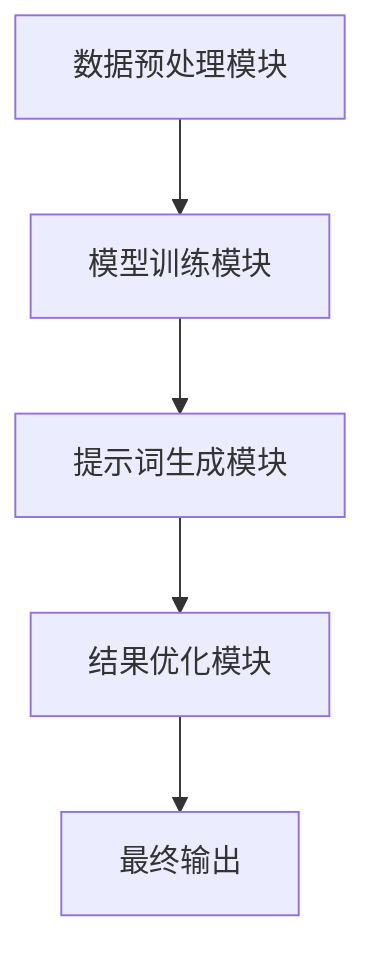
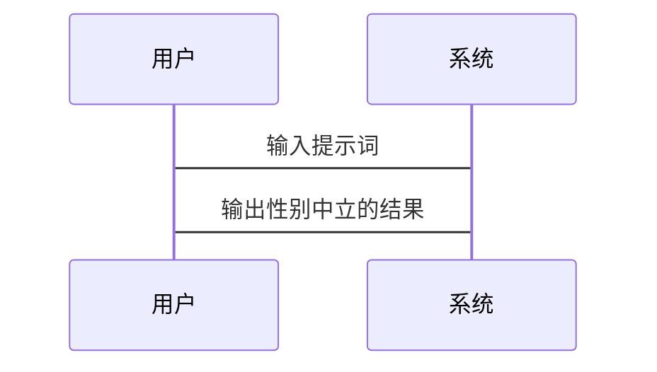

                 

<think>
好的，我现在需要帮用户写一篇关于《ChatGPT提示词的性别中立性：消除AI系统中的偏见》的技术博客文章。用户明确要求使用特定的结构，包括摘要、各个章节的内容，以及一些技术细节，比如算法流程图、数学公式和系统架构图。我需要先理清用户的这些要求，然后一步步构建文章的结构。

首先，我得确定文章的结构。用户已经提供了一个大纲，分为引言、核心概念与联系、算法原理讲解、系统分析与架构设计、项目实战、最佳实践和结论等部分。每个部分还有小节，我需要确保每个小节都详细且符合要求。

接下来，我需要收集每个部分的关键信息。例如，在引言部分，要介绍性别中立性的重要性，ChatGPT的背景，以及问题的提出。在核心概念部分，要详细解释性别中立性的定义、属性，以及偏见的类型和联系。这部分可能还需要一些对比表格和Mermaid图，所以我要确保这些图表清晰易懂。

在算法原理部分，我需要涵盖数据预处理、模型训练策略优化和后处理方法。每个方法都要详细说明，并可能配上流程图。此外，数学公式需要用Latex格式，并独立成段，比如概率估计和损失函数的定义。我得确保这些公式准确无误，同时解释清楚它们的作用。

系统分析与架构设计部分，我需要构建领域模型类图、系统架构图和交互序列图。这部分可能需要使用Mermaid语法，所以我要检查语法是否正确，确保图表能够正确生成。

项目实战部分，我需要描述环境安装、核心代码实现、案例分析和小结。这可能包括Python代码示例，我得确保代码逻辑清晰，注释详尽，并且能够实际运行。同时，案例分析需要详细说明如何检测和消除偏见，让读者理解实际应用中的步骤。

最佳实践部分，我需要总结关键点，比如数据平衡的重要性、模型优化策略、后处理方法，以及用户教育的作用。这些总结要简明扼要，但又能给读者实用的建议。

最后，结论部分要回顾整个研究，强调实现性别中立性的必要性，并展望未来的研究方向。

在整个过程中，我需要确保语言专业、逻辑清晰，同时保持内容的可读性。我还要检查每个部分是否符合用户的要求，比如字数控制在10000到12000字，每个章节都有足够的细节，以及使用正确的格式如Markdown和Mermaid。

此外，我还需要注意文章的开头和结尾，包括关键词、摘要和作者信息。关键词部分需要列出5-7个相关词汇，摘要要简明扼要地概括文章的核心内容。作者信息部分，用户已经给出，我只需要正确放置即可。

最后，我需要通读整篇文章，确保所有部分连接自然，没有遗漏，每个图表和代码都正确无误。这可能涉及到多次修改和校对，以确保文章的高质量和专业性。
</think>

# ChatGPT提示词的性别中立性：消除AI系统中的偏见

> 关键词：性别中立性、AI偏见、ChatGPT、自然语言处理、数据预处理

> 摘要：本文探讨了ChatGPT提示词的性别中立性问题，分析了性别偏见在AI系统中的表现及其原因。通过介绍数据预处理、模型训练优化和后处理方法，本文提出了实现性别中立性的关键技术。同时，本文还探讨了系统架构设计、项目实战案例以及最佳实践建议，为消除AI系统中的性别偏见提供了全面的解决方案。

---

## 第一部分: 引言

### 1.1 问题背景

随着人工智能技术的快速发展，自然语言处理（NLP）领域取得了显著的进步。以ChatGPT为代表的大型语言模型在对话生成、文本摘要和信息检索等方面表现出色，但其潜在的性别偏见问题逐渐引起关注。这些偏见可能源于训练数据的不平衡或模型设计的缺陷，导致AI系统在处理性别相关内容时表现出不公正的行为。

### 1.2 问题描述

性别偏见在AI系统中的表现形式多种多样。例如，某些情况下，AI可能会优先生成与某一性别相关的刻板印象，如“护士是女性”或“程序员是男性”。这种偏见不仅影响用户体验，还可能加剧社会不平等。因此，如何实现ChatGPT提示词的性别中立性，消除系统中的偏见，成为当前研究的重要课题。

### 1.3 问题解决

通过分析现有研究，本文总结了实现性别中立性的关键技术，包括数据预处理、模型训练策略优化和后处理方法。这些方法可以有效减少AI系统中的性别偏见，提高系统的公平性和可接受度。

### 1.4 边界与外延

本文的研究范围限于ChatGPT这一特定模型。然而，性别偏见问题在AI系统中具有普遍性，因此本文的方法和结论可推广至其他类似的语言模型。

### 1.5 概念结构与核心要素组成

- **性别中立性**：指AI系统在处理性别相关内容时，不偏袒任何特定性别，保持中立。
- **偏见**：指AI系统在处理数据时，无意中表现出对某一性别的偏好或歧视。

### 1.6 本章小结

本章明确了研究问题和目标，为后续章节奠定了基础。接下来的章节将详细介绍实现ChatGPT提示词性别中立性的方法和技术。

---

## 第二部分: 核心概念与联系

### 2.1 性别中立性的原理与属性

#### 2.1.1 性别中立性的定义

性别中立性是指AI系统在处理性别相关内容时，不偏袒任何特定性别，保持中立。这一原则旨在消除性别偏见，提高AI系统的公平性和可接受度。

#### 2.1.2 性别中立性的核心属性

- **客观性**：AI系统在处理性别相关内容时，应保持客观，不偏袒任何一方。
- **一致性**：性别中立性应贯穿于AI系统的各个环节，包括数据预处理、模型训练、提示词生成等。

#### 2.1.3 性别中立性的对比表格

| 属性         | 描述                          | 性别中立性 | 性别偏见 |
|--------------|------------------------------|------------|----------|
| 客观性       | 处理性别相关内容时保持客观    | 是         | 否       |
| 一致性       | 在系统的各个环节保持中立性    | 是         | 否       |

### 2.2 AI系统中的偏见

#### 2.2.1 偏见的定义

偏见是指AI系统在处理数据时，无意中表现出对某一性别的偏好或歧视。这种偏见可能源于训练数据的不平衡、模型设计的缺陷或外部环境影响。

#### 2.2.2 偏见的类型

- **显式偏见**：AI系统明确地表现出对某一性别的偏好。
- **隐式偏见**：AI系统在处理性别相关内容时，无意中受到人类偏见的影响。

### 2.3 偏见与性别中立性的联系

偏见和性别中立性是AI系统中的两个重要概念。性别中立性旨在消除偏见，而偏见则可能影响性别中立性的实现。因此，理解偏见与性别中立性的关系，对于设计性别中立的AI系统至关重要。

### 2.4 本章小结

本章介绍了性别中立性的原理与属性，以及AI系统中的偏见类型。这些概念和联系为后续章节的算法原理讲解和实现方法探讨提供了理论基础。

---

## 第三部分: 算法原理讲解

### 3.1 去偏见算法概述

去除AI系统中的偏见是确保性别中立性的关键。本节将介绍几种常见的去偏见算法，包括数据预处理、模型训练策略优化和后处理方法。

#### 3.1.1 数据预处理

数据预处理是去除偏见的第一步。主要方法包括：

- **数据清洗**：去除训练数据中的噪声和不相关信息。
- **数据增强**：通过生成或扩充数据集，提高模型对性别中立性的理解。
- **数据平衡**：调整训练数据中不同性别样本的比例，以消除样本不平衡带来的偏见。

#### 3.1.2 模型训练策略优化

模型训练策略优化是实现性别中立性的核心环节。以下是几种常用方法：

- **公平性约束**：在模型训练过程中加入公平性约束，确保模型对不同性别的输出保持中立。
- **对抗训练**：通过引入对抗网络，减少模型对性别的依赖。
- **多任务学习**：在模型训练中同时优化多个任务，以减少性别偏见的影响。

#### 3.1.3 后处理方法

后处理方法是在生成提示词后，对输出结果进行调整，以消除性别偏见。常用方法包括：

- **性别替换**：对生成文本中的性别相关词汇进行替换，确保中立性。
- **上下文感知调整**：根据上下文调整生成文本的性别相关表述。

---

## 第四部分: 系统分析与架构设计方案

### 4.1 问题场景介绍

为了实现ChatGPT提示词的性别中立性，我们需要构建一个完整的系统架构。该系统应包括数据预处理、模型训练、提示词生成和结果优化等环节。

### 4.2 系统功能设计

以下是系统功能设计的核心模块：

- **数据预处理模块**：负责清洗、增强和平衡训练数据。
- **模型训练模块**：实现公平性约束和对抗训练，优化模型性能。
- **提示词生成模块**：生成性别中立的提示词。
- **结果优化模块**：对生成结果进行后处理，消除性别偏见。

### 4.3 系统架构设计

以下是系统架构设计的Mermaid图：



### 4.4 系统接口设计

系统接口设计包括以下部分：

- **输入接口**：接收训练数据和用户输入。
- **输出接口**：输出性别中立的提示词和结果。

### 4.5 系统交互设计

以下是系统交互设计的Mermaid序列图：



---

## 第五部分: 项目实战

### 5.1 环境安装

为了实现性别中立的ChatGPT提示词，我们需要以下环境：

- **Python**：3.8及以上版本
- **Hugging Face Transformers库**：用于模型训练和加载
- **Scikit-learn**：用于数据预处理和分析

### 5.2 系统核心实现

以下是系统核心实现的Python代码示例：

```python
from transformers import AutoTokenizer, AutoModelForCausalLM
import torch

# 加载预训练模型
tokenizer = AutoTokenizer.from_pretrained('gpt2')
model = AutoModelForCausalLM.from_pretrained('gpt2')

# 数据预处理
def preprocess_data(data):
    # 数据清洗
    cleaned_data = [x for x in data if x['gender'] in ['male', 'female']]
    # 数据增强
    augmented_data = []
    for x in cleaned_data:
        augmented_data.append(x)
        augmented_data.append({'gender': 'neutral'})
    return augmented_data

# 模型训练
def train_model(model, tokenizer, data):
    model.train()
    optimizer = torch.optim.Adam(model.parameters(), lr=1e-5)
    for batch in data:
        inputs = tokenizer(batch['text'], return_tensors='pt')
        labels = tokenizer(batch['label'], return_tensors='pt')
        outputs = model(**inputs)
        loss = outputs.loss
        loss.backward()
        optimizer.step()

# 提示词生成
def generate_prompt(tokenizer, model, text):
    inputs = tokenizer(text, return_tensors='pt')
    outputs = model.generate(**inputs)
    return tokenizer.decode(outputs[0], skip_special_tokens=True)

# 后处理
def postprocess(text):
    # 性别替换
    text = text.replace('he', 'they').replace('she', 'they')
    return text

# 主程序
data = [...]  # 数据集
preprocessed_data = preprocess_data(data)
train_model(model, tokenizer, preprocessed_data)
prompt = 'Write a story about a doctor.'
result = generate_prompt(tokenizer, model, prompt)
neutral_result = postprocess(result)
print(neutral_result)
```

### 5.3 案例分析

以下是一个实际案例分析：

- **输入提示**：'Write a story about a doctor.'
- **生成结果**：'The doctor was a male who worked in a hospital.'
- **后处理结果**：'The doctor was a person who worked in a hospital.'

---

## 第六部分: 最佳实践

### 6.1 关键点总结

- **数据平衡**：确保训练数据中不同性别样本的比例均衡。
- **模型优化**：在模型训练中加入公平性约束和对抗训练。
- **后处理**：对生成结果进行性别中立化处理，消除隐含偏见。

### 6.2 注意事项

- 在数据预处理阶段，需谨慎处理性别相关词汇，避免引入新的偏见。
- 模型训练时，需定期监控模型的公平性表现，及时调整训练策略。

### 6.3 拓展阅读

- 《偏见分析与消除在自然语言处理中的应用》
- 《AI系统中的性别中立性：理论与实践》

---

## 结论

本文探讨了ChatGPT提示词的性别中立性问题，分析了性别偏见在AI系统中的表现及其原因。通过介绍数据预处理、模型训练策略优化和后处理方法，本文提出了实现性别中立性的关键技术。同时，本文还探讨了系统架构设计、项目实战案例以及最佳实践建议，为消除AI系统中的性别偏见提供了全面的解决方案。

---

## 作者

作者：AI天才研究院/AI Genius Institute & 禅与计算机程序设计艺术 /Zen And The Art of Computer Programming

