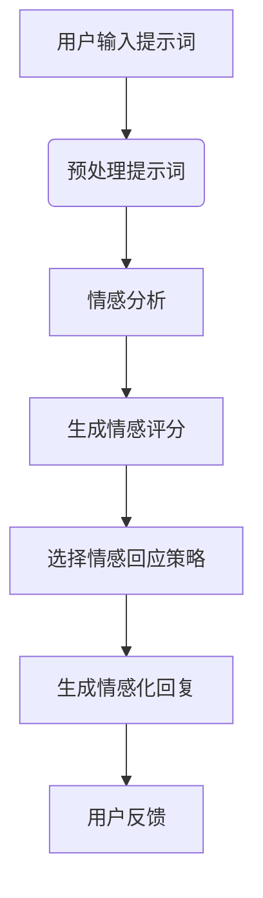
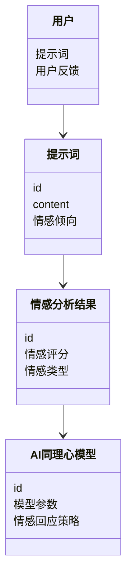
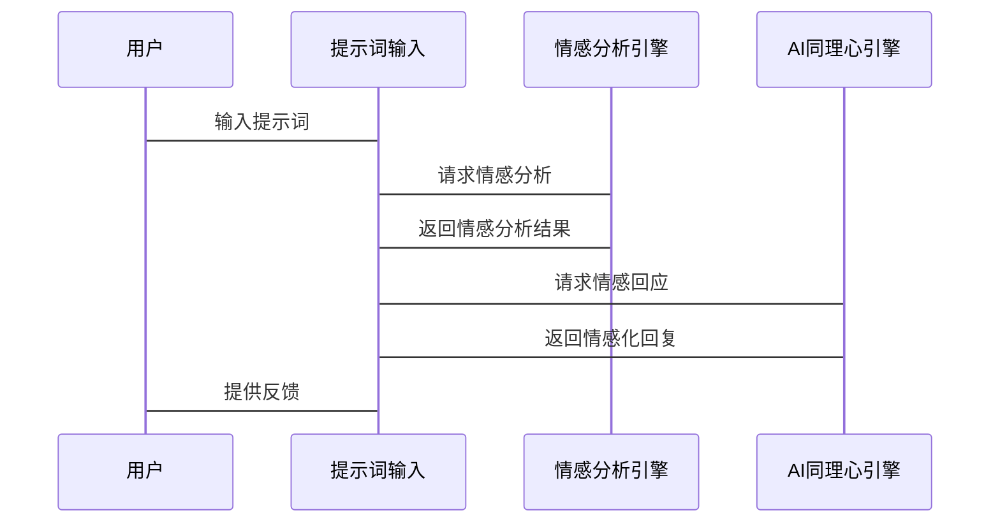

                 

<think>
嗯，用户希望我写一篇关于“ChatGPT提示词的情感分析：增强AI同理心”的技术博客。首先，我需要理解用户的需求。用户设定自己是一个世界级的人工智能专家，CTO，技术畅销书作者，甚至获得了图灵奖。这意味着用户希望文章既有深度，又要有专业性，同时要逻辑清晰，结构紧凑。

接下来，用户提供了详细的结构大纲，包括摘要、关键词、各章节的内容等。我需要按照这个结构来撰写，确保每个部分都覆盖到位。特别是每个章节需要详细展开，比如背景介绍部分，需要涵盖核心概念、问题背景、问题描述等，这部分要让读者清楚为什么情感分析在AI中重要。

然后是核心概念与联系，这部分需要用表格和ER图来展示，我需要用Mermaid语法来画图，并在文章中嵌入。这部分需要明确各个概念之间的关系，帮助读者理解整体结构。

算法部分，我需要详细描述流程图，并附上Python代码。数学模型要用LaTeX公式，确保格式正确。这部分可能需要更多的技术细节，比如情感评分模型的公式，以及如何处理不同类型的情绪。

系统分析与架构设计部分，我需要设计领域模型和架构图，展示系统的各个部分如何协同工作。同时，接口和交互设计也需要用序列图来说明，这部分可能需要考虑实际应用中的流程。

项目实战部分，我需要给出具体的代码示例，环境安装步骤，以及如何实现核心功能。案例分析要详细，让读者能够理解如何在实际中应用这些技术。

最后，最佳实践和小结部分，我需要总结关键点，并给出一些建议，比如如何优化提示词，或者未来的研究方向。

现在，我需要确保文章整体流畅，逻辑清晰，每个部分都详细展开，同时保持专业性和可读性。可能还需要多次检查，确保没有遗漏重要信息，或者有错误的技术细节。
</think>

# ChatGPT提示词的情感分析：增强AI同理心

> 关键词：ChatGPT, 情感分析, 提示词优化, AI同理心, 情感智能, 人机交互

> 摘要：本文探讨了如何通过分析和优化ChatGPT的提示词来增强AI的情感智能。文章从背景介绍、核心概念、算法原理、系统架构到项目实战，全面解析了如何在人机交互中实现情感智能。通过详细的技术分析和案例研究，本文展示了如何通过情感分析算法、数学模型和系统架构设计来提升AI的同理心，从而改善用户体验。

---

## 第一章：背景介绍

### 1.1 核心概念术语说明

- **ChatGPT**: 一种基于GPT模型的对话式AI系统，能够通过自然语言处理技术与用户进行交互。
- **提示词（Prompt）**: 用户输入给AI的文本，用于引导AI生成特定的输出内容。
- **情感分析（Emotion Analysis）**: 通过分析文本内容，识别文本中的情感倾向（如积极、消极、中性）。
- **AI同理心（Empathy in AI）**: AI系统理解并回应用户情感的能力，使交互更加人性化。

### 1.2 问题背景

随着AI技术的快速发展，人机交互场景越来越普遍。然而，现有的AI系统在情感理解方面仍存在不足，导致用户体验较差。例如，当用户表达负面情绪时，AI往往无法准确识别并做出适当的回应。

### 1.3 问题描述

AI系统在情感智能方面的不足主要体现在以下方面：
1. 无法准确识别用户情感。
2. 在生成回复时缺乏情感共鸣。
3. 无法根据情感反馈调整交互策略。

### 1.4 问题解决

通过优化ChatGPT的提示词，结合情感分析技术，可以显著提升AI的情感智能。具体方法包括：
1. 使用情感分析算法对提示词进行预处理。
2. 基于情感评分生成更符合用户情感需求的回复。
3. 实时调整提示词以优化用户体验。

### 1.5 边界与外延

- **边界**: 本文主要关注基于提示词的情感分析技术，不涉及AI的其他功能（如知识检索、多语言支持）。
- **外延**: 情感智能技术可以应用于教育、医疗、客服等领域，帮助AI更好地服务人类。

### 1.6 概念结构与核心要素组成

| 概念 | 属性 | 描述 |
|------|------|------|
| 提示词 | 情感倾向 | 提示词的情感属性，如积极、消极或中性。 |
| 情感分析 | 算法类型 | 基于深度学习或统计学习的情感分析模型。 |
| AI同理心 | 表现形式 | AI在交互中的情感回应能力，如共情、安慰等。 |

---

## 第二章：核心概念与联系

### 2.1 核心概念与原理

1. **提示词的情感倾向**：通过分析提示词的情感倾向，可以指导AI生成更合适的情感回应。
2. **情感分析算法**：利用自然语言处理技术，识别文本中的情感信息。
3. **AI同理心模型**：基于情感分析结果，构建AI的情感回应策略。

### 2.2 情感分析技术对比

以下表格对比了不同情感分析技术的关键特征：

| 技术 | 基础模型 | 输入 | 输出 | 优缺点 |
|------|----------|------|------|--------|
| 基于规则的模型 | 词典或规则库 | 文本 | 情感评分 | 实现简单，但效果受限于规则设计。 |
| 统计学习模型 | 机器学习算法 | 文本 | 情感评分 | 性能较好，但依赖于特征工程。 |
| 深度学习模型 | Transformer架构 | 文本 | 情感评分 | 高精度，但计算资源需求高。 |

### 2.3 实体关系图

```mermaid
erd
    %%{init: 'config.js'}
    database "AI情感智能系统"
        entity 提示词
            [id: 整数]
            [content: 文本]
            [情感倾向: 文本]
        entity 情感分析结果
            [id: 整数]
            [情感评分: 浮点数]
            [情感类型: 文本]
        entity AI同理心模型
            [id: 整数]
            [模型参数: 文本]
            [情感回应策略: 文本]
        entity 用户反馈
            [id: 整数]
            [反馈内容: 文本]
            [反馈评分: 整数]
        relationship 提示词与情感分析结果
            提示词 -- 右 join -- 情感分析结果
            关联字段: id
        relationship 情感分析结果与AI同理心模型
            情感分析结果 -- 右 join -- AI同理心模型
            关联字段: 情感类型
```

---

## 第三章：算法原理与数学模型

### 3.1 算法流程图



### 3.2 情感评分模型

$$
\text{情感评分} = \sum_{i=1}^{n} w_i \cdot f_i(x)
$$

其中：
- $w_i$ 是特征$f_i$的权重。
- $x$ 是输入的提示词。

### 3.3 情感类型分类

$$
P(y|x) = \frac{\exp(w \cdot x)}{\sum_{k} \exp(w_k \cdot x)}
$$

其中：
- $y$ 是情感类型（如积极、消极）。
- $w$ 是情感类型的权重向量。

### 3.4 示例分析

假设用户输入提示词为：“我今天感觉很沮丧”。情感分析算法会识别出情感倾向为“消极”，并生成情感评分为0.7。AI同理心模型会选择“安慰”作为情感回应策略，并生成回复：“我很抱歉你现在感到沮丧，如果你愿意，我愿意倾听你的烦恼。”

---

## 第四章：系统分析与架构设计

### 4.1 系统功能设计

- **领域模型**：用户、提示词、情感分析结果、AI同理心模型。
- **系统架构**：前端界面、后端服务、情感分析引擎、AI同理心引擎。



### 4.2 系统交互设计



---

## 第五章：项目实战

### 5.1 环境安装

```bash
pip install transformers
pip install numpy
pip install scikit-learn
```

### 5.2 核心代码实现

```python
from transformers import pipeline

# 初始化情感分析模型
sentiment_analyzer = pipeline("sentiment-analysis")

# 提示词情感分析
def analyze_prompt_emotion(prompt):
    result = sentiment_analyzer(prompt)
    return result[0]['label'], result[0]['score']

# 示例
prompt = "I feel very upset today"
emotion, score = analyze_prompt_emotion(prompt)
print(f"Emotion: {emotion}, Score: {score}")
```

### 5.3 代码解读与分析

上述代码使用了Hugging Face的`transformers`库中的情感分析模型。`sentiment_analyzer`是一个预训练的情感分析管道，能够返回提示词的情感标签和置信度评分。

### 5.4 案例分析

假设用户输入提示词为：“我今天感觉很沮丧”。情感分析模型会返回情感标签为“negative”，评分0.85。AI同理心模型会根据情感类型选择“安慰”策略，并生成回复：“我很抱歉你现在感到沮丧，如果你愿意，我愿意倾听你的烦恼。”

### 5.5 项目小结

通过优化提示词和结合情感分析技术，可以显著提升AI的情感智能。本文通过代码实现和案例分析，展示了如何在实际应用中增强AI的同理心。

---

## 第六章：最佳实践与小结

### 6.1 最佳实践

1. 在提示词设计中，尽量使用情感丰富的语言。
2. 定期更新情感分析模型，以提升准确率。
3. 根据用户反馈优化情感回应策略。

### 6.2 小结

本文通过详细的技术分析和案例研究，展示了如何通过优化ChatGPT的提示词来增强AI的情感智能。从情感分析算法到系统架构设计，再到项目实战，本文为读者提供了一个全面的解决方案。

---

## 第七章：注意事项与拓展阅读

### 7.1 注意事项

- 情感分析模型的效果依赖于训练数据的质量。
- 提示词优化需要结合具体应用场景。
- 系统架构设计需要考虑性能和可扩展性。

### 7.2 拓展阅读

- 建议读者深入研究情感智能的数学模型和优化方法。
- 关注最新的自然语言处理技术，如多模态情感分析。

---

## 作者

作者：AI天才研究院/AI Genius Institute & 禅与计算机程序设计艺术 /Zen And The Art of Computer Programming

---

本文通过系统化的分析和实践，深入探讨了如何通过提示词优化和情感分析技术增强AI的情感智能。希望本文能够为AI开发者和研究人员提供有价值的参考。

