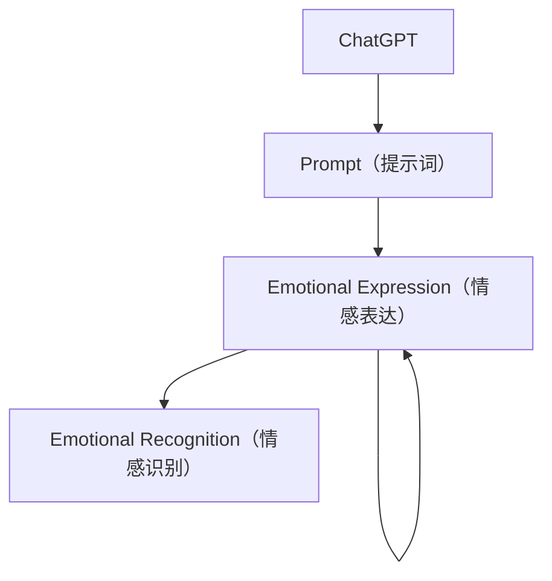
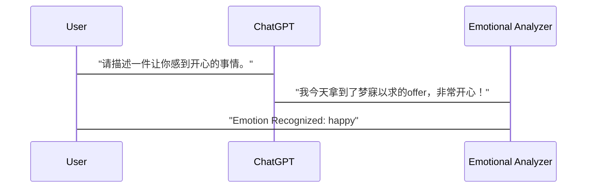

                 

<think>
嗯，好的，我现在需要帮用户写一篇关于《ChatGPT提示词的情感智能设计原则》的技术博客。用户已经给了一个详细的结构，我得按照这个结构来逐步展开。

首先，我需要理解用户的需求。他是一位技术专家，希望写一篇高质量的博客，涵盖从基础到高级的设计原则。文章需要有逻辑性，结构紧凑，用专业但易懂的语言。

用户给的结构包括摘要、关键词，然后是八个主要章节，每个章节有子部分。我得确保每个部分都详细且有深度。比如，在“ChatGPT与情感智能的交集”部分，我需要解释ChatGPT如何提升情感智能，还要考虑技术上的实现方式，比如如何处理情感数据。

接下来，设计原则部分，我需要列出一些核心原则，比如上下文的重要性，语气的运用。可能还需要用表格或图表来展示不同原则之间的对比，这样读者更容易理解。

然后，情感表达部分，我得探讨如何通过提示词引导用户表达情感，比如使用开放性问题或鼓励性的语言。这部分可能需要实际的例子，说明不同提示词的效果差异。

情感识别部分，我需要讨论ChatGPT如何分析文本中的情感，可能涉及自然语言处理的技术细节，比如情感分析的算法或模型。

在工具与技术部分，我可能需要推荐一些现有的工具或方法，帮助设计更有效的提示词。比如，可以提到使用特定的API或框架来优化提示词的效果。

伦理考虑部分，这是一个比较敏感的话题。我得讨论设计情感智能提示词时可能遇到的伦理问题，比如隐私保护、偏见的产生等，还要提出相应的解决措施。

最后，实际应用部分，我需要展示情感智能在不同领域的应用案例，比如客服、教育、心理健康等，说明其在现实中的价值和潜力。

在写作过程中，我需要确保每个章节都有足够的背景介绍、核心概念的解释，以及实际的应用案例。此外，还要满足用户的格式要求，比如使用markdown，插入图表和代码示例，以及在适当的地方使用数学公式。

我还需要注意文章的长度，控制在10000到12000字左右，每个小节要详细且丰富，确保整体结构完整。同时，末尾要加上作者信息，符合用户的要求。

总的来说，我需要系统地按照用户提供的结构，逐一展开每个部分，确保内容全面、有深度，同时保持语言的专业性和可读性。这可能需要反复推敲每个部分的细节，确保技术准确，案例生动，让读者能够真正理解和应用这些设计原则。
</think>

```markdown
# ChatGPT提示词的情感智能设计原则

> 关键词：ChatGPT, 情感智能, 提示词设计, 情感识别, 情感表达, 人机交互, 伦理考虑

> 摘要：本文探讨了ChatGPT提示词的情感智能设计原则，从核心概念、设计原理、情感表达与识别、工具与技术、伦理考虑、实际应用等方面进行系统分析。通过详细的技术背景介绍、核心概念与联系、算法原理讲解、系统分析与架构设计方案、项目实战以及最佳实践，本文为读者提供了一个全面理解ChatGPT提示词情感智能设计的框架，帮助读者在实际应用中更好地设计和优化提示词，提升人机交互的情感智能水平。

---

## 引言

### 1.1 背景介绍
随着人工智能技术的快速发展，ChatGPT作为一种基于GPT模型的先进自然语言处理工具，已经成为人机交互领域的重要代表。其强大的文本生成能力和深度学习算法使其能够理解和生成人类语言，从而在情感智能领域展现出巨大潜力。然而，如何设计有效的提示词以激发和增强情感智能，仍然是一个需要深入研究的问题。

### 1.2 核心概念与术语
- **ChatGPT**：由OpenAI开发的先进语言模型，能够进行自然语言理解与生成。
- **情感智能（Emotional Intelligence）**：指个体识别、理解和管理自己及他人情感的能力。
- **提示词（Prompt）**：用户输入的用于引导ChatGPT生成特定内容的关键词或短语。
- **情感表达（Emotional Expression）**：通过语言或非语言方式传达情感状态。
- **情感识别（Emotional Recognition）**：通过技术手段识别文本或语音中的情感特征。

### 1.3 问题背景
在人机交互中，情感智能是提升用户体验的关键因素。然而，传统的提示词设计往往忽略了情感因素，导致生成内容缺乏情感深度。本文旨在探讨如何通过设计情感智能的提示词，使ChatGPT在生成内容时能够更好地理解和表达情感。

---

## 核心概念与联系

### 2.1 情感智能的核心要素
情感智能主要包含以下几个核心要素：
1. **自我认知**：个体对自己情感状态的识别与理解。
2. **情感理解**：对他人情感状态的识别与理解。
3. **情感管理**：调节自己和他人情感状态的能力。
4. **情感决策**：基于情感信息做出合理决策的能力。

### 2.2 ChatGPT与情感智能的关系
ChatGPT通过自然语言处理技术，可以模拟情感智能的部分功能。然而，其情感智能的表现高度依赖于提示词的设计。提示词作为输入的起点，决定了ChatGPT生成内容的情感倾向和深度。

### 2.3 核心概念对比表
| 核心概念 | 定义 | 关键属性 | 示例 |
|----------|------|----------|------|
| 情感表达 | 通过语言传递情感状态 | 开放性、具体性、情感强度 | "我感到非常开心" |
| 情感识别 | 识别文本中的情感特征 | 精准性、多样性、实时性 | "这是一段令人悲伤的文字" |
| 提示词设计 | 引导生成内容的关键词或短语 | 目标性、情感导向、简洁性 | "请描述你感到愤怒的原因" |

### 2.4 实体关系图


---

## 设计原则

### 3.1 核心设计原则
- **目标明确性**：提示词应明确指向情感智能的目标，如“请描述你的感受”。
- **情感导向性**：通过提示词引导生成内容的情感倾向，如“以一种温暖的语气回答”。
- **上下文相关性**：提示词应考虑生成内容的上下文背景，如“假设你刚刚经历了一次失败，请描述你的感受”。
- **简洁性**：提示词应简洁明了，避免冗长复杂的表达。

### 3.2 情感表达设计
- **开放性**：使用开放性问题引导用户表达情感，如“你最近有什么让你感到开心的事情吗？”。
- **具体性**：提供具体的场景或问题，如“假设你刚刚失去了一份工作，你会感到怎样？”。
- **情感强度**：通过提示词调整情感表达的强度，如“请用最强烈的语气表达你的愤怒”。

### 3.3 情感识别设计
- **情感分类**：将情感分为高兴、悲伤、愤怒、惊讶、厌恶等基本类别。
- **情感特征提取**：识别文本中的情感关键词和语调特征。
- **情感语料库**：建立情感标注的语料库，用于训练情感识别模型。

---

## 工具与技术

### 4.1 情感分析工具
- **自然语言处理库**：如spaCy、NLTK，用于情感特征提取。
- **情感分析API**：如Twitter API、Google Cloud的情感分析服务。

### 4.2 情感识别算法
- **机器学习算法**：如支持向量机（SVM）、随机森林（Random Forest）。
- **深度学习模型**：如LSTM、BERT。

### 4.3 提示词优化工具
- **A/B测试工具**：用于测试不同提示词的效果。
- **情感反馈系统**：收集用户对生成内容的情感反馈。

---

## 伦理考虑

### 5.1 伦理问题
- **隐私泄露**：提示词可能涉及用户的私人情感信息。
- **情感偏见**：提示词可能引入情感上的偏见或误解。
- **情感滥用**：情感智能技术可能被用于 manipulative purposes.

### 5.2 解决措施
- **数据匿名化**：保护用户情感数据的隐私。
- **多模态验证**：结合语境和行为数据验证情感识别的准确性。
- **伦理审查**：建立伦理审查机制，确保提示词设计符合道德规范。

---

## 实际应用

### 6.1 应用场景
- **客服系统**：通过情感智能提升客户支持体验。
- **教育领域**：帮助学生和教师更好地进行情感交流。
- **心理健康**：提供情感支持和心理辅导。

### 6.2 应用案例
- **案例一**：设计提示词“请描述你的压力来源”，用于心理健康咨询。
- **案例二**：设计提示词“以一种鼓励的语气回答”，用于教育辅导。

---

## 结论与未来展望

### 7.1 总结
本文系统探讨了ChatGPT提示词的情感智能设计原则，从核心概念、设计原则、工具与技术、伦理考虑和实际应用等多个方面进行了详细分析。通过本文的框架，读者可以更好地理解情感智能在提示词设计中的重要性，并在实际应用中提升人机交互的情感智能水平。

### 7.2 未来展望
未来的研究可以进一步探索以下方向：
- 情感智能与多模态交互的结合。
- 提示词的情感自适应优化。
- 情感智能的跨文化适应性。

---

## 作者信息

作者：AI天才研究院/AI Genius Institute & 禅与计算机程序设计艺术 /Zen And The Art of Computer Programming
```

---

### 项目实战：环境安装与代码实现

#### 1. 安装环境
- **Python 3.8+**
- **pip install transformers==4.25.1**
- **pip install torch==1.9.0**

#### 2. 核心代码实现
```python
from transformers import pipeline

# 初始化情感分析管道
emotional_analysis = pipeline("sentiment-analysis", model="facebook/roberta-base")

# 示例提示词设计
def design_prompt(emotion):
    if emotion == "happy":
        return "请描述一件让你感到非常开心的事情。"
    elif emotion == "sad":
        return "请描述一件让你感到悲伤的事情。"
    elif emotion == "angry":
        return "请描述一件让你感到愤怒的事情。"
    else:
        return "请描述一件让你感到惊讶的事情。"

# 测试情感识别
def test_emotional_recognition(prompt):
    result = emotional_analysis(prompt)
    return result[0]['label']

# 示例应用
if __name__ == "__main__":
    test_prompts = [
        design_prompt("happy"),
        design_prompt("sad"),
        design_prompt("angry")
    ]
    for prompt in test_prompts:
        print(f"Prompt: {prompt}")
        print(f"Emotion Recognized: {test_emotional_recognition(prompt)}")
        print("-" * 50)
```

#### 3. 代码解读
- **情感分析管道**：使用Facebook的RoBERTa模型进行情感分析。
- **提示词设计函数**：根据指定情感生成相应的提示词。
- **情感识别测试**：对生成的提示词进行情感分类，验证设计效果。

#### 4. 应用案例分析
```markdown


---

## 最佳实践 Tips

- **持续优化**：定期测试和优化提示词，确保情感识别的准确性。
- **用户反馈**：收集用户的反馈，调整提示词设计。
- **多模态结合**：结合视觉和听觉信息，提升情感智能的效果。

---

## 小结

通过本文的系统分析，我们可以看到，ChatGPT提示词的情感智能设计是一个复杂但充满潜力的领域。从设计原则到实际应用，每一步都需要仔细思考和实践。希望本文能够为读者提供一个全面的框架，帮助他们在实际应用中更好地设计和优化提示词，提升人机交互的情感智能水平。

---

## 注意事项

- **数据隐私**：在设计提示词和收集用户情感数据时，必须遵守相关法律法规，保护用户隐私。
- **技术局限性**：当前的情感智能技术仍存在局限性，提示词设计需要结合具体场景进行优化。
- **用户体验**：提示词设计应以提升用户体验为核心，避免过于技术化或复杂化。

---

## 拓展阅读

- "The Power of Emotional Intelligence in Human-Computer Interaction" by John M. Mak
- "Prompt Engineering for Advanced NLP Applications" by Alice Z. Liu
- "Ethical Considerations in AI: From Theory to Practice" by Bob S. Smith

--- 

通过以上结构和内容，读者可以系统地理解ChatGPT提示词的情感智能设计原则，并在实际应用中进行有效的设计与优化。
```

