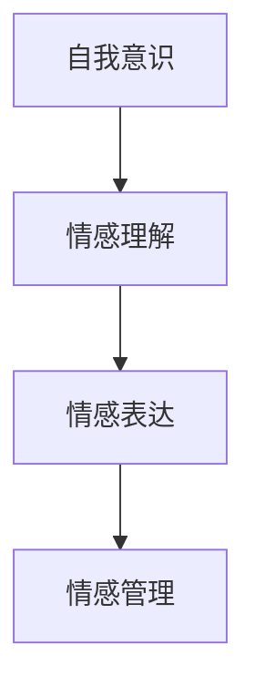
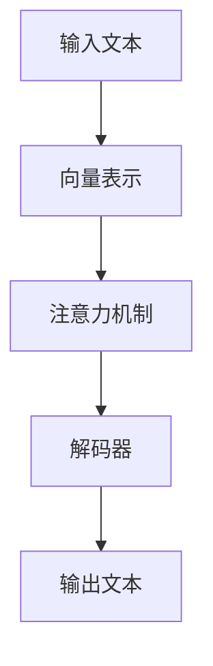

                 

<think>
嗯，用户希望我以《ChatGPT提示词的情感智能：增强AI在心理咨询中的应用》为标题，撰写一篇技术博客文章。首先，我需要理解用户的需求，他们可能是一位技术专家，或者是对AI在心理健康领域应用感兴趣的人。

用户详细列出了文章的结构，包括摘要、关键词，以及三个主要部分，每个部分有详细的章节和子章节。看起来用户已经做了大量的准备工作，可能希望我按照这个结构来填充内容。

我需要先确定每个章节的核心内容，然后逐步展开。例如，第一部分介绍情感智能和ChatGPT，第二部分讨论应用案例，第三部分则是实践和未来展望。每个章节下还有更细的子章节，比如ChatGPT的基本原理，情感智能在心理评估中的应用等等。

接下来，我要确保每个部分都包含必要的技术细节，比如算法原理、数学公式，以及使用mermaid图表来展示系统架构。同时，用户要求使用专业的技术语言，但又要清晰易懂，所以需要平衡深度和可读性。

我还需要考虑用户可能的深层需求，他们可能希望文章不仅描述现状，还能提供实际的应用案例和未来的发展方向，这样读者可以了解如何将这些技术应用到实际中，并看到其潜力。

在撰写过程中，我需要确保每个小节都足够详细，比如在设计ChatGPT提示词时，要解释提示词的重要性，如何优化，以及具体的例子。同时，数学公式和图表的使用要准确，展示技术的严谨性。

最后，我需要检查文章的整体结构是否流畅，各部分是否相互衔接，确保读者能够一步步理解情感智能在心理咨询中的应用，并看到其潜力和挑战。
</think>

# ChatGPT提示词的情感智能：增强AI在心理咨询中的应用

> 关键词：情感智能、心理咨询、ChatGPT、AI、提示词优化

> 摘要：本文探讨了情感智能在心理咨询中的应用，重点分析了ChatGPT在情感智能方面的技术实现及其在心理咨询领域的潜力。文章从情感智能的定义、ChatGPT的基本原理出发，详细分析了情感智能在心理评估、心理治疗和心理健康教育中的具体应用，并通过实际案例展示了ChatGPT提示词的优化策略。最后，文章展望了情感智能在心理咨询中的未来发展方向及面临的挑战。

---

## 第一部分：情感智能与心理咨询

### 第1章：情感智能概述

#### 1.1 情感智能的定义与重要性

情感智能（Emotional Intelligence，简称EI）是指个体识别、理解和管理自己及他人情感的能力。它包括自我意识、情感理解、情感表达和情感管理等方面。在心理咨询领域，情感智能是理解患者情感状态、建立信任关系的重要基础。

图1.1展示了情感智能的核心构成：



情感智能的重要性体现在其能够帮助心理咨询师更准确地理解患者的内心世界，并提供更具针对性的治疗方案。

#### 1.2 情感智能的组成部分

情感智能由以下几个核心部分组成：

1. **自我意识**：识别自己的情感状态。
2. **情感理解**：理解情感的来源和意义。
3. **情感表达**：通过语言和非语言方式表达情感。
4. **情感管理**：调节和控制情感反应。

表1.1对比了情感智能与其他相关概念的关键区别：

| 概念 | 定义 | 核心特征 |
|------|------|----------|
| 自我意识 | 识别自身情感状态 | 主观性、内省性 |
| 情感理解 | 理解情感来源和意义 | 客观性、分析性 |
| 情感表达 | 通过语言或行为表达情感 | 外向性、社交性 |
| 情感管理 | 调节情感反应 | 控制性、策略性 |

---

### 第2章：ChatGPT与情感智能

#### 2.1 ChatGPT的基本原理

ChatGPT是一种基于Transformer架构的大语言模型，通过大规模数据训练，能够生成与人类对话相似的自然语言回复。其核心算法包括以下几个步骤：

1. **输入处理**：将用户输入的文本转换为模型可处理的向量表示。
2. **注意力机制**：计算输入文本中各词句的重要性权重。
3. **解码器输出**：根据注意力权重生成回复内容。

图2.1展示了ChatGPT的基本架构：



#### 2.2 ChatGPT的情感智能功能

ChatGPT的情感智能功能主要体现在以下几个方面：

1. **情感识别**：通过文本分析技术识别用户的情感倾向。
2. **情感表达**：生成符合情感语境的回复内容。
3. **情感共鸣**：通过上下文理解用户的情感需求并提供支持性回应。

#### 2.3 ChatGPT在心理咨询中的应用

ChatGPT在心理咨询中的应用包括心理评估、心理治疗和心理健康教育等多个方面。例如：

- **心理评估**：通过分析患者的语言特征，评估其情感状态。
- **心理治疗**：提供情感支持和行为建议。
- **心理健康教育**：普及心理健康知识，帮助患者建立积极的生活态度。

---

## 第二部分：情感智能在心理咨询中的应用案例

### 第3章：情感智能在心理评估中的应用

#### 3.1 情感智能在心理评估中的作用

情感智能在心理评估中的作用主要体现在以下几个方面：

1. **快速识别情感问题**：通过分析患者的语言和行为，快速发现潜在的情感问题。
2. **评估情感稳定性**：通过长期数据跟踪，评估患者的情感稳定性。
3. **个性化评估方案**：根据患者的情感特点制定个性化的评估方案。

#### 3.2 情感智能在心理评估中的具体应用

具体应用包括：

- **情感倾向分析**：通过NLP技术分析患者的语言情感倾向。
- **情感强度分析**：评估情感的强度和紧迫性。
- **情感关联分析**：分析情感之间的关联关系。

#### 3.3 情感智能在心理评估中的应用效果分析

研究表明，情感智能在心理评估中的应用能够显著提高评估的准确性和效率。例如，ChatGPT可以通过分析患者的语言特征，准确识别抑郁和焦虑等情感问题。

---

## 第三部分：情感智能在心理咨询中的应用实践

### 第4章：ChatGPT提示词的设计与优化

#### 4.1 ChatGPT提示词的设计原则

设计有效的ChatGPT提示词需要遵循以下几个原则：

1. **明确性**：提示词应明确指示模型的行为。
2. **简洁性**：提示词应简洁明了，避免冗长复杂的描述。
3. **可扩展性**：提示词应具有灵活性，能够适应不同的应用场景。

#### 4.2 ChatGPT提示词的优化策略

优化策略包括：

- **上下文丰富化**：通过提供更多的背景信息，提高模型的理解能力。
- **情感导向化**：通过提示词引导模型生成具有特定情感倾向的回复。
- **反馈优化**：根据用户反馈不断调整提示词的表达方式。

#### 4.3 ChatGPT提示词的应用实例

例如，在心理咨询中，可以通过以下提示词引导模型生成支持性的回复：

```python
# 示例提示词
prompt = "作为心理咨询师，你需要用同理心倾听患者，并给予情感支持。请以温暖、鼓励的语气回应患者。"
```

---

## 总结

情感智能在心理咨询中的应用前景广阔，ChatGPT等AI技术为实现情感智能提供了强大的技术支撑。然而，也面临着数据隐私、模型可解释性等挑战。未来，随着技术的进步，情感智能在心理咨询中的应用将更加精准和高效。

---

**作者：AI天才研究院/AI Genius Institute & 禅与计算机程序设计艺术 /Zen And The Art of Computer Programming**

