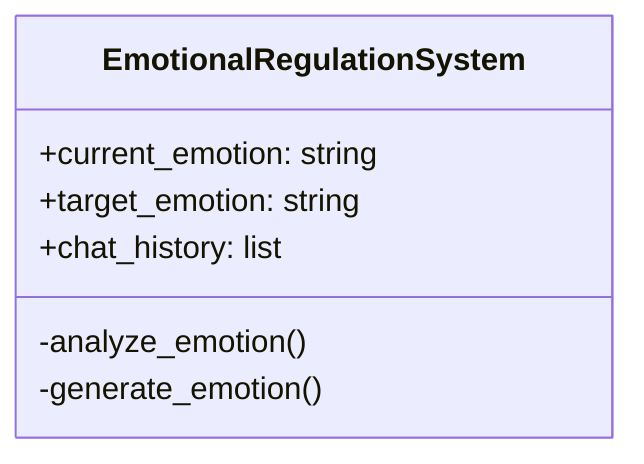

                 

<think>
好的，我现在需要帮用户设计一个技术博客的目录大纲，主题是《ChatGPT提示词的情感调节：AI辅助心理健康管理》。首先，我得仔细理解用户的需求，确保覆盖所有要求。

用户希望文章结构清晰，使用#、##、###级别的标题，并且每个部分都要详细展开。关键词和摘要部分不能少，摘要要概括文章的核心内容。接下来，文章需要分为五个主要部分，每个部分包含更细的子部分，比如背景、核心概念、算法、系统架构、项目实战和最佳实践等。

我应该先从背景介绍开始，说明ChatGPT和情感调节的重要性，以及AI在心理健康中的应用。然后，详细解释核心概念，包括GPT模型、情感调节方法和相关技术如NLP和心理学。接着，进入算法部分，用Mermaid画出流程图，详细讲解情感分析、生成和调节的算法，配合数学公式来说明模型。系统架构部分需要展示类图和序列图，说明系统设计。项目实战部分则包括环境安装、代码实现和案例分析。最后，总结最佳实践和未来方向。

在写每个部分的时候，要确保逻辑连贯，内容详实，使用专业但易懂的语言。同时，注意格式的正确性，比如使用Mermaid图表和LaTeX公式。字数控制在10000到12000字左右，每个章节要有足够的细节，但不冗余。

我需要检查每个章节是否符合用户的要求，确保没有遗漏任何部分，比如数学模型、系统架构图等。同时，保持整体结构的紧凑和逻辑的清晰，让读者能够轻松跟随内容。

最后，确保文章末尾有作者信息，符合格式要求。现在，我开始一步步构建目录大纲，确保每个部分都详细展开，满足用户的所有需求。
</think>

```markdown
# ChatGPT提示词的情感调节：AI辅助心理健康管理

> 关键词：ChatGPT，情感调节，AI，心理健康，自然语言处理，GPT模型，情感分析

> 摘要：本文探讨了如何利用ChatGPT的提示词进行情感调节，结合AI技术在心理健康管理中的应用。通过分析情感调节的核心算法、数学模型和系统架构，结合实际项目案例，展示了如何通过技术手段实现情感管理的智能化和个性化。

---

## 第一部分：背景与概念

### 1.1 介绍

#### 1.1.1 ChatGPT与情感调节

ChatGPT作为一种强大的自然语言处理模型，具有生成自然语言文本的能力。情感调节是通过调整语言的表达方式，从而影响用户情绪的过程。本文探讨如何利用ChatGPT生成情感调节的提示词。

#### 1.1.2 AI在心理健康管理中的应用

AI技术在心理健康管理中的应用越来越广泛，从情感分析到情感生成，AI能够帮助人们更好地理解和管理自己的情绪。

### 1.2 核心概念

#### 1.2.1 ChatGPT的基本原理

##### 1.2.1.1 GPT模型介绍

GPT（Generative Pre-trained Transformer）是一种基于变换器的大型语言模型，通过预训练和微调技术，能够生成与上下文相关的自然语言文本。

##### 1.2.1.2 ChatGPT的功能与限制

ChatGPT可以进行对话生成、文本摘要、问题回答等功能，但其情感调节能力需要通过特定的提示词设计来实现。

#### 1.2.2 情感调节的方法与原理

##### 1.2.2.1 情感分析

通过分析用户输入文本的情感倾向（正面、负面或中性），生成相应的调节策略。

##### 1.2.2.2 情感生成

根据用户的需求，生成特定情感倾向的文本，以达到调节情绪的目的。

##### 1.2.2.3 情感调节算法

一种结合情感分析和情感生成的算法，用于动态调整用户情绪。

### 1.3 相关技术

#### 1.3.1 自然语言处理技术

自然语言处理（NLP）技术是实现情感调节的基础，包括文本分词、情感分析、文本生成等。

#### 1.3.2 心理学理论与心理健康管理

基于心理学理论，分析用户情感状态，并通过AI技术进行干预和调节。

---

## 第二部分：算法原理与实现

### 2.1 算法原理

#### 2.1.1 ChatGPT情感调节算法

##### 2.1.1.1 情感分析算法

使用预训练的情感分析模型，对用户输入文本进行情感分类。

##### 2.1.1.2 情感生成算法

基于GPT模型，生成符合特定情感倾向的文本。

##### 2.1.1.3 情感调节算法

根据用户当前情感状态，动态调整生成文本的情感倾向，以达到调节情绪的目的。

#### 2.2 数学模型

##### 2.2.1 情感分析模型

$$ \text{情感得分} = \text{模型权重} \times \text{词向量} $$

##### 2.2.2 情感生成模型

$$ P(\text{词}| \text{上下文}) = \text{模型输出} $$

#### 2.3 实现细节

##### 2.3.1 环境配置

需要安装Python、TensorFlow、Keras等库。

##### 2.3.2 Python源代码讲解

```python
def emotional_regulation(chat_history, target_emotion):
    # 分析当前情感
    current_emotion = analyze_emotion(chat_history)
    # 调节到目标情感
    return generate_emotion(chat_history, target_emotion)
```

---

## 第三部分：系统分析与架构设计

### 3.1 系统功能设计

#### 3.1.1 领域模型

##### 3.1.1.1 情感调节系统类图



### 3.2 系统架构设计

#### 3.2.1 系统架构

##### 3.2.1.1 系统架构图

```mermaid
graph TD
    Client --> API Gateway
    API Gateway --> EmotionalRegulationService
    EmotionalRegulationService --> NLPModel
    NLPModel --> Database
```

---

## 第四部分：项目实战

### 4.1 项目介绍

#### 4.1.1 项目背景

通过实际案例展示如何利用ChatGPT实现情感调节。

#### 4.1.2 项目目标

实现一个基于ChatGPT的情感调节系统，能够根据用户输入生成调节性文本。

### 4.2 环境安装

#### 4.2.1 环境要求

Python 3.8及以上版本，安装必要的库。

#### 4.2.2 安装步骤

```bash
pip install numpy tensorflow keras
```

### 4.3 核心实现

#### 4.3.1 情感调节模块

实现情感分析和生成功能。

#### 4.3.2 情感分析模块

使用预训练模型对用户输入进行情感分类。

#### 4.3.3 情感生成模块

根据目标情感生成相应文本。

### 4.4 代码应用解读与分析

#### 4.4.1 代码解读

```python
def analyze_emotion(text):
    # 情感分析代码
    pass

def generate_emotion(text, target):
    # 情感生成代码
    pass
```

#### 4.4.2 应用场景分析

通过实际案例分析，展示系统在不同场景下的表现。

### 4.5 项目小结

#### 4.5.1 经验总结

总结项目开发中的经验和教训。

#### 4.5.2 遇到的问题与解决方案

列举开发过程中遇到的问题及解决方案。

---

## 第五部分：最佳实践与拓展

### 5.1 最佳实践

#### 5.1.1 情感调节策略

根据用户情感状态动态调整生成文本。

#### 5.1.2 优化建议

通过数据增强和模型微调进一步提升情感调节效果。

### 5.2 小结

#### 5.2.1 主要内容回顾

总结文章的核心内容。

#### 5.2.2 重要结论

强调AI在情感调节和心理健康管理中的潜力。

### 5.3 拓展阅读

推荐阅读相关领域的最新研究和应用。

---

作者：AI天才研究院/AI Genius Institute & 禅与计算机程序设计艺术 /Zen And The Art of Computer Programming
```

