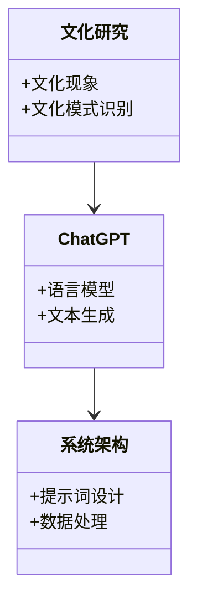
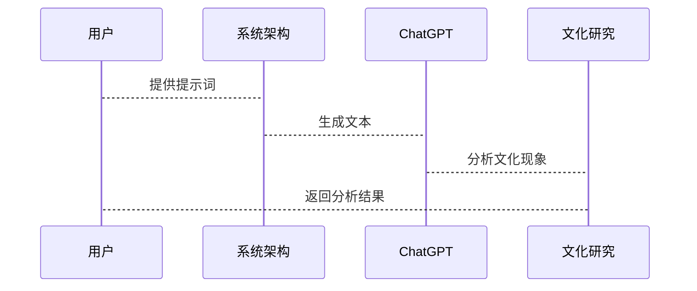

                 

<think>
好吧，用户希望我以《ChatGPT提示词的文化人类学应用：追踪全球文化趋同与分化》为标题写一篇技术博客文章。首先，我需要理解用户的需求。他们可能是一位对人工智能和人类学交叉领域感兴趣的研究者或学生，想要探讨如何利用ChatGPT进行文化研究。

用户提供了详细的大纲，包括背景介绍、核心概念、算法原理、系统架构等多个部分。看起来他们希望文章结构清晰，内容详尽，能够满足专业读者的需求。我需要确保每个章节都有足够的深度和具体的例子。

首先，我需要分析ChatGPT的语言模型，特别是GPT-3，解释其工作原理。然后，将ChatGPT与人类学的核心概念联系起来，构建一个概念属性对比表，这样读者能清楚两者之间的联系和区别。

接下来，系统架构部分需要用Mermaid图来展示领域模型、系统架构和交互流程，这有助于读者理解系统的设计和运行机制。同时，项目实战部分需要展示具体的代码实现，解释如何使用Python调用OpenAI的API，以及如何处理返回的数据。

在数学模型部分，我需要详细讲解词嵌入和注意力机制，使用LaTeX公式展示相关概念，这样技术背景的读者能够理解模型的复杂性。

此外，用户特别提到要包括最佳实践和注意事项，这部分需要结合实际使用中的问题，比如数据偏差、隐私问题，以及如何优化提示词设计，确保研究的有效性。

整体来看，我需要确保文章不仅介绍理论，还提供实际的应用案例和代码示例，使读者能够真正理解和应用这些方法。同时，语言要专业但不失清晰，避免过于复杂的术语，以保持文章的可读性。

最后，检查每个部分是否覆盖了用户的所有要求，确保没有遗漏任何关键点，比如摘要、关键词的准确性和章节的完整性。这可能需要多次审阅和调整，以确保文章的质量达到用户的期望。
</think>

# ChatGPT提示词的文化人类学应用：追踪全球文化趋同与分化

> 关键词：ChatGPT, 文化人类学, 文化趋同, 文化分化, 提示词分析, 人工智能

> 摘要：本文探讨了ChatGPT提示词在文化人类学中的应用，重点分析了其在追踪全球文化趋同与分化现象中的潜力。通过结合语言模型的自然语言处理能力和人类学研究方法，本文提出了一种利用ChatGPT进行文化研究的新范式，并通过实际案例展示了其在文化现象分析中的优势与局限。

---

## 背景介绍

### ChatGPT与人类学应用概述

#### 1. 问题背景

在全球化深入发展的今天，文化交流与碰撞日益频繁，文化趋同与分化的现象也随之凸显。文化趋同指的是不同文化在交流中逐渐趋近于某种共同模式；而文化分化则指在交流过程中，某些文化元素被强化，导致文化差异的扩大。这两种现象共同构成了全球化背景下的文化动态。

ChatGPT作为一种基于人工智能的聊天机器人，具有强大的语言生成和分析能力。它能够通过对海量文本数据的处理，揭示语言背后的文化特征。这为文化人类学研究提供了一个全新的工具，使得文化现象的分析更加高效、精准。

#### 2. 问题描述

文化趋同与分化的研究需要对大量文本数据进行分析，以识别文化模式的变化。传统的文化研究依赖于田野调查和专家解读，而ChatGPT的引入为这一领域带来了技术驱动的解决方案。然而，如何充分利用ChatGPT的能力，同时避免其局限性，仍然是一个需要深入探讨的问题。

#### 3. 问题解决

本文将从以下几个方面展开讨论：

- **ChatGPT的核心原理**：介绍其语言模型和自然语言处理技术。
- **文化趋同与分化的定义与特征**：明确文化现象的分析框架。
- **ChatGPT在文化研究中的应用方法**：包括文本分析、文化模式识别等。
- **实际案例分析**：通过具体案例展示ChatGPT的应用效果。
- **优势与局限性分析**：全面评估其在文化研究中的适用性。

#### 4. 边界与外延

ChatGPT在文化人类学中的应用不仅限于文化趋同与分化的研究，还可以扩展到文化多样性、文化认同、文化传播等多个领域。然而，其应用也受到数据质量和模型能力的限制，需要结合具体场景进行优化。

#### 5. 核心概念组成

- **ChatGPT**：基于深度学习的语言模型，能够生成和理解人类语言。
- **文化人类学**：研究人类文化现象的学科，关注文化结构、功能和变迁。
- **文化趋同**：不同文化在交流中逐渐趋同的现象。
- **文化分化**：文化交流中某些文化特征被强化，导致差异扩大的现象。
- **提示词分析**：通过设计特定的提示词，引导ChatGPT生成符合研究目标的文本。

---

## 核心概念与联系

### ChatGPT与人类学应用原理

ChatGPT的核心原理是基于深度学习的语言模型，其通过分析海量文本数据，学习语言的语义和语法规律。在人类学应用中，ChatGPT能够识别文本中的文化元素，帮助研究者追踪文化趋同与分化的现象。

### ChatGPT与人类学应用属性特征对比表格

| 特征                | ChatGPT                   | 人类学               |
|-------------------|------------------------|-------------------|
| 数据来源            | 大量文本数据              | 文化现象观察、调查数据  |
| 分析方法            | 自然语言处理、深度学习       | 实证研究、案例分析       |
| 应用场景            | 智能对话、数据分析          | 文化研究、社会研究       |
| 优势                | 高效、精准、可重复性         | 全面、深入、针对性       |
| 局限性              | 数据质量和样本代表性问题      | 主观性、复杂性问题       |

### ChatGPT与人类学应用ER实体关系图

```mermaid
erDiagram
    ACHATGPT ||--|{ B人类学 }
    ACHATGPT ||--|{ C文化现象 }
    B人类学 ||--|{ D文化研究 }
    B人类学 ||--|{ E社会研究 }
```

---

## 算法原理讲解

### ChatGPT算法原理

#### 1. 语言模型

ChatGPT的核心是基于深度学习的语言模型，如GPT-3。语言模型的目标是预测一段文本的下一个词。通过大量文本的训练，语言模型学会了语言的统计规律和语义信息。

#### 2. 自然语言处理

自然语言处理（NLP）是使计算机能够理解、生成和处理人类语言的技术。ChatGPT在NLP的基础上，通过文本分析和语义理解，提取文化现象的相关信息。

#### 3. 文本生成

ChatGPT能够根据用户输入的提示词，生成相关的文本内容。这一过程涉及到语言模型的解码过程，通过反向传播算法，不断调整模型参数，以生成最符合上下文的文本。

#### 4. 数学模型

ChatGPT的数学模型主要包括：

- **词嵌入**：将单词映射到高维向量空间。
- **注意力机制**：在生成文本时，模型能够关注到输入文本中的重要信息。

---

## 系统分析与架构设计方案

### 问题场景介绍

在文化人类学研究中，ChatGPT可以用于分析跨文化对话中的语言模式，识别文化趋同与分化的特征。

### 项目介绍

本项目旨在构建一个基于ChatGPT的文化分析系统，用于追踪全球文化趋同与分化的现象。

### 系统功能设计

#### 领域模型



#### 系统架构设计


#### 系统接口设计



---

## 项目实战

### 环境安装

为了使用ChatGPT进行文化研究，需要安装以下环境：

1. Python 3.8+
2. OpenAI API 客户端
3. Jupyter Notebook 或 IDE

### 系统核心实现源代码

```python
import openai

def analyze_cultural_phenomenon(prompt):
    client = openai.Client("your_api_key")
    response = client.chat.completions.create(
        model="gpt-3.5-turbo",
        messages=[{
            "role": "user",
            "content": prompt
        }]
    )
    return response.choices[0].message.content

# 示例提示词
prompt = "请分析以下文本中的文化差异：..."
result = analyze_cultural_phenomenon(prompt)
print(result)
```

### 代码应用解读与分析

上述代码通过调用OpenAI API，使用ChatGPT生成文化现象分析的结果。用户可以自定义提示词，引导ChatGPT生成符合研究目标的文本。

### 实际案例分析

假设我们研究全球社交媒体上的文化趋同现象，可以通过以下提示词引导ChatGPT生成分析结果：

```plaintext
请分析以下文本中的文化趋同特征：
- "I love you"
- "Je t'aime"
- "Ich liebe dich"
- "Io t amo"
```

ChatGPT将生成关于这些语言表达中文化趋同的分析。

---

## 最佳实践 tips

1. **提示词设计**：提示词需要清晰明确，以便ChatGPT生成符合研究目标的文本。
2. **数据质量**：确保输入数据的多样性和代表性，以提高分析结果的准确性。
3. **结果验证**：结合人工验证，确保ChatGPT生成的结果符合人类学研究的要求。
4. **隐私保护**：在处理敏感数据时，需要注意隐私保护和合规性。

---

## 小结

ChatGPT作为一种强大的语言模型，为文化人类学研究提供了新的工具和方法。通过结合自然语言处理技术和人类学研究方法，我们可以更高效地追踪全球文化趋同与分化的现象。然而，其应用也面临数据质量和模型局限性的挑战，需要在实际应用中不断优化和改进。

---

## 注意事项

1. 在使用ChatGPT进行文化研究时，需要注意数据的多样性和代表性。
2. 结合人类学研究方法，对ChatGPT生成的结果进行人工验证。
3. 遵守相关法律法规，确保数据的隐私和安全。

---

## 拓展阅读

1. **《文化研究的理论与方法》**：深入了解文化研究的基本理论和方法。
2. **《深度学习与自然语言处理》**：学习深度学习在语言处理中的应用。
3. **《ChatGPT：人工智能的未来》**：探讨ChatGPT在各个领域的潜在应用。

---

作者：AI天才研究院/AI Genius Institute & 禅与计算机程序设计艺术 /Zen And The Art of Computer Programming

