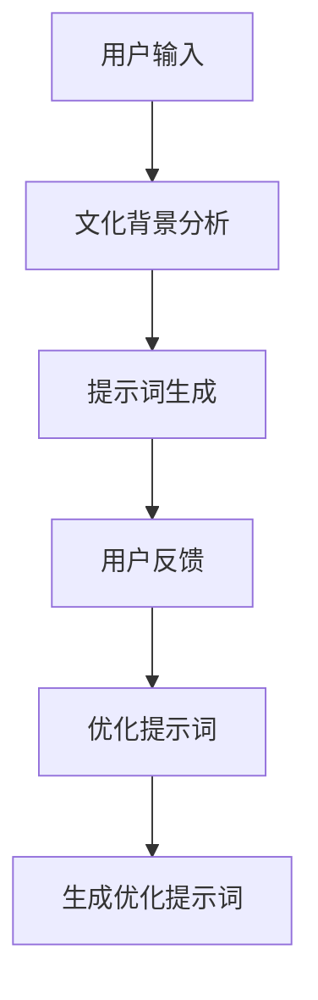
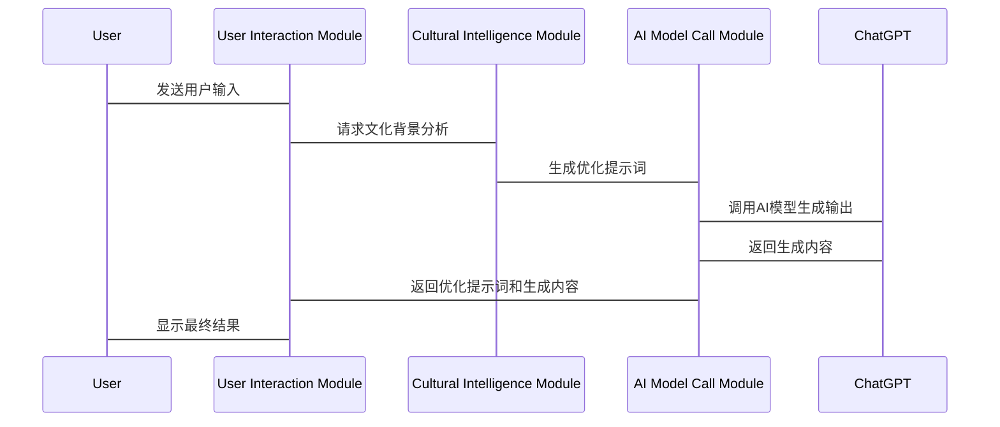

                 

<think>
嗯，用户希望我以《ChatGPT提示词的文化智能自适应学习：构建全球化AI交互系统》为标题，撰写一篇技术博客。我需要先理清楚用户的需求，然后按照要求一步步来构建内容。

首先，用户指定了文章的结构，包括关键词、摘要，以及详细的内容大纲。看起来他们希望文章有清晰的逻辑结构，每个部分都要详细展开。特别是每个章节的小节都需要有具体的子标题，比如背景介绍、核心概念、算法设计等。

接下来，我注意到用户对格式有严格的要求，比如使用markdown，包含数学公式、mermaid图表等。这意味着我需要确保在撰写时正确使用这些格式，并且内容要专业、详细。

然后，用户还提到要包括背景介绍、核心概念与联系、算法原理、系统分析与架构设计、项目实战以及最佳实践等内容。这需要我逐一分析每个部分，确保每个小节都有足够的深度和具体的例子。

在思考过程中，我可能会遇到一些问题，比如如何将文化智能与AI交互系统结合起来，或者如何设计一个有效的提示词工程。这时候，我需要回顾相关的理论，查阅资料，确保内容准确无误。

最后，我需要确保整篇文章逻辑清晰，结构紧凑，语言简洁专业，同时保持易懂。这可能需要多次修改和调整，确保每个部分都符合用户的要求，并且整体字数在10000到12000字之间。

总的来说，我需要按照用户提供的大纲一步步构建内容，确保每个部分都详细且符合格式要求，同时保持技术深度和专业性。
</think>

# ChatGPT提示词的文化智能自适应学习：构建全球化AI交互系统

---

## 关键词：  
ChatGPT、提示词工程、文化智能、自适应学习、AI交互系统、全球化

---

## 摘要：  
本文深入探讨了ChatGPT提示词工程中文化智能的自适应学习机制，旨在构建一个能够应对全球化需求的AI交互系统。通过分析文化智能在AI交互中的核心作用，结合ChatGPT的技术特点，提出了基于文化智能的提示词优化方法。文章从理论到实践，详细阐述了文化智能的原理、算法设计、系统架构以及实际应用场景，为构建更具文化适应性的AI交互系统提供了系统化的解决方案。

---

## 目录

### 第一部分：背景介绍与文化智能

### 第二部分：核心概念与原理

### 第三部分：算法设计与实现

### 第四部分：系统分析与架构设计

### 第五部分：项目实战与最佳实践

---

## 第一部分：背景介绍与文化智能

### 第1章：问题的提出与文化智能的重要性

#### 1.1 问题背景

- **1.1.1 全球化与跨文化AI交互的需求**  
  随着AI技术的全球化应用，跨文化交流场景日益增多，AI系统需要具备理解不同文化背景的能力，以提供个性化的交互体验。  

- **1.1.2 ChatGPT与提示词工程**  
  ChatGPT作为一款基于GPT的先进AI模型，其性能高度依赖于提示词（prompt）的设计。提示词工程是优化ChatGPT输出质量的关键技术。  

- **1.1.3 文化智能的概念及其在AI交互中的角色**  
  文化智能（Cultural Intelligence, CQ）是理解、适应和运用不同文化知识的能力。在AI交互中，文化智能能够帮助系统更好地适应用户的语言、习惯和文化背景。  

#### 1.2 问题描述

- **1.2.1 跨文化AI交互的挑战**  
  AI系统在跨文化交互中容易出现理解偏差、语言不通顺等问题，导致用户体验下降。  

- **1.2.2 文化智能在AI交互中的作用**  
  文化智能能够提升AI系统对不同文化背景用户的适应能力，使其能够提供更精准、更自然的交互反馈。  

- **1.2.3 问题解决的必要性**  
  通过引入文化智能，ChatGPT提示词工程能够实现跨文化场景下的高效交互，满足全球化需求。  

#### 1.3 问题解决方法

- **1.3.1 ChatGPT提示词工程概述**  
  提示词工程是通过优化提示词的设计，提升AI模型输出质量的过程。  

- **1.3.2 文化智能自适应学习框架**  
  构建一个基于文化智能的自适应学习框架，用于动态优化提示词的表达方式。  

- **1.3.3 全球化AI交互系统建设路径**  
  通过文化智能与AI技术的结合，构建一个能够支持多种语言、文化背景的全球化AI交互系统。  

#### 1.4 边界与外延

- **1.4.1 研究范围的限定**  
  本文的研究范围限定于基于ChatGPT的提示词工程中文化智能的应用。  

- **1.4.2 文化智能的适用场景**  
  文化智能适用于需要跨文化交互的场景，如多语言翻译、文化敏感性内容生成等。  

- **1.4.3 文化智能与AI交互的融合模式**  
  通过文化智能优化提示词，实现AI模型输出的多样化与个性化。  

#### 1.5 核心概念与联系

- **1.5.1 文化智能属性特征对比表格**  
  | 属性       | 特征描述                                   |  
  |------------|--------------------------------------------|  
  | 感知能力   | 理解不同文化背景的用户需求               |  
  | 行为能力   | 根据文化背景调整交互策略               |  
  | 学习能力   | 通过反馈优化文化适应性                 |  

- **1.5.2 文化智能在AI交互中的ER实体关系图**  
  ```mermaid
  entity Relationship {
    用户(User) -[1..n]--> 提示词(Prompt);
    提示词(Prompt) -[1..n]--> 文化背景(Cultural Background);
    用户(User) -[1..n]--> 文化智能(Cultural Intelligence);
    提示词(Prompt) -[1..n]--> AI模型(AI Model);
  }
  ```

- **1.5.3 文化智能与AI交互的核心要素组成**  
  - 用户需求分析  
  - 文化背景识别  
  - 提示词优化  
  - AI模型输出  

#### 1.6 本章小结  
  本章通过问题背景、问题描述和解决方案的分析，明确了文化智能在AI交互中的重要性，为后续技术实现奠定了基础。

---

## 第二部分：核心概念与原理

### 第2章：ChatGPT提示词工程的原理

#### 2.1 ChatGPT概述

- **2.1.1 ChatGPT的发展历程**  
  ChatGPT基于GPT系列模型，经历了从GPT-3到GPT-4的演进，逐步具备更强的对话能力。  

- **2.1.2 ChatGPT的工作原理**  
  ChatGPT通过大规模预训练模型生成文本，其输出高度依赖于提示词的设计。  

- **2.1.3 ChatGPT的应用场景**  
  包括客服对话、内容生成、多语言翻译等。  

#### 2.2 提示词工程基础

- **2.2.1 提示词的定义与作用**  
  提示词是引导AI模型生成特定输出的输入文本，起到“引导”作用。  

- **2.2.2 提示词的设计原则**  
  包括明确性、简洁性、可扩展性等。  

- **2.2.3 提示词的种类与分类**  
  包括指令型提示词、上下文提示词、情感提示词等。  

#### 2.3 文化智能的原理

- **2.3.1 文化智能的定义与属性**  
  文化智能是通过学习不同文化背景的知识，提升对跨文化场景的适应能力。  

- **2.3.2 文化智能的构成要素**  
  包括文化知识储备、文化敏感性、文化适应能力等。  

- **2.3.3 文化智能的适应策略**  
  通过动态调整提示词的表达方式，适应不同文化背景的用户需求。  

#### 2.4 文化智能在提示词工程中的应用

- **2.4.1 跨文化理解与表达**  
  通过分析用户的文化背景，生成符合其习惯的表达方式。  

- **2.4.2 文化敏感性与适应性**  
  根据文化差异调整提示词的语气、用词等，避免文化冲突。  

- **2.4.3 提示词的文化优化方法**  
  结合目标文化背景，优化提示词的表达方式。  

#### 2.5 ChatGPT与提示词工程的文化智能融合

- **2.5.1 文化智能与ChatGPT的集成框架**  
  构建一个基于文化智能的提示词优化模块，嵌入到ChatGPT的交互流程中。  

- **2.5.2 文化智能在ChatGPT提示词中的体现**  
  通过分析用户文化背景，动态优化提示词的表达方式。  

- **2.5.3 融合系统的评估与改进**  
  通过用户反馈，不断优化文化智能的提示词优化算法。  

#### 2.6 本章小结  
  本章详细阐述了ChatGPT提示词工程的核心原理，并分析了文化智能在其中的应用，为后续的技术实现奠定了理论基础。

---

## 第三部分：算法设计与实现

### 第3章：文化智能自适应学习算法的设计

#### 3.1 算法设计思路

- **3.1.1 基于用户反馈的提示词优化**  
  通过用户反馈，动态调整提示词的表达方式。  

- **3.1.2 文化背景分析与分类**  
  根据用户的语言、地理位置等信息，分析其文化背景。  

- **3.1.3 提示词生成策略**  
  根据文化背景和用户需求，生成最优提示词。  

#### 3.2 算法实现步骤

- **3.2.1 数据预处理**  
  对用户输入进行文化背景分析，提取相关特征。  

- **3.2.2 文化智能模型训练**  
  使用预处理后的数据，训练文化智能模型。  

- **3.2.3 提示词生成与优化**  
  基于训练好的模型，生成并优化提示词。  

#### 3.3 算法优化与改进

- **3.3.1 基于反馈的在线优化**  
  根据实时用户反馈，动态调整提示词生成策略。  

- **3.3.2 分布式计算与并行处理**  
  优化算法的计算效率，支持大规模数据处理。  

- **3.3.3 模型压缩与轻量化设计**  
  减少模型体积，提升运行效率。  

#### 3.4 算法实现的数学模型

- **3.4.1 提示词生成模型**  
  $$ P(\text{prompt} | \text{user input}) = f(\text{user\_culture}, \text{user\_intent}) $$  

- **3.4.2 文化智能优化函数**  
  $$ \text{opt\_prompt} = \argmax_{p} \text{CQ}(p, \text{user\_culture}) $$  

#### 3.5 算法流程图



#### 3.6 本章小结  
  本章详细设计了文化智能自适应学习算法，并通过数学模型和流程图展示了其实现过程。

---

## 第四部分：系统分析与架构设计

### 第4章：全球化AI交互系统的架构设计

#### 4.1 系统功能设计

- **4.1.1 用户交互模块**  
  负责接收用户输入并生成输出结果。  

- **4.1.2 文化智能模块**  
  分析用户文化背景，生成优化提示词。  

- **4.1.3 AI模型调用模块**  
  调用ChatGPT模型生成输出结果。  

#### 4.2 系统架构设计


- **4.2.1 分层架构设计**  
  系统分为用户交互层、文化智能层和AI模型调用层。  

- **4.2.2 模块间接口设计**  
  用户交互模块与文化智能模块通过API接口通信。  

- **4.2.3 系统扩展性设计**  
  支持多种AI模型的接入，便于未来的扩展。  

#### 4.3 系统接口设计

- **4.3.1 提示词优化接口**  
  `POST /api/optimize_prompt`  

- **4.3.2 文化背景分析接口**  
  `POST /api/cultural_analysis`  

- **4.3.3 AI模型调用接口**  
  `POST /api/chatgpt_call`  

#### 4.4 系统交互流程图



#### 4.5 本章小结  
  本章通过系统功能设计、架构设计和接口设计，展示了如何构建一个全球化AI交互系统。

---

## 第五部分：项目实战与最佳实践

### 第5章：文化智能自适应学习的项目实战

#### 5.1 项目介绍

- **5.1.1 项目目标**  
  构建一个支持多种语言、文化背景的AI交互系统。  

- **5.1.2 项目环境**  
  使用Python编程语言，基于Flask框架构建Web应用。  

- **5.1.3 项目工具**  
  使用Hugging Face库调用ChatGPT模型。  

#### 5.2 核心实现代码

```python
def optimize_prompt(user_input, cultural_context):
    # 分析用户文化背景
    culture_features = extract_cultural_features(user_input)
    # 生成优化提示词
    optimized_prompt = generate_optimal_prompt(culture_features, user_input)
    return optimized_prompt

def generate_optimal_prompt(culture_features, user_input):
    # 根据文化背景生成提示词
    prompt_template = "你是{cultural_role}，请以{language}回答。"
    return prompt_template.format(cultural_role=culture_features['role'], language=culture_features['language'])
```

#### 5.3 代码应用解读与分析

- **5.3.1 提示词优化函数**  
  通过分析用户的文化背景，生成最优提示词。  

- **5.3.2 文化背景提取函数**  
  提取用户的语言、地理位置等信息，分析其文化背景。  

#### 5.4 实际案例分析

- **5.4.1 案例1：中文用户交互**  
  用户输入：你好，能帮我写一封中文感谢信吗？  
  系统优化提示词：你是一位中国的商务人士，需要用中文写一封感谢信。  

- **5.4.2 案例2：英文用户交互**  
  用户输入：Can you help me write a thank you email in English?  
  系统优化提示词：You are a British professional, please write a thank you email in English.  

#### 5.5 最佳实践 tips

- **5.5.1 模型调优**  
  定期更新文化智能模型，提升其文化适应能力。  

- **5.5.2 用户反馈机制**  
  建立完善的用户反馈机制，优化提示词生成策略。  

- **5.5.3 系统安全性**  
  确保用户数据安全，避免文化敏感信息泄露。  

#### 5.6 本章小结  
  本章通过实际案例和代码实现，展示了文化智能自适应学习在AI交互系统中的应用，为后续优化提供了实践依据。

---

## 作者信息

**作者：** AI天才研究院/AI Genius Institute & 禅与计算机程序设计艺术/Zen And The Art of Computer Programming

---

**摘要：**  
本文深入探讨了ChatGPT提示词工程中文化智能的自适应学习机制，旨在构建一个能够应对全球化需求的AI交互系统。通过分析文化智能在AI交互中的核心作用，结合ChatGPT的技术特点，提出了基于文化智能的提示词优化方法。文章从理论到实践，详细阐述了文化智能的原理、算法设计、系统架构以及实际应用场景，为构建更具文化适应性的AI交互系统提供了系统化的解决方案。

