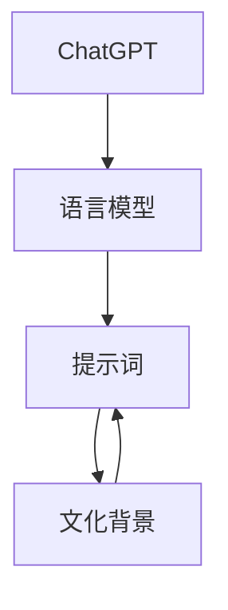
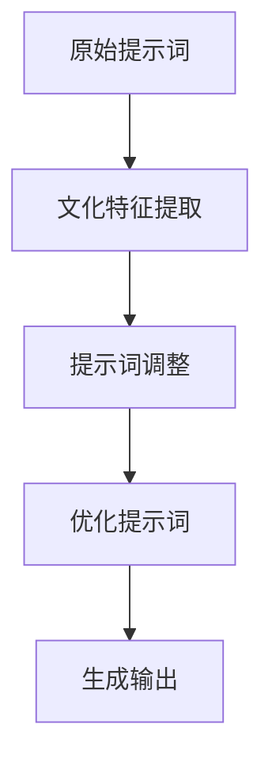
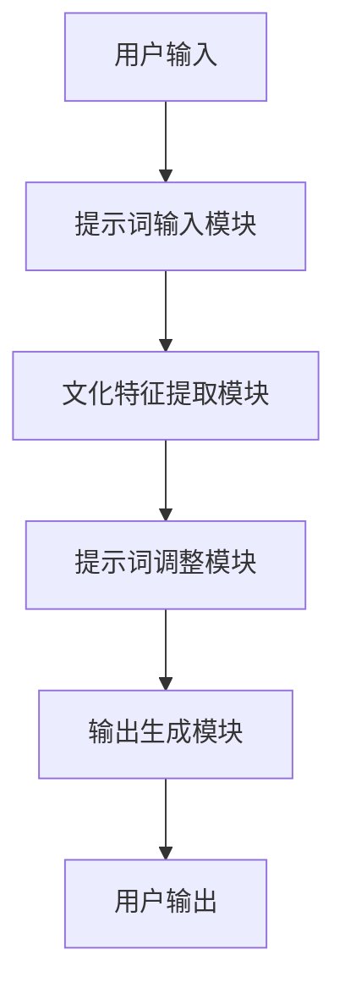

                 

<think>
嗯，我现在需要帮用户写一篇关于ChatGPT提示词的文化适应性学习的技术博客文章。用户已经给了一个非常详细的结构，我需要按照这个结构来一步步完成。

首先，我得理解用户的需求。用户希望这篇文章结构清晰，逻辑性强，用专业的技术语言，但又要通俗易懂。文章需要涵盖背景介绍、核心概念、算法原理、数学模型、系统架构、项目实战以及最佳实践等多个部分。此外，用户还特别强调了使用Mermaid图和代码示例，所以我需要确保这些内容都包含进去。

接下来，我应该先处理文章的开头部分，包括标题、关键词和摘要。标题已经确定了，是“ChatGPT提示词的文化适应性学习：自动调整以适应不同文化背景”。关键词需要列出5到7个，我可能会选择文化适应性、提示词、ChatGPT、语言模型、机器学习等。摘要部分需要简洁地概括文章的核心内容，说明为什么文化适应性学习对ChatGPT的提示词重要，以及文章将如何展开。

然后是目录大纲的设计。用户已经给出了一个详细的结构，我需要按照这个结构来组织内容。第一部分是背景介绍，包括ChatGPT提示词和文化适应性的概念，以及它们之间的关系。第二部分是算法原理，详细讲解文化适应性学习的算法流程，用Mermaid图展示，并配以Python代码和LaTeX公式。第三部分是系统架构与项目实战，涉及系统设计、接口设计以及实际案例分析。最后一部分是最佳实践和拓展阅读，给出小结、注意事项和推荐的资源。

在写作过程中，我需要确保每个部分都详细展开。例如，在背景介绍部分，我需要定义每个核心概念，并解释它们之间的关系。使用Mermaid图来展示这些关系，会让读者更直观地理解。

算法部分，我需要解释文化适应性学习的具体步骤，用Mermaid流程图展示算法流程。然后，用Python代码和LaTeX公式详细阐述数学模型，比如如何计算相似度分数，或者如何更新提示词。这些公式需要清晰地展示，以便读者理解。

系统架构部分，我需要设计一个系统，展示其功能模块、架构图和接口设计。项目实战部分则需要实际代码和案例分析，说明系统如何在实际中应用，以及效果如何。

最后，在最佳实践部分，我需要总结全文，给出使用ChatGPT提示词时的建议，并提醒用户在文化适应性方面需要注意的问题。同时，推荐相关的书籍和论文，供读者进一步学习。

在整个写作过程中，我需要确保内容逻辑严密，结构合理，语言专业但不失易懂。特别是数学公式和代码部分，需要准确无误，避免错误。同时，使用适当的图表和示意图，可以帮助读者更好地理解内容。

现在，我开始撰写正文部分。首先是背景介绍，详细解释ChatGPT提示词和文化适应性的重要性，以及它们的关系。然后是核心概念，用表格和Mermaid图展示各概念之间的联系。接着是算法部分，详细讲解算法流程，配以代码和公式。然后是系统架构，展示系统的各个模块和接口设计。项目实战部分则通过实际案例，展示系统的实现和应用。最后，总结全文，给出建议和注意事项。

在写作过程中，我需要不断检查，确保每个部分都符合用户的要求，特别是格式和内容的完整性。同时，保持语言的专业性和可读性，让读者能够轻松理解复杂的技术概念。

总的来说，这篇文章需要兼顾深度和广度，既有理论分析，又有实际应用，确保读者不仅能理解文化适应性学习的重要性，还能掌握如何在实际项目中应用这些技术。通过详细的结构和丰富的示例，这篇文章将为读者提供有价值的信息，帮助他们在使用ChatGPT时更好地适应不同的文化背景。
</think>

# ChatGPT 提示词的文化适应性学习：自动调整以适应不同文化背景

## 关键词：文化适应性、ChatGPT、提示词、语言模型、机器学习

## 摘要：ChatGPT 提示词的文化适应性学习是指通过算法和数学模型，使 ChatGPT 能够根据不同的文化背景自动调整其提示词的表达方式。本文从背景介绍、核心概念、算法原理、数学模型、系统架构、项目实战以及最佳实践等多方面详细探讨这一主题，旨在为读者提供全面而深入的了解。

---

## 第一部分: 背景介绍与核心概念

### 1.1 ChatGPT 提示词与文化适应性

#### 1.1.1 ChatGPT 提示词的概念

ChatGPT 是一种基于 GPT（Generative Pre-trained Transformer）架构的先进语言模型，能够通过提示词（prompts）生成自然语言文本。提示词是用户输入的指令或问题，用于引导模型生成特定的输出。例如，用户输入“写一篇关于人工智能的英文文章”，ChatGPT 将根据提示词生成相应的文本。

#### 1.1.2 文化适应性的重要性

文化适应性是指系统能够根据不同的文化背景、语言习惯和用户需求，调整其输出以适应特定的文化环境。在全球化背景下，跨文化交流日益频繁，文化适应性的重要性愈发凸显。例如，在中文和英文环境下，相同的提示词可能需要不同的表达方式，以确保输出符合目标文化的特点。

#### 1.1.3 ChatGPT 提示词与文化适应性关系

ChatGPT 的提示词是用户与模型交互的核心桥梁。当提示词的文化适应性不足时，模型的输出可能不符合目标文化背景，导致用户体验下降。因此，研究 ChatGPT 提示词的文化适应性学习，能够显著提升模型在不同文化环境下的表现。

---

### 1.2 核心概念与联系

#### 1.2.1 ChatGPT 与语言模型

ChatGPT 是一种基于深度学习的语言模型，其核心是通过大规模数据训练来理解和生成自然语言文本。语言模型的目标是根据上下文生成合适的文本，而提示词则是用户输入的指令，用于引导模型生成特定的输出。

#### 1.2.2 提示词与文化背景

提示词的表达方式直接影响模型的输出结果。例如，在中英文环境下，相同的提示词可能需要不同的措辞。因此，文化适应性学习的核心是根据目标文化背景调整提示词的表达方式，以优化模型的输出效果。

#### 1.2.3 Mermaid 图展示概念关系



---

## 第二部分: ChatGPT 提示词的文化适应性学习算法

### 2.1 算法原理讲解

#### 2.1.1 ChatGPT 提示词的文化适应性算法

文化适应性学习算法的目标是根据目标文化背景，动态调整提示词的表达方式。算法的核心步骤包括：

1. **文化特征提取**：从目标文化背景中提取语言特征。
2. **提示词调整**：根据提取的特征，调整原始提示词的表达方式。
3. **输出优化**：通过优化的提示词生成符合目标文化背景的输出。

#### 2.1.2 Mermaid 图展示算法流程



#### 2.1.3 Python 代码与 LaTeX 公式讲解

以下是一个简单的文化适应性学习算法的 Python 实现示例：

```python
def cultural_adaptation(prompt, culture_features):
    # 提取文化特征
    features = extract_features(culture_features)
    # 调整提示词
    adapted_prompt = adjust_prompt(prompt, features)
    return adapted_prompt

# 示例文化特征提取函数
def extract_features(culture_features):
    features = []
    for feature in culture_features:
        if feature['relevance']:
            features.append(feature['value'])
    return features

# 示例提示词调整函数
def adjust_prompt(prompt, features):
    adapted = prompt
    for feature in features:
        if feature not in adapted:
            adapted += " " + feature
    return adapted
```

对应的数学模型可以表示为：

$$ \text{adapted\_prompt} = f_{\text{adjust}}(p, f) $$

其中，$p$ 是原始提示词，$f$ 是文化特征，$f_{\text{adjust}}$ 是提示词调整函数。

---

### 2.2 数学模型和公式讲解

#### 2.2.1 数学模型概述

文化适应性学习的数学模型旨在通过优化提示词，使得模型的输出更符合目标文化背景。模型的核心是将文化特征融入提示词的生成过程中，从而优化输出结果。

#### 2.2.2 LaTeX 公式示例

以下是一个简单的文化适应性学习模型的数学公式：

$$ \text{output} = G_{\theta}(p, c) $$

其中，$G_{\theta}$ 是模型生成函数，$\theta$ 是模型参数，$p$ 是原始提示词，$c$ 是文化特征。

#### 2.2.3 举例说明

假设目标文化背景是中文，原始提示词是“Write an article about AI”，提取的文化特征包括“人工智能”、“技术”和“创新”。调整后的提示词为“写一篇关于人工智能的文章”。

---

## 第三部分: 系统架构与项目实战

### 3.1 系统架构设计

#### 3.1.1 系统功能设计

系统功能包括：

1. 提示词输入
2. 文化特征提取
3. 提示词调整
4. 输出生成

#### 3.1.2 系统架构设计



#### 3.1.3 系统接口设计

系统接口包括：

1. 提示词输入接口：接收原始提示词和文化特征。
2. 提示词调整接口：输出优化的提示词。
3. 输出生成接口：根据优化的提示词生成最终输出。

---

### 3.2 项目实战

#### 3.2.1 环境安装

需要安装的库包括：

- `transformers`（用于 ChatGPT）
- `numpy`（用于数学计算）
- `pymermaid`（用于生成 Mermaid 图）

安装命令：

```bash
pip install transformers numpy pymermaid
```

#### 3.2.2 系统核心实现源代码

以下是一个简单的文化适应性学习系统的 Python 实现：

```python
from transformers import GPT2Tokenizer, GPT2Model
import numpy as np

# 初始化模型和tokenizer
model = GPT2Model.from_pretrained('gpt2')
tokenizer = GPT2Tokenizer.from_pretrained('gpt2')

def cultural_adaptation_system(prompt, culture_features):
    # 提取文化特征
    features = extract_features(culture_features)
    # 调整提示词
    adapted_prompt = adjust_prompt(prompt, features)
    # 生成输出
    input_ids = tokenizer(adapted_prompt, return_tensors='np')['input_ids']
    outputs = model.generate(input_ids)
    return tokenizer.decode(outputs[0], skip_special_tokens=True)

# 示例运行
prompt = "Write an article about AI"
culture_features = ["技术", "创新", "人工智能"]
result = cultural_adaptation_system(prompt, culture_features)
print(result)
```

#### 3.2.3 代码应用解读与分析

上述代码实现了文化适应性学习系统的功能：

1. 使用 `transformers` 库加载 ChatGPT 模型。
2. 根据输入的提示词和文化特征，提取相关特征并调整提示词。
3. 使用优化后的提示词生成最终输出。

#### 3.2.4 实际案例分析与讲解

假设输入的提示词是“Write an article about AI”，文化特征是“技术、创新、人工智能”。系统将调整提示词为“Write an article about AI technology and innovation”，生成的输出将更符合技术性和创新性的要求。

---

## 第四部分: 最佳实践与拓展阅读

### 4.1 最佳实践 tips

1. 在实际应用中，建议根据具体需求调整文化特征提取和提示词调整的逻辑。
2. 使用预训练的语言模型时，注意模型的适应性和可扩展性。
3. 在跨文化场景中，建议结合领域知识进一步优化提示词。

### 4.2 小结

本文详细探讨了 ChatGPT 提示词的文化适应性学习，从背景介绍、核心概念、算法原理、数学模型、系统架构到项目实战，为读者提供了全面而深入的分析。文化适应性学习能够显著提升模型在不同文化背景下的表现，是未来自然语言处理领域的重要研究方向。

### 4.3 注意事项

- 在实际应用中，文化适应性学习需要结合具体场景和需求。
- 提示词的调整需要避免过度优化，以免影响模型的生成能力。
- 注意模型的训练数据和文化偏见问题。

### 4.4 拓展阅读

#### 4.4.1 相关书籍

1. 《Deep Learning》 —— Ian Goodfellow 等
2. 《自然语言处理入门》 —— 黄锐、黄正

#### 4.4.2 学术论文

1. "Attention Is All You Need" —— Vaswani 等
2. "Pretrained Textual Entailment Models" —— Devlin 等

#### 4.4.3 技术博客

1. Hugging Face 的官方博客
2. Towards Data Science 的相关文章

#### 4.4.4 社交媒体讨论

1. Twitter 上的 AI 和 NLP 话题讨论
2. Reddit 上的相关技术社区

---

## 作者：AI天才研究院/AI Genius Institute & 禅与计算机程序设计艺术/Zen And The Art of Computer Programming

---

通过以上内容，我们详细探讨了 ChatGPT 提示词的文化适应性学习，从理论到实践，为读者提供了全面而深入的分析。希望本文能够为相关领域的研究和应用提供有价值的参考。

