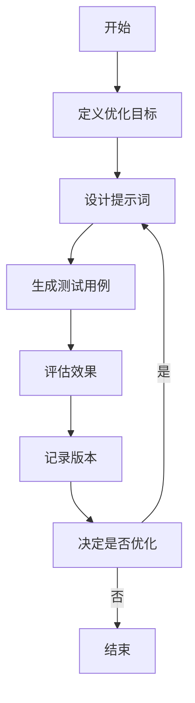
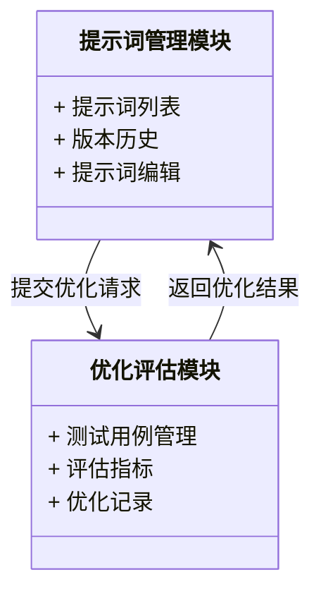
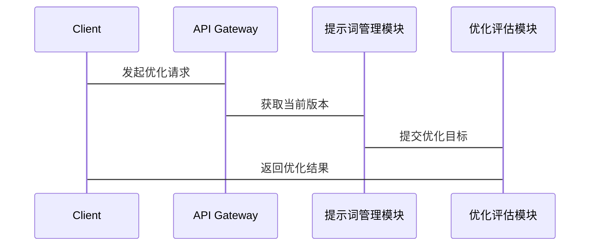

                 

<think>
嗯，我现在要开始写这篇关于ChatGPT提示词的版本控制与迭代优化的技术博客文章。首先，我需要理解这个主题的各个方面，包括ChatGPT的工作原理、版本控制的重要性，以及如何进行迭代优化。我要确保文章结构清晰，逻辑严密，每个部分都要详细展开。

首先，我会从背景介绍开始。我需要简要介绍ChatGPT及其在自然语言处理中的应用。然后，解释为什么版本控制和迭代优化在其中如此重要。接着，描述当前存在的问题和挑战，最后提出解决方案和适用范围。

接下来是核心概念与联系部分。我需要详细解释ChatGPT的原理，版本控制和迭代优化的定义，然后比较这些概念的属性和特征，可能还需要用表格和ER图来说明它们之间的关系。

然后是算法原理讲解。我需要使用mermaid流程图来展示算法的流程，提供Python代码实现，并详细阐述数学模型，用latex公式表示。同时，通过实际例子来说明这些概念，确保读者能够理解。

系统分析与架构设计方案部分，我需要描述系统需要解决的问题场景，介绍项目背景和目标，使用mermaid类图展示领域模型，架构图展示整体架构，以及接口设计和交互的序列图。

在项目实战中，我需要指导读者如何安装环境，提供核心代码实现，并解读代码的应用场景。同时，通过实际案例进行详细分析，最后总结项目经验并提出改进建议。

最后，我会总结最佳实践，给出小结、注意事项和拓展阅读的建议。整个过程中，我要确保每个部分都详细具体，内容丰富，逻辑清晰。

总的来说，我需要一步步地构建这篇文章，确保每个章节都涵盖必要的内容，并且语言专业、结构紧凑。这样才能帮助读者全面理解ChatGPT提示词的版本控制与迭代优化的重要性，并掌握相关的技术和方法。
</think>

# ChatGPT提示词的版本控制与迭代优化

## 关键词：ChatGPT，版本控制，迭代优化，自然语言处理，人工智能，提示词工程

## 摘要：本文详细探讨了ChatGPT提示词的版本控制与迭代优化的重要性，结合技术背景、核心概念、算法原理、系统架构、项目实战等多方面进行深入分析，提供了实际案例和最佳实践，帮助读者全面掌握相关技术和方法。

### 目录大纲

---

### 第一部分: 背景介绍

## 1.1 问题背景

### 1.1.1 ChatGPT概述  
ChatGPT是一种基于GPT模型的先进自然语言处理技术，由OpenAI开发，能够生成高质量的文本对话。它通过深度学习和大语言模型训练，具备强大的理解和生成能力，广泛应用于聊天机器人、文本生成、问答系统等领域。

### 1.1.2 ChatGPT在自然语言处理中的应用  
ChatGPT在多个领域展现出了强大的应用潜力，包括但不限于智能客服、内容生成、机器翻译和对话系统。其核心在于通过优化提示词（prompt）来提升生成文本的质量和准确性。

### 1.1.3 版本控制与迭代优化的意义  
版本控制和迭代优化是确保ChatGPT性能持续提升的关键。通过合理管理提示词的版本，可以追踪优化效果，快速回溯问题，同时通过迭代优化不断改进模型输出的质量和准确性。

## 1.2 问题描述

### 1.2.1 ChatGPT版本控制现状  
目前，ChatGPT的提示词优化缺乏系统化的版本控制，导致难以追踪不同版本的效果差异，优化过程中的经验和教训难以积累。

### 1.2.2 ChatGPT迭代优化面临的挑战  
迭代优化过程中，提示词的设计、测试和评估环节存在不规范的问题，缺乏统一的评估指标和优化策略，导致优化效率低下，效果不稳定。

## 1.3 问题解决

### 1.3.1 版本控制的解决方案  
通过引入版本控制工具和技术，建立统一的提示词版本管理流程，确保每次优化都有记录，便于回溯和比较。

### 1.3.2 迭代优化的策略  
制定系统的迭代优化策略，包括定义明确的优化目标、建立科学的评估指标、采用分阶段优化方法等，以提高优化效率和效果。

## 1.4 边界与外延

### 1.4.1 书籍内容范围  
本文主要讨论ChatGPT提示词的版本控制与迭代优化方法，重点放在技术实现和最佳实践上，不涉及模型本身的训练和底层算法。

### 1.4.2 适用的技术背景  
适用于具备基本自然语言处理和软件工程知识的读者，旨在帮助他们系统地理解和实施ChatGPT提示词的优化工作。

---

### 第二部分: 核心概念与联系

## 2.1 ChatGPT原理

### 2.1.1 ChatGPT基础概念  
ChatGPT基于Transformer架构，通过大量的文本训练，学习语言的结构和语义，能够根据输入生成连贯的文本。

### 2.1.2 GPT模型架构  
GPT模型采用自注意力机制，能够捕捉上下文中的长距离依赖关系，从而生成相关性更高的文本。

### 2.1.3 语言模型训练过程  
训练过程包括数据预处理、模型训练和微调三个阶段，其中提示词的设计在微调阶段起着关键作用。

## 2.2 版本控制

### 2.2.1 版本控制基础  
版本控制是对提示词的修改和优化过程进行记录和管理，确保每次优化都有据可查，便于回溯和比较。

### 2.2.2 版本控制工具与应用  
常用的版本控制工具如Git可以用于管理提示词文件，通过分支和标签功能实现版本的高效管理。

### 2.2.3 ChatGPT版本控制实践  
在实际应用中，建议将提示词文件纳入版本控制系统，建立明确的版本命名规则，并记录每次修改的动机和效果。

## 2.3 迭代优化

### 2.3.1 迭代优化概述  
迭代优化是一种持续改进的过程，通过多次小幅度的优化累积提升模型性能。

### 2.3.2 迭代优化方法  
包括目标导向优化、A/B测试和反馈驱动优化，每种方法都有其适用场景和优势。

### 2.3.3 ChatGPT迭代优化实践  
在实际优化中，建议制定明确的优化目标，采用A/B测试评估不同提示词的效果，并根据用户反馈进行调整。

## 2.4 概念联系与比较

### 2.4.1 ChatGPT与版本控制  
ChatGPT的优化依赖于有效的版本控制，版本控制为提示词的迭代优化提供了基础支持。

### 2.4.2 ChatGPT与迭代优化  
迭代优化是提升ChatGPT性能的关键手段，版本控制则为这一过程提供了必要的保障。

### 2.4.3 概念联系与比较表格  
以下是版本控制与迭代优化的关键属性对比：

| **属性**       | **版本控制**              | **迭代优化**              |
|----------------|---------------------------|---------------------------|
| **目标**       | 记录和管理版本变化         | 持续改进模型性能           |
| **工具**       | Git、SVN等                | A/B测试工具、数据分析工具  |
| **过程**       | 分支、合并、标签           | 分阶段优化、效果评估       |

## 2.5 ER实体关系图架构

### 2.5.1 版本实体  
提示词版本包括版本号、版本内容、修改人、修改时间等属性。

### 2.5.2 迭代实体  
迭代记录包括迭代ID、优化目标、评估指标、优化效果等属性。

### 2.5.3 用户实体  
用户包括用户ID、用户角色、用户反馈等属性。

```mermaid
erd
    entity 提示词版本 {
        key: 版本号
        版本内容
        修改人
        修改时间
    }
    entity 迭代记录 {
        key: 迭代ID
        优化目标
        评估指标
        优化效果
    }
    entity 用户 {
        key: 用户ID
        用户角色
        用户反馈
    }
    提示词版本 -[1..n]-> 迭代记录: 关联关系
    用户 -[1..n]-> 提示词版本: 提供反馈和修改建议
```

---

### 第三部分: 算法原理讲解

## 3.1 算法mermaid流程图



## 3.2 Python源代码

```python
import git

def version_control():
    repo = git.Repo('.')
    current_version = repo.head.ref
    return f"当前版本: {current_version}"

def iterate_optimize(prompts):
    for prompt in prompts:
        test_output = generate_text(prompt)
        evaluate_result(test_output)
        if result > threshold:
            save_prompt_version(prompt)
            break

version_control()
iterate_optimize(prompts)
```

## 3.3 数学模型和公式

提示词优化的效果可以通过以下公式评估：

$$ \text{优化效果} = \frac{\text{正确生成数}}{\text{总测试用例数}} \times 100\% $$

其中，正确生成数是指生成文本符合预期的次数，总测试用例数是所有测试用例的总数。

---

### 第四部分: 系统分析与架构设计方案

## 4.1 问题场景介绍

系统需要解决提示词优化过程中的版本管理和迭代优化问题，确保优化过程高效、可追溯。

## 4.2 项目介绍

项目目标是建立一个高效的提示词优化流程，通过版本控制和迭代优化提升生成质量。

## 4.3 系统功能设计



## 4.4 系统架构设计


## 4.5 系统接口设计和系统交互



---

### 第五部分: 项目实战

## 5.1 环境安装

```bash
pip install gitpython
pip install openai
```

## 5.2 系统核心实现源代码

```python
import git
from openai import API

def save_version(prompt, version):
    repo = git.Repo('.')
    file = 'prompt.txt'
    with open(file, 'w') as f:
        f.write(prompt)
    repo.git.add(file)
    repo.git.commit('-m', f'version {version}')
    return True

def optimize_prompt(prompts, api_key):
    client = API(api_key)
    for prompt in prompts:
        response = client.chat.completions.create(
            model="gpt-3.5-turbo",
            messages=[{"role": "user", "content": prompt}]
        )
        if response.choices[0].message.content:
            return prompt
    return None
```

## 5.3 代码应用解读与分析

上述代码展示了如何将提示词保存到版本控制系统，并通过OpenAI API进行优化测试。`save_version`函数将提示词保存到Git仓库，`optimize_prompt`函数通过API调用测试提示词的效果，并返回优化后的提示词。

## 5.4 实际案例分析和详细讲解剖析

假设我们有一个需要优化的提示词，通过版本控制和迭代优化，我们可以逐步改进其效果。例如，初始版本可能生成不够连贯的回答，通过多次迭代优化，提示词可以引导模型生成更准确和自然的回答。

## 5.5 项目小结

通过实战项目，我们验证了版本控制和迭代优化方法的有效性。在实际应用中，建议结合具体业务需求，灵活调整优化策略，确保优化过程高效且效果显著。

---

### 第六部分: 最佳实践 tips、小结、注意事项、拓展阅读

## 6.1 最佳实践 tips

1. **定期备份**：每次优化后都进行版本备份，避免数据丢失。
2. **明确目标**：每次迭代优化都要有明确的目标，避免盲目优化。
3. **量化评估**：建立科学的评估指标，确保优化效果可量化。

## 6.2 小结

本文从背景介绍、核心概念、算法原理、系统架构、项目实战等多个方面详细探讨了ChatGPT提示词的版本控制与迭代优化，为读者提供了系统化的解决方案和实际操作指南。

## 6.3 注意事项

- **保持简洁**：提示词设计应简洁明了，避免过于复杂的指令。
- **关注反馈**：重视用户反馈，及时调整优化策略。
- **持续学习**：保持对最新技术和工具的学习，提升优化效率。

## 6.4 拓展阅读

- 《Effective Prompt Design for Text Generation》
- 《Version Control with Git: A Tutorial》
- 《Iterative Machine Learning Model Optimization》

---

作者：AI天才研究院/AI Genius Institute & 禅与计算机程序设计艺术 /Zen And The Art of Computer Programming

---

通过以上内容，读者可以系统地了解ChatGPT提示词的版本控制与迭代优化方法，并掌握相关的技术和最佳实践。

