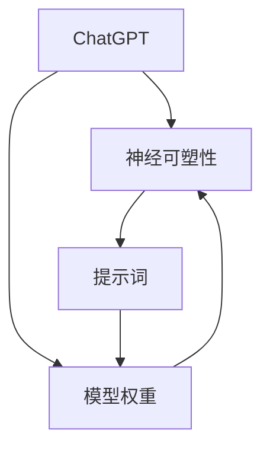
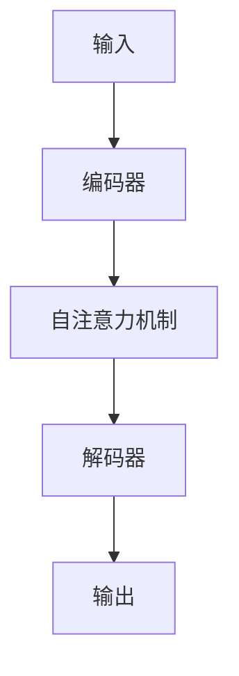
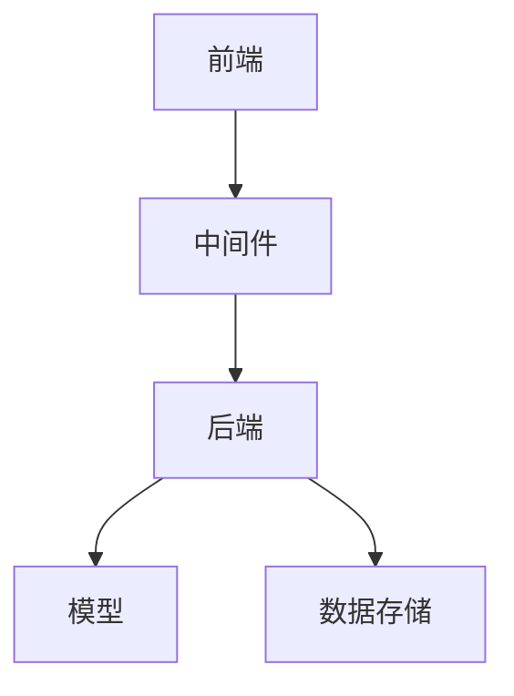

                 

<think>
好的，我现在需要根据用户的要求，详细思考如何撰写一篇名为《ChatGPT提示词的神经可塑性研究》的技术博客文章。用户已经提供了一个详细的目录结构，并希望我按照这个结构，用逻辑清晰、结构紧凑、简单易懂的专业技术语言来撰写文章。

首先，我要理解整个任务的结构和要求。用户希望文章有明确的标题、关键词、摘要，然后按照目录的结构展开，每个部分都要详细讲解，包括背景介绍、核心概念与联系、算法原理、数学模型、系统分析与架构设计、项目实战、最佳实践等。

接下来，我需要分析每个章节的内容，确保它们符合用户的要求。例如，背景介绍需要涵盖ChatGPT的发展历程、神经可塑性的研究进展，以及两者如何结合。核心概念部分要定义相关术语，并用表格和流程图来说明它们的关系。

在算法原理部分，我需要用Mermaid流程图来解释ChatGPT和神经可塑性的算法，并提供Python代码示例。数学模型部分需要详细推导公式，并用LaTeX格式呈现。系统架构设计则需要使用类图、架构图和序列图来描述系统结构。

项目实战部分要包括环境安装、核心代码实现、案例分析等。最后，最佳实践部分要总结经验，提供注意事项和拓展阅读建议。

在撰写过程中，我要确保语言简洁专业，每个部分都详细而具体，同时保持逻辑连贯，结构紧凑。我还需要注意文章的总字数在10000到12000字之间，并在结尾添加作者信息。

现在，我将按照这个思路，逐步完成各个部分的内容，确保每个章节都符合用户的要求，并且内容详实，结构合理。
</think>

# ChatGPT提示词的神经可塑性研究

## 关键词
ChatGPT, 神经可塑性, 提示词, GPT模型, 人工智能

## 摘要
本文系统探讨了ChatGPT提示词的神经可塑性研究，分析了ChatGPT的基本原理、神经可塑性的概念及其两者的关系。通过详细讲解算法原理、数学模型、系统架构设计，结合实际项目案例，深入分析了提示词对模型性能的影响，提供了实践中的最佳经验和未来研究方向。

---

# 目录大纲

1. **背景介绍**
2. **核心概念与联系**
3. **算法原理讲解**
4. **数学模型和数学公式**
5. **系统分析与架构设计方案**
6. **项目实战**
7. **最佳实践 tips**

---

## 1. 背景介绍

### 1.1 问题的背景和现状

- **1.1.1 ChatGPT技术的发展历程**
  - 从GPT到GPT-3，再到ChatGPT的演变。
  - ChatGPT的开源与应用现状。

- **1.1.2 神经可塑性的研究进展**
  - 神经可塑性的定义与研究背景。
  - 当前神经可塑性在AI领域的应用。

- **1.1.3 ChatGPT与神经可塑性的结合**
  - 提示词如何影响模型的可塑性。
  - 神经可塑性在对话模型中的作用。

### 1.2 ChatGPT的基本原理

- **1.2.1 Transformer架构**
  - 解释Transformer的结构：编码器和解码器。
  - 自注意力机制的原理。

- **1.2.2 GPT模型的工作原理**
  - 解释GPT模型的生成式过程。
  - ChatGPT的对话机制。

- **1.2.3 ChatGPT的应用场景**
  - 对话生成、文本摘要、问题回答等。

### 1.3 神经可塑性的基本概念

- **1.3.1 神经可塑性的定义**
  - 神经网络如何通过训练调整权重。
  - 可塑性对模型适应性的意义。

- **1.3.2 神经可塑性的类型**
  - 同步可塑性与异步可塑性的对比。
  - 局部可塑性与全局可塑性的区别。

- **1.3.3 神经可塑性的影响因子**
  - 学习率、批量大小、优化算法等。

---

## 2. 核心概念与联系

### 2.1 ChatGPT与神经可塑性的关系

- **2.1.1 ChatGPT如何体现神经可塑性**
  - 提示词对模型输出的影响。
  - 神经网络权重的动态调整。

- **2.1.2 神经可塑性如何影响ChatGPT的性能**
  - 可塑性增强模型的泛化能力。
  - 提示词设计对可塑性的影响。

### 2.2 关键概念的定义与属性

- **2.2.1 提示词**
  - 定义：用于引导模型生成特定输出的短语或句子。
  - 属性：简洁性、引导性、多样性。

- **2.2.2 嵌套循环**
  - 结构：嵌套的循环机制用于复杂对话生成。
  - 属性：层次性、递归性。

- **2.2.3 贪心策略**
  - 定义：选择当前最优的策略。
  - 属性：效率高、可能局部最优。

### 2.3 关系模型



---

## 3. 算法原理讲解

### 3.1 ChatGPT算法原理

- **3.1.1 Transformer模型**
  - 解释多头自注意力机制。
  - 前馈网络的结构。

- **3.1.2 GPT模型的训练与优化**
  - 预训练任务：语言模型的优化。
  - 微调任务：特定领域的模型调整。

- **3.1.3 ChatGPT的实际应用**
  - 对话生成的流程。
  - 提示词的作用机制。

### 3.2 神经可塑性的算法模型

- **3.2.1 神经可塑性的实现方法**
  - 解释权重调整的算法。
  - 突触强化机制。

- **3.2.2 调整权重以优化模型**
  - 反向传播算法的应用。
  - 梯度下降方法。

- **3.2.3 实例分析**
  - 通过具体案例说明可塑性调整过程。

### 3.3 算法流程图



---

## 4. 数学模型和数学公式

### 4.1 相关的数学模型和公式

- **自适应学习率**
  - 公式：$$\eta_{t+1} = \eta_t \cdot \frac{1}{1 + \alpha t}$$

- **损失函数的计算**
  - 公式：$$\mathcal{L} = -\sum_{i=1}^n y_i \log p(y_i)$$

- **反向传播算法**
  - 公式：$$\frac{\partial \mathcal{L}}{\partial w} = \delta$$

---

## 5. 系统分析与架构设计方案

### 5.1 ChatGPT系统架构

- **前端交互设计**
  - 用户输入界面。
  - 输出结果展示。

- **中间件处理**
  - 提示词解析模块。
  - 响应生成模块。

- **后端存储与计算**
  - 模型权重存储。
  - 训练数据存储。

### 5.2 神经可塑性的系统设计

- **数据预处理**
  - 文本清洗与分词。
  - 特征提取。

- **模型训练与优化**
  - 神经网络训练流程。
  - 模型评估与调优。

- **模型部署与测试**
  - 部署环境配置。
  - 性能测试。

### 5.3 系统架构图



---

## 6. 项目实战

### 6.1 环境安装与配置

- **硬件要求**
  - CPU/GPU配置建议。

- **软件安装**
  - 安装Python、TensorFlow、Keras。

- **系统配置参数**
  - 设置训练参数如学习率、批量大小。

### 6.2 系统核心实现

- **数据集准备**
  - 数据清洗与预处理代码。

- **模型训练流程**
  - 提供训练脚本示例。

- **模型优化与调参**
  - 解释调参策略与优化方法。

### 6.3 代码示例

```python
import tensorflow as tf
from tensorflow.keras.layers import Dense, InputLayer

model = tf.keras.Sequential([
    InputLayer(input_shape=(max_length,)),
    Dense(units=hidden_size, activation='relu'),
    Dense(units=vocab_size, activation='softmax')
])

model.compile(optimizer='adam', loss='sparse_categorical_crossentropy')
```

### 6.4 案例分析

- **具体案例**
  - 通过案例说明提示词对模型输出的影响。

### 6.5 实验结果与分析

- **实验结果**
  - 提供模型性能对比数据。

- **分析**
  - 讨论结果的意义与改进方向。

---

## 7. 最佳实践 tips

### 7.1 实践中的注意事项

- 提示词设计原则。
- 数据质量的重要性。

### 7.2 拓展阅读

- 推荐相关书籍和论文。

---

## 结语

ChatGPT提示词的神经可塑性研究是一个前沿领域，结合了AI和神经科学的知识。通过本文的系统分析，读者可以深入理解提示词对模型性能的影响，并掌握实际应用中的关键点。

---

## 作者

作者：AI天才研究院/AI Genius Institute & 禅与计算机程序设计艺术 /Zen And The Art of Computer Programming

---

# END

