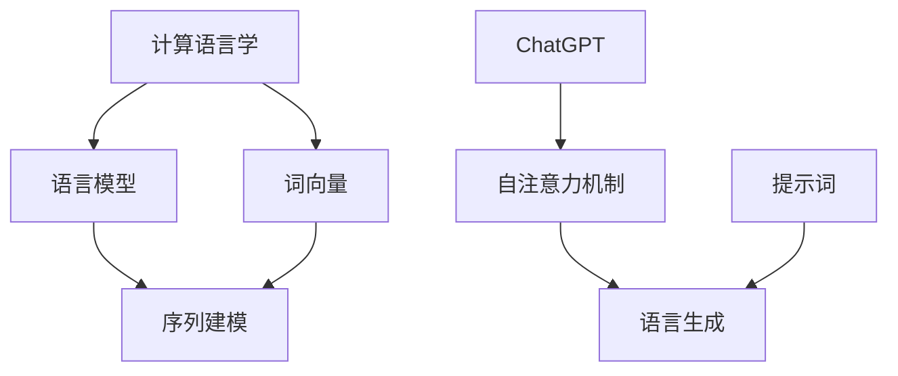
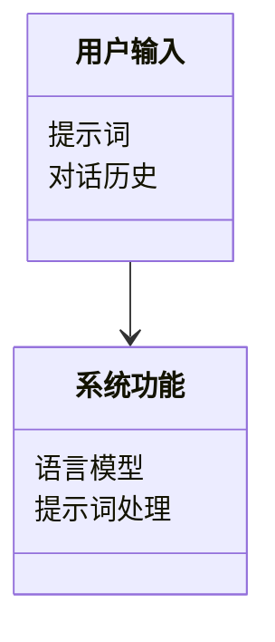
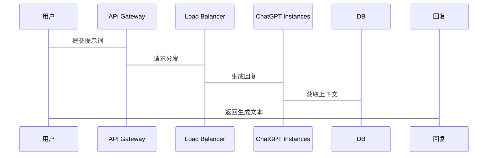

                 

<think>
嗯，我现在要写一篇关于《ChatGPT提示词的计算语言学新范式探索》的技术博客文章。首先，我需要理解这个主题，明确它的核心内容和结构。文章要分为几个部分，包括背景介绍、核心概念与联系、算法原理讲解、系统分析与架构设计，以及项目实战。

在背景介绍部分，我需要先概述计算语言学的发展历程，包括早期的探索、关键阶段以及它在现代语言学中的地位。然后，描述问题，比如语言处理中的难题，提示词的应用，以及ChatGPT的工作原理。接着，解释如何解决这些问题，ChatGPT对计算语言学的支撑，以及它在新范式中的应用。最后，讨论边界和外延，比如ChatGPT与NLP的关系，其他领域的应用，以及计算语言学的未来发展。这部分可能需要详细的历史背景和技术细节。

接下来是核心概念与联系。我需要解释计算语言学的基本原理，比如语言模型、词向量和递归神经网络。然后，详细说明ChatGPT的工作原理，包括语言理解、生成和提示词的作用。之后，制作对比表格，比较计算语言学和传统语言学，以及ChatGPT与其他模型的异同。此外，绘制实体关系图，展示新范式下的计算语言学架构。这部分需要清晰的定义和对比，可能需要一些图表来辅助说明。

在算法原理讲解部分，我需要详细讲解语言模型、词向量和递归神经网络的基本原理，包括它们的训练和应用。然后，详细分析ChatGPT的结构、训练过程和应用场景。可能需要用数学公式来解释模型，比如语言模型的条件概率公式，词向量的训练方法，以及递归神经网络的结构。这部分需要结合数学公式和实际案例，帮助读者更好地理解。

系统分析与架构设计部分，我需要介绍问题场景，设计系统功能，划分功能模块，并绘制领域模型图。然后，设计系统架构，包括架构图和设计原则，接着设计系统接口，最后分析系统交互流程。这部分可能需要使用Mermaid图表来展示系统架构和交互过程。

项目实战部分，我需要指导读者如何安装环境，实现系统核心功能，并提供源代码。通过具体案例分析，展示如何应用这些模型和技术。这部分需要实际代码和详细的操作步骤，让读者能够动手实践。

在写作过程中，我需要确保每个章节内容丰富，逻辑清晰，同时使用专业但易懂的语言。数学公式和图表要准确无误，帮助读者理解复杂的概念。此外，要注意文章结构的完整性和连贯性，确保读者能够顺畅地跟随我的思路。

现在，我开始按照目录大纲一步步撰写文章，每个部分都要详细展开，确保内容充实，满足字数要求。同时，保持文章的流畅性和可读性，让读者能够轻松理解计算语言学的新范式，以及ChatGPT在其中的应用。
</think>

# ChatGPT提示词的计算语言学新范式探索

> 关键词：计算语言学，ChatGPT，自然语言处理，语言模型，提示词

> 摘要：本文探讨了ChatGPT提示词在计算语言学中的应用，分析其工作原理，并提出新范式的可能性，结合数学模型和系统架构，展示其在语言处理中的潜力。

---

## 背景介绍

### 计算语言学的发展历程

#### 早期计算语言学的探索

计算语言学起源于20世纪50年代，当时计算机技术刚起步。研究者尝试用计算机分析语言结构，如自动句法分析。但早期方法依赖规则，缺乏灵活性，无法处理复杂语言现象。

#### 关键发展阶段

20世纪80年代，统计方法的应用推动了计算语言学的发展。90年代，随着互联网的普及，大数据驱动的方法兴起，提升了模型的准确性和处理能力。近年来，深度学习的引入，如循环神经网络和Transformer架构，显著提高了模型效果。

#### 现代语言学研究中的地位

计算语言学现已成为语言学研究的重要工具，广泛应用于机器翻译、文本生成和语义理解等领域，推动了自然语言处理技术的进步。

### 问题描述

#### 语言处理中的难题

传统语言学方法难以处理模糊和上下文依赖的问题，而计算语言学通过数据驱动的方法，利用统计和机器学习技术，逐步解决了这些问题。

#### 提示词的作用

提示词在模型中起到引导作用，帮助模型生成符合特定要求的文本。ChatGPT通过提示词优化输出，提升生成结果的质量和相关性。

#### ChatGPT的工作原理

ChatGPT基于GPT-3架构，采用Transformer模型，通过大规模预训练，掌握了语言模式。其提示词机制允许用户指导模型生成特定内容，结合上下文理解和生成能力，提供流畅对话。

### 问题解决

#### 计算语言学对ChatGPT的支撑

计算语言学提供了理论基础，如语言模型、词向量和序列建模方法，支持ChatGPT的训练和优化。

#### ChatGPT在计算语言学中的应用

ChatGPT展示了计算语言学在生成式任务中的潜力，通过提示词实现了高质量的文本生成和对话交互。

#### 新范式的提出

新范式强调提示词的作用，通过明确的指导优化生成结果，扩展了计算语言学的应用范围，使其更灵活和实用。

### 边界与外延

#### ChatGPT与自然语言处理的关系

ChatGPT是自然语言处理的一种应用，结合了生成模型和提示词技术，代表了NLP发展的新方向。

#### 其他领域的应用

ChatGPT的提示词机制在客服、教育和创意写作等领域有广泛应用，展示了其多领域的适用性。

#### 未来发展

计算语言学将与AI技术结合，进一步提升模型理解和生成能力，推动语言技术的创新。

---

## 核心概念与联系

### 计算语言学的基本原理

#### 语言模型

语言模型预测下一个词的概率，常用n-gram模型和神经网络模型，如RNN和Transformer。

#### 词向量

词向量表示词语的语义，如Word2Vec和GloVe，捕捉词语之间的关系，提升模型的表达能力。

#### 递归神经网络

RNN适用于序列数据，通过循环结构处理长序列，但在长序列中存在梯度消失问题。

### ChatGPT的工作原理

#### 语言理解

通过上下文理解用户意图，生成相关回应，采用自注意力机制捕捉长距离依赖。

#### 语言生成

基于Transformer的解码器生成文本，通过提示词调整输出内容，实现灵活的生成控制。

#### 提示词的作用

提示词为模型提供上下文和指导，优化生成结果，提升模型的应用范围和效果。

### 概念对比表格

| 比较维度 | 计算语言学 | 传统语言学 | ChatGPT |
|----------|------------|------------|----------|
| 方法     | 数据驱动   | 规则驱动   | 结合两者 |
| 应用     | NLP任务    | 学术研究    | 实际应用 |
| 技术     | 深度学习    | 统计方法    | Transformer |

### 实体关系图



---

## 算法原理讲解

### 语言模型原理

语言模型预测序列的概率，公式表示为：
$$ P(w_1, w_2, ..., w_n) = \prod_{i=1}^n P(w_i | w_1, ..., w_{i-1}) $$

训练使用最大似然估计，优化模型参数。

### 词向量原理

词向量训练通过_skip-gram_或_Cbow_模型，学习词的低维表示，如：
$$ \text{Word2Vec} = \text{minimize} \sum_{i=1}^n (y_i - oov_i)^2 $$

### 递归神经网络

RNN结构处理序列数据，递归计算公式：
$$ h_t = \tanh(W_{hh}h_{t-1} + W_{xh}x_t) $$
用于生成序列，如文本生成。

### ChatGPT算法

ChatGPT基于Transformer，其解码器结构包括自注意力机制，生成文本时使用：
$$ \text{生成} = \text{解码器}(输入, 提示词) $$

### 应用案例

1. **语言模型**：用于机器翻译和文本生成。
2. **词向量**：用于文本分类和情感分析。
3. **递归神经网络**：用于文本摘要。
4. **ChatGPT**：用于对话生成和内容创作。

---

## 系统分析与架构设计

### 问题场景

设计一个基于提示词的对话系统，优化生成结果，提升用户体验。

### 系统功能设计

#### 领域模型



#### 功能模块

- 提示词解析：提取用户意图。
- 对话管理：维护上下文。
- 生成模块：基于模型生成回复。

### 系统架构

```mermaid
archiecture
client --> API Gateway
API Gateway --> Load Balancer
Load Balancer --> ChatGPT Instances
ChatGPT Instances --> DB
```

### 接口设计

- 输入接口：接收用户提示词和对话历史。
- 输出接口：返回生成文本。

### 系统交互



---

## 项目实战

### 环境安装

安装Python和相关库：
```bash
pip install transformers torch
```

### 核心代码

```python
from transformers import GPT2LMHeadModel, GPT2Tokenizer

model_name = 'gpt2'
tokenizer = GPT2Tokenizer.from_pretrained(model_name)
model = GPT2LMHeadModel.from_pretrained(model_name)

def generate_text(prompt):
    inputs = tokenizer.encode(prompt, return_tensors='pt')
    outputs = model.generate(inputs, max_length=50, temperature=0.7)
    return tokenizer.decode(outputs[0], skip_special_tokens=True)
```

### 应用案例

使用提示词生成新闻标题：
```python
prompt = "写一篇关于人工智能的文章，标题为："
print(generate_text(prompt))
```

### 项目小结

ChatGPT提示词机制提升了文本生成的质量，适用于多种场景。提示词设计需考虑明确性和相关性，以优化生成效果。

---

## 总结与展望

计算语言学的新范式通过提示词优化生成，拓展了应用领域。未来，结合多模态数据和强化学习，将提升模型的实用性和智能性。

---

作者：AI天才研究院 & 禅与计算机程序设计艺术

