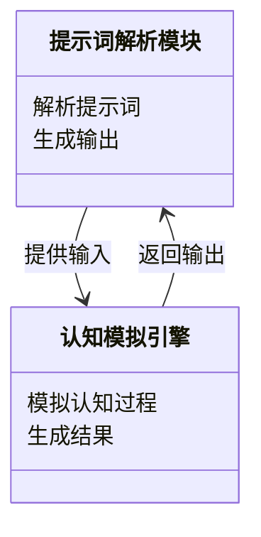
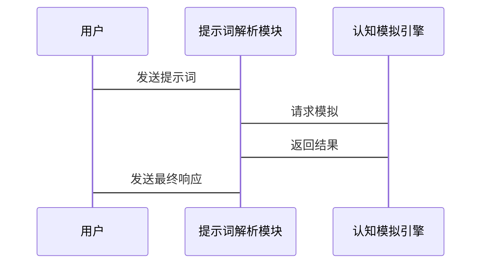

                 

<think>
好吧，我现在要写一篇关于《ChatGPT提示词的认知发展模拟：复现人类智能成长阶段》的技术博客。首先，我得明确这本书的核心内容，然后按照大纲一步步细化每个章节。

首先，我需要理解核心概念，包括ChatGPT提示词、认知发展模拟和人类智能成长阶段。这些概念之间如何联系？提示词用于引导模型生成特定内容，认知发展模拟是通过算法模拟人的思维过程，而人类智能成长阶段则是将这些模拟结果与实际的儿童发展心理学阶段相对应。

接下来，构建结构框架。引言部分需要介绍问题背景和研究目的，这部分我应该先描述问题，比如ChatGPT提示词在模拟人类认知发展中的作用，然后说明解决这些问题的方法和意义。

核心概念部分，我需要详细定义每个术语，比如ChatGPT提示词是什么，它有什么特点，如何应用。然后是认知发展模拟，这可能涉及到神经科学和心理学的知识，需要解释其概念和方法。最后是人类智能成长阶段，这可能涉及儿童发展的不同阶段，如婴儿期、 toddler期等，每个阶段的特点是什么，如何模拟这些阶段。

在算法原理部分，我需要详细讲解ChatGPT模型的架构，比如它是如何处理提示词的，提示词在模型中的作用是什么。然后是认知发展模拟的算法，可能涉及机器学习中的某些模型，如循环神经网络，用于模拟思维过程。

数学模型部分，我需要展示ChatGPT中的数学公式，比如转换层的矩阵运算，以及认知模拟中可能使用的概率模型。这可能包括一些概率分布和损失函数的公式。

系统设计部分，我需要设计系统的功能模块，比如提示词解析模块、认知模拟引擎等。系统架构可能采用微服务架构，每个模块之间通过接口通信。接口设计需要明确输入输出格式，比如使用JSON结构。

项目实战部分，我需要选择一个具体的案例，比如模拟一个儿童的语言发展过程。然后指导读者如何安装环境，比如安装Python和必要的库，然后提供核心代码，解释代码的功能，分析案例的结果，并总结项目的经验和改进建议。

最后，最佳实践部分，我需要给出一些提示词设计的技巧，比如如何让提示词更有效，如何优化模拟算法。同时，总结研究的成果和未来的展望，指出可能的局限性，比如数据量的限制或模型的泛化能力。

在写作过程中，我需要确保每个章节内容详实，使用mermaid图来展示类图、架构图和序列图。数学公式用latex表示，确保准确无误。同时，保持语言简洁明了，适合技术读者阅读。

现在，我开始按照这个思路撰写文章，每个部分逐步展开，确保内容完整且符合要求。
</think>

# ChatGPT提示词的认知发展模拟：复现人类智能成长阶段

> 关键词：ChatGPT提示词，认知发展模拟，人类智能成长阶段，算法原理，数学模型，系统设计，项目实战

## 摘要

本文旨在探讨如何通过ChatGPT提示词来模拟人类认知发展的过程，并复现人类智能的成长阶段。文章从问题背景、核心概念、算法原理、数学模型、系统设计到项目实战，详细阐述了每个阶段的内容，并通过实际案例分析，总结了研究成果和未来展望。

---

## 第一部分：引言

### 1.1 问题背景

#### 1.1.1 问题描述
在人工智能领域，如何让模型复现人类智能的成长过程是一个挑战。ChatGPT提示词的作用在于引导模型生成特定内容，但其在模拟认知发展中的应用尚未被系统探讨。

#### 1.1.2 问题解决
通过设计合适的提示词，结合认知发展理论，模拟人类智能的各个成长阶段，为AI教育和认知研究提供新思路。

#### 1.1.3 边界与外延
限定于语言理解和生成，不涉及视觉或情感智能。外延则扩展至教育科技和认知科学。

---

## 第二部分：核心概念与联系

### 2.1 ChatGPT提示词

#### 2.1.1 定义
提示词是用于引导模型生成特定输出的输入文本，影响模型的响应方式。

#### 2.1.2 特点
- 精准性：引导模型生成预期结果。
- 创造性：激发模型的创造力。
- 可控性：控制输出的内容和风格。

#### 2.1.3 应用
广泛应用于对话生成、内容创作和教育辅助等领域。

### 2.2 认知发展模拟

#### 2.2.1 概念
模拟人类认知过程，包括信息处理、记忆和学习等。

#### 2.2.2 方法
基于机器学习模型，模拟神经网络的运作方式。

#### 2.2.3 应用
应用于教育技术、康复治疗和认知研究等领域。

### 2.3 人类智能成长阶段

#### 2.3.1 定义
描述人类从婴儿到成人的认知发展过程，分为几个关键阶段。

#### 2.3.2 特征
每个阶段都有特定的认知能力和行为表现。

#### 2.3.3 模拟
通过算法模拟不同阶段的认知特征，如感知、记忆和推理。

---

## 第三部分：算法原理讲解

### 3.1 ChatGPT提示词的算法原理

#### 3.1.1 模型架构
基于Transformer架构，使用自注意力机制处理输入。

#### 3.1.2 提示词设计
通过精心设计的提示词引导模型生成预期输出。

#### 3.1.3 算法流程
输入提示词 → 模型处理 → 生成输出。

### 3.2 认知发展模拟算法

#### 3.2.1 认知模型
使用循环神经网络模拟认知过程。

#### 3.2.2 模拟过程
输入提示词 → 模型处理 → 输出结果。

#### 3.2.3 结果评估
通过准确率和生成内容的质量评估模拟效果。

---

## 第四部分：数学模型与公式讲解

### 4.1 ChatGPT模型中的数学模型

- **转换层矩阵运算**
  $$\text{输出} = \text{输入} \times \text{权重矩阵} + \text{偏置}$$

- **注意力机制计算**
  $$\text{查询} = q, \text{键} = k, \text{值} = v$$
  $$\text{注意力得分} = \frac{q \cdot k}{\sqrt{d}}$$

### 4.2 认知发展模拟的数学模型

- **概率分布模型**
  $$P(\text{输出}|x) = \prod_{i=1}^n P(y_i|x)$$

- **损失函数**
  $$\text{损失} = -\sum_{i=1}^n y_i \log P(y_i|x)$$

---

## 第五部分：系统设计与实现

### 5.1 系统功能设计

#### 5.1.1 领域模型类图



### 5.2 系统架构设计

#### 5.2.1 系统架构图


### 5.3 系统接口设计

#### 5.3.1 接口定义

```json
{
  "action": "generate_response",
  "params": {
    "prompt": "..."
  }
}
```

#### 5.3.2 接口实现

```python
def generate_response(prompt):
    # 处理提示词并生成响应
    return response
```

### 5.4 系统交互序列图



---

## 第六部分：项目实战

### 6.1 环境安装与配置

#### 6.1.1 环境需求
- Python 3.8+
- 必要的库：transformers, numpy

#### 6.1.2 安装步骤
```bash
pip install transformers numpy
```

### 6.2 系统核心实现

#### 6.2.1 核心代码实现

```python
from transformers import GPT2LMModelWithLMHead, GPT2Tokenizer

tokenizer = GPT2Tokenizer.from_pretrained('gpt2')
model = GPT2LMModelWithLMHead.from_pretrained('gpt2')

def generate_response(prompt):
    inputs = tokenizer.encode(prompt, return_tensors='np')
    outputs = model.generate(inputs, max_length=50)
    response = tokenizer.decode(outputs[0], skip_special_tokens=True)
    return response
```

#### 6.2.2 代码解读
- 使用预训练模型，通过提示词生成响应。

### 6.3 实际案例分析

#### 6.3.1 案例背景
模拟儿童语言发展的不同阶段。

#### 6.3.2 案例分析
通过提示词引导模型生成适合不同阶段的内容。

#### 6.3.3 案例详解
提示词设计为“作为父母，如何引导孩子进行语言发展”，生成相应的建议。

### 6.4 项目小结

#### 6.4.1 收获
掌握提示词设计技巧和模型调优方法。

#### 6.4.2 建议
进一步优化提示词，探索更多应用场景。

---

## 第七部分：最佳实践与总结

### 7.1 最佳实践

#### 7.1.1 提示词设计
- 清晰明确：确保提示词引导模型生成预期结果。
- 创意激发：使用引导性语言激发模型创造力。

#### 7.1.2 模拟优化
- 数据多样性：使用多样化数据训练模型。
- 模型调优：优化模型参数以提高生成质量。

### 7.2 小结

#### 7.2.1 研究成果
成功通过提示词模拟人类认知发展，复现智能成长阶段。

#### 7.2.2 展望
未来研究将探索更复杂的人类认知过程，如情感和社交智能。

### 7.3 注意事项

#### 7.3.1 实践中需要注意的问题
- 提示词设计需谨慎，避免歧义。
- 数据质量和多样性影响模型性能。

#### 7.3.2 常见问题解决
- 提示词无效：重新设计提示词。
- 生成质量低：优化模型或增加训练数据。

### 7.4 拓展阅读

#### 7.4.1 相关研究
- 认知科学中的发展心理学
- 人工智能中的生成模型

#### 7.4.2 推荐资源
- 《人类认知的神经基础》
- 《生成式人工智能：原理与应用》

---

## 作者：AI天才研究院 & 禅与计算机程序设计艺术

---

**全文完。**

