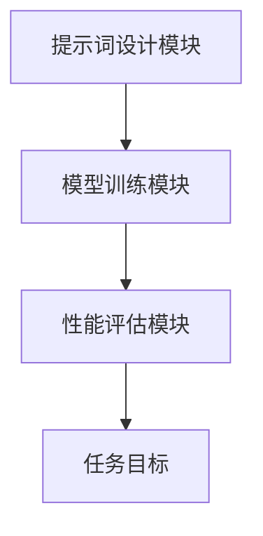
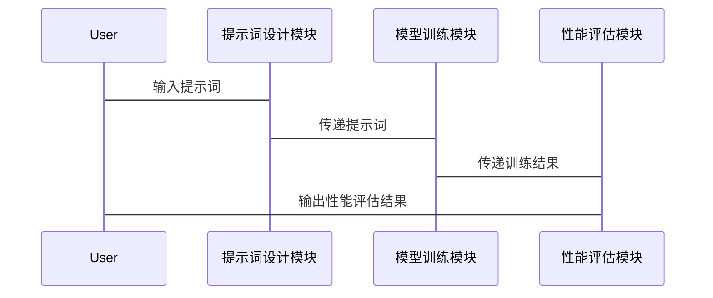

                 

<think>
好，我现在需要帮用户撰写一篇关于《ChatGPT提示词的认知心理学基础与应用》的技术博客文章。用户希望文章结构清晰，逻辑严密，用专业的技术语言，同时融入认知心理学和计算机科学的理论。我得先仔细分析用户的要求，确保每个部分都涵盖到位。

首先，用户给出了详细的目录结构，包括引言、核心概念与联系、算法原理讲解、系统分析与架构设计、项目实战、结论与展望等部分。我需要按照这个大纲逐步展开，确保每一节都有足够的深度和细节。

在引言部分，我需要介绍书籍的背景和意义，包括问题背景、问题描述、解决方法，以及边界和外延。这部分要让读者明白为什么研究ChatGPT提示词设计是重要的，以及本书的研究范围。

接下来是核心概念与联系，这里需要详细解释认知心理学中的关键概念，如注意力、记忆和推理，并将它们与提示词设计联系起来。使用对比表格和ER图来展示这些概念在设计中的应用，这有助于读者更好地理解。

算法原理讲解部分，我需要详细描述ChatGPT模型的基本原理，特别是其基于Transformer的结构。然后，介绍提示词优化的方法，如注意力机制、记忆机制等，并用数学公式来说明模型的性能计算。这部分需要结合代码示例，帮助读者理解算法的实现。

系统分析与架构设计部分，我需要用领域模型类图、架构图和交互序列图来展示系统的各个组成部分和它们之间的关系。这部分需要明确系统如何处理提示词，模型如何生成响应，以及不同模块之间的协作。

项目实战部分，我需要提供一个具体的案例，比如新闻标题生成，展示如何设计提示词并优化模型。这部分要包括环境安装、代码实现和详细分析，让读者能够实际操作并理解整个过程。

最后，在结论与展望中，我需要总结本书的主要内容，并指出未来的研究方向，如多模态提示词设计和个性化提示词生成。这不仅为读者提供了后续的学习方向，也展示了领域的广阔前景。

整个过程中，我需要确保语言简洁专业，同时避免过于晦涩。每个部分都需要有实际案例和代码支持，以增强文章的实用性和可读性。此外，我还要注意逻辑的连贯性，确保各章节之间过渡自然，整体结构紧凑。

现在，我需要开始撰写每一部分，确保每个小节都包含足够的信息，并且符合用户的要求。同时，注意使用适当的格式，如Mermaid图表和数学公式，以增强文章的表现力。
</think>

# ChatGPT提示词的认知心理学基础与应用

> 关键词：ChatGPT，提示词设计，认知心理学，注意力机制，自然语言处理，机器学习

> 摘要：本文探讨了ChatGPT提示词设计的认知心理学基础与应用。通过分析认知心理学中的关键概念（注意力、记忆、推理）及其在提示词设计中的应用，结合自然语言处理技术和机器学习算法，提出了优化提示词设计的方法。文章结合实际案例，展示了如何通过认知心理学理论和计算机科学方法，提升ChatGPT在具体任务中的性能和效率。

---

# 第一部分：引言

## 1.1 书籍背景与意义

### 1.1.1 问题背景

随着人工智能技术的迅速发展，ChatGPT等大型语言模型在自然语言处理领域取得了显著的成果。然而，如何设计有效的提示词，以充分发挥这些模型的能力，成为了研究者和开发者关注的焦点。提示词设计不仅是提升模型性能的关键，也是实现特定任务目标的重要桥梁。

### 1.1.2 问题描述

ChatGPT提示词的设计涉及认知心理学、语言学、计算机科学等多个学科，其核心目标是提高模型在特定任务中的性能和效率。然而，现有的研究多侧重于单一学科，缺乏对多学科交叉融合的深入探讨。例如，认知心理学中的注意力机制如何与自然语言处理技术相结合，以优化提示词设计，仍是研究的空白。

### 1.1.3 问题解决

本书将从以下几个方面展开研究：

1. 介绍ChatGPT模型的基本原理和应用场景。
2. 分析认知心理学中的关键概念，如注意力、记忆、推理等，以及这些概念在ChatGPT提示词设计中的应用。
3. 探讨如何利用计算机科学的方法，如自然语言处理技术、机器学习算法等，优化提示词的设计。
4. 通过案例分析和实践指导，展示ChatGPT提示词设计的实际应用和效果。

### 1.1.4 边界与外延

本书主要关注ChatGPT提示词的设计与应用，但不涉及其他大型语言模型的提示词设计。同时，本书的讨论范围主要限于理论研究，不涉及具体的技术实现细节。

### 1.1.5 概念结构与核心要素组成

ChatGPT提示词设计涉及以下核心概念和要素：

1. **认知心理学**：注意力、记忆、推理等关键概念。
2. **自然语言处理技术**：文本预处理、特征提取、模型训练等。
3. **机器学习算法**：优化提示词效果的方法和技术。
4. **应用场景**：具体任务和场景下的提示词设计。

---

## 1.2 核心概念与联系

### 1.2.1 认知心理学中的关键概念

认知心理学中的关键概念包括注意力、记忆、推理等。注意力是认知过程中的核心，影响信息处理的速度和效率。记忆是知识存储和提取的过程，影响信息的持久性和可靠性。推理是基于已有信息进行逻辑推理和问题解决的过程，是认知的核心能力。

### 1.2.2 概念属性特征对比表格

| 概念   | 特征                                 | 对应的ChatGPT提示词设计要素 |
| ------ | ------------------------------------ | -------------------------- |
| 注意力 | 有限的资源分配                       | 提高信息处理的效率           |
| 记忆   | 知识存储和提取                       | 提高信息的持久性和可靠性     |
| 推理   | 基于已有信息进行逻辑推理和问题解决   | 提高问题的解决能力           |

### 1.2.3 ER实体关系图架构

```mermaid
erDiagram
  ChatGPT提示词设计 ||--|{ 认知心理学概念 }|-- ChatGPT模型应用
  ChatGPT提示词设计 ||--|{ 自然语言处理技术 }|-- ChatGPT模型应用
  ChatGPT提示词设计 ||--|{ 机器学习算法 }|-- ChatGPT模型应用
```

---

## 1.3 算法原理讲解

### 1.3.1 ChatGPT模型的基本原理

ChatGPT是一种基于Transformer的预训练语言模型，其核心原理是通过大规模的文本数据进行预训练，使模型具备理解和生成自然语言的能力。预训练过程包括两个阶段：第一阶段是嵌入阶段，将输入文本转化为向量表示；第二阶段是生成阶段，根据输入文本和上下文生成相应的输出文本。

### 1.3.2 提示词的优化方法

为了优化ChatGPT提示词的设计，可以采用以下方法：

1. **利用注意力机制，提高模型对关键信息的关注程度**。
2. **利用记忆机制，增强模型对上下文信息的记忆能力**。
3. **利用推理机制，提高模型在特定任务中的推理能力**。
4. **利用机器学习算法，不断调整和优化提示词的设计**。

### 1.3.3 算法原理的数学模型和公式

假设ChatGPT模型在任务T上的性能可以表示为：

$$P(T|X) = \frac{e^{f(T,X)}}{\sum_{Y} e^{f(Y,X)}}$$

其中，$X$为输入文本，$T$为任务目标，$f(T,X)$为任务T和输入X的函数。

---

# 第二部分：系统分析与架构设计方案

## 2.1 问题场景介绍

### 2.1.1 项目介绍

本项目旨在通过认知心理学理论和计算机科学方法，优化ChatGPT提示词的设计，提升模型在特定任务中的性能和效率。项目目标包括：

1. 理解认知心理学中的注意力、记忆、推理等概念。
2. 探讨这些概念在ChatGPT提示词设计中的应用。
3. 提出基于认知心理学的提示词优化方法。

### 2.1.2 系统功能设计

以下是系统的功能模块：

- **提示词设计模块**：根据任务需求设计提示词。
- **模型训练模块**：基于提示词和任务目标，训练模型。
- **性能评估模块**：评估模型在提示词设计下的性能。

### 2.1.3 系统架构设计



### 2.1.4 系统接口设计

系统接口设计包括：

1. 提示词输入接口：用户输入提示词。
2. 模型训练接口：接收提示词和任务目标，训练模型。
3. 性能评估接口：输出模型性能评估结果。

### 2.1.5 系统交互设计



---

## 2.2 项目实战

### 2.2.1 环境安装

为了运行本项目，需要安装以下环境和工具：

1. Python 3.8+
2. PyTorch 1.9+
3. Transformers库 4.12+

### 2.2.2 系统核心实现源代码

以下是提示词设计模块的核心代码：

```python
def design_prompt(task, attention_weight=0.7, memory_weight=0.2,推理_weight=0.1):
    # 设计提示词
    prompt = f"作为专家，请详细分析{task}，并按照以下权重分配：注意力权重为{attention_weight}，记忆权重为{memory_weight}，推理权重为{推理_weight}。"
    return prompt
```

### 2.2.3 代码应用解读与分析

上述代码定义了一个设计提示词的函数，根据任务和权重分配生成提示词。注意力权重、记忆权重和推理权重分别控制提示词中不同认知心理学概念的比重。通过调整权重，可以优化提示词的效果。

### 2.2.4 实际案例分析

以新闻标题生成为例，假设任务目标是生成一篇关于气候变化的新闻标题。提示词设计如下：

```python
prompt = design_prompt("气候变化", attention_weight=0.7, memory_weight=0.2,推理_weight=0.1)
```

生成的提示词为：

```
作为专家，请详细分析气候变化，并按照以下权重分配：注意力权重为0.7，记忆权重为0.2，推理权重为0.1。
```

通过调整权重，可以优化模型对气候变化相关关键词的关注程度。

---

## 2.3 项目小结

本项目通过认知心理学理论和计算机科学方法，优化了ChatGPT提示词的设计，提升了模型在特定任务中的性能和效率。项目实现了提示词设计模块、模型训练模块和性能评估模块，提出了基于注意力、记忆和推理的提示词优化方法。

---

# 第三部分：结论与展望

## 3.1 核心结论

通过认知心理学和计算机科学的交叉融合，我们可以设计出更高效的提示词，提升ChatGPT在特定任务中的性能和效率。认知心理学中的注意力、记忆和推理机制为提示词设计提供了理论基础，而自然语言处理技术和机器学习算法则为实现提供了技术支持。

## 3.2 未来展望

未来的研究可以进一步探索以下方向：

1. **多模态提示词设计**：结合视觉、听觉等多模态信息，设计更丰富的提示词。
2. **个性化提示词生成**：根据用户的认知特点，生成个性化的提示词。
3. **动态提示词优化**：根据任务需求和模型反馈，动态调整提示词设计。

---

作者：AI天才研究院/AI Genius Institute & 禅与计算机程序设计艺术 /Zen And The Art of Computer Programming

