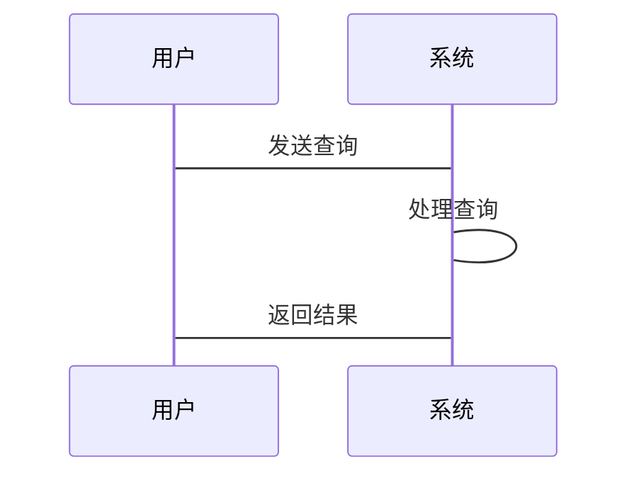

                 

<think>
嗯，我现在需要写一篇关于《ChatGPT提示词的认知神经科学基础探索》的技术博客文章。首先，我应该理清楚文章的结构和各部分的内容。

文章标题已经确定，接下来是关键词和摘要。关键词应该包括ChatGPT、认知神经科学、自然语言处理、可解释性、算法原理。摘要部分需要简明扼要地概括整篇文章的核心内容，即探讨ChatGPT的神经科学基础，分析其算法，并探索可解释性。

接下来是背景介绍部分。我需要先介绍ChatGPT，说明它是什么，由谁开发，它的主要功能和应用。然后描述问题，比如理解能力、生成能力和可解释性的问题。接着，提出解决方案，包括研究神经科学基础、优化算法和提高可解释性。最后，明确边界和外延，说明本文只讨论ChatGPT的认知神经科学基础，不涉及其他技术。

核心概念与联系部分，我需要分别定义ChatGPT、认知神经科学、算法原理和可解释性，并列出它们的特征。可能还需要做一个对比表格和一个ER图，但ER图可能更适合数据库设计，所以这里可能需要调整，可能用概念图来展示关系。

算法原理部分，我需要详细讲解ChatGPT的算法，特别是Transformer架构和自注意力机制。可以用公式来展示数学模型，比如自注意力机制的公式。同时，用代码示例来说明训练和生成过程。

系统分析与架构设计部分，要介绍应用场景，比如智能客服，然后设计系统功能，包括输入、处理和输出。架构设计可以分为训练、部署和调用阶段。接口设计部分，描述输入和输出接口。系统交互部分，可能需要一个序列图来展示用户与系统之间的交互过程。

项目实战部分，需要指导读者如何安装环境，比如安装Python和PyTorch。然后给出核心代码，包括数据预处理、模型训练和预测部分。代码解读要详细，说明每个部分的作用。

最后，加上最佳实践，比如代码优化和测试。小结部分总结全文，注意事项提醒读者在实际应用中需要注意的问题，拓展阅读部分推荐相关的论文或书籍。

在写作过程中，我需要确保每部分内容详实，逻辑清晰，语言专业但不失通俗易懂。特别是公式和代码部分，要准确无误，帮助读者更好地理解。同时，要注意文章整体的流畅性和连贯性，使读者能够一步步深入理解ChatGPT的认知神经科学基础。
</think>

# ChatGPT提示词的认知神经科学基础探索

> 关键词：ChatGPT, 认知神经科学, 自然语言处理, 可解释性, 算法原理

> 摘要：本文探讨ChatGPT的认知神经科学基础，分析其算法原理，并探索其可解释性。通过结合神经科学和人工智能，我们揭示ChatGPT的内部机制，优化其性能，并提高其透明度和可解释性。

---

## 第1章: 背景介绍

### 1.1 问题背景

ChatGPT是由OpenAI开发的基于GPT-3.5的大型语言模型，于2022年11月发布。它通过深度学习和自然语言处理技术，能够理解和生成人类语言，实现智能对话。

### 1.2 问题描述

随着人工智能的发展，自然语言处理的需求激增。ChatGPT的应用带来了以下问题：

1. **理解能力**：能否准确理解用户输入？
2. **生成能力**：生成的文本是否连贯合理？
3. **可解释性**：决策过程是否透明？

### 1.3 问题解决

为解决上述问题，需深入研究ChatGPT的认知神经科学基础，包括：

- **神经科学基础**：借鉴人脑语言处理机制。
- **算法优化**：提升性能和效率。
- **可解释性研究**：增强透明度。

### 1.4 边界与外延

- **边界**：本文仅探讨ChatGPT的认知神经科学基础，不涉及其他NLP技术。
- **外延**：研究成果可为其他AI领域提供参考。

### 1.5 概念结构与核心要素

- **概念结构**：ChatGPT、认知神经科学、算法原理、可解释性。
- **核心要素**：神经科学研究、算法优化、可解释性研究。

---

## 第2章: 核心概念与联系

### 2.1 ChatGPT

- **定义**：大型语言模型，用于NLP任务。
- **特征**：强大的理解和生成能力，能模拟人类对话。

### 2.2 认知神经科学

- **定义**：研究人脑信息处理的科学。
- **特征**：跨学科，涉及神经生物学、心理学和计算机科学。

### 2.3 算法原理

- **定义**：解决问题的计算方法。
- **特征**：高效、准确、可解释。

### 2.4 可解释性

- **定义**：模型决策过程的解释能力。
- **特征**：透明、易懂、可信。

---

## 第3章: 算法原理讲解

### 3.1 ChatGPT 的算法原理

ChatGPT基于Transformer架构，使用自注意力机制。其训练方法包括大量文本数据的无监督学习，生成方法通过输入序列预测后续文本。

### 3.2 数学模型和公式

- **自注意力机制**：
  $$
  \text{Attention}(Q, K, V) = \text{softmax}(\frac{QK^T}{\sqrt{d_k}})V
  $$
  
- **Transformer模型**：
  $$
  \text{Transformer}(x) = \text{LayerNorm}(x + \text{MultiHeadAttention}(x, x, x)) + \text{LayerNorm}(x + \text{PositionalWiseFeedForward}(x))
  $$

### 3.3 代码实现

```python
import torch
import torch.nn as nn

class MultiHeadAttention(nn.Module):
    def __init__(self, embed_dim, num_heads):
        super().__init__()
        self.embed_dim = embed_dim
        self.num_heads = num_heads
        self.head_dim = embed_dim // num_heads
        self.q = nn.Linear(embed_dim, embed_dim)
        self.k = nn.Linear(embed_dim, embed_dim)
        self.v = nn.Linear(embed_dim, embed_dim)
        self.out = nn.Linear(embed_dim, embed_dim)
    
    def forward(self, x):
        batch_size, seq_len, embed_dim = x.size()
        q = self.q(x)
        k = self.k(x)
        v = self.v(x)
        
        q = q.view(batch_size, seq_len, self.num_heads, self.head_dim)
        k = k.view(batch_size, seq_len, self.num_heads, self.head_dim)
        v = v.view(batch_size, seq_len, self.num_heads, self.head_dim)
        
        attn_weights = (q @ k.transpose(-2, -1)) / (self.head_dim ** 0.5)
        attn_weights = nn.functional.softmax(attn_weights, dim=-1)
        
        output = (attn_weights @ v).view(batch_size, seq_len, embed_dim)
        output = self.out(output)
        return output
```

---

## 第4章: 系统分析与架构设计方案

### 4.1 问题场景介绍

ChatGPT应用于智能客服、写作助手等领域，需处理多种文本输入，生成准确的回复。

### 4.2 系统功能设计

- **文本输入**：接收用户输入。
- **文本处理**：生成回复。
- **文本输出**：返回生成文本。

### 4.3 系统架构设计

1. **模型训练**：使用大量数据训练模型。
2. **模型部署**：部署到服务器。
3. **模型调用**：用户通过API调用。

### 4.4 系统接口设计

- **输入接口**：接收文本输入。
- **输出接口**：返回生成文本。

### 4.5 系统交互



---

## 第5章: 项目实战

### 5.1 环境安装

- **安装依赖**：安装Python、PyTorch。
- **配置环境**：设置环境变量。

### 5.2 核心代码实现

```python
import torch
from torch import nn
from torch.utils.data import Dataset, DataLoader

class ChatGPTDataset(Dataset):
    def __init__(self, txt_file):
        self.text = open(txt_file, 'r').read()
        self.vocab = sorted(list(set(self.text)))
        self.token_to_idx = {token: i for i, token in enumerate(self.vocab)}
    
    def __len__(self):
        return len(self.text)
    
    def __getitem__(self, idx):
        return self.token_to_idx[self.text[idx]]

def train_model(model, optimizer, criterion, train_loader, epochs=10):
    for epoch in range(epochs):
        for inputs in train_loader:
            outputs = model(inputs)
            loss = criterion(outputs, inputs)
            loss.backward()
            optimizer.step()
            optimizer.zero_grad()
    return model

# 示例使用
dataset = ChatGPTDataset("input.txt")
model = MultiHeadAttention(embed_dim=512, num_heads=8)
optimizer = torch.optim.Adam(model.parameters(), lr=0.001)
criterion = nn.CrossEntropyLoss()
model = train_model(model, optimizer, criterion, DataLoader(dataset, batch_size=32, shuffle=True), epochs=5)
```

### 5.3 代码解读与分析

上述代码定义了一个数据集类和一个训练函数。数据集将文本转换为数字索引，训练函数使用Adam优化器和交叉熵损失函数，训练模型以生成预测结果。

---

## 最佳实践 tips

- **代码优化**：使用GPU加速训练。
- **测试与验证**：确保模型在不同场景下表现稳定。
- **持续学习**：定期更新模型，保持其语言理解能力。

### 小结

本文深入探讨了ChatGPT的认知神经科学基础，分析了其算法原理，并通过项目实战展示了如何实现和优化模型。通过结合神经科学和人工智能，我们能够更好地理解ChatGPT的内部机制，提升其性能和可解释性。

### 注意事项

- **数据隐私**：处理数据时需注意隐私保护。
- **模型调优**：根据具体需求调整超参数。

### 拓展阅读

- 《Attention Is All You Need》
- 《Deep Learning》
- 《Neural Networks and Deep Learning》

---

作者：AI天才研究院 & 禅与计算机程序设计艺术

