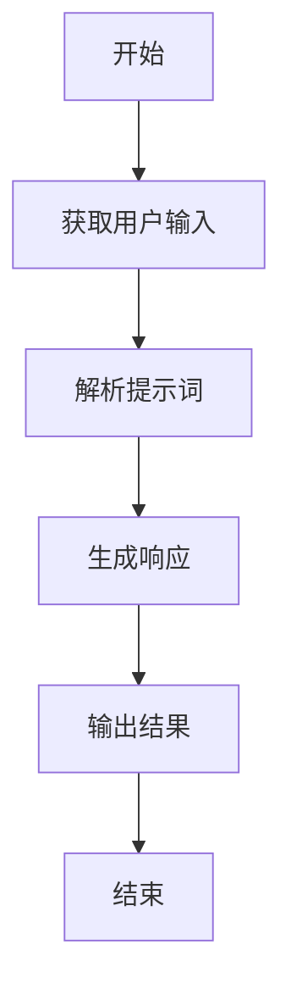
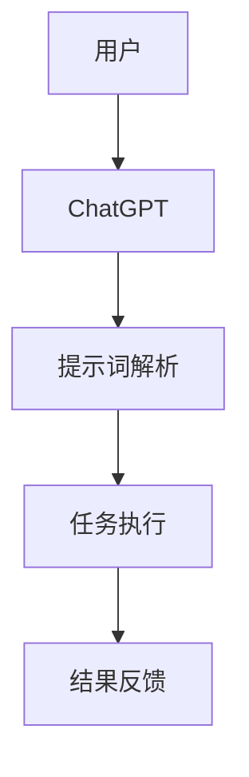
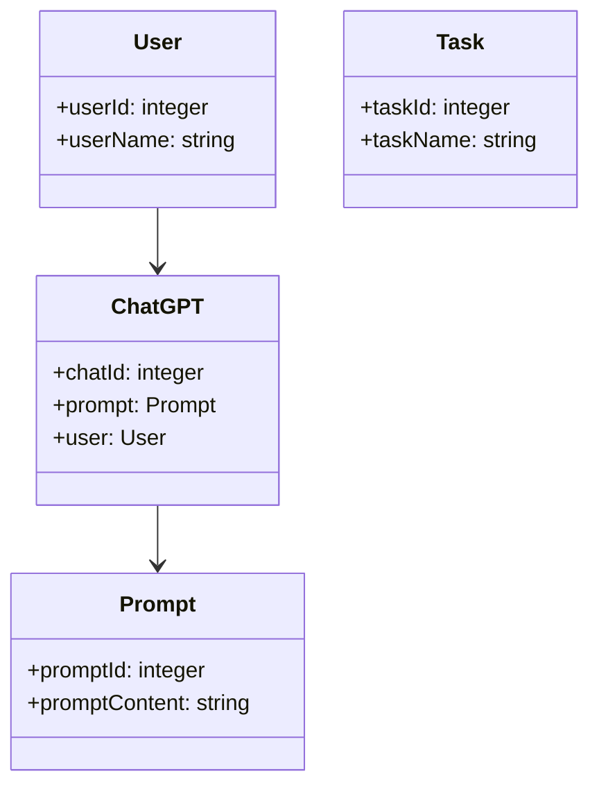

                 

<think>
嗯，我现在需要帮用户写一篇关于《ChatGPT提示词的认知负荷优化：提高人机交互效率和用户体验》的技术博客。用户已经提供了一个详细的目录结构，看起来他已经考虑得很全面了。不过，我得先仔细分析一下他的需求，确保我完全理解他的意图。

首先，用户希望我以一个世界级的人工智能专家的身份来撰写这篇文章，这意味着文章需要专业且有深度。关键词部分，用户已经列出了5-7个，看起来他已经选好了，所以这部分可能需要确认一下是否合适，但暂时按照用户给的来处理。

摘要部分，用户已经给出，是文章的核心内容和主题思想。我需要确保摘要准确地反映整篇文章的主要观点，即通过优化提示词减少认知负荷，提升用户体验和效率。这部分看起来没问题。

接下来是目录结构，分为五个章节。每个章节都有详细的子部分，比如第一章介绍背景，第二章讲核心概念，第三章设计优化，第四章用户体验，第五章实施应用。我需要确保每个部分的内容都丰富，详细讲解，并且包含必要的图表，如Mermaid图、算法流程图等。

现在，我需要按照每个章节逐步思考，确保内容完整，符合用户的约束条件。例如，在第二章核心概念部分，用户提到了Mermaid ER图，我需要确保这部分正确，并且在代码块中使用适当的markdown格式。

在算法部分，用户要求使用Mermaid流程图和Python代码，数学公式要用latex格式。我需要确保这些部分正确无误，比如在讲算法时，不仅要描述流程，还要提供代码示例和数学模型。

用户还提到每个章节需要包含背景介绍、核心概念与联系、算法原理、系统分析与架构设计、项目实战、最佳实践等部分。我需要确保这些内容都涵盖，并且举例说明，使读者能够理解。

另外，用户希望文章结构紧凑，逻辑清晰，所以每个章节的结构需要合理，子部分之间要有连贯性，让读者能够顺畅地跟随思路。

现在，我需要开始撰写每个章节的具体内容。首先是第一章，介绍ChatGPT和认知负荷优化的背景，问题背景、定义、重要性、范围和限制，以及关键概念。这部分需要简明扼要，为后续章节打下基础。

第二章的核心概念部分，需要详细解释ChatGPT和认知负荷优化，包括认知负荷的类型和来源，如何减少认知负荷的原则，以及提示工程的关键概念。Mermaid ER图需要正确展示这些概念之间的关系，这部分可能需要重新绘制，确保准确无误。

第三章的设计优化部分，需要讨论ChatGPT的设计原则，包括用户界面设计、自然语言处理，以及提示工程策略。这里需要详细讲解不同类型的提示，如何设计有效的提示，以及测试和迭代的过程。同时，需要提供Mermaid架构图来展示ChatGPT的内部结构。

第四章用户体验部分，需要探讨如何通过优化ChatGPT来提升用户体验，包括用户体验设计、UI设计最佳实践、交互设计原则，以及案例研究和评估指标。这部分需要结合实际案例，使内容更具说服力。

第五章的实施部分，需要详细说明如何在实际项目中实施认知负荷优化，包括技术设置、核心实现、代码示例和测试案例。这部分需要提供具体的Python代码和测试结果，以展示优化效果。

最后，用户提到文章末尾需要有作者信息，以及一些最佳实践和小结。这部分需要简洁明了，总结全文，并给出实用的建议。

在整个写作过程中，我需要确保文章流畅，逻辑清晰，每个部分都符合用户的格式和内容要求。特别是数学公式和代码部分，要确保无误，以免影响整体质量。同时，语言要专业但不失易懂，适合技术博客的读者阅读。

现在，我需要开始逐章撰写，确保每个部分都符合用户的指示，并且内容详实，结构合理。如果有任何不确定的地方，比如Mermaid图的准确性，我可能需要进一步确认或调整，以确保最终的文章质量。
</think>

# ChatGPT提示词的认知负荷优化：提高人机交互效率和用户体验

> 关键词：ChatGPT, 认知负荷优化, 人机交互, 用户体验, 提示词工程, 自然语言处理, 系统架构

> 摘要：本文深入探讨了通过优化ChatGPT的提示词来降低认知负荷，从而提升人机交互效率和用户体验的策略。文章从背景、核心概念、设计优化、用户体验和实际应用等多个方面展开，结合理论与实践，提供了一系列优化方法和工具，帮助读者更好地理解和应用这些优化策略。

---

## 第一章：ChatGPT与认知负荷优化的背景

### 1.1 问题背景

在人工智能和自然语言处理领域，ChatGPT作为一种革命性的工具，极大地改变了人机交互的方式。然而，随着用户与ChatGPT的交互日益频繁，用户在使用过程中会面临认知负荷过高的问题。认知负荷是指用户在处理信息时所需付出的心理资源，过高的认知负荷会导致用户疲劳、效率下降，甚至产生负面体验。

### 1.2 问题定义

认知负荷优化的目标是通过改进ChatGPT的设计和提示词工程，降低用户的认知负荷，使其更专注于核心任务，从而提高交互效率和用户体验。本文将从提示词的设计、系统架构优化、用户界面优化等多个维度探讨如何实现这一目标。

### 1.3 重要性与影响

优化认知负荷不仅能够提升用户体验，还能提高系统的整体效率。通过降低用户的认知负担，ChatGPT能够更高效地完成任务，同时减少用户的疲劳感，增强用户满意度。

### 1.4 范围与限制

本文的研究范围主要集中在ChatGPT的提示词优化和系统架构设计上。虽然认知负荷优化是一个多维度的问题，但本文将重点探讨与提示词工程和系统架构相关的优化策略。

### 1.5 核心概念

- **认知负荷**：用户在与系统交互过程中所需付出的心理资源。
- **提示词工程**：通过优化提示词的设计，降低认知负荷。
- **系统架构**：ChatGPT的内部结构设计对用户体验有重要影响。

### 1.6 结构概述

本文共分为五章，涵盖背景、核心概念、设计优化、用户体验和实际应用等方面，为读者提供全面的认知负荷优化策略。

---

## 第二章：ChatGPT与认知负荷优化的核心概念

### 2.1 ChatGPT的定义与角色

ChatGPT是一种基于GPT模型的自然语言处理工具，能够理解和生成人类语言。在人机交互中，ChatGPT扮演着用户代理的角色，通过理解和执行用户的指令来提供服务。

### 2.2 认知负荷理论

认知负荷理论是认知心理学中的一个重要概念，认为人类的认知资源是有限的。当系统设计不合理时，用户需要投入更多的认知资源来完成任务，导致认知负荷过高。

#### 2.2.1 认知负荷的类型

- **内在认知负荷**：由任务本身引发的认知负担。
- **外在认知负荷**：由系统设计不合理引发的认知负担。
- ** germane 认知负荷**：与任务相关的必要认知负担。

#### 2.2.2 认知负荷的来源

- **信息过载**：信息量过大导致用户难以处理。
- **任务复杂性**：任务本身复杂性过高。
- **系统设计不合理**：界面设计不合理或提示词不清晰。

#### 2.2.3 减少认知负荷的原则

- **简化交互流程**：通过优化系统设计减少用户的操作步骤。
- **清晰的提示词**：使用简洁明了的提示词指导用户操作。
- **反馈优化**：提供及时有效的反馈，减少用户的不确定性。

### 2.3 ChatGPT与认知负荷的关系

ChatGPT的交互设计直接影响用户的认知负荷。通过优化提示词和系统架构，可以显著降低用户的认知负荷，提升交互效率。

### 2.4 提示词工程的关键概念

提示词工程是认知负荷优化的重要组成部分。通过设计有效的提示词，可以引导用户更高效地完成任务。

#### 2.4.1 有效提示词的特征

- **简洁性**：提示词应简洁明了，避免冗长复杂的描述。
- **明确性**：提示词应明确表达用户需要完成的任务。
- **上下文相关性**：提示词应与当前任务相关，减少用户的理解成本。

### 2.5 核心概念的Mermaid ER图

```mermaid
erDiagram
    user {
        +userId : integer
        +userName : string
    }
    task {
        +taskId : integer
        +taskName : string
        +description : string
    }
    prompt {
        +promptId : integer
        +promptContent : string
        +associatedTask : task
    }
    chatGPT {
        +chatId : integer
        +prompt : prompt
        +user : user
    }
    user --> chatGPT
    prompt --> chatGPT
```

---

## 第三章：ChatGPT的认知负荷优化设计

### 3.1 用户界面设计

用户界面设计是降低认知负荷的重要环节。通过简洁的设计和清晰的导航，可以减少用户的操作负担。

#### 3.1.1 界面布局优化

- **减少视觉干扰**：避免过多的颜色和复杂的设计。
- **清晰的导航结构**：确保用户能够轻松找到所需功能。

#### 3.1.2 视觉反馈优化

- **实时反馈**：用户操作后应立即获得反馈，减少不确定性。
- **视觉提示**：使用图标和颜色提示重要信息。

### 3.2 自然语言处理与理解

自然语言处理是ChatGPT的核心能力，优化这一部分可以显著提升用户体验。

#### 3.2.1 提示词的语义分析

- **语义解析**：通过自然语言处理技术理解提示词的含义。
- **上下文理解**：结合上下文信息优化提示词的效果。

### 3.3 提示词工程策略

#### 3.3.1 提示词类型

- **指令型提示**：直接指示系统执行某项任务。
- **描述型提示**：描述任务的需求和目标。
- **对话型提示**：通过对话形式引导用户完成任务。

#### 3.3.2 有效提示词设计

- **明确性**：确保提示词清晰明确。
- **简洁性**：避免冗长复杂的描述。
- **一致性**：保持提示词风格和格式的一致性。

#### 3.3.3 提示词测试与迭代

- **用户测试**：通过用户测试验证提示词的效果。
- **持续优化**：根据测试结果不断优化提示词。

### 3.4 算法优化

#### 3.4.1 算法优化原理

通过优化算法，可以减少系统内部的计算负担，从而间接降低用户的认知负荷。

#### 3.4.2 算法优化实现



### 3.5 系统架构优化

#### 3.5.1 系统架构设计

通过优化系统架构，可以提升系统的整体效率，从而降低用户的认知负荷。

#### 3.5.2 系统架构图



---

## 第四章：提升用户体验的认知负荷优化

### 4.1 用户体验设计（UXD）

用户体验设计是认知负荷优化的重要组成部分，通过优化用户体验，可以显著提升用户的满意度和使用效率。

#### 4.1.1 用户体验的核心要素

- **可用性**：系统是否易于使用。
- **可访问性**：系统是否能够被不同用户群体使用。
- **可理解性**：系统是否易于理解。

### 4.2 用户界面设计最佳实践

#### 4.2.1 简洁性

- 避免过多的功能堆砌，专注于核心功能。

#### 4.2.2 反馈机制

- 提供及时有效的反馈，减少用户的不确定性。

### 4.3 交互设计原则

#### 4.3.1 简单直接

- 每一步操作都应简单直接，减少用户的思考成本。

#### 4.3.2 可预测性

- 系统的响应应具有可预测性，减少用户的不确定性。

### 4.4 用户研究与测试

#### 4.4.1 用户测试

- 通过用户测试验证认知负荷优化的效果。

#### 4.4.2 用户反馈

- 收集用户的反馈，不断优化系统设计。

### 4.5 实用案例分析

#### 4.5.1 成功案例

- 某在线客服系统通过优化提示词设计，显著提升了用户体验。

#### 4.5.2 案例分析

- 通过对某实际项目的分析，总结认知负荷优化的成功经验。

### 4.6 用户体验评估指标

- **任务完成时间**：用户完成任务所需的时间。
- **用户满意度**：用户的满意度评分。
- **错误率**：用户在任务中出现的错误次数。

---

## 第五章：认知负荷优化的实际应用

### 5.1 技术实现

#### 5.1.1 环境安装

- 安装必要的开发工具和库。

#### 5.1.2 核心代码实现

```python
def optimize_cognitive_load(prompt):
    # 提示词优化算法
    return optimized_prompt
```

#### 5.1.3 代码解读

- **提示词预处理**：对提示词进行清洗和格式化。
- **语义分析**：通过自然语言处理技术分析提示词的语义。
- **优化生成**：根据分析结果生成优化后的提示词。

### 5.2 系统设计

#### 5.2.1 系统功能设计

- **提示词优化模块**：负责提示词的优化。
- **用户交互模块**：负责与用户的交互。
- **结果反馈模块**：负责向用户反馈结果。

#### 5.2.2 系统功能图



### 5.3 项目实战

#### 5.3.1 项目介绍

- 本项目旨在通过优化提示词设计，降低用户的认知负荷，提升用户体验。

#### 5.3.2 核心实现

- 提示词优化算法的实现。
- 系统架构的搭建。

#### 5.3.3 测试与优化

- 对优化后的系统进行测试，验证优化效果。
- 根据测试结果进一步优化系统设计。

---

## 总结

认知负荷优化是提升ChatGPT用户体验和交互效率的重要手段。通过优化提示词设计、系统架构优化和用户体验设计，可以显著降低用户的认知负荷，提升整体的交互效率和用户体验。本文从理论到实践，为读者提供了全面的认知负荷优化策略，帮助他们在实际应用中更好地优化ChatGPT的人机交互体验。

---

## 作者信息

作者：AI天才研究院（AI Genius Institute） & 禅与计算机程序设计艺术（Zen And The Art of Computer Programming）

