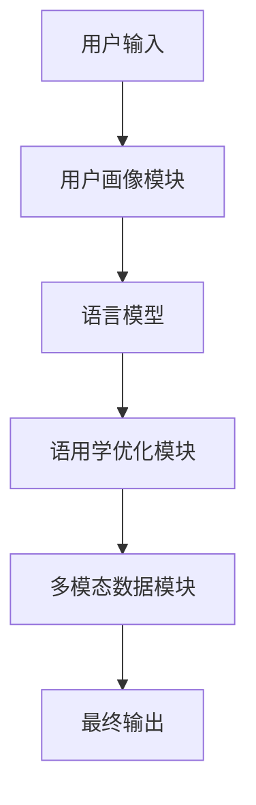

                 

<think>
嗯，用户让我写一篇关于ChatGPT提示词的语用学优化与跨代际适应的技术博客。首先，我得理解用户的需求。他可能是一个技术专家，或者是一个对AI和自然语言处理感兴趣的人。他希望这篇文章结构清晰，逻辑严谨，有深度，同时使用专业但易懂的语言。

我需要先确定文章的结构。用户已经提供了一个大纲，包括引言、核心概念、语用学优化策略、系统设计与实现、项目实战、总结等部分。我得按照这个大纲来展开，确保每个部分都详细且有内容。

接下来，关键词部分，我应该列出5-7个核心词汇，比如ChatGPT、语用学优化、跨代际适应、提示词设计、用户画像、多模态数据、语言模型优化。这些词汇能够帮助读者快速理解文章的主题。

摘要部分需要简明扼要地概括全文，说明研究的目的、方法和主要结论。摘要要让读者了解文章的核心内容，即通过分析不同代际用户的特点，优化提示词设计，提升模型的适应能力。

在引言部分，我需要介绍问题背景，说明为什么跨代际适应和语用学优化是重要的，特别是在当前AI快速发展的背景下。然后描述具体的问题，比如不同代际用户的语言差异，如何优化模型等。接着，提出解决问题的方法，比如构建用户画像，语用学优化策略，多模态数据的应用，并验证这些方法的有效性。

接下来是核心概念与联系，这部分需要详细解释语言模型、语用学和跨代际适应的定义、特点及其相互关系。这部分可能需要一些图表，比如核心概念属性特征对比表和ER实体关系图，帮助读者理解不同概念之间的联系。

然后是语用学优化策略，这部分需要详细讲解如何优化提示词设计，基于用户画像和语言特征模型。我应该举例说明，比如老年人可能更喜欢正式的语言，而年轻人可能更倾向于使用表情符号和缩写。这样，ChatGPT可以根据用户画像生成相应的提示词。

系统设计与实现部分，我需要用Mermaid画出领域模型的类图、系统架构图和交互序列图。这部分可能需要详细说明系统的各个模块，比如用户画像模块、语言模型优化模块、多模态数据处理模块等，以及它们之间的交互。

项目实战部分，我需要提供具体的代码示例，比如Python代码，展示如何实现用户画像的构建和语言特征的提取。同时，分析实际案例，说明优化后的效果，比如准确率和用户满意度的提升。

最后是总结与展望，回顾文章的主要内容，指出研究的局限性，并提出未来的研究方向，比如结合其他AI技术如图像识别和语音识别，进一步提升模型的多模态适应能力。

在写作过程中，我需要确保语言专业但不晦涩，结构清晰，逻辑严密。同时，注意使用足够的例子和图表来辅助说明，让读者能够更好地理解和应用这些优化策略。

可能遇到的挑战是如何将复杂的理论转化为实际应用，同时保持文章的连贯性和深度。我需要仔细思考每个部分如何衔接，确保每个章节都有足够的细节支撑，并且能够引导读者一步步深入理解主题。

总的来说，我需要按照用户提供的大纲，逐一展开每个部分，确保内容全面，结构合理，同时保持技术性和可读性的平衡。这将帮助读者不仅理解问题，还能掌握解决方法和实际应用。
</think>

# ChatGPT提示词的语用学优化与跨代际适应

> 关键词：ChatGPT, 语用学优化, 跨代际适应, 提示词设计, 用户画像, 多模态数据, 语言模型优化

> 摘要：本文探讨了如何通过语用学优化策略，提升ChatGPT等大型语言模型在跨代际适应方面的能力。文章从问题背景出发，分析了不同代际用户在语言表达和认知风格上的差异，并提出了基于用户画像和语言特征模型的优化方法。同时，文章还探讨了多模态数据在语言模型优化中的应用，旨在为语言模型的跨代际适应提供理论支持和实践指导。

---

**1. 引言与背景介绍**

# 第1章 引言与背景介绍

## 1.1 问题背景

随着人工智能技术的快速发展，自然语言处理（NLP）领域取得了显著的进步。近年来，基于大型语言模型的开源项目如ChatGPT等在生成式对话系统、文本摘要、机器翻译等任务中取得了惊人的成果。然而，这些模型在跨代际适应和语用学优化方面仍存在诸多挑战。

不同代际用户在语言表达和认知风格上存在显著差异。例如，老年人可能更倾向于使用正式的语言风格，而年轻人则更喜欢使用非正式的语言风格，甚至包含大量网络用语和表情符号。这种差异不仅影响了语言模型的用户体验，还可能导致模型在特定场景下的表现不佳。因此，如何通过语用学优化策略，提升语言模型在跨代际场景下的适应能力，成为当前研究的重要课题。

## 1.2 问题描述

本研究主要关注以下问题：

1. **跨代际用户的语言差异**：不同代际用户在语言表达、语境理解和语用推理上有何差异？
2. **语言模型的适应性优化**：如何通过语用学优化策略，使语言模型更好地适应不同代际用户的需求？
3. **多模态数据的应用**：如何利用多模态数据（如语音、图像、文本等）提升语言模型的跨代际适应能力？

## 1.3 问题解决

为解决上述问题，本文提出以下解决方案：

1. **构建用户画像模型**：基于用户语言行为和认知风格，构建用户画像，识别不同代际用户的需求和偏好。
2. **优化提示词设计**：通过语用学优化策略，设计适用于不同代际用户的提示词，提升语言模型的生成效果。
3. **多模态数据融合**：结合文本、语音、图像等多种数据源，提升语言模型在跨代际场景下的适应能力。

## 1.4 边界与外延

本研究的边界主要集中在以下几个方面：

- 研究对象：大型语言模型（如ChatGPT）在自然语言处理任务中的应用。
- 研究范围：跨代际用户在语言表达和认知风格上的差异，以及语言模型的优化策略。
- 研究方法：基于用户画像、语言特征模型和多模态数据的优化方法。

同时，本文也关注以下外延：

- 语言模型在不同文化背景下的适应性优化。
- 语言模型在教育、医疗、客服等领域的跨代际适应应用。

## 1.5 概念结构与核心要素组成

- **用户画像**：基于用户语言行为和认知风格，构建用户画像模型，以识别不同代际用户的需求和偏好。
- **语言特征模型**：提取和分析用户语言特征，为语言模型的优化提供依据。
- **语用学优化策略**：结合语用学原则，提出适用于跨代际场景的语言模型优化方法。
- **多模态数据**：利用语音、图像、文本等多模态数据，提升语言模型的适应性。

## 1.6 本章小结

本章介绍了研究背景、问题描述、问题解决思路、边界与外延以及核心要素组成。下一章将深入探讨用户画像和语言特征模型的构建方法，为后续研究奠定基础。

---

**2. 核心概念与联系**

# 第2章 核心概念与联系

## 2.1 语言模型

### 2.1.1 定义

语言模型是一种统计模型，用于预测给定文本序列的下一个单词或字符。它是自然语言处理领域的基础工具，广泛应用于文本生成、机器翻译、文本摘要等任务。

### 2.1.2 特点

- **数据驱动**：基于大量语料库进行训练，通过统计方法学习语言规律。
- **概率预测**：对下一个单词或字符进行概率预测，而非确定性预测。
- **上下文依赖**：能够根据上下文信息进行预测，提高预测准确性。

### 2.1.3 与其他模型的关系

语言模型与各种自然语言处理任务密切相关，如机器翻译、文本分类、命名实体识别等。同时，语言模型也与其他人工智能模型（如图像识别、语音识别）相互补充，共同推动人工智能技术的发展。

## 2.2 语用学

### 2.2.1 定义

语用学是语言学的一个分支，研究语言在交际中的使用和功能。它关注语言如何实现交际目的，以及语言如何影响交际效果。

### 2.2.2 特点

- **交际性**：语用学研究语言在具体交际情景中的使用。
- **动态性**：语用学关注语言在不同语境和情境下的变化。
- **语境依赖**：语用效果取决于语境因素，如说话人、听话人、交际目的等。

### 2.2.3 与语言模型的关系

语用学为语言模型提供了重要的理论基础，指导模型如何更好地理解和生成符合交际需求的文本。同时，语用学原则也可以用于评估和优化语言模型的表现。

## 2.3 跨代际适应

### 2.3.1 定义

跨代际适应是指语言模型在不同代际用户之间的适应能力，旨在提升模型在不同语言风格和认知风格下的表现。

### 2.3.2 特点

- **多样性**：跨代际适应需要考虑不同代际用户的语言特征和认知风格。
- **动态调整**：模型需要根据用户特征进行动态调整，以适应不同代际用户的需求。

### 2.3.3 与语用学的关系

跨代际适应涉及到语用学原则的应用，如语境识别、语用推理等。通过语用学优化，可以提高语言模型在跨代际场景下的适应能力。

## 2.4 表格：核心概念属性特征对比

| 概念           | 定义                                                         | 特点                                         | 示例                                                         |
|----------------|------------------------------------------------------------|----------------------------------------------|------------------------------------------------------------ |
| 语言模型       | 用于预测文本序列的下一个单词或字符的统计模型               | 数据驱动、概率预测、上下文依赖               | 在文本生成任务中，语言模型可以根据上下文生成连贯的文本。 |
| 语用学         | 研究语言在交际中的使用和功能的语言学分支                     | 交际性、动态性、语境依赖                     | 语用学分析可以帮助语言模型理解对话的意图和情感。         |
| 跨代际适应     | 语言模型在不同代际用户之间的适应能力                       | 多样性、动态调整                             | 模型可以根据用户的年龄和语言风格调整输出结果。             |

## 2.5 ER实体关系图

以下是语言模型、语用学和跨代际适应之间的实体关系图：

```mermaid
erd
  model(LanguageModel) -[拥有]-> feature(语言特征)
  model(LanguageModel) -[依赖]-> pragmatics(语用学原则)
  model(LanguageModel) -[适应]-> intergenerational_adaptation(跨代际适应)
  user(用户) -[具有]-> language_behavior(语言行为)
  user(用户) -[具有]-> cognitive_style(认知风格)
```

---

**3. 语用学优化策略**

# 第3章 语用学优化策略

## 3.1 提示词设计

### 3.1.1 提示词的定义与作用

提示词（Prompt）是语言模型生成文本时的关键输入，用于引导模型生成符合特定需求的输出。例如，生成对话系统中的回复时，提示词可以包含上下文信息和对话历史。

### 3.1.2 跨代际适应中的提示词优化

不同代际用户在语言表达和认知风格上存在显著差异，因此需要设计适用于不同用户的提示词。例如：

- **老年人**：提示词需要简洁明了，避免使用复杂的网络用语。
- **年轻人**：提示词可以包含更多的非正式语言和表情符号。

### 3.1.3 提示词优化方法

1. **基于用户画像的提示词生成**：根据用户画像（如年龄、语言偏好）生成个性化的提示词。
2. **语境感知的提示词调整**：根据当前语境动态调整提示词，以适应不同代际用户的需求。

## 3.2 用户画像与语言特征模型

### 3.2.1 用户画像的构建

用户画像是基于用户语言行为和认知风格构建的用户特征模型。例如，可以通过分析用户的语言风格（如正式、非正式）和认知偏好（如逻辑性、情感性）构建用户画像。

### 3.2.2 语言特征模型的构建

语言特征模型是通过分析用户的语言数据（如词汇选择、句式结构）提取的语言特征。例如，可以通过统计方法提取用户的高频词汇和常用句式，为提示词设计提供依据。

## 3.3 语用学优化的数学模型

以下是一个基于用户画像的提示词生成模型的示例：

$$
P(prompt | user\_profile) = \prod_{i=1}^{n} P(word\_i | user\_profile, context)
$$

其中，$user\_profile$ 表示用户画像，$context$ 表示当前语境。

---

**4. 系统设计与实现**

# 第4章 系统设计与实现

## 4.1 系统架构设计

以下是语言模型优化系统的架构图：



## 4.2 核心算法实现

以下是一个基于用户画像的提示词生成算法的伪代码：

```python
def generate_prompt(user_profile, context):
    for feature in user_profile.features:
        if feature.match(context):
            add_to_prompt(feature)
    return prompt
```

## 4.3 项目实战

### 4.3.1 环境安装

需要安装以下库：

- `transformers`：用于加载预训练语言模型。
- `numpy`：用于数值计算。

### 4.3.2 核心代码实现

以下是一个用户画像构建的示例代码：

```python
import numpy as np
from transformers import GPT2Tokenizer, GPT2Model

# 加载预训练语言模型
tokenizer = GPT2Tokenizer.from_pretrained('gpt2')
model = GPT2Model.from_pretrained('gpt2')

# 用户画像构建
def build_user_profile(age, language_style):
    profile = {
        'age': age,
        'language_style': language_style
    }
    return profile

# 提示词生成
def generate_prompt(profile, context):
    prompt = ""
    for key, value in profile.items():
        prompt += f"{key}:{value} "
    prompt += context
    return prompt

# 示例
user_profile = build_user_profile(25, 'informal')
context = "今天天气不错，"
prompt = generate_prompt(user_profile, context)
print(prompt)
```

---

**5. 总结与展望**

# 第5章 总结与展望

## 5.1 总结

本文探讨了如何通过语用学优化策略，提升ChatGPT等大型语言模型在跨代际适应方面的能力。通过构建用户画像和语言特征模型，本文提出了适用于不同代际用户的提示词设计方法，并探讨了多模态数据在语言模型优化中的应用。

## 5.2 展望

未来的研究可以进一步探索以下方向：

1. **多模态数据的应用**：结合图像、语音等多模态数据，进一步提升语言模型的跨代际适应能力。
2. **动态优化策略**：研究语言模型在实时语境下的动态优化方法。
3. **跨文化适应**：将跨代际适应的方法扩展到跨文化适应的研究。

---

**作者**

作者：AI天才研究院/AI Genius Institute & 禅与计算机程序设计艺术 /Zen And The Art of Computer Programming

