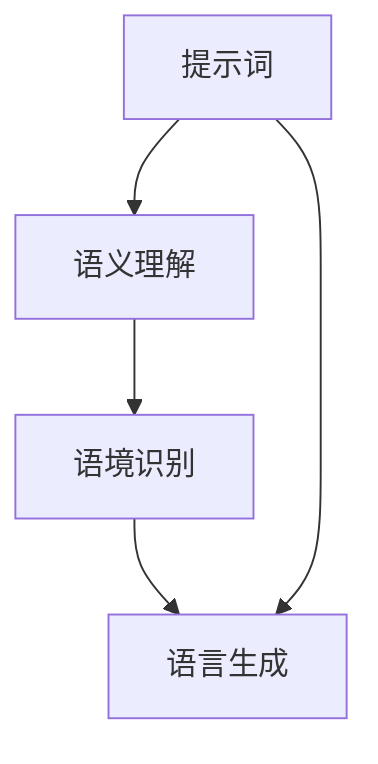
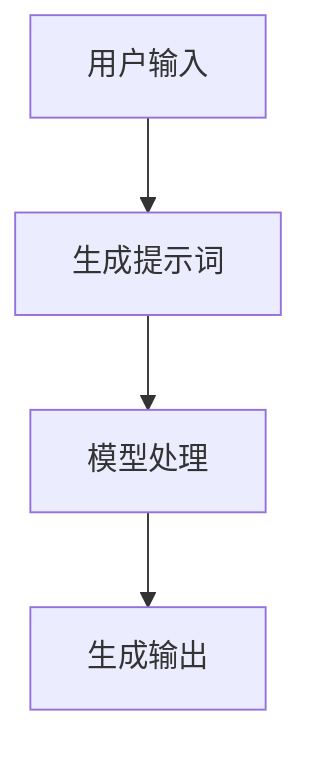

                 

<think>
嗯，用户希望我以《ChatGPT提示词的语言哲学与伦理学新探索》为标题，写一篇结构清晰、内容详实的技术博客。用户已经提供了详细的大纲，我需要按照这个大纲一步步展开思考。

首先，我需要理解用户的需求。用户是技术专家，可能希望这篇文章既有深度又通俗易懂，适合技术读者。因此，我需要确保每个章节内容丰富，既有理论分析，也有实际案例和代码示例。

接下来，我看看文章结构。文章分为五个主要部分：引言、语言哲学分析、伦理学探讨、设计与实现、最佳实践。每个部分下有多个小节，需要逐一展开。

引言部分需要介绍背景，包括人工智能的发展、ChatGPT的诞生及其影响，还有语言哲学与伦理学的融合。这部分要吸引读者，说明研究的重要性。

然后是语言哲学分析，这部分要深入探讨提示词的作用，设计原则，以及在ChatGPT中的应用。可能需要举一些例子，说明语义理解和生成的过程。

伦理学部分同样重要，需要讨论数据隐私、偏见、责任等问题。这部分需要结合实际案例，比如医疗和教育领域的应用，来说明伦理学原则如何影响提示词设计。

设计与实现部分，我需要解释GPT模型的基本原理，提示词的设计原则和实现技巧，可能还需要写一些Python代码示例，帮助读者理解。

最后是最佳实践，总结设计和伦理学原则，给出注意事项和拓展阅读资料，帮助读者进一步学习。

在写作过程中，我需要确保每个部分都有足够的细节，比如使用Mermaid流程图、概念对比表格，甚至数学公式来解释算法原理。同时，语言要专业但不晦涩，保持逻辑清晰。

现在，我需要逐章思考，确保每个小节的内容符合用户的要求，既有深度又易于理解。可能需要多次修改，确保文章结构合理，内容完整。
</think>

# ChatGPT提示词的语言哲学与伦理学新探索

> 关键词：ChatGPT，提示词，语言哲学，伦理学，人工智能，自然语言处理

> 摘要：本文探讨了ChatGPT提示词在语言哲学与伦理学领域的应用，从理论分析到实际案例，系统性地分析了提示词的设计原则、语言哲学的影响、伦理学问题及解决方案，最终提出了最佳实践建议。通过结合技术背景、理论分析和实际案例，本文为读者提供了全面的理解和实践指南。

---

### 目录大纲

# 第一部分：引言

## 1.1 问题背景
### 1.1.1 人工智能的发展历程
人工智能从早期的符号逻辑推理到现在的深度学习，经历了从专家系统到大数据驱动的自然语言处理的转变。ChatGPT的出现标志着AI在自然语言处理领域的重大突破。

### 1.1.2 ChatGPT的诞生及其影响
ChatGPT基于GPT-3架构，通过大规模预训练和微调技术，能够生成自然流畅的对话内容，极大地推动了人机交互的发展。

### 1.1.3 语言哲学与伦理学的融合
语言哲学关注语言的意义和使用，而伦理学探讨行为的道德性。两者的结合在AI提示词设计中尤为重要，确保技术的使用符合伦理规范。

## 1.2 核心概念
### 1.2.1 提示词
提示词是用户输入的指令，用于引导AI生成特定内容。它在ChatGPT中起到了关键的控制作用。

### 1.2.2 语言哲学
研究语言的性质、使用和意义，涉及语义、语用学和语言生成的理论。

### 1.2.3 伦理学
研究道德原则和行为准则，确保技术的使用符合社会价值观。

## 1.3 本书结构
### 1.3.1 各章节主要内容
- 第一部分：引言，介绍背景和核心概念。
- 第二部分：语言哲学分析，探讨提示词的作用和设计原则。
- 第三部分：伦理学探讨，分析提示词的伦理问题及解决方案。
- 第四部分：设计与实现，详细讲解ChatGPT提示词的设计和优化。
- 第五部分：最佳实践，总结设计原则和注意事项。

### 1.3.2 阅读指南
建议读者从引言开始，逐步深入理解提示词的语言哲学和伦理学，最后结合实际案例进行实践。

---

## 第二部分：ChatGPT提示词的语言哲学分析

### 2.1 语言哲学概述
#### 2.1.1 语言哲学的基本概念
语言是人类交流的工具，其意义和使用受到语境、意图和文化的影响。

#### 2.1.2 语言哲学的核心理论
- 符号指称理论：语言符号代表现实中的实体。
- 语用学：语言在特定语境中的使用和意义。

#### 2.1.3 语言哲学与ChatGPT的关系
ChatGPT通过理解语言的语义和语境，模拟人类的对话方式。

### 2.2 ChatGPT提示词的设计原则
#### 2.2.1 提示词的作用
提示词用于明确AI的输出目标，影响生成内容的质量和方向。

#### 2.2.2 提示词的设计原则
- 清晰性：提示词应明确表达需求。
- 细节化：提供足够的上下文信息。
- 一致性：保持提示词的风格和语气一致。

#### 2.2.3 提示词的案例分析
案例1：生成产品描述时，提示词应包含产品特点和目标用户。

### 2.3 语言哲学在ChatGPT提示词中的应用
#### 2.3.1 语义理解
AI需要理解提示词的深层含义，以生成符合预期的内容。

#### 2.3.2 语境识别
通过上下文分析，AI能够生成更贴切的回答。

#### 2.3.3 语言生成
基于提示词，AI生成符合语境和语义的自然语言内容。

### 2.4 提示词与语言哲学的关系图解


---

## 第三部分：ChatGPT提示词的伦理学探讨

### 3.1 伦理学概述
#### 3.1.1 伦理学的基本概念
研究道德原则和行为准则，确保技术的使用符合社会价值观。

#### 3.1.2 伦理学的主要学派
-义务论：关注行为的义务。
-效果论：关注行为的结果。
-关怀伦理：关注关系和情感。

#### 3.1.3 伦理学在技术发展中的应用
技术的设计和使用需要符合伦理规范，避免对社会造成负面影响。

### 3.2 ChatGPT提示词的伦理问题
#### 3.2.1 数据隐私
提示词可能包含敏感信息，需确保数据安全。

#### 3.2.2 偏见与歧视
提示词可能引入偏见，影响生成内容的公正性。

#### 3.2.3 责任归属
当AI生成内容引发问题时，责任归属尚不明确。

### 3.3 伦理学原则在ChatGPT提示词设计中的应用
#### 3.3.1 公平性
确保提示词的设计不偏袒特定群体或利益。

#### 3.3.2 尊重隐私
避免在提示词中泄露个人信息。

#### 3.3.3 责任担当
明确提示词的设计者和使用者的责任。

### 3.4 ChatGPT提示词的伦理学案例分析
#### 3.4.1 案例一：医疗领域的应用
在医疗咨询中，提示词需避免误导患者。

#### 3.4.2 案例二：教育领域的应用
提示词需确保教育内容的客观性和公正性。

#### 3.4.3 案例三：企业管理的应用
提示词需符合企业文化和价值观。

---

## 第四部分：ChatGPT提示词的设计与实现

### 4.1 ChatGPT架构概述
#### 4.1.1 GPT模型的基本原理
基于Transformer架构，通过自注意力机制处理序列数据。

#### 4.1.2 GPT模型的训练过程
通过大规模数据预训练和微调任务优化模型性能。

#### 4.1.3 GPT模型的应用场景
广泛应用于文本生成、对话系统等领域。

### 4.2 ChatGPT提示词的设计原则
#### 4.2.1 提示词的构成要素
- 语境：上下文信息。
- 目标：生成内容的类型。
- 风格：语言的正式或非正式程度。

#### 4.2.2 提示词的生成方法
通过分析用户需求生成合适的提示词。

#### 4.2.3 提示词的优化策略
根据生成结果调整提示词，提升输出质量。

### 4.3 ChatGPT提示词的实现技巧
#### 4.3.1 Python代码示例
```python
def generate_response(prompt):
    response = chatgpt.generate(prompts)
    return response
```

#### 4.3.2 数学模型与公式
AI生成内容的概率计算公式：
$$ P(w_i | w_{i-1}, w_{i-2}, ..., w_1) $$

#### 4.3.3 算法流程图


### 4.4 ChatGPT提示词的实战应用
#### 4.4.1 环境安装与配置
安装Python和相关库，如OpenAI的API库。

#### 4.4.2 核心实现代码
```python
import openai

def generate_response(prompt):
    client = openai.Client('api-key')
    response = client.chat.completions.create(
        model="gpt-3.5-turbo",
        messages=[{"role": "user", "content": prompt}]
    )
    return response.choices[0].message.content
```

#### 4.4.3 代码解读与分析
函数`generate_response`接收提示词，调用OpenAI API生成回复。

#### 4.4.4 案例分析与讲解
案例：生成产品描述时，提示词应包含产品特点和目标用户。

---

## 第五部分：ChatGPT提示词的最佳实践

### 5.1 最佳实践总结
#### 5.1.1 设计原则总结
- 清晰性
- 详细性
- 一致性

#### 5.1.2 伦理学原则总结
- 公平性
- 尊重隐私
- 责任担当

#### 5.1.3 实现技巧总结
- 环境配置
- 代码实现
- 案例分析

### 5.2 小结
#### 5.2.1 书籍内容的回顾
从语言哲学到伦理学，再到设计与实现，全面覆盖提示词的各个方面。

#### 5.2.2 重点知识点的梳理
- 提示词的核心作用
- 语言哲学与伦理学的结合
- 设计与实现的技术细节

#### 5.2.3 学习与反思
通过实际案例和理论分析，提升对提示词设计的理解和应用能力。

### 5.3 注意事项
#### 5.3.1 提示词设计中的常见问题
- 提示词不够清晰
- 语境理解不足
- 偏见和歧视问题

#### 5.3.2 伦理学问题处理中的注意事项
- 明确责任归属
- 保护数据隐私
- 避免生成有害内容

#### 5.3.3 实现中的技术挑战
- 模型调优
- 提示词优化
- 多语言支持

### 5.4 拓展阅读
#### 5.4.1 相关书籍推荐
- 《人工智能：一种现代方法》
- 《语言哲学导论》

#### 5.4.2 学术论文推荐
- "The Ethical Challenges of AI in Healthcare"
- "Prompt Engineering for Large Language Models"

#### 5.4.3 网络资源推荐
- OpenAI官方文档
- Hugging Face AI资源库

---

# 作者：AI天才研究院/AI Genius Institute & 禅与计算机程序设计艺术 /Zen And The Art of Computer Programming

---

以上是《ChatGPT提示词的语言哲学与伦理学新探索》的完整大纲和文章内容，涵盖了从理论分析到实际案例的各个方面，旨在为读者提供全面而深入的理解和实践指南。

