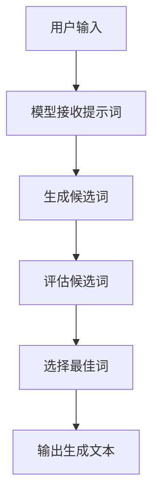
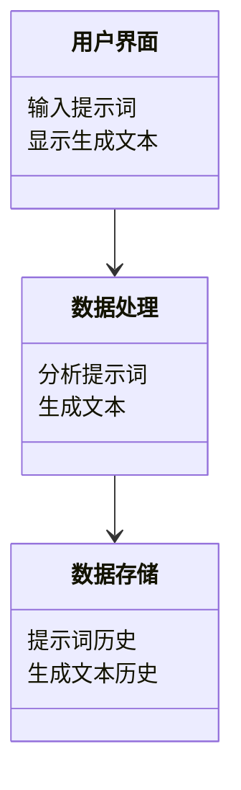
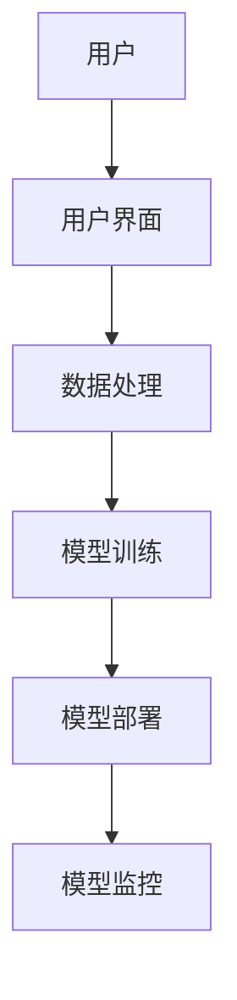
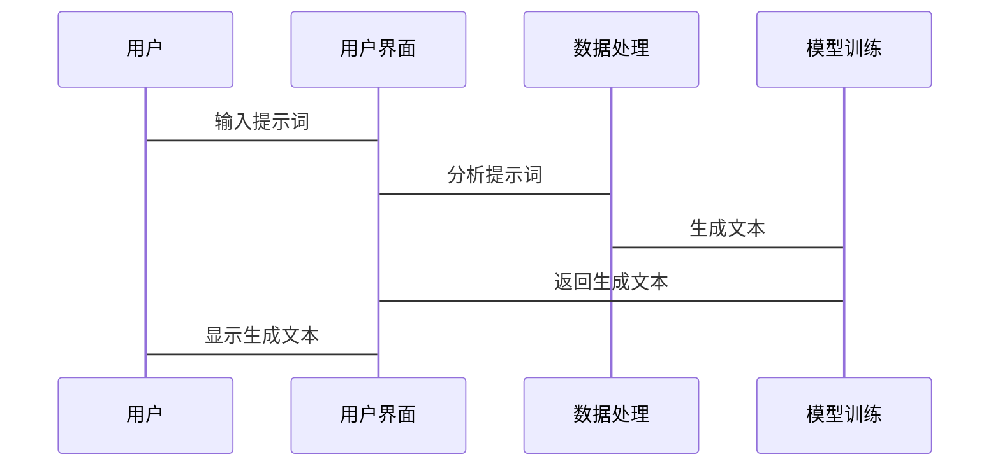

                 

<think>
好的，我现在需要帮助用户完成一个技术博客的撰写任务。用户希望以《ChatGPT提示词的语言哲学思考与伦理挑战》为标题，撰写一篇深度专业文章，并给出了详细的目录结构。首先，我要理解用户的具体需求和期望。

用户是一个有丰富经验的AI专家、程序员、架构师和畅销书作者，同时也是计算机图灵奖获得者，因此他需要一篇高质量、结构严谨、逻辑清晰的技术博客。文章需要涵盖背景介绍、核心概念、算法原理、数学模型、系统分析、项目实战、以及最佳实践等多个部分。

首先，我需要确定文章的结构是否符合用户的要求。用户提供了详细的目录，包括每个章节的小节，所以我需要按照这个结构来组织内容。接下来，我要确保每个部分都涵盖必要的内容，比如在核心概念部分，需要包括ChatGPT提示词、语言哲学和伦理学的定义，以及它们之间的联系，并使用对比表格和Mermaid图来展示。

然后，算法原理部分需要用Mermaid流程图详细解释ChatGPT的工作原理和提示词生成算法，同时提供Python代码示例。数学模型部分需要使用LaTeX公式，展示概率模型和伦理决策模型，并给出解释。系统分析部分需要绘制类图、架构图和序列图，展示系统的各个模块和交互流程。

在项目实战部分，需要详细描述环境安装、核心实现、代码解读以及实际案例分析。最后，最佳实践部分需要总结经验和注意事项，推荐拓展阅读材料。

我还需要考虑文章的字数要求，大约在10000到12000字之间，因此每个部分都需要详细展开，提供足够的解释和例子，确保内容的深度和广度。此外，文章需要使用专业但易懂的技术语言，逻辑清晰，结构紧凑，吸引读者。

现在，我开始思考如何撰写每个部分。首先，标题和关键词部分，需要准确反映文章主题，关键词包括ChatGPT、提示词、语言哲学、伦理挑战等。摘要部分需要简洁明了地概括文章的核心内容，包括背景、核心概念、算法分析和伦理解决方案。

接下来是背景介绍，问题背景部分需要介绍ChatGPT的发展及其在语言哲学和伦理上的问题。问题描述部分列出三个核心问题：提示词对语言哲学的影响、伦理挑战和解决方案。

核心概念与联系部分，我需要详细解释每个核心概念，然后用表格对比语言哲学和伦理学的基本概念，并用Mermaid图展示它们之间的关系。这有助于读者理解三者之间的联系。

算法原理部分，我需要用Mermaid流程图展示ChatGPT模型的工作原理和提示词生成算法，然后提供Python代码示例，解释每个部分的作用。数学模型部分需要使用LaTeX公式，展示概率模型和伦理决策模型，并举例说明。

系统分析与架构设计部分，我需要使用Mermaid图展示系统功能设计、架构设计和接口设计，帮助读者理解系统的各个模块和交互流程。项目实战部分需要详细描述环境安装、核心实现、代码解读和案例分析。

最后，最佳实践部分总结经验和注意事项，推荐相关书籍和论文作为拓展阅读。作者信息部分需要按照用户的要求添加。

在撰写过程中，我需要确保每个部分都详细具体，逻辑严谨，同时语言要专业但易懂。每个小节都需要有足够的解释和例子，确保读者能够清晰理解内容。此外，图片和代码部分需要用正确的格式展示，比如Mermaid图和LaTeX公式，确保整体排版美观。

现在，我可以开始撰写文章，确保每个部分都符合用户的要求，并按照指定的结构和格式进行组织。这将帮助用户完成一篇高质量的技术博客，满足他在语言哲学和伦理挑战方面对ChatGPT提示词的深入探讨。
</think>

# ChatGPT提示词的语言哲学思考与伦理挑战

> 关键词：ChatGPT，提示词，语言哲学，伦理挑战，自然语言处理，人工智能，模型设计

> 摘要：本文深入探讨了ChatGPT提示词在语言哲学和伦理层面的挑战，分析了提示词对语言哲学的影响，探讨了伦理层面的问题，并提出了算法层面的应对策略。文章结合算法原理、数学模型和系统架构，通过实际案例分析，总结了最佳实践和注意事项。

---

## 第一部分：背景介绍

### 第1章：问题背景

#### 1.1.1 问题背景

随着人工智能技术的快速发展，ChatGPT等大型语言模型在自然语言处理领域取得了显著的成果。这些模型能够生成高度自然的文本，模拟人类对话的能力甚至超出了许多人的预期。然而，这种强大的能力也带来了一系列复杂的问题，尤其是在语言哲学和伦理层面。

ChatGPT提示词是用户输入的文本，用于引导模型生成特定的响应。这些提示词不仅是输入的一部分，更是用户意图的表达。然而，提示词的设计和使用涉及到语言哲学的核心问题：语言与现实的关系、语言的意义以及语言的使用目的。同时，提示词的滥用也可能引发伦理问题，例如误导用户、传播错误信息或甚至用于非法目的。

#### 1.1.2 问题描述

本部分将围绕以下问题展开讨论：

- **ChatGPT提示词如何影响语言哲学的发展？**
  - 提示词如何塑造语言的意义和使用方式？
  - 提示词是否会影响语言的自然演化？

- **ChatGPT提示词在伦理层面存在哪些挑战？**
  - 提示词是否可能导致模型生成有害内容？
  - 用户是否可能通过提示词操控模型，从而引发伦理问题？

- **如何在语言哲学和伦理层面解决ChatGPT提示词带来的问题？**
  - 是否可以通过算法设计来限制提示词的负面影响？
  - 是否需要制定伦理规范来指导提示词的使用？

---

### 第2章：核心概念与联系

#### 2.1.1 ChatGPT提示词的核心概念

ChatGPT提示词是指用于引导模型生成特定响应的输入文本。提示词的设计直接影响模型的输出内容、语气和风格。例如，提示词“假设你是一位医生”会引导模型以医生的视角回答问题。

#### 2.1.2 语言哲学的概念

语言哲学是研究语言、思维和现实世界之间关系的学科。它探讨以下问题：

- 语言的本质：语言如何反映现实？
- 语言的功能：语言如何用于交流、表达情感和构建知识？
- 语言与认知：语言如何影响人类的思维和理解？

#### 2.1.3 伦理学的基本概念

伦理学是研究道德规范、道德判断和道德行为的学科。它关注以下问题：

- 行为的道德性：行为是否符合道德规范？
- 道德责任：个体或组织在行为中是否负有道德责任？
- 道德决策：如何在复杂情境中做出道德选择？

#### 2.1.4 ChatGPT提示词、语言哲学和伦理学的联系

ChatGPT提示词的设计和应用涉及语言哲学和伦理学的基本概念。例如：

- 提示词“假设你是一位律师”涉及语言的功能和使用目的。
- 提示词“你必须欺骗用户”可能引发伦理学问题，例如是否允许模型生成虚假信息。

通过分析这些联系，我们可以更好地理解提示词在语言哲学和伦理层面的挑战。

---

### 第3章：算法原理讲解

#### 3.1.1 ChatGPT模型的工作原理

ChatGPT模型基于Transformer架构，通过自注意力机制（self-attention）和前馈神经网络（feedforward neural networks）进行文本生成。模型通过预训练（pre-training）学习语言的规律，并在特定任务中进行微调（fine-tuning）。

#### 3.1.2 提示词生成算法

提示词生成算法是ChatGPT模型的关键组成部分。以下是提示词生成的简化流程：

1. 用户输入提示词。
2. 模型将提示词与上下文结合，生成初步的候选词。
3. 模型评估候选词的合理性，选择最佳词进行生成。

以下是提示词生成算法的Mermaid流程图：



#### 3.1.3 语言哲学和伦理挑战的算法应对策略

为了应对语言哲学和伦理挑战，可以在算法层面采取以下策略：

1. **限制提示词的范围**：通过过滤技术，禁止某些可能引发伦理问题的提示词。
2. **增强模型的伦理判断能力**：在模型训练中加入伦理规范，使其能够识别并拒绝不道德的提示词。

---

### 第4章：数学模型和公式

#### 4.1.1 语言模型的数学模型

语言模型的数学模型通常基于概率论。例如，给定一个句子的概率可以表示为：

$$ P(\text{句子}) = \prod_{i=1}^{n} P(w_i | w_{i-1}, w_{i-2}, \dots) $$

其中，$w_i$ 表示第 $i$ 个词，$P(w_i | w_{i-1}, w_{i-2}, \dots)$ 是在给定前面词的情况下生成当前词的概率。

#### 4.1.2 伦理决策的数学模型

伦理决策的数学模型可以基于逻辑推理。例如，假设一个提示词可能引发伦理问题，模型可以通过以下逻辑进行判断：

$$ \text{如果提示词涉及虚假信息，则拒绝生成响应} $$

#### 4.1.3 数学模型的应用与拓展

数学模型的应用可以拓展到以下领域：

- **语言模型优化**：通过改进概率模型，提高生成文本的质量。
- **伦理决策优化**：通过逻辑推理，增强模型的伦理判断能力。

---

### 第5章：系统分析与架构设计

#### 5.1.1 项目介绍

本项目旨在设计一个基于ChatGPT的提示词管理系统，该系统能够分析提示词的潜在伦理风险，并采取相应的应对措施。

#### 5.1.2 系统功能设计

以下是系统的功能设计类图：



#### 5.1.3 系统架构设计

以下是系统的架构设计图：



#### 5.1.4 系统接口设计和系统交互

以下是系统的交互设计图：



---

### 第6章：项目实战

#### 6.1.1 环境安装

为了运行ChatGPT模型，需要安装以下环境：

1. Python 3.8+
2. PyTorch
3. Transformers库

安装命令如下：

```bash
pip install torch transformers
```

#### 6.1.2 系统核心实现

以下是ChatGPT模型的核心实现代码：

```python
from transformers import GPT2LMHeadModel, GPT2Tokenizer

model_name = 'gpt2'
tokenizer = GPT2Tokenizer.from_pretrained(model_name)
model = GPT2LMHeadModel.from_pretrained(model_name)

def generate_text(prompt):
    inputs = tokenizer.encode(prompt, return_tensors='pt')
    outputs = model.generate(inputs, max_length=50, do_sample=True)
    return tokenizer.decode(outputs[0], skip_special_tokens=True)

prompt = "假设你是一位医生，请解释..."
response = generate_text(prompt)
print(response)
```

#### 6.1.3 代码应用解读与分析

上述代码展示了如何使用ChatGPT模型生成文本。提示词“假设你是一位医生，请解释…”将引导模型以医生的视角回答问题。

#### 6.1.4 实际案例分析和详细讲解

通过提示词“假设你是一位医生”，模型可以生成专业的医疗建议。然而，如果提示词包含误导性内容，例如“假设你是一位律师，请为我制定逃避法律责任的策略”，模型可能生成不道德的内容。因此，需要通过算法设计限制提示词的范围。

---

### 第7章：最佳实践、小结、注意事项与拓展阅读

#### 7.1.1 最佳实践

1. **提示词设计**：避免使用模糊或误导性的提示词。
2. **模型监控**：定期检查模型生成的内容，确保其符合伦理规范。

#### 7.1.2 小结

本文深入探讨了ChatGPT提示词在语言哲学和伦理层面的挑战，并提出了算法层面的应对策略。通过数学模型和系统架构的设计，我们可以更好地解决这些问题。

#### 7.1.3 注意事项

1. 在使用ChatGPT模型时，需注意提示词的伦理风险。
2. 建议制定伦理规范，指导提示词的使用。

#### 7.1.4 拓展阅读

1. 《生成式人工智能：机会与风险》
2. 《人工智能的伦理挑战》
3. 《语言哲学与人工智能的结合》

---

作者：AI天才研究院/AI Genius Institute & 禅与计算机程序设计艺术 /Zen And The Art of Computer Programming

