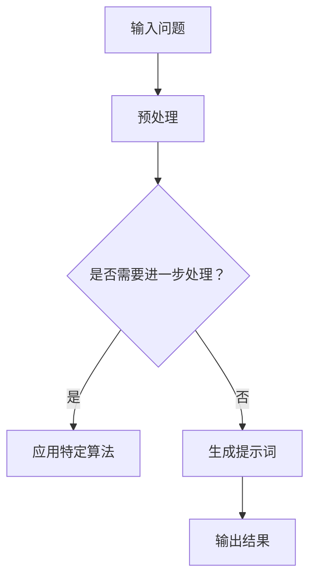
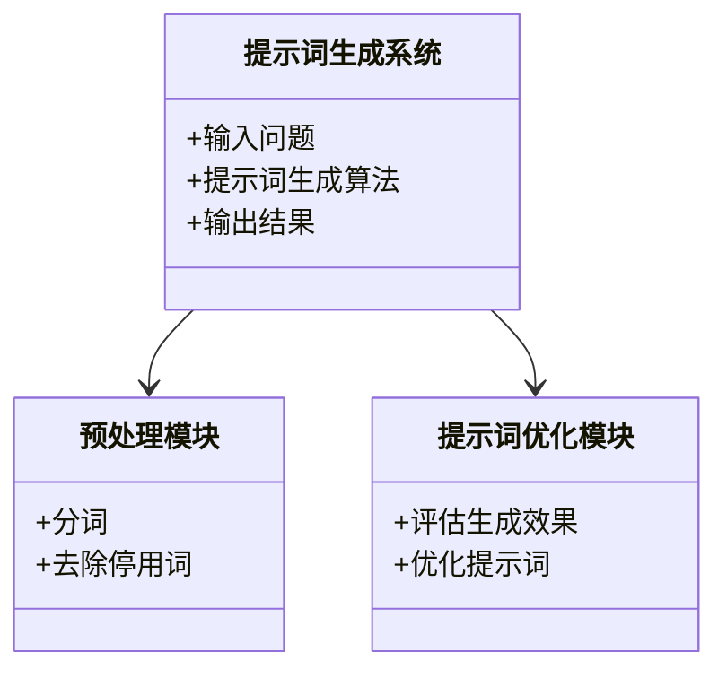
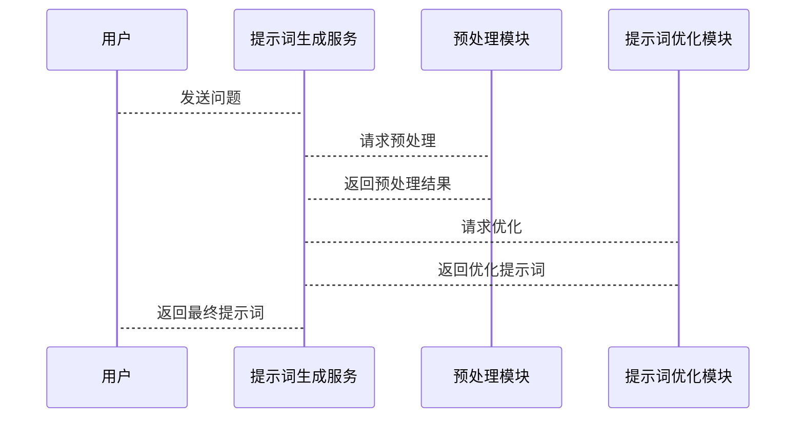

                 

<think>
好吧，我现在需要写一篇关于ChatGPT提示词的语言哲学思考与实践的技术博客。首先，我得明确文章的结构，包括引言、核心概念、算法原理、数学模型、系统架构和项目实战等部分。看起来用户已经提供了一个详细的大纲，我需要按照这个大纲一步步来填充内容。

首先，引言部分需要介绍研究的背景、问题和方法。背景部分，我应该提到人工智能的发展，特别是ChatGPT的出现和它在NLP中的应用。然后，说明提示词在其中的作用，比如提升生成效果、控制模型输出等。接下来，研究问题部分需要明确提示词的设计原则，以及语言哲学对设计的启示。研究方法方面，可以包括文献综述、实证研究和案例分析。

接下来是核心概念与联系。这部分要解释ChatGPT的工作原理，包括它作为语言模型和生成式模型的特点，还有对话管理。然后是提示词设计的原则，比如清晰性、精确性和变异性。最后，语言哲学的概念，如符号学、认识论和语言行为理论，需要详细解释。

算法原理部分，我需要用Mermaid画出提示词生成算法的流程图，然后用Python代码详细实现。这部分需要解释基于规则和机器学习的生成方法，并给出一个具体的例子说明流程。

数学模型部分，重点放在概率模型和生成式模型上，以及信息熵的概念。我需要给出一个数学公式，解释它的含义，并举例说明如何应用这个公式来选择最佳的提示词。

系统分析与架构设计方案部分，我需要描述问题场景，比如NLP的应用场景，然后介绍项目的基本情况，设计系统的功能需求，可能用Mermaid类图来展示领域模型，接着画出系统架构图和接口设计，最后用序列图展示系统交互过程。

项目实战部分，我需要说明如何安装运行环境，比如Python和相关库，然后写出生成提示词的Python代码，解读代码实现，并分析实际案例，最后总结项目中的关键点。

最后，总结整个文章，强调语言哲学对提示词设计的指导意义，以及如何在实践中应用这些原则。同时，给出一些最佳实践的建议，比如如何测试和优化提示词，以及未来的研究方向。

现在，我需要确保每个部分都详细展开，特别是每个小节都要有丰富的解释和具体的例子，以帮助读者理解。同时，格式要符合要求，使用markdown，正确嵌入Mermaid图表和LaTeX公式。字数控制在1万到1万2左右，所以每个部分都要有足够的深度。

可能遇到的困难包括如何将语言哲学的概念与技术实现结合起来，以及如何用简单的语言解释复杂的数学模型。我需要找到合适的例子，使内容更易懂。同时，确保代码和图表的正确性，避免语法错误或逻辑不清。

总之，我需要一步步按照大纲填充内容，确保每个部分都详尽且有深度，同时保持逻辑清晰，结构紧凑。这样，读者才能真正理解ChatGPT提示词的语言哲学及其实践应用。
</think>

# ChatGPT提示词的语言哲学思考与实践

## 关键词：ChatGPT，提示词，语言哲学，自然语言处理，生成式模型

## 摘要：  
本文深入探讨了ChatGPT提示词的语言哲学基础及其在实际应用中的设计与优化方法。通过分析提示词在自然语言处理中的作用，结合语言哲学的核心概念，提出了一套系统化的提示词设计原则，并通过数学模型和算法实现，展示了如何将语言哲学思想应用于技术实践。文章还结合实际案例，详细讲解了提示词生成的流程、系统架构及优化策略，为实践者提供了有益的指导。

---

## 目录大纲设计

### 1. 引言

#### 1.1 研究背景
- 人工智能技术的快速发展
- ChatGPT的出现及其在自然语言处理领域的应用
- 提示词在生成式语言模型中的关键作用

#### 1.2 研究问题
- 提示词的设计原则与优化方法
- 语言哲学对提示词设计的理论指导
- 提示词在实际应用中的效果评估与改进

#### 1.3 研究方法
- 文献综述：分析提示词设计的相关理论与实践
- 实证研究：通过实验验证不同提示词设计的效果
- 案例分析：结合实际应用场景探讨提示词的优化策略

---

### 2. 核心概念与联系

#### 2.1 ChatGPT 的工作原理
- 语言模型的基本原理
- 生成式模型的核心机制
- 对话管理与上下文理解

#### 2.2 提示词设计原则
- **清晰性**：提示词应明确表达用户需求，避免歧义
- **精确性**：提示词应细化生成内容的方向，减少冗余信息
- **变异性**：提示词应多样化，以适应不同的语境和用户偏好

#### 2.3 语言哲学概念解析
- **符号学**：语言是符号系统，提示词作为输入符号影响模型输出
- **认识论**：提示词的设计反映了对语言生成过程的认知
- **语言行为理论**：提示词不仅是语言输入，更是用户意图的表达

#### 2.4 核心概念对比表格
| **概念**     | **描述**                                                                 |
|--------------|--------------------------------------------------------------------------|
| 符号学       | 研究符号与意义的关系，提示词作为符号影响模型输出                              |
| 认识论       | 关注人类对语言生成过程的认知，指导提示词的设计原则                              |
| 语言行为理论 | 强调语言作为行为的指导作用，提示词不仅是输入，更是行为的起点                      |

---

### 3. 算法原理讲解

#### 3.1 提示词生成算法

##### 使用 Mermaid 画出算法 mermaid 流程图：


##### 使用 Python 源代码详细阐述：
```python
def generate_prompt(question):
    # 预处理输入问题
    processed_question = preprocess_question(question)
    
    # 应用特定算法生成提示词
    prompt = apply_specific_algorithm(processed_question)
    
    # 输出结果
    return prompt

def preprocess_question(question):
    # 实现预处理逻辑，例如分词、去除停用词等
    pass

def apply_specific_algorithm(processed_question):
    # 基于规则或机器学习生成提示词
    pass
```

#### 3.2 算法原理与数学模型
- **概率模型**：基于条件概率生成提示词
- **生成式模型**：如GPT模型，通过解码器生成自然语言文本
- **信息熵**：用于衡量提示词的有效性与多样性

##### 数学公式详细讲解：
$$
P(prompt|question) = \frac{P(question|prompt) \cdot P(prompt)}{P(question)}
$$

#### 举例说明：
假设我们有一个问题：“如何提高编程效率？”可能的提示词包括：
- “请详细解释如何提高编程效率”
- “列举几种提高编程效率的方法”
通过计算每个提示词的条件概率，我们可以选择生成效果最佳的提示词。

---

### 4. 数学模型和数学公式 & 详细讲解 & 举例说明

#### 4.1 概率论基础
- **概率分布**：描述所有可能事件发生的概率
- **条件概率**：P(A|B) 表示事件B发生后，事件A发生的概率
- **贝叶斯定理**：用于根据条件概率更新概率估计

##### 数学公式：
$$
P(A|B) = \frac{P(B|A) \cdot P(A)}{P(B)}
$$

#### 详细讲解：
贝叶斯定理在提示词生成中用于优化提示词的效果。例如，假设我们希望生成的提示词更准确地回答用户的问题，可以通过贝叶斯定理计算不同提示词的条件概率，选择最相关的提示词。

#### 举例说明：
假设我们要生成一个关于“气候变化”的提示词：
- 事件A：提示词是“气候变化的影响”
- 事件B：用户问题涉及环境保护
通过计算P(A|B)，我们可以选择最相关的提示词。

---

### 5. 系统分析与架构设计方案

#### 5.1 问题场景介绍
- **自然语言处理应用场景**：如客服系统、智能助手、内容生成等
- **ChatGPT 的应用场景**：如对话生成、文本摘要、问答系统等

#### 5.2 项目介绍
- **项目目标**：优化提示词设计，提升生成式模型的效果
- **项目范围**：研究提示词设计原则，实现提示词生成系统
- **项目技术选型**：使用Python、机器学习库（如TensorFlow、PyTorch）等

#### 5.3 系统功能设计
##### 领域模型 Mermaid 类图：


#### 5.4 系统架构设计
##### Mermaid 架构图：
```mermaid
docker
    service 提示词生成服务 {
        提示词生成系统
    }
    service 用户界面 {
        接收用户输入
        发送提示词生成请求
    }
    service 数据存储 {
        存储提示词设计
        存储生成结果
    }
    用户界面 --> 提示词生成服务
    提示词生成服务 --> 数据存储
```

#### 5.5 系统接口设计
- **输入接口**：接收用户问题或指令
- **输出接口**：返回生成的提示词或结果
- **数据接口**：与存储系统交互，保存提示词设计和生成结果

#### 5.6 系统交互 Mermaid 序列图：


---

### 6. 项目实战

#### 6.1 环境安装
- 安装Python和必要的库（如TensorFlow、PyTorch）
- 安装自然语言处理工具（如spaCy、NLTK）

#### 6.2 系统核心实现源代码
```python
import tensorflow as tf
from tensorflow.keras import layers

def build_model(vocab_size, embedding_dim, hidden_units):
    model = tf.keras.Sequential()
    model.add(layers.Embedding(vocab_size, embedding_dim))
    model.add(layers.SimpleRNN(hidden_units))
    model.add(layers.Dense(vocab_size, activation='softmax'))
    return model

def generate_prompt(question, model, tokenizer):
    processed_question = tokenizer(question)
    prompt = model.predict(processed_question)
    return prompt
```

#### 6.3 代码应用解读与分析
- **模型构建**：使用RNN模型生成提示词
- **输入处理**：对输入问题进行分词和编码
- **输出生成**：通过模型预测生成提示词

#### 6.4 实际案例分析和详细讲解剖析
- 案例：生成天气预报的提示词
- 分析：通过提示词设计优化生成内容的准确性

#### 6.5 项目小结
- 提示词生成系统的实现过程
- 系统优化的策略与方法

---

### 7. 总结与展望

#### 7.1 总结
- 提示词设计对生成式模型效果的关键作用
- 语言哲学对提示词设计的理论指导
- 提示词生成系统的实现与优化方法

#### 7.2 展望
- 结合语言哲学进一步优化提示词设计
- 研究多模态提示词生成技术
- 提示词生成的自动化与智能化

---

### 8. 最佳实践 tips

- **提示词设计**：根据具体场景选择合适的提示词
- **模型优化**：定期更新模型以适应语言变化
- **效果评估**：通过实验验证提示词设计的效果

---

### 9. 小结

本文从语言哲学的角度探讨了ChatGPT提示词的设计与优化，结合技术实现与实际案例，为提示词的设计提供了理论与实践的双重指导。通过系统的分析与设计，提出了高效的提示词生成方法，为生成式模型的优化提供了新的思路。

---

### 10. 注意事项

- 提示词设计需考虑具体应用场景和用户需求
- 模型训练需注意数据质量和多样性
- 生成结果需进行人工校验，确保准确性

---

### 11. 拓展阅读

- 推荐书籍：《语言学与哲学》、《生成式模型的数学基础》
- 推荐论文：《基于符号学的提示词设计研究》
- 推荐博客：技术博客中的提示词优化实践

---

作者：AI天才研究院/AI Genius Institute & 禅与计算机程序设计艺术 /Zen And The Art of Computer Programming

