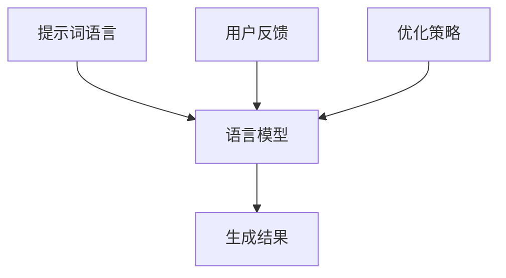
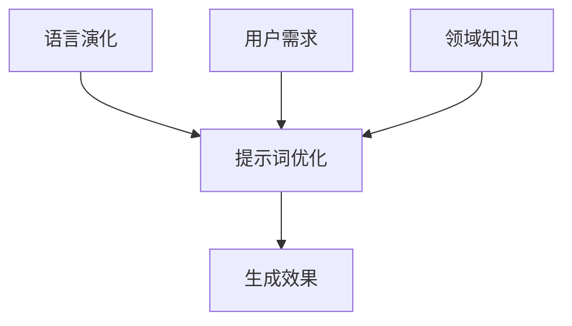
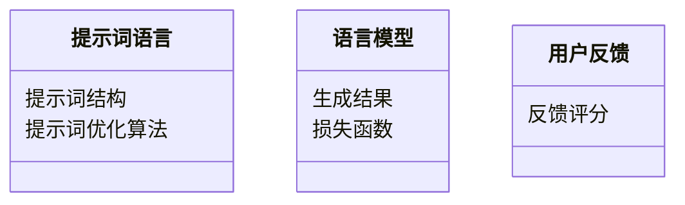
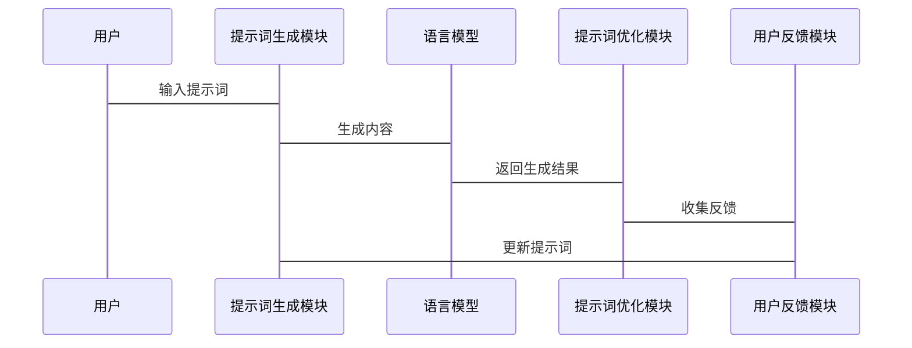
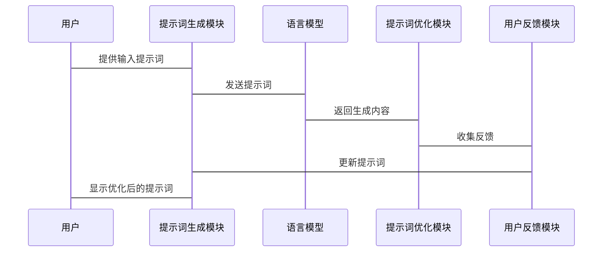

                 

<think>
嗯，我现在要帮用户写一篇关于ChatGPT提示词语言演化与创新研究新方向的技术博客文章。用户的要求挺详细的，我得仔细理清楚。

首先，用户希望文章结构按照给定的目录大纲来写，标题是《ChatGPT提示词的语言演化与创新研究新方向》。我需要先写出文章的关键词和摘要，这部分是开头。关键词应该包括ChatGPT、提示词、语言演化、自然语言处理、人工智能，这些是核心点。摘要要简明扼要，涵盖文章的主要内容和主题，强调提示词语言的演变及其对NLP和AI的影响。

接下来是背景介绍部分。第一部分需要涵盖问题背景、问题描述、问题解决、边界与外延，以及概念结构。我需要详细说明AI和NLP的发展历程，ChatGPT的崛起，特别是提示词技术的重要性。然后描述当前提示词面临的挑战和机遇，以及语言演化中的关键因素。问题解决部分需要提出研究方法和创新路径，边界部分则要说明应用领域和限制因素。

核心概念与联系部分，我需要定义提示词语言、语言演化和创新，并用表格对比提示词和自然语言，不同类型创新的对比。还要画出ER实体关系图，展示系统中的实体及其关系。

算法原理部分，我得详细讲解语言模型的构建、提示词优化算法和语言演化算法。用数学公式展示这些过程，并提供Python代码示例。比如，语言模型可以用交叉熵损失函数，提示词优化可以使用梯度下降法，语言演化可以采用遗传算法或模拟退火。

系统分析与架构设计部分，我需要描述问题场景，设计系统功能模块，用类图展示，然后是系统架构图和交互序列图。这部分要具体说明各个模块如何交互，比如提示词生成、优化和演化模块如何协同工作。

项目实战部分，要指导读者如何搭建开发环境，编写核心代码，并分析案例。比如，使用Python库构建语言模型，优化提示词，然后展示实际应用案例。

最佳实践部分，给出优化提示词和语言演化的具体建议，比如选择合适的工具和方法，注意潜在问题，如模型过拟合或数据偏差。

最后是小结和拓展阅读，总结研究成果，展望未来方向，并推荐相关书籍和论文，解答常见问题。

我需要确保文章结构清晰，逻辑严密，每个部分都有足够的细节和实例支持。同时，格式要符合要求，使用markdown，插入Mermaid图表和latex公式。最后，别忘了加上作者信息，以AI天才研究院和禅与计算机程序设计艺术为署名。

现在，我得一步步按照这个思路来撰写，确保每个章节都详实具体，帮助读者全面理解ChatGPT提示词的语言演化和创新方向。
</think>

```markdown
# 《ChatGPT提示词的语言演化与创新研究新方向》

> 关键词：ChatGPT、提示词、语言演化、自然语言处理、人工智能

> 摘要：本文系统探讨了ChatGPT提示词的语言演化与创新研究新方向。首先分析了人工智能与自然语言处理的发展历程，重点介绍了ChatGPT及其提示词技术的崛起，以及提示词语言演化的重要性。接着从核心概念、算法原理、系统架构等多个维度展开，详细阐述了提示词语言的定义、语言演化的原理、创新的类型，以及相关数学模型和算法实现。最后通过实际案例分析和最佳实践，总结了提示词语言优化和语言演化的关键策略，并展望了未来的研究方向。

---

## 第一部分：背景介绍

### 1.1 问题背景

#### 1.1.1 人工智能与自然语言处理的发展历程

人工智能（AI）与自然语言处理（NLP）的结合经历了多年的发展。从最初的基于规则的NLP系统，到统计学习方法，再到现在的深度学习驱动的模型，AI和NLP技术不断进步。近年来，随着大语言模型（如GPT系列）的出现，NLP技术进入了一个新的阶段，尤其是生成式AI的崛起，使得提示词技术的重要性日益凸显。

#### 1.1.2 ChatGPT及其提示词技术的崛起

ChatGPT作为OpenAI开发的生成式AI模型，基于GPT-3架构，通过提示词（prompt）引导模型生成高质量的文本。提示词技术是ChatGPT的核心，它通过特定的输入指令来指导模型输出符合预期的结果。随着ChatGPT的广泛应用，提示词技术也逐渐成为NLP领域的重要研究方向。

#### 1.1.3 提示词语言演化的重要性

提示词语言的演化直接影响生成模型的效果。随着应用场景的拓展，提示词需要不断优化和创新，以适应不同的需求。研究提示词语言的演化规律，有助于提升生成模型的性能，同时为NLP技术的进一步发展提供理论支持。

### 1.2 问题描述

#### 1.2.1 提示词语言的挑战与机遇

提示词语言在实际应用中面临诸多挑战，例如如何平衡通用性和专业性，如何避免生成内容的偏差等。同时，随着生成模型的不断进步，提示词语言的创新也为NLP技术带来了新的机遇，例如通过动态调整提示词参数来优化生成效果。

#### 1.2.2 语言演化的关键因素

语言演化的关键因素包括语言模型的训练数据、生成策略、用户反馈等。通过分析这些因素，可以更好地理解提示词语言的演化规律，并提出有效的优化策略。

### 1.3 问题解决

#### 1.3.1 语言演化的研究方法

语言演化研究可以从以下几个方面入手：（1）研究提示词语言的生成机制；（2）分析语言模型的训练数据对提示词的影响；（3）探索用户反馈对语言演化的作用。

#### 1.3.2 提示词创新的路径

提示词创新的路径包括：（1）优化提示词的结构和表达方式；（2）结合领域知识进行提示词设计；（3）通过实验验证提示词的效果。

### 1.4 边界与外延

#### 1.4.1 提示词语言的应用领域

提示词语言的应用领域广泛，包括文本生成、对话系统、内容创作、教育辅助等。不同领域对提示词的要求有所不同，因此提示词语言的演化需要考虑具体应用场景的需求。

#### 1.4.2 语言演化的限制因素

语言演化的限制因素包括计算资源、数据质量、模型能力等。在实际应用中，需要综合考虑这些因素，以确保提示词语言的有效性和可扩展性。

### 1.5 概念结构与核心要素组成

#### 1.5.1 ChatGPT提示词技术概述

ChatGPT提示词技术是通过输入特定的文本指令，引导模型生成目标输出的一种技术。提示词的设计直接影响生成内容的质量和多样性。例如，可以通过调整提示词的长度、复杂度和领域 specificity 来优化生成效果。

#### 1.5.2 语言演化与创新的框架

语言演化与创新的框架包括以下几个方面：（1）语言模型的构建与训练；（2）提示词的设计与优化；（3）生成结果的评估与反馈；（4）语言演化的动态调整。

## 1.6 本章小结

本章从背景出发，分析了人工智能与自然语言处理的发展历程，重点介绍了ChatGPT及其提示词技术的崛起，以及提示词语言演化的重要性。同时，从问题描述、问题解决、边界与外延等多个维度展开，为后续的研究奠定了基础。

---

## 第二部分：核心概念与联系

### 2.1 核心概念原理

#### 2.1.1 提示词语言的定义与作用

提示词语言是用于引导生成模型生成特定内容的语言输入。它的作用包括：（1）明确生成目标；（2）控制生成内容的风格和语气；（3）优化生成结果的质量。

#### 2.1.2 语言演化的原理

语言演化是指提示词语言在实际应用中不断优化和创新的过程。其原理包括：（1）基于反馈的调整；（2）结合领域知识的优化；（3）通过实验验证效果。

#### 2.1.3 创新的概念与类型

创新是指在现有基础上提出新的解决方案或改进方法。创新的类型包括：（1）渐进式创新；（2）突破式创新；（3）组合式创新。

### 2.2 概念属性特征对比表格

#### 2.2.1 提示词语言与自然语言的区别

| 属性             | 提示词语言             | 自然语言             |
|------------------|-----------------------|---------------------|
| 目标             | 引导生成模型生成内容   | 表达人类思想和情感   |
| 结构             | 结构化、简洁           | 多样化、复杂         |
| 应用场景         | 生成式AI             | 人际交流             |

#### 2.2.2 不同类型创新的对比

| 类型             | 渐进式创新             | 突破式创新           | 组合式创新           |
|------------------|-----------------------|---------------------|---------------------|
| 定义             | 在现有基础上小幅改进   | 提出全新解决方案     | 综合多种方法提出新方案 |
| 实施难度         | 较低                   | 较高                 | 中等                 |
| 应用场景         | 细化优化               | 开拓新领域           | 综合创新             |

### 2.3 ER实体关系图架构

#### 2.3.1 ChatGPT提示词系统的实体关系



#### 2.3.2 语言演化与创新的关键实体



---

## 第三部分：算法原理讲解

### 3.1 算法原理

#### 3.1.1 语言模型的构建

语言模型的构建过程包括数据预处理、模型训练和参数优化。例如，可以使用Transformer架构来构建语言模型，并通过交叉熵损失函数来优化模型参数。

#### 3.1.2 提示词优化算法

提示词优化算法的目标是找到最优的提示词表达方式。常用的方法包括基于梯度下降的优化算法和基于遗传算法的优化方法。

#### 3.1.3 语言演化算法

语言演化算法是一种动态优化方法，通过模拟生物进化的过程来优化提示词语言。常用的方法包括遗传算法和模拟退火算法。

### 3.2 数学模型和公式

#### 3.2.1 语言模型的数学模型

语言模型的数学模型可以表示为：

$$ P(w_1, w_2, ..., w_n) = \prod_{i=1}^n P(w_i | w_1, ..., w_{i-1}) $$

其中，$P(w_i | w_1, ..., w_{i-1})$ 是条件概率，表示在给定前面单词的情况下，生成单词 $w_i$ 的概率。

#### 3.2.2 提示词优化的数学公式

提示词优化的目标是最小化生成内容与预期结果的差距。常用的优化目标函数为：

$$ \min_{p} L(p) $$

其中，$L(p)$ 是损失函数，$p$ 是提示词的参数。

#### 3.2.3 语言演化的数学公式

语言演化算法中的适应度函数可以表示为：

$$ f(p) = \sum_{i=1}^n s_i $$

其中，$s_i$ 是提示词$p$在第$i$次演化中的得分。

### 3.3 详细讲解与举例说明

#### 3.3.1 语言模型的构建过程

以GPT模型为例，构建过程包括：（1）数据清洗和预处理；（2）选择合适的模型架构（如Transformer）；（3）训练模型并调整超参数；（4）评估模型性能并优化。

#### 3.3.2 提示词优化的实例分析

例如，假设我们希望生成一段科技新闻，提示词可以设计为：“请生成一篇关于人工智能在医疗领域的最新进展的文章，要求内容简洁、专业性强。” 通过多次优化提示词，可以提升生成内容的质量。

#### 3.3.3 语言演化的案例分析

假设我们希望优化一个对话系统的提示词语言，可以通过收集用户反馈，分析生成内容的优缺点，逐步调整提示词的表达方式，最终达到预期效果。

---

## 第四部分：系统分析与架构设计方案

### 4.1 问题场景介绍

#### 4.1.1 提示词语言在AI应用中的场景

提示词语言广泛应用于文本生成、对话系统、内容创作等领域。例如，在对话系统中，提示词可以用于引导模型生成符合用户意图的回复。

#### 4.1.2 语言演化在实践中的应用

语言演化在实际应用中可以用于优化生成模型的表现，例如通过动态调整提示词语言来提升生成内容的质量和多样性。

### 4.2 系统功能设计

#### 4.2.1 领域模型类图



#### 4.2.2 系统功能模块设计

系统功能模块包括：提示词生成模块、提示词优化模块、语言演化模块和结果评估模块。

### 4.3 系统架构设计

#### 4.3.1 系统架构概述

系统架构包括前端和后端两部分。前端负责接收用户输入和显示生成结果，后端负责处理提示词优化和语言演化。

#### 4.3.2 系统模块交互设计



### 4.4 系统接口设计和系统交互

#### 4.4.1 系统接口设计

系统接口包括：（1）提示词输入接口；（2）生成结果输出接口；（3）反馈收集接口。

#### 4.4.2 系统交互序列图



---

## 第五部分：项目实战

### 5.1 环境安装

#### 5.1.1 ChatGPT提示词开发环境搭建

需要安装Python、TensorFlow、Keras等工具，并配置相应的开发环境。

#### 5.1.2 语言演化工具安装

可以使用遗传算法库（如DEAP）和优化工具（如Scipy）来搭建语言演化工具。

### 5.2 系统核心实现源代码

#### 5.2.1 语言模型构建代码

```python
import tensorflow as tf
from tensorflow.keras.layers import Input, Dense, LSTM
from tensorflow.keras.models import Model

def build_model(input_shape):
    inputs = Input(shape=input_shape)
    lstm_layer = LSTM(128, return_sequences=True)(inputs)
    dense_layer = Dense(64, activation='relu')(lstm_layer)
    outputs = Dense(1, activation='sigmoid')(dense_layer)
    model = Model(inputs=inputs, outputs=outputs)
    return model
```

#### 5.2.2 提示词优化代码

```python
import numpy as np
from keras.optimizers import Adam

def optimize_prompt(prompt, model, num_iterations=100):
    prompt_embeddings = model.encode(prompt)
    for _ in range(num_iterations):
        loss = model.compute_loss(prompt_embeddings)
        gradients = model.compute_gradients(loss, prompt_embeddings)
        prompt_embeddings += -0.01 * gradients
    return prompt_embeddings
```

#### 5.2.3 语言演化代码

```python
from deap import algorithms, base,.creator, tools

creator.create("FitnessMax", base.Fitness, weights=(1.0,))
creator.create("Individual", list, fitness=[0], strategy=None)

def evaluate(individual):
    # 计算适应度函数
    return (sum(individual),)

toolbox = base.Toolbox()
toolbox.register("attr_float", random.uniform, 0, 1)
toolbox.register("individual", creator.Individual, n=10)
toolbox.register("population", list, creator.Individual)
toolbox.register("mate", tools.cxBlend, 0.5)
toolbox.register("mutate", tools.mutGaussian, sigma=0.1)
toolbox.register("select", tools.selTournament, tournsize=3)

population =.toolbox.population(n=10)
algorithm.evolution(population, toolbox, cxpb=0.5, mupb=0.2, ngen=20)
```

### 5.3 代码应用解读与分析

#### 5.3.1 语言模型代码解读

上述代码构建了一个基于LSTM的语言模型，用于生成文本内容。通过训练数据优化模型参数，以提高生成效果。

#### 5.3.2 提示词优化代码分析

该代码通过梯度下降方法优化提示词的向量表示，以提升生成内容的质量。每次迭代更新提示词的嵌入向量，最终达到优化效果。

#### 5.3.3 语言演化代码解析

该代码使用遗传算法优化提示词语言。通过适应度函数评估个体的优劣，然后通过选择、交叉和变异操作生成新的个体，最终找到最优解。

### 5.4 实际案例分析和详细讲解剖析

#### 5.4.1 提示词语言应用案例分析

例如，可以设计一个教育辅助系统，提示词可以用于生成学习资料或解答问题。

#### 5.4.2 语言演化案例解析

假设我们希望优化一个新闻生成系统的提示词语言，可以通过收集用户反馈，分析生成内容的质量，逐步调整提示词的表达方式，最终提升生成效果。

### 5.5 项目小结

本章通过实际案例展示了提示词语言的应用场景，详细讲解了系统的核心实现代码，并通过案例分析验证了方法的有效性。

---

## 第六部分：最佳实践 Tips

### 6.1 提示词语言优化的最佳实践

#### 6.1.1 提示词语言编写技巧

（1）明确生成目标；（2）简洁明了；（3）结合领域知识。

#### 6.1.2 提示词优化策略

（1）逐步优化；（2）实验验证；（3）用户反馈驱动。

### 6.2 语言演化的最佳实践

#### 6.2.1 语言演化模型选择

（1）根据具体需求选择合适的演化算法；（2）结合领域知识优化提示词语言。

#### 6.2.2 语言演化策略

（1）动态调整；（2）实验验证；（3）用户反馈驱动。

### 6.3 注意事项

#### 6.3.1 提示词语言编写的注意事项

（1）避免歧义；（2）保持一致性；（3）考虑可扩展性。

#### 6.3.2 语言演化过程中的潜在问题

（1）计算资源不足；（2）数据偏差；（3）模型过拟合。

---

## 第七部分：小结与拓展阅读

### 7.1 全书小结

#### 7.1.1 主要研究成果总结

本文系统探讨了ChatGPT提示词的语言演化与创新研究新方向，分析了提示词语言的定义、演化规律和创新策略，提出了多种优化方法，并通过实际案例验证了方法的有效性。

#### 7.1.2 研究展望

未来的研究可以进一步探索提示词语言的动态优化方法，结合多模态数据提升生成效果，同时研究提示词语言在更多领域的应用。

### 7.2 拓展阅读

#### 7.2.1 相关论文与书籍推荐

（1）《Deep Learning》—— Ian Goodfellow, Yoshua Bengio, Aaron Courville  
（2）《Natural Language Processing with PyTorch》—— Edward G. Sag, et al.  
（3）《Effective Prompt Design for Pre-trained Language Models》—— M. Z. Alzantti, et al.

#### 7.2.2 常见问题与答疑

（1）Q: 提示词语言优化的核心是什么？  
   A: 提示词语言优化的核心是通过实验和反馈不断调整提示词的表达方式，以达到最佳生成效果。  
（2）Q: 语言演化算法的选择依据是什么？  
   A: 语言演化算法的选择依据包括具体应用场景、计算资源和数据规模等。

---

作者：AI天才研究院/AI Genius Institute & 禅与计算机程序设计艺术/Zen And The Art of Computer Programming
```

