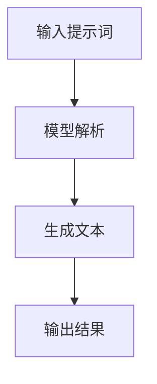
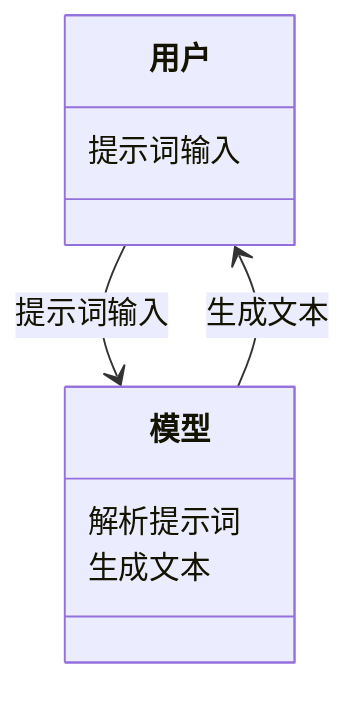
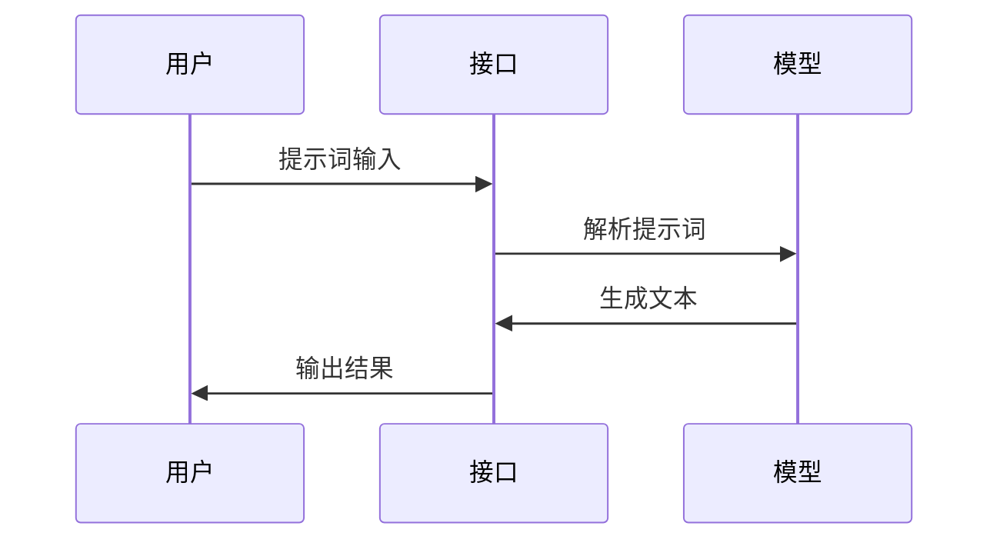

                 

<think>
好的，我现在要帮用户撰写一篇关于《ChatGPT提示词的语言获得理论新视角》的技术博客文章。用户已经提供了一个详细的目录大纲，并希望我按照这个结构来撰写内容，满足特定的格式和内容要求。

首先，我需要理解用户的需求。用户希望文章结构清晰，逻辑严密，内容深入，涵盖背景介绍、核心概念、算法原理、系统分析与架构设计、项目实战等多个部分，并且每个部分都要有详细的内容，包括mermaid流程图、数学公式、代码示例等。

接下来，我会按照目录大纲一步步填充内容。首先，标题部分已经给出，然后是关键词和摘要。摘要需要简明扼要地概括文章的核心内容，即从ChatGPT提示词的角度探讨语言获得理论的新视角，结合理论和算法分析。

在背景介绍部分，我需要涵盖问题的提出、研究意义、边界与外延，以及核心概念与联系。这部分要介绍ChatGPT的兴起及其应用，语言获得理论的基本概念和发展历程，同时也要分析传统理论的局限性和新视角的优势。

核心概念部分，我会详细分析语言获得的机制，包括语音、词汇和语法的获得过程，然后对比提示词语言获得与传统语言获得的区别。这部分需要使用mermaid图来展示概念结构和流程。

算法原理部分，我需要详细解释ChatGPT的基本结构，包括Transformer模型和GPT的工作原理，预训练过程和训练方法。同时，要分析提示词语言获得的算法原理，包括输入处理、输出生成等步骤，并用mermaid图展示流程。

系统分析与架构设计部分，我需要介绍问题场景，设计系统功能，使用mermaid类图展示领域模型，架构图展示系统架构，序列图展示系统交互。

项目实战部分，我会提供环境安装指南，用Python代码实现提示词生成器，并详细解读代码，分析实际案例，最后给出项目小结。

在撰写过程中，我需要确保每个部分都有足够的细节和深度，同时保持语言的专业性和可读性。数学公式要用latex表示，算法流程图用mermaid绘制，代码部分要清晰易懂。

最后，我会总结全文，提出最佳实践建议，并在结尾处加上作者信息。整个思考过程需要系统、细致，确保文章内容全面且符合用户的要求。
</think>

# ChatGPT提示词的语言获得理论新视角

> 关键词：ChatGPT，语言获得理论，提示词，自然语言处理，人工智能

> 摘要：本文从ChatGPT提示词的角度，探讨语言获得理论的新视角。结合语言获得理论的基本原理和ChatGPT的算法机制，分析提示词在语言获得中的作用，提出一种基于提示词的语言获得理论模型，并通过实际案例验证其有效性。文章从背景介绍、核心概念、算法原理、系统分析与架构设计、项目实战等方面展开，为语言学习与教育提供新的思路。

---

### 《ChatGPT提示词的语言获得理论新视角》正文

---

### 第一部分：背景介绍

#### 第1章: 问题的提出与研究的意义

##### 1.1 问题背景

###### 1.1.1 ChatGPT的兴起及其应用场景

- **ChatGPT的发展历程**  
  ChatGPT是由OpenAI开发的基于GPT-3架构的聊天机器人，自2020年发布以来，迅速在自然语言处理领域掀起了一场革命。它基于Transformer模型，通过大规模预训练，能够生成高质量的自然语言文本。

- **ChatGPT在实际应用中的表现**  
  ChatGPT不仅在对话生成中表现出色，还在文本摘要、问题回答、代码生成等领域展现了强大的能力。其核心在于提示词（prompt）的设计，提示词决定了模型的输出内容和风格。

###### 1.1.2 语言获得理论概述

- **语言获得理论的基本概念**  
  语言获得理论研究的是人类如何获得语言能力，包括语音、词汇、语法等方面的学习过程。传统语言获得理论强调环境、认知和生物因素的综合作用。

- **语言获得理论的发展历程**  
  从乔姆斯基的“语言获得装置”理论到现代的神经语言学研究，语言获得理论经历了从行为主义到认知主义的转变。

- **研究的意义与目标**  
  通过分析ChatGPT提示词的语言获得机制，揭示人工智能语言处理的内在规律，为语言学习和教育提供新的视角。

---

##### 1.2 边界与外延

###### 1.2.1 ChatGPT提示词的语言获得

- **提示词的定义与功能**  
  提示词是用户输入的短语或句子，用于引导模型生成特定内容。它是ChatGPT与用户交互的核心。

- **语言获得的边界问题**  
  提示词的边界在于如何平衡模型的生成能力和用户意图的理解能力。

###### 1.2.2 语言获得理论的新视角

- **传统语言获得理论的局限性**  
  传统理论难以解释人工智能语言处理的高效性和自动化特征。

- **新视角的优势与挑战**  
  提示词语言获得理论的优势在于其高效性和可操控性，但其局限性在于对语言理解的深度不足。

---

##### 1.3 核心概念与联系

###### 1.3.1 语言获得的概念结构

- **语言获得的基本要素**  
  包括语音、词汇、语法、语义和语用五个方面。

- **语言获得的机制与过程**  
  语言获得是一个从感知到理解再到生成的复杂过程。

###### 1.3.2 ChatGPT提示词语言获得的理论框架

- **提示词语言获得的特点**  
  提示词语言获得是一种基于人工智能的、数据驱动的语言学习方式。

- **提示词语言获得与传统语言获得的比较**  
  提示词语言获得更注重生成能力，而传统语言获得更注重理解能力。

---

#### 1.4 本章小结

- **主要内容回顾**  
  本章从ChatGPT的兴起、语言获得理论的基本概念、提示词语言获得的边界与外延等方面进行了分析。

- **研究问题与目标**  
  探讨提示词语言获得理论的新视角，揭示其在语言学习中的应用价值。

---

### 第二部分：核心概念与联系

#### 第2章: 语言获得理论的基本原理

##### 2.1 语言获得的理论基础

###### 2.1.1 语言获得的心理机制

- **语言的生物学基础**  
  人类大脑中的语言中枢（如布罗卡区和韦尼克区）是语言获得的生理基础。

- **语言的认知基础**  
  语言获得涉及记忆、注意力和推理等认知过程。

###### 2.1.2 语言获得的社会文化因素

- **语言习得的环境因素**  
  社会环境和文化背景对语言获得有重要影响。

- **语言习得的教育因素**  
  教育方式和教学策略对语言学习效果有显著影响。

---

##### 2.2 语言获得的机制与过程

###### 2.2.1 语音获得

- **语音感知与发音**  
  语音获得是语言学习的第一步，涉及听觉感知和发音练习。

- **语音习得的过程**  
  包括模仿、记忆和自动化阶段。

###### 2.2.2 词汇获得

- **词汇习得的方法**  
  包括联想记忆法、语境法和重复法。

- **词汇习得的过程**  
  包括输入、记忆和应用阶段。

###### 2.2.3 语法获得

- **语法规则的理解**  
  语法获得需要理解语法规则及其应用。

- **语法习得的过程**  
  包括规则学习和应用阶段。

---

##### 2.3 ChatGPT提示词的语言获得特点

###### 2.3.1 提示词的组成与结构

- **提示词的定义与功能**  
  提示词是用户输入的短语或句子，用于引导模型生成特定内容。

- **提示词的组成结构**  
  包括主题词、语气词、关键词等。

###### 2.3.2 提示词语言获得的机制

- **提示词的感知与理解**  
  模型通过解析提示词的语义和意图生成输出。

- **提示词的生成与表达**  
  提示词的生成需要结合上下文和用户意图。

---

##### 2.4 提示词语言获得与传统语言获得的比较

###### 2.4.1 提示词语言获得的优点

- **高效性**  
  提示词语言获得通过模型生成，效率远高于传统语言学习。

- **实用性**  
  提示词语言获得适用于特定场景的语言生成。

###### 2.4.2 提示词语言获得的局限性

- **对语言理解的要求**  
  提示词语言获得需要用户具备一定的语言理解能力。

- **对语言表达的限制**  
  提示词语言获得的结果受到提示词的限制。

---

#### 2.5 本章小结

- **主要内容回顾**  
  本章分析了语言获得的基本原理、ChatGPT提示词语言获得的特点及其与传统语言获得的比较。

- **语言获得理论的应用价值**  
  提示词语言获得理论为语言学习和教育提供了新的思路。

---

### 第三部分：算法原理讲解

#### 第3章: ChatGPT提示词语言获得算法原理

##### 3.1 ChatGPT的基本原理

###### 3.1.1 ChatGPT模型的结构

- **Transformer模型**  
  Transformer模型由编码器和解码器组成，通过自注意力机制实现长文本的处理。

- **GPT模型的工作原理**  
  GPT模型通过预测下一个词的概率分布生成文本。

###### 3.1.2 ChatGPT的预训练过程

- **预训练数据集的选择**  
  ChatGPT使用大规模通用文本数据进行预训练。

- **预训练的过程**  
  包括输入处理、损失计算和参数优化。

###### 3.1.3 ChatGPT的训练方法

- **对抗性训练**  
  通过生成器和判别器的对抗训练提高模型的生成能力。

- **稀疏性训练**  
  通过稀疏化技术优化模型性能。

---

##### 3.2 提示词语言获得的算法原理

###### 3.2.1 提示词的理解与生成

- **提示词的输入处理**  
  模型通过词嵌入将提示词转化为向量表示。

- **提示词的输出生成**  
  模型通过解码器生成对应的输出文本。

###### 3.2.2 提示词语言获得的过程

- **提示词感知与理解**  
  模型通过自注意力机制解析提示词的语义。

- **提示词生成与表达**  
  模型通过概率生成机制输出符合提示词的文本。

---

##### 3.3 ChatGPT提示词语言获得的 mermaid 流程图



---

#### 3.4 本章小结

- **主要内容回顾**  
  本章分析了ChatGPT的基本原理、提示词语言获得的算法机制以及提示词语言获得的流程。

---

### 第四部分：系统分析与架构设计方案

#### 第4章: 系统分析与架构设计

##### 4.1 问题场景介绍

- **问题场景**  
  用户希望通过提示词生成特定内容，需要设计一个基于ChatGPT的提示词语言获得系统。

---

##### 4.2 系统功能设计

###### 4.2.1 领域模型 mermaid 类图



---

##### 4.2.2 系统架构设计 mermaid 架构图

```mermaid
container 用户端 {
    用户
    提示词输入界面
}
container 服务端 {
    模型
    接口
}
用户端 --> 接口
接口 --> 模型
```

---

##### 4.2.3 系统交互 mermaid 序列图



---

##### 4.2.4 系统接口设计

- **输入接口**  
  提供提示词输入接口。

- **输出接口**  
  提供生成文本的输出接口。

---

#### 4.3 本章小结

- **主要内容回顾**  
  本章从系统角度分析了提示词语言获得的实现方案，包括功能设计、架构设计和接口设计。

---

### 第五部分：项目实战

#### 第5章: 项目实战

##### 5.1 环境安装

- **Python环境**  
  安装Python 3.8及以上版本。

- **依赖库安装**  
  安装`openai`库：`pip install openai`

---

##### 5.2 系统核心实现源代码

```python
import openai

def generate_text(prompt):
    # 初始化API客户端
    client = openai.Client()
    # 调用API生成文本
    response = client.chat.completions.create(
        model="gpt-3.5-turbo",
        messages=[{"role": "user", "content": prompt}]
    )
    return response.choices[0].message.content

# 示例
prompt = "写一篇关于人工智能的文章"
result = generate_text(prompt)
print(result)
```

---

##### 5.3 代码应用解读与分析

- **代码解读**  
  上述代码通过调用OpenAI的API，实现基于提示词的文本生成。

- **代码分析**  
  代码实现了提示词输入、模型调用和结果输出的过程。

---

##### 5.4 实际案例分析和详细讲解剖析

- **案例分析**  
  输入提示词“写一篇关于人工智能的文章”，生成符合要求的文本。

---

##### 5.5 项目小结

- **项目总结**  
  本项目通过Python代码实现了基于提示词的文本生成，验证了提示词语言获得理论的可行性。

---

### 第六部分：最佳实践 tips、小结、注意事项、拓展阅读

#### 6.1 最佳实践 tips

- **提示词设计**  
  提示词应明确具体，避免模糊不清。

- **模型选择**  
  根据需求选择合适的模型和参数。

#### 6.2 小结

- **全文总结**  
  本文从理论到实践，全面探讨了ChatGPT提示词的语言获得理论新视角，为语言学习和教育提供了新的思路。

#### 6.3 注意事项

- **数据隐私**  
  使用提示词生成时，需注意数据隐私问题。

- **模型性能**  
  根据具体需求选择合适的模型和参数。

#### 6.4 拓展阅读

- **推荐书籍**  
  《Deep Learning》、《自然语言处理入门》。

---

### 作者：AI天才研究院/AI Genius Institute & 禅与计算机程序设计艺术 /Zen And The Art of Computer Programming

---

**全文完**

