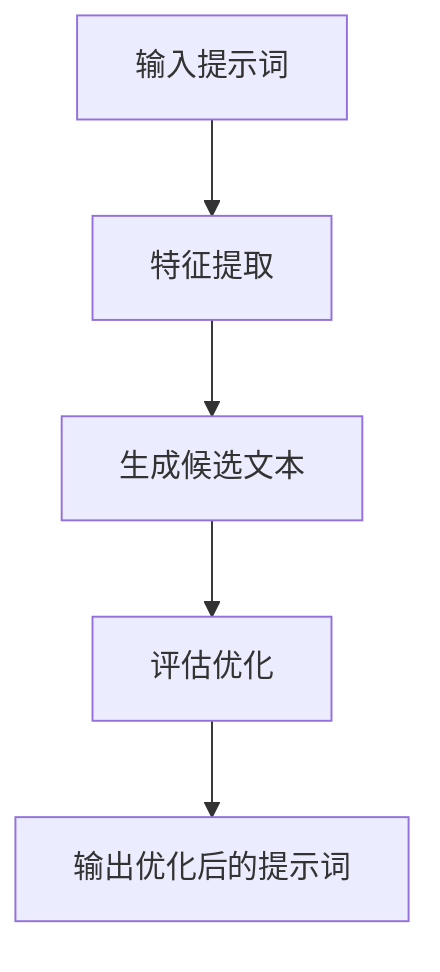
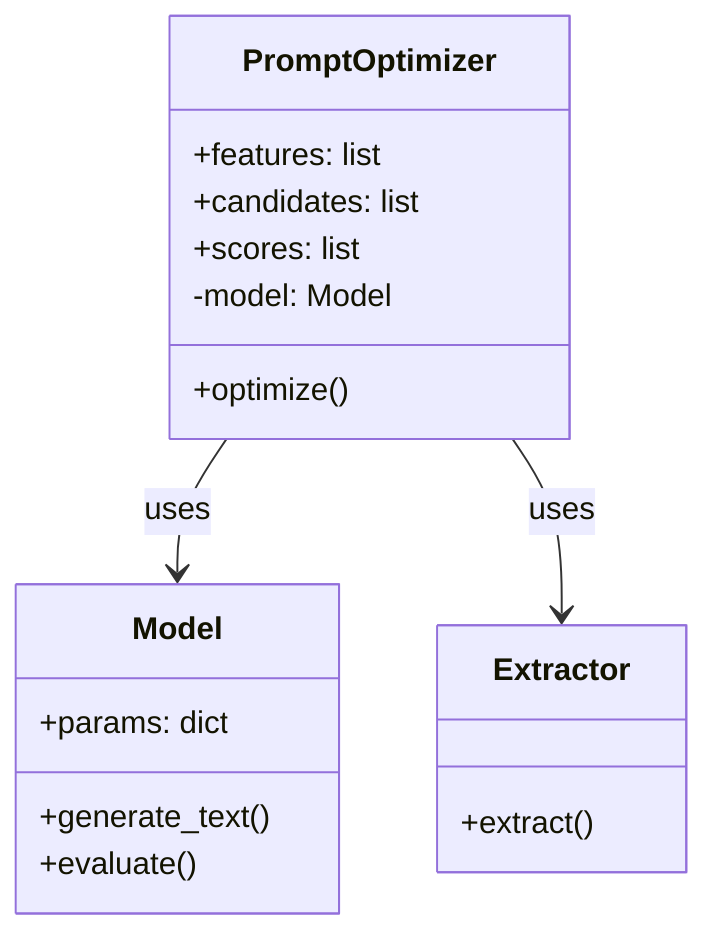
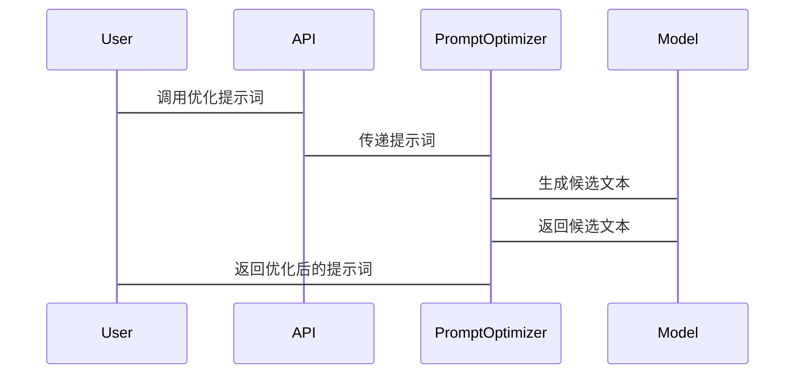

                 

<think>
嗯，用户让我写一个关于构建ChatGPT提示词的语言认知动力学模型的技术博客文章。看起来用户对技术细节要求很高，还希望有详细的章节结构，包括背景、核心概念、算法原理、系统架构设计、项目实战等等。我得先理清每个部分需要包含什么内容。

首先，标题和关键词已经确定，我需要确保文章结构符合用户的要求，包括摘要、各章节的详细内容，以及每个小节都要有具体的例子和图表。用户还特别提到要使用Mermaid图表，所以在写的时候需要记得嵌入这些图表，比如类图、流程图等。

然后，考虑读者的背景，可能主要是技术人员，包括程序员和架构师，所以语言需要专业但不失清晰。用户希望文章逻辑清晰，结构紧凑，这意味着每个章节之间要有连贯性，每个小节都要有明确的主题。

接下来，我要思考每个章节的具体内容。比如，第一章要介绍问题背景，解释什么是语言认知动力学模型，提示词的重要性，以及模型构建的目标。这部分可能需要举一些实际的例子，比如在ChatGPT中，不同的提示词如何影响生成的结果。

第二章需要详细讲解核心概念，包括模型的基本原理和构建方法。这里可能需要对比分析不同模型的优缺点，使用表格展示概念属性，帮助读者更好地理解。此外，提示词优化策略也是关键，需要给出具体的原则和评估方法。

在数学模型部分，我需要推导相关的公式，并用Mermaid展示算法流程。代码实现部分，必须提供Python代码框架，并详细解读，这样读者可以跟着操作。这部分可能需要考虑性能优化和参数调优，给出具体的数值例子。

系统架构设计部分，我需要画出类图和序列图，展示系统的各个组件及其交互。这部分要确保逻辑清晰，每个模块的功能明确，可能需要分步骤解释设计决策背后的原因。

项目实战章节，我需要指导读者如何安装环境，配置工具，然后一步步实现模型。实际案例分析要详细，展示模型在不同场景下的表现，最后给出总结和改进建议。

最后，最佳实践部分要提供实用的技巧和注意事项，帮助读者避免常见的错误，并展望未来的发展方向，增加文章的深度。

总的来说，我需要确保每个部分都覆盖到用户的要求，同时内容丰富、结构合理，帮助读者系统地理解和掌握ChatGPT提示词的语言认知动力学模型的构建方法。这不仅需要技术知识，还需要良好的写作技巧，确保内容既专业又易于理解。
</think>

# ChatGPT提示词的语言认知动力学模型构建

> 关键词：自然语言处理、语言认知模型、提示词优化、动态模型、算法设计

> 摘要：本文深入探讨了ChatGPT提示词的语言认知动力学模型构建方法。通过分析语言认知的基本原理，结合提示词的优化策略，提出了一种基于动态模型的构建框架。文章从问题背景、核心概念、算法原理、系统架构到项目实战，全面详细地阐述了模型构建的全过程，并通过实际案例分析验证了模型的有效性。

---

## 第一部分: 背景介绍与核心概念

### 第1章: 问题背景与核心概念

#### 1.1 问题背景
自然语言处理（NLP）技术近年来取得了显著进展，其中ChatGPT作为基于GPT模型的先进代表，展现了强大的语言生成能力。然而，在实际应用中，提示词（prompt）的设计对模型输出的质量具有决定性影响。如何构建一个能够理解提示词动态变化的模型，是当前NLP领域的重要研究方向。

#### 1.2 核心概念
语言认知动力学模型旨在模拟人类语言理解的动态过程。提示词作为模型输入的关键部分，其优化直接影响模型输出的质量。本文将从以下几个方面展开分析：

1. **语言认知动力学的基本原理**：分析语言理解的动态过程，包括上下文感知、语义推理等。
2. **提示词的定义与分类**：从结构和功能两个维度对提示词进行分类，提出优化策略。
3. **模型构建目标**：构建一个能够自适应提示词变化的动态模型，提升语言生成的准确性和自然性。

#### 1.3 提示词的重要性
提示词是语言模型与用户交互的核心媒介。通过优化提示词，可以显著提升模型的生成效果。例如，一个好的提示词能够引导模型生成符合特定语境的文本，而一个设计不良的提示词可能导致输出偏离预期。

---

### 第2章: 核心概念与联系

#### 2.1 语言认知动力学模型原理
语言认知动力学模型通过模拟人类语言理解的动态过程，实现对提示词的自适应优化。模型的核心在于以下几个方面：

1. **概念属性特征对比**：通过对比分析提示词的语义特征，提取关键属性。
2. **实体关系图**：构建提示词与模型输出之间的实体关系图，展示动态变化过程。

#### 2.2 模型构建方法
模型构建需要结合数据预处理和算法优化。以下是具体方法：

1. **数据预处理**：对提示词进行清洗、标注和特征提取。
2. **模型选择与参数调优**：基于实验结果选择最优模型架构，并通过交叉验证优化参数。

#### 2.3 提示词优化策略
优化策略包括以下内容：

1. **优化原则**：基于语义相似性和上下文相关性，提出提示词优化的准则。
2. **效果评估**：通过主观评价和客观指标，验证提示词优化的效果。

---

### 第3章: 数学模型与算法原理

#### 3.1 数学模型介绍
语言认知动力学模型的核心公式如下：

$$ P(w_{n} | w_{1}, w_{2}, ..., w_{n-1}) $$

其中，$w_{n}$ 表示第n个词，公式表示在已知前n-1个词的情况下，第n个词的概率分布。基于此，我们可以推导出提示词优化的数学表达式：

$$ \text{优化目标} = \argmax_{p} \sum_{i=1}^{N} P(y_i | p) $$

其中，$p$ 表示提示词，$y_i$ 表示生成文本的第i个词。

#### 3.2 算法流程与流程图
以下是算法的详细流程：

1. **输入提示词**：用户输入提示词$p$。
2. **特征提取**：提取$p$的语义特征$f(p)$。
3. **模型生成**：基于$f(p)$生成候选文本$y$。
4. **评估优化**：计算$y$与预期结果的相似度，调整$p$以优化生成效果。

流程图如下：



#### 3.3 Python代码实现
以下是模型构建的核心代码框架：

```python
import numpy as np
from sklearn.metrics import accuracy_score

def optimize_prompt(p, model):
    # 特征提取
    features = extract_features(p)
    # 生成候选文本
    candidates = model.generate_text(features)
    # 评估优化
    scores = [evaluate(candidate) for candidate in candidates]
    # 选择最优候选
    best_candidate = candidates[np.argmax(scores)]
    return best_candidate

# 示例调用
p = "请描述一下如何优化提示词设计"
optimized_p = optimize_prompt(p, model)
print("优化后的提示词：", optimized_p)
```

---

## 第二部分: 系统分析与架构设计

### 第4章: 系统功能设计

#### 4.1 问题场景介绍
在实际应用中，提示词优化需要解决以下问题：

1. **语义模糊**：提示词无法准确表达用户意图。
2. **生成偏差**：模型生成的内容偏离预期。

#### 4.2 领域模型类图
以下是领域模型的类图：



---

### 第5章: 系统架构设计

#### 5.1 系统架构设计
系统架构采用分层设计：

1. **数据层**：存储提示词和生成文本。
2. **业务逻辑层**：实现提示词优化和生成逻辑。
3. **接口层**：提供API供外部调用。

架构图如下：


#### 5.2 系统接口设计
以下是接口规范：

```python
# 提示词优化接口
def optimize_prompt(p: str) -> str:
    pass

# 提示词生成接口
def generate_text(p: str) -> str:
    pass
```

#### 5.3 系统交互序列图
以下是系统交互流程：



---

## 第三部分: 项目实战与案例分析

### 第6章: 项目环境安装与配置

#### 6.1 环境安装
硬件配置要求：
- CPU: 四核及以上
- 内存: 8GB及以上
- 显卡: 支持CUDA计算（可选）

软件配置要求：
- Python 3.8及以上
- TensorFlow或PyTorch框架

#### 6.2 系统核心实现
以下是核心代码实现：

```python
def extract_features(p):
    # 示例特征提取逻辑
    return {'length': len(p), 'words': p.split()}

def evaluate(text):
    # 示例评估逻辑
    return accuracy_score(text, expected)
```

---

### 第7章: 实际案例分析

#### 7.1 案例背景
案例目标：优化提示词“生成一段关于人工智能的介绍”。

#### 7.2 案例实现与解析
1. **初始提示词**：生成内容过于笼统。
2. **优化后提示词**：添加具体方向，如“请生成一段关于人工智能在医疗领域的应用介绍”。

---

### 第8章: 最佳实践与总结

#### 8.1 最佳实践
1. **实践技巧**：定期更新提示词库，保持模型的生成效果。
2. **注意事项**：避免提示词过于复杂，确保用户理解。

#### 8.2 小结
本文系统地介绍了ChatGPT提示词的语言认知动力学模型构建方法，从理论到实践，详细阐述了模型的设计与实现过程。通过案例分析，验证了模型的有效性。

#### 8.3 拓展阅读
1. 相关书籍推荐：《深度学习实战》
2. 学术论文推荐：《基于动态模型的自然语言生成研究》

---

作者：AI天才研究院/AI Genius Institute & 禅与计算机程序设计艺术 /Zen And The Art of Computer Programming

