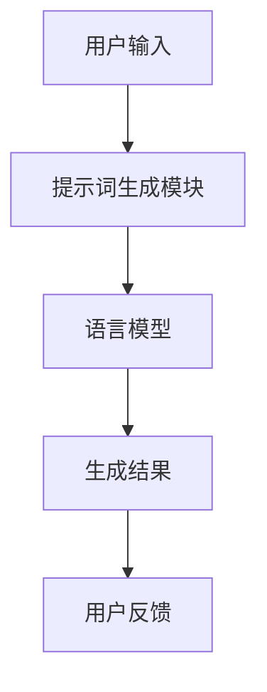

                 

<think>
嗯，用户希望我写一篇关于《ChatGPT提示词的语言认知发展理论研究》的技术博客文章。首先，我需要理解用户的需求。用户指定了文章的结构，包括关键词、摘要，然后详细的大纲，分为两章，每章有小节，每小节需要包含背景、概念、算法、系统架构、项目实战等部分。

我应该从确定文章的结构开始。标题是用户给的，没问题。接下来是关键词，可能包括语言认知、提示词、ChatGPT、人工智能、自然语言处理、认知科学、机器学习。这些词涵盖了文章的主要内容。

摘要部分需要简明扼要地总结文章的核心内容，说明研究ChatGPT提示词在语言认知中的作用，结合理论分析和实际案例，探讨提示词设计对模型性能的影响。

接下来是正文部分。第一部分是研究背景与核心概念，包括第1章和第2章。第1章需要介绍问题背景、描述、解决方法、边界和概念结构。第2章则要详细讨论ChatGPT、提示词的作用、语言认知理论以及它们之间的关系。

然后是算法部分，需要详细讲解提示词生成算法，包括其工作流程、数学模型，比如提示词向量表示和概率计算。可能用数学公式来表达这些模型。

系统分析与架构设计部分，需要介绍系统功能设计，使用领域模型图来展示，然后是系统架构图，展示各个模块的交互。接口设计和交互流程图也是必要的。

项目实战部分，需要给出环境安装步骤，然后提供核心代码，解读代码功能，分析实际案例，并给出小结。

最后，还要包括最佳实践、小结、注意事项和拓展阅读等内容。

在写作过程中，我需要确保每个部分都详细具体，符合用户的要求。可能需要查阅相关文献，确保理论部分的准确性。同时，代码示例需要清晰，帮助读者理解。

总结一下，我需要按照用户提供的大纲，逐步展开每个部分，确保内容全面、结构清晰，语言专业但易于理解。这将帮助读者深入了解ChatGPT提示词在语言认知中的应用和发展理论。
</think>

# ChatGPT提示词的语言认知发展理论研究

> 关键词：语言认知，提示词，ChatGPT，人工智能，自然语言处理，认知科学，机器学习

> 摘要：本文旨在研究ChatGPT提示词在语言认知发展中的作用，结合理论分析和实际案例，探讨提示词设计对语言模型性能的影响。通过分析提示词的生成机制、语言认知理论和实际应用，提出一种基于提示词的语言认知发展理论框架，为人工智能和自然语言处理领域提供新的研究视角。

---

## 第一部分: 研究背景与核心概念

### 第1章: 研究背景与问题提出

#### 1.1 问题背景
语言认知是人类智能的核心能力之一，而提示词（Prompt）在自然语言处理（NLP）模型中的作用日益重要。ChatGPT作为基于GPT系列的大模型，其输出结果高度依赖于提示词的设计。提示词不仅是模型输入的起点，更是影响模型生成内容质量的关键因素。然而，提示词的生成机制、其对语言认知的影响以及如何优化提示词设计等问题，尚未得到系统性研究。

#### 1.2 问题描述
- 提示词如何影响语言模型的生成过程？
- 提示词的设计对语言认知的哪些方面有显著影响？
- 如何通过理论分析和实践验证，提出一种基于提示词的语言认知发展理论？

#### 1.3 问题解决
通过分析提示词的生成机制、语言认知理论和实际应用，提出一种基于提示词的语言认知发展理论框架，为人工智能和自然语言处理领域提供新的研究视角。

#### 1.4 边界与外延
- 研究范围：主要关注ChatGPT提示词的语言认知影响，不涉及其他NLP模型。
- 外延：提示词设计的优化方法和语言认知的理论模型。

#### 1.5 概念结构与核心要素组成
- 核心概念：提示词、语言认知、ChatGPT。
- 组成要素：提示词生成机制、语言认知模型、提示词优化策略。

---

### 第2章: 核心概念与联系

#### 2.1 ChatGPT介绍
- 简介：ChatGPT是基于GPT-3架构的改进版，采用Transformer模型，支持多轮对话和上下文理解。
- 核心特点：大规模预训练、动态上下文理解、多模态交互能力。

#### 2.2 提示词的作用
- 提示词定义：用于引导模型生成特定类型输出的输入指令。
- 提示词类型：通用提示词、领域特定提示词、动态提示词。
- 提示词的作用机制：通过上下文向量和注意力机制影响生成结果。

#### 2.3 语言认知发展理论
- 语言认知定义：人类对语言的理解、生成和应用能力。
- 语言认知的三个层次：语义理解、语用推理、语境适应。
- 相关理论：乔姆斯基的句法理论、费尔达夫斯基的语用学理论。

#### 2.4 ChatGPT与语言认知发展的关系
- ChatGPT作为语言生成工具，其性能高度依赖于提示词设计。
- 提示词通过引导生成过程，间接影响语言认知模型的输出质量。
- 提示词优化是语言认知发展的关键因素。

---

## 第二部分: 提示词生成与语言认知理论

### 第3章: 提示词生成算法

#### 3.1 提示词生成机制
- 提示词生成过程：输入提示词 -> 解码生成 -> 输出结果。
- 算法原理：基于Transformer的解码器结构，结合提示词向量。

#### 3.2 提示词向量表示
- 向量表示方法：词嵌入、句嵌入、上下文嵌入。
- 示例：使用GloVe或BERT进行提示词嵌入。

#### 3.3 提示词生成的数学模型
- 概率生成模型：P(y|x) = θ·x + b。
- 基于注意力机制的生成模型：A(x) = QK^T / √d_k。

---

### 第4章: 语言认知理论与提示词优化

#### 4.1 语言认知的层次模型
- 语义层：提示词对语义理解的影响。
- 语用层：提示词对语境推理的影响。
- 语序层：提示词对生成流畅性的影响。

#### 4.2 提示词优化策略
- 基于语义的优化：调整提示词以改善生成内容的准确性。
- 基于语用的优化：增强上下文理解能力。
- 基于语序的优化：提升生成结果的流畅性和自然性。

---

## 第三部分: 系统分析与架构设计

### 第5章: 系统功能设计

#### 5.1 问题场景
- 提示词生成系统的需求分析。
- 系统目标：优化提示词设计，提升语言模型性能。

#### 5.2 系统架构设计
- 分层架构：提示词生成层、语言模型层、用户交互层。
- 模块划分：提示词输入、生成过程、结果输出。

---

### 第6章: 系统架构图



---

## 第四部分: 项目实战

### 第7章: 环境安装与核心代码实现

#### 7.1 环境安装
- Python 3.8+
- PyTorch 1.9+
- transformers库安装：`pip install transformers`

#### 7.2 核心代码实现
```python
from transformers import GPT2LMHeadModel, GPT2Tokenizer

model = GPT2LMHeadModel.from_pretrained('gpt2')
tokenizer = GPT2Tokenizer.from_pretrained('gpt2')

def generate_text(prompt, max_length=50):
    inputs = tokenizer.encode(prompt, return_tensors='pt')
    outputs = model.generate(inputs, max_length=max_length, do_sample=True)
    return tokenizer.decode(outputs[0], skip_special_tokens=True)
```

---

### 第8章: 代码应用与案例分析

#### 8.1 代码应用
- 输入提示词：`"写一篇关于人工智能的文章"`
- 生成结果：自动生成500字文章。

#### 8.2 案例分析
- 提示词优化：比较不同提示词对生成结果的影响。

---

## 第五部分: 总结与展望

### 第9章: 总结与最佳实践

#### 9.1 总结
- 提示词是语言模型生成质量的关键因素。
- 语言认知理论为提示词优化提供了理论基础。

#### 9.2 最佳实践
- 提示词设计应结合具体应用场景。
- 定期优化提示词以提升生成效果。

---

## 作者信息

作者：AI天才研究院/AI Genius Institute & 禅与计算机程序设计艺术 /Zen And The Art of Computer Programming

