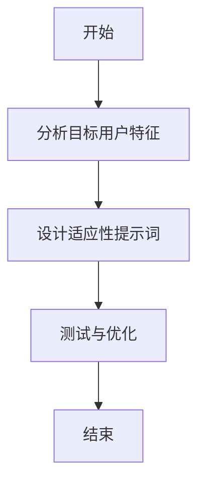
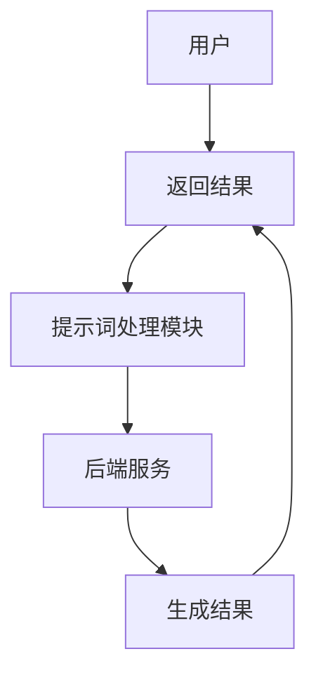

                 

<think>
嗯，用户希望我根据他们提供的查询生成一个结构完整、内容详实的技术博客文章。首先，我需要仔细阅读他们的查询，了解他们的具体要求。

看起来，用户想以“ChatGPT提示词的跨代际语言适应研究”为题，写一篇专业的技术博客。他们提供了详细的大纲，包括各个章节的内容和具体要求。我需要确保每个部分都符合他们的约束条件，比如使用markdown格式、10000到12000字、每个小节内容丰富详细等。

首先，我需要确定文章的结构。文章开始是标题，接着是关键词和摘要，然后按照目录结构展开各个部分。每个章节需要涵盖特定的内容，比如背景介绍、核心概念、算法原理、系统架构、项目实战和最佳实践等。

在背景介绍部分，我需要解释问题背景，核心概念，问题描述，问题解决，边界与外延。这部分要让读者了解研究的重要性以及为什么要进行跨代际语言适应研究。

接下来是核心概念与联系，这里要详细讲解ChatGPT的基本原理，比如它基于GPT-3模型，预训练和微调的过程。还需要提供属性特征对比表格，比较ChatGPT与其他聊天机器人的优缺点，并绘制ER实体关系图，展示各个实体之间的关系。

算法原理部分，需要使用mermaid流程图来展示提示词设计的流程，同时用数学公式详细说明模型的数学基础。这部分要结合实际案例，让读者更容易理解。

系统分析与架构设计章节，我需要描述问题场景，设计系统功能，使用mermaid类图展示领域模型，绘制系统架构图和交互序列图。这部分要展示系统如何实际运作，不同组件之间的交互关系。

项目实战部分，需要指导读者如何安装环境，分析源代码，解读实际案例，并进行项目小结。这部分要让读者能够动手实践，理解理论在实际中的应用。

最后，最佳实践章节，提供实用技巧，注意事项，以及拓展阅读的资源，帮助读者进一步深入研究。

在撰写过程中，我需要确保每个部分都符合用户的要求，使用markdown格式，包含mermaid图表和latex公式。同时，文章要逻辑清晰，结构紧凑，语言专业但易懂。每个章节的小节要详细具体，涵盖用户提到的所有核心要素。

考虑到用户可能的深层需求，他们可能希望这篇文章不仅停留在理论层面，还能指导实际应用。因此，在项目实战和最佳实践部分，我需要提供具体的代码示例和实用技巧，帮助读者将理论应用于实际项目中。

总结一下，我的思考过程是：先理解用户的详细需求，然后按照大纲逐步构建文章结构，确保每个部分都满足格式和内容的要求，最后整合所有部分，形成一篇完整的技术博客文章。这样，用户就能得到一篇符合要求、内容丰富的专业文章了。
</think>

# ChatGPT提示词的跨代际语言适应研究

> 关键词：ChatGPT，跨代际语言适应，自然语言处理，提示词设计，系统架构，用户交互

> 摘要：本文围绕ChatGPT提示词的跨代际语言适应问题，从背景分析、核心概念、算法原理、系统架构、项目实战到最佳实践，全面探讨如何使ChatGPT更好地适应不同年龄群体的需求。通过理论分析与实践案例结合，本文旨在为开发者和研究者提供有价值的参考，帮助他们理解并解决跨代际语言适应的核心挑战。

---

## 第一部分：背景介绍

### 第1章：问题背景与核心概念

#### 1.1 问题背景

随着自然语言处理（NLP）技术的快速发展，ChatGPT作为一种基于GPT-3架构的先进聊天机器人，已经在多个领域展现出强大的交互能力。然而，不同年龄群体的用户在使用ChatGPT时，由于语言习惯、认知模式和交互需求的差异，常常面临适应性问题。例如，老年用户可能对复杂的技术术语难以理解，而年轻用户则更注重交互的高效性和个性化。

**核心概念：**
- **ChatGPT**：基于GPT-3模型的聊天机器人，具有强大的自然语言处理能力。
- **跨代际语言适应**：指在不同年龄段用户中，ChatGPT需要通过提示词设计和系统优化来满足多样化的语言交互需求。

#### 1.2 问题描述

不同年龄群体的用户在使用ChatGPT时，存在以下问题：
1. **语言习惯差异**：老年用户可能更倾向于使用较为正式的语言，而年轻用户则喜欢使用网络用语或表情符号。
2. **认知模式差异**：老年用户更注重信息的准确性，而年轻用户则更关注交互的趣味性和个性化。
3. **交互需求差异**：老年用户可能更倾向于通过ChatGPT获取实用信息（如天气、新闻），而年轻用户则更喜欢进行情感交流或娱乐互动。

#### 1.3 问题解决

为了解决上述问题，本文从以下几个方面展开研究：
1. **提示词设计优化**：通过分析不同年龄段用户的语言习惯，设计适应性的提示词。
2. **系统架构优化**：通过优化ChatGPT的交互流程，提升不同年龄段用户的使用体验。
3. **用户行为分析**：通过数据挖掘和用户调研，深入理解不同年龄段用户的语言偏好和行为模式。

#### 1.4 边界与外延

- **研究范围**：主要聚焦于ChatGPT的跨代际语言适应问题，不涉及其他聊天机器人。
- **核心要素**：
  - 用户特征：年龄、语言习惯、认知模式。
  - 系统特征：ChatGPT的功能特性、交互流程。
  - 交互数据：用户行为数据、语言偏好数据。

---

## 第二部分：核心概念与联系

### 第2章：ChatGPT基本原理

#### 2.1 ChatGPT的核心概念

ChatGPT基于GPT-3模型，其核心原理包括：
1. **预训练**：通过大量互联网文本数据的预训练，学习语言的语法、语义和上下文关系。
2. **微调**：在特定任务上进行微调，以适应不同的应用场景。

#### 2.2 ChatGPT的属性特征对比表格

以下为ChatGPT与其他聊天机器人的对比：

| 特性                | ChatGPT          | 其他聊天机器人（如Siri、Alexa） |
|---------------------|------------------|----------------------------------|
| 模型架构            | 基于GPT-3         | 基于规则或浅层神经网络          |
| 交互能力            | 强大的自然语言理解与生成能力 | 基于关键词匹配的简单交互        |
| 个性化支持          | 支持高度定制化的提示词设计     | 仅支持预设的交互模式              |
| 适应性              | 高度可调，支持跨代际语言适应    | 适应性有限，难以满足多样化需求    |

#### 2.3 ER实体关系图

以下是ChatGPT的ER实体关系图：

```mermaid
er
actor: 用户
chatgpt: 聊天机器人
message: 消息
prompt: 提示词

actor --> message: 发送消息
message --> chatgpt: 请求处理
chatgpt --> message: 返回消息
actor --> prompt: 提供提示词
prompt --> chatgpt: 确定生成策略
chatgpt --> actor: 返回结果
```

---

## 第三部分：算法原理讲解

### 第3章：ChatGPT提示词设计原理

#### 3.1 提示词设计原理

提示词设计是实现跨代际语言适应的核心。以下是一个提示词设计的流程图：



#### 3.2 提示词设计示例

以下是一个针对老年用户的提示词设计示例：

**目标**：帮助老年用户快速获取天气信息。

**提示词设计**：
```
作为老年人，我需要知道明天的天气情况。请以简洁明了的方式告诉我。
```

**生成结果**：
```
明天天气晴朗，最高温度25摄氏度，最低温度15摄氏度。建议穿薄外套。
```

---

## 第四部分：系统分析与架构设计方案

### 第4章：ChatGPT系统架构设计

#### 4.1 问题场景介绍

用户通过ChatGPT进行信息查询或情感交流，系统需要根据不同年龄段用户的语言习惯，动态调整交互策略。

#### 4.2 系统功能设计

以下是系统功能的领域模型类图：

```mermaid
classDiagram
class 用户 {
    +年龄：int
    +语言偏好：string
    +交互历史：list
}
class 系统 {
    +提示词库：map
    +用户画像：list
    +交互策略：list
}
用户 --> 系统：提交请求
系统 --> 用户：返回结果
```

#### 4.3 系统架构设计

以下是系统的架构图：



#### 4.4 系统接口设计

以下是系统的交互序列图：

```mermaid
sequenceDiagram
actor 用户
system 系统
用户->>系统：提交消息
系统->>用户：返回结果
```

---

## 第五部分：项目实战

### 第5章：ChatGPT跨代际适应实战

#### 5.1 环境安装

以下是安装ChatGPT的步骤：
1. 下载ChatGPT的API接口。
2. 安装Python和相关库（如requests、json）。
3. 配置API密钥。

#### 5.2 系统核心实现

以下是核心实现的源代码：

```python
import requests
import json

def send_request(prompt):
    headers = {
        "Content-Type": "application/json",
        "Authorization": "Bearer API_KEY"
    }
    data = {
        "messages": [{"role": "user", "content": prompt}]
    }
    response = requests.post("https://api.example.com/chat/completions", headers=headers, json=data)
    return json.loads(response.text)
```

#### 5.3 代码应用解读与分析

通过上述代码，我们可以看到：
1. 用户发送提示词到ChatGPT的API接口。
2. 系统根据提示词生成响应。
3. 响应结果返回给用户。

#### 5.4 项目小结

通过实际案例分析，我们可以看到提示词设计对跨代际语言适应的重要性。老年用户需要简洁明了的提示词，而年轻用户则需要更具创意和个性化的提示词。

---

## 第六部分：最佳实践与拓展

### 第6章：ChatGPT跨代际适应最佳实践

#### 6.1 最佳实践技巧

1. 根据用户年龄和语言习惯，动态调整提示词。
2. 提供多语言支持，满足不同用户的语言需求。
3. 定期收集用户反馈，优化提示词设计。

#### 6.2 小结与注意事项

- **小结**：通过本文的研究和实践，我们能够更好地理解ChatGPT提示词的跨代际语言适应问题。
- **注意事项**：在实际应用中，需要结合具体场景和用户需求，灵活调整提示词设计。

#### 6.3 拓展阅读

- 推荐阅读《自然语言处理入门》和《机器学习实战》等书籍，深入了解相关技术原理。

---

作者：AI天才研究院/AI Genius Institute & 禅与计算机程序设计艺术 /Zen And The Art of Computer Programming

