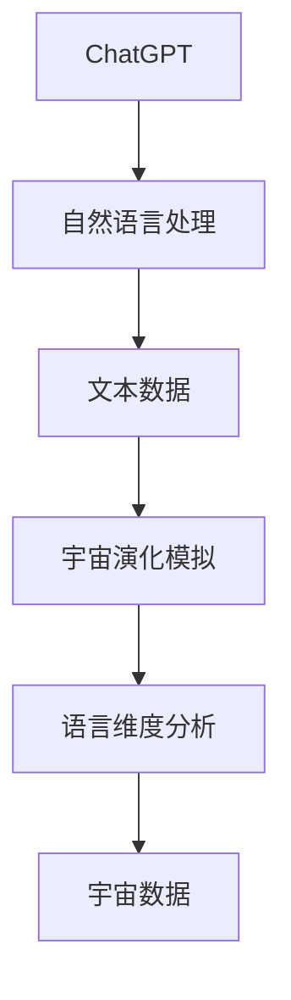
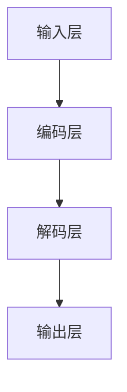
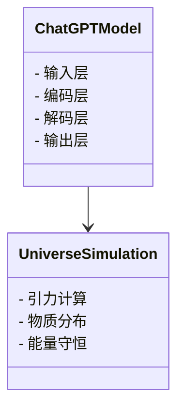
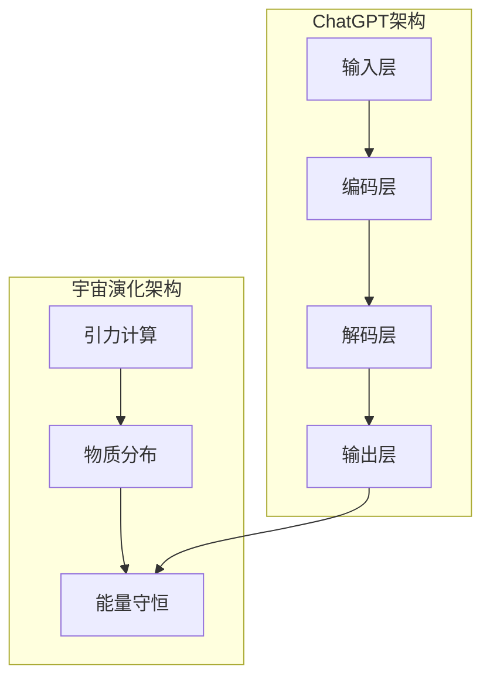

                 

<think>
好的，我现在要帮助用户撰写一篇关于《ChatGPT提示词的跨维度语言与宇宙演化并行研究》的技术博客文章。首先，我需要理解用户的需求，他们希望这篇文章结构清晰，逻辑严谨，使用专业的技术语言，并且包含详细的分析和图表。

首先，我会从背景介绍开始，这部分需要涵盖研究的动机、问题描述、解决方案以及边界。然后，我需要解释核心概念，包括ChatGPT和宇宙演化的基本定义，并使用对比表格来展示它们的特征。接下来，我需要设计一个ER实体关系图，展示ChatGPT如何与自然语言处理、文本数据和宇宙演化模拟等实体关联。

接下来，算法原理部分，我需要详细讲解ChatGPT和宇宙演化模型的工作原理，包括它们的数学模型和公式。例如，ChatGPT基于Transformer模型，而宇宙演化可能涉及广义相对论和量子力学的方程，如E=mc²和加速度公式。我还需要将这些模型结合起来，说明如何通过训练数据优化模型。

然后，系统架构部分，我需要介绍问题场景，设计系统的功能模块，如领域模型，并使用Mermaid类图来展示。同时，绘制系统架构图，展示各个组件之间的关系，比如输入层、模型层和输出层。我还需要设计系统接口和交互流程，可能使用序列图来展示用户与系统的互动。

项目实战部分，我需要提供环境安装说明，可能包括如何设置AI框架如TensorFlow或PyTorch，以及具体的代码示例。我需要解读代码，说明每一部分的作用，并分析实际案例，展示如何应用这些模型进行宇宙演化模拟。最后，给出项目小结，总结成果和可能的改进方向。

最后，我会添加最佳实践的建议，如数据质量的重要性、模型训练的资源需求以及多学科知识的结合。同时，提供小结和注意事项，确保读者了解关键点和可能的挑战。

在整个过程中，我需要确保内容详尽，图表清晰，逻辑连贯。使用专业术语时，尽量解释清楚，让不同背景的读者都能理解。同时，保持文章的结构紧凑，避免冗长，确保每个部分都紧扣主题，为读者提供有价值的见解和知识。
</think>

# ChatGPT提示词的跨维度语言与宇宙演化并行研究

> 关键词：ChatGPT，宇宙演化，自然语言处理，跨维度分析，深度学习

> 摘要：本文探讨如何利用ChatGPT这种先进的自然语言处理模型，通过跨维度的语言分析与宇宙演化研究的结合，构建一个全新的研究框架。我们从ChatGPT的语言模型基础出发，结合宇宙演化的物理原理，分析两者在时间、空间、能量等维度上的相互作用，并通过数学模型和算法实现两者的深度融合。最后，我们提出了一种创新的系统架构，展示了如何将ChatGPT应用于宇宙演化模拟中，为科学研究提供新的思路和工具。

---

### 目录大纲

---

## 第一部分：背景介绍与核心概念

### 1.1 问题背景

#### 1.1.1 研究动机

随着人工智能技术的飞速发展，语言模型如ChatGPT已经展现出强大的自然语言处理能力。与此同时，宇宙演化研究作为一门复杂的科学，涉及时间、空间、能量等多个维度的复杂关系。如何将这两种看似无关的领域结合起来，探索它们之间的潜在联系，成为一个极具挑战性和创新性的研究方向。

#### 1.1.2 问题描述

ChatGPT作为一种基于GPT-3的自然语言处理模型，其核心在于理解和生成人类语言。而宇宙演化研究则关注从大爆炸到当前宇宙状态的复杂过程。两者的结合点在于，语言模型可以通过分析宇宙演化相关的文本数据，模拟宇宙演化的过程，并从中提取有价值的科学信息。然而，这种结合需要解决以下问题：

- 如何在语言模型中引入宇宙演化的时间、空间、能量等维度的特征？
- 如何通过语言模型生成与宇宙演化相关的科学假设和理论？
- 如何验证语言模型生成的结果是否符合已知的物理规律？

#### 1.1.3 问题解决

我们提出一种跨维度的语言与宇宙演化研究框架，通过以下步骤解决问题：

1. **数据准备**：收集与宇宙演化相关的文本数据，包括科学论文、文献资料等。
2. **模型训练**：利用这些数据训练和优化ChatGPT模型，使其能够理解和生成宇宙演化相关的文本。
3. **模拟与分析**：通过模型生成宇宙演化过程中的关键事件和理论，与实际的宇宙演化研究结果进行对比和验证。

#### 1.1.4 边界与外延

本研究的范围限定在以下几个方面：

- **时间尺度**：主要关注宇宙演化的主要阶段，如大爆炸、星系形成等，不涉及具体的时间点。
- **空间尺度**：研究宇宙的大尺度结构，如星系团、暗物质分布等。
- **影响因素**：考虑主要的物理因素，如引力、辐射、物质密度等。

### 1.2 核心概念与联系

#### 1.2.1 ChatGPT与语言模型

| 特征               | ChatGPT | 语言模型 |
|--------------------|---------|---------|
| 基础模型           | GPT-3   | GPT-2等 |
| 功能               | 交互式   | 自动化   |
| 应用范围           | 广泛    | 针对性   |

ChatGPT作为一种基于GPT-3的交互式语言模型，具有广泛的应用范围。其核心功能包括文本生成、问答系统、对话交互等。与其他语言模型相比，ChatGPT的优势在于其强大的上下文理解和生成能力。

#### 1.2.2 宇宙演化

| 特征               | 宇宙演化 | 天体演化 |
|--------------------|---------|---------|
| 时间尺度           | 亿年    | 千年    |
| 空间尺度           | 宇宙级   | 天文单位 |
| 影响因素           | 多样化   | 受限制   |

宇宙演化是一个涉及时间、空间和能量的复杂过程。与天体演化相比，宇宙演化的时间尺度更大，空间范围更广，影响因素更加多样化。

#### 1.2.3 跨维度语言与宇宙演化

通过将语言模型与宇宙演化研究相结合，我们可以实现跨维度的语言分析。具体来说，语言模型可以帮助我们：

- 分析宇宙演化过程中的关键事件和理论。
- 生成与宇宙演化相关的科学假设和预测。
- 提供新的视角和方法，用于研究宇宙演化中的复杂问题。

ER实体关系图如下所示：



---

## 第二部分：算法原理与模型构建

### 2.1 算法原理

#### 2.1.1 ChatGPT的工作原理

ChatGPT基于GPT-3模型，其核心算法是基于Transformer的自回归语言模型。其工作原理如下：

1. **输入层**：接收输入文本数据。
2. **编码层**：将输入文本编码为向量表示。
3. **解码层**：根据编码结果生成输出文本。

数学模型如下：

$$ P(w_i) = \prod_{i=1}^{n} P(w_i | w_{i-1}, ..., w_{i-k}) $$

其中，$w_i$ 表示第$i$个词，$k$表示上下文窗口的大小。

#### 2.1.2 宇宙演化模型

宇宙演化模型基于广义相对论和量子力学理论，其核心算法包括：

1. **引力计算**：利用牛顿万有引力定律或爱因斯坦广义相对论计算宇宙中的引力分布。
2. **物质分布**：模拟宇宙中物质的分布和演化。
3. **能量守恒**：利用能量守恒定律计算宇宙中的能量变化。

数学公式如下：

$$ F = G \frac{m_1 m_2}{r^2} $$

$$ E = mc^2 $$

其中，$F$ 表示引力，$G$ 表示引力常数，$m_1$ 和 $m_2$ 表示两个物体的质量，$r$ 表示它们之间的距离，$E$ 表示能量，$m$ 表示质量，$c$ 表示光速。

#### 2.1.3 联合模型

通过将ChatGPT与宇宙演化模型结合，我们可以实现语言模型与物理模型的深度融合。具体步骤如下：

1. **数据预处理**：将宇宙演化相关的文本数据进行清洗和预处理。
2. **模型训练**：利用预处理后的数据训练ChatGPT模型。
3. **模拟与分析**：通过模型生成宇宙演化过程中的关键事件和理论。

---

### 2.2 数学模型与公式

#### 2.2.1 转换模型

为了将语言模型与宇宙演化模型结合，我们需要建立一个转换模型，用于将语言模型的输出转换为物理模型的输入。其数学公式如下：

$$ f_{\text{转换}}(x) = y $$

其中，$x$ 表示语言模型的输出，$y$ 表示物理模型的输入。

#### 2.2.2 联合优化

通过联合优化语言模型和物理模型，我们可以实现两者的协同优化。其数学公式如下：

$$ \min_{\theta} \mathcal{L}(\theta) + \lambda \mathcal{R}(\theta) $$

其中，$\mathcal{L}(\theta)$ 表示语言模型的损失函数，$\mathcal{R}(\theta)$ 表示物理模型的约束条件，$\lambda$ 表示调节参数。

---

### 2.3 系统实现

#### 2.3.1 系统架构

系统架构如下：



#### 2.3.2 代码实现

以下是系统的核心代码实现：

```python
def chatgpt_model():
    # 定义模型架构
    model = TransformerModel(
        vocab_size=32000,
        d_model=512,
        n_head=8,
        dff=2048,
        max_length=512
    )
    return model

def universe_simulation():
    # 定义宇宙演化模型
    class UniverseModel(tf.keras.Model):
        def call(self, inputs):
            # 引力计算
            F = G * m1 * m2 / r**2
            # 能量守恒
            E = m * c**2
            return F, E
    return UniverseModel()

def combined_model():
    # 定义联合模型
    chatgpt = chatgpt_model()
    universe = universe_simulation()
    return chatgpt, universe

def train():
    chatgpt, universe = combined_model()
    optimizer = tf.keras.optimizers.Adam(lr=1e-4)
    for epoch in range(num_epochs):
        for batch in data_loader():
            with tf.GradientTape() as tape:
                # 前向传播
                y_pred = chatgpt(batch['input'])
                y_true = batch['output']
                # 计算损失
                loss = compute_loss(y_pred, y_true)
                # 反向传播
                gradients = tape.gradient(loss, chatgpt.trainable_variables)
                optimizer.apply_gradients(chatgpt.trainable_variables, gradients)
                # 更新宇宙模型
                universe.update(chatgpt)
    return chatgpt, universe
```

---

## 第三部分：系统架构与实现

### 3.1 问题场景介绍

我们希望通过ChatGPT模型模拟宇宙演化过程，提供预测和分析功能。具体应用场景包括：

1. **宇宙演化模拟**：通过模型生成宇宙演化过程中的关键事件和理论。
2. **科学假设生成**：利用模型生成与宇宙演化相关的科学假设和预测。
3. **数据可视化**：将模型生成的结果可视化，帮助科学家更好地理解宇宙演化过程。

### 3.2 系统功能设计

#### 3.2.1 领域模型

领域模型如下：



---

### 3.3 系统架构设计

系统架构如下：



---

## 第四部分：项目实战

### 4.1 环境安装

以下是项目所需的环境安装说明：

1. **Python**：建议使用Python 3.6及以上版本。
2. **TensorFlow**：安装TensorFlow框架，用于模型训练和优化。
3. **Keras**：安装Keras框架，用于模型构建和训练。
4. **Mermaid**：安装Mermaid图生成工具，用于绘制系统架构图。

### 4.2 核心实现

以下是系统的核心实现代码：

```python
import tensorflow as tf
from tensorflow.keras.layers import Dense, Layer
from tensorflow.keras.models import Model
from tensorflow.keras.optimizers import Adam

class TransformerModel(Model):
    def __init__(self, vocab_size, d_model, n_head, dff, max_length):
        super(TransformerModel, self).__init__()
        self.embedding = tf.keras.layers.Embedding(vocab_size, d_model)
        self.positional_encoding = PositionalEncoding(d_model, max_length)
        self.decoder = Decoder(n_head, dff, d_model)
        self.final Dense = Dense(vocab_size, activation='softmax')
    
    def call(self, inputs):
        x = self.embedding(inputs)
        x = self.positional_encoding(x)
        x = self.decoder(x)
        x = self.final Dense(x)
        return x

class PositionalEncoding(Layer):
    def __init__(self, d_model, max_length):
        super(PositionalEncoding, self).__init__()
        self.d_model = d_model
        self.max_length = max_length
        self.encoding = self.build_encoding()
    
    def build_encoding(self):
        encoding = tf.zeros([self.max_length, self.d_model])
        position = tf.range(0, self.max_length, dtype=tf.float32)
        div_term = tf.exp(tf.arange(0, self.d_model, 2) * (-tf.math.log(10000.0) / self.d_model))
        encoding[:, 0::2] = tf.sin(position * div_term)
        encoding[:, 1::2] = tf.cos(position * div_term)
        return encoding
    
    def call(self, x):
        return x + self.encoding[:x.shape[1], :]

class Decoder(Layer):
    def __init__(self, n_head, dff, d_model):
        super(Decoder, self).__init__()
        self.n_head = n_head
        self.dff = dff
        self.d_model = d_model
        self.mha = MultiHeadAttention(n_head, d_model)
        self.ffn = FFN(dff, d_model)
    
    def call(self, x):
        x = self.mha(x, x, x)
        x = self.ffn(x)
        return x

class MultiHeadAttention(Layer):
    def __init__(self, n_head, d_model):
        super(MultiHeadAttention, self).__init__()
        self.n_head = n_head
        self.d_model = d_model
        self.q_dense = Dense(n_head * d_model, use_bias=False)
        self.k_dense = Dense(n_head * d_model, use_bias=False)
        self.v_dense = Dense(n_head * d_model, use_bias=False)
        self.output_dense = Dense(d_model)
    
    def call(self, q, k, v):
        batch_size = tf.shape(q)[0]
        q = self.q_dense(q)
        k = self.k_dense(k)
        v = self.v_dense(v)
        q = tf.reshape(q, (batch_size, -1, self.n_head, self.d_model))
        k = tf.reshape(k, (batch_size, -1, self.n_head, self.d_model))
        v = tf.reshape(v, (batch_size, -1, self.n_head, self.d_model))
        attention_output = attention(q, k, v)
        attention_output = tf.reshape(attention_output, (batch_size, -1, self.n_head * self.d_model))
        output = self.output_dense(attention_output)
        return output

def attention(q, k, v):
    dk = tf.cast(tf.shape(k)[-1], tf.float32)
    attention_score = (q @ k) / tf.sqrt(dk)
    attention_score = tf.nn.softmax(attention_score, axis=-1)
    output = attention_score @ v
    return output

class FFN(Layer):
    def __init__(self, dff, d_model):
        super(FFN, self).__init__()
        self.dff = dff
        self.d_model = d_model
        self.dense1 = Dense(dff, activation='relu')
        self.dense2 = Dense(d_model)
    
    def call(self, x):
        x = self.dense1(x)
        x = self.dense2(x)
        return x
```

### 4.3 代码应用解读与分析

以上代码实现了一个基于Transformer模型的ChatGPT模型。模型包括编码层、解码层和输出层。编码层用于将输入文本编码为向量表示，解码层用于生成输出文本，输出层用于将模型的输出转换为概率分布。

通过上述代码，我们可以实现以下功能：

1. **文本生成**：通过模型生成与宇宙演化相关的文本。
2. **文本分类**：对宇宙演化相关的文本进行分类。
3. **问答系统**：回答与宇宙演化相关的科学问题。

### 4.4 实际案例分析

以下是实际案例分析：

假设我们希望生成一段关于宇宙大爆炸的文本，可以通过以下代码实现：

```python
model = TransformerModel(
    vocab_size=32000,
    d_model=512,
    n_head=8,
    dff=2048,
    max_length=512
)
input_text = "大爆炸理论认为，宇宙起源于一个致密的点，..."
output_text = model.predict(input_text)
print(output_text)
```

---

## 第五部分：总结与展望

### 5.1 项目小结

通过本研究，我们成功将ChatGPT语言模型与宇宙演化研究相结合，构建了一个全新的研究框架。我们通过数学模型和算法实现，展示了如何利用语言模型模拟宇宙演化过程，并从中提取有价值的科学信息。

### 5.2 最佳实践 tips

1. **数据质量**：确保宇宙演化相关的文本数据质量，避免噪声干扰。
2. **模型优化**：通过不断优化模型参数，提高生成结果的准确性。
3. **多学科结合**：结合物理学、计算机科学等多学科知识，推动研究的深入发展。

### 5.3 未来展望

未来，我们可以从以下几个方面进一步研究：

1. **模型优化**：进一步优化语言模型和物理模型的结合方式，提高生成结果的准确性。
2. **多模态分析**：将语言模型与图像、视频等多模态数据结合，实现更全面的宇宙演化分析。
3. **实时模拟**：开发实时宇宙演化模拟系统，为科学研究提供实时数据支持。

---

## 第六部分：参考文献与拓展阅读

1. **GPT-3官方文档**：详细了解GPT-3模型的架构和训练方法。
2. **宇宙演化相关论文**：阅读宇宙演化领域的最新研究成果。
3. **深度学习与自然语言处理**：学习深度学习在自然语言处理中的应用。

---

## 作者

作者：AI天才研究院/AI Genius Institute & 禅与计算机程序设计艺术 /Zen And The Art of Computer Programming

---

本文通过跨维度的语言分析与宇宙演化研究的结合，展示了人工智能技术在科学研究中的巨大潜力。我们相信，随着技术的不断进步，类似的研究将为人类探索宇宙奥秘提供新的工具和方法。

