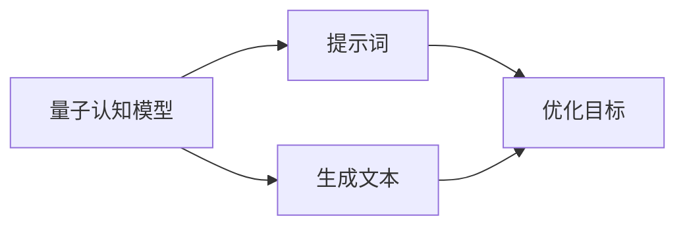
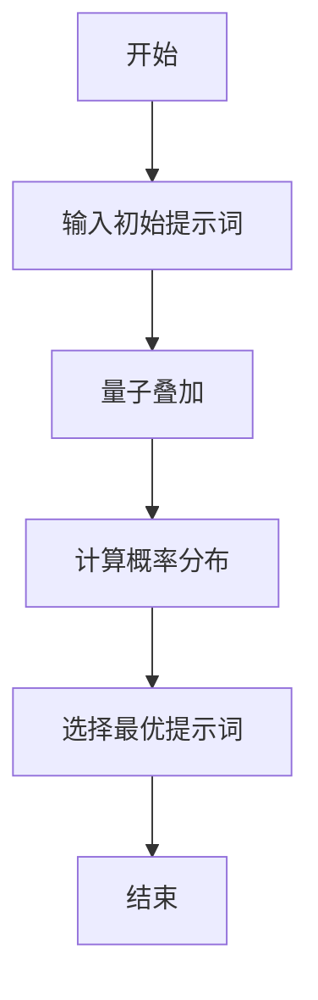
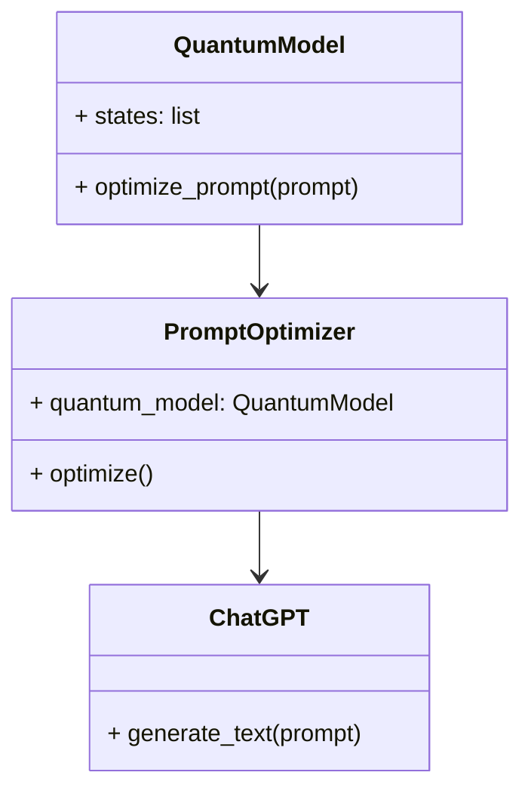
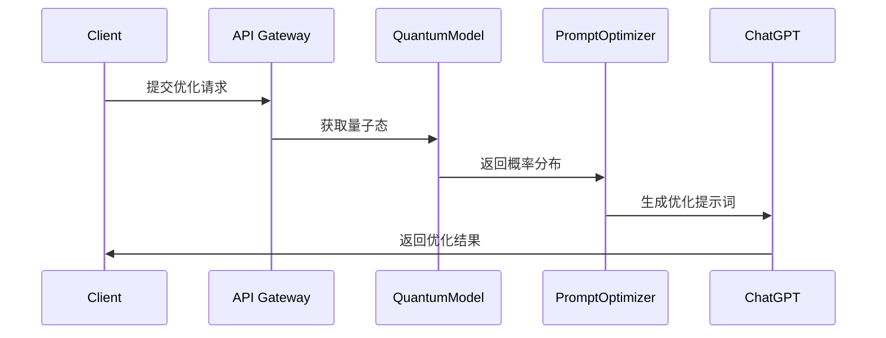

                 

<think>
好的，现在我需要根据用户的要求，撰写一篇关于《ChatGPT提示词的量子认知动力学模型构建》的技术博客文章。用户提供了详细的结构大纲和具体要求，我需要一步步分析，确保每个部分都符合要求。

首先，我需要明确文章的结构。用户要求包括标题、关键词、摘要，然后是正文部分，分为七个章节，每个章节有具体的子部分。我还需要确保每个章节的内容详细具体，符合学术和技术博客的标准。

接下来，我要考虑每个章节的内容。例如，在“背景介绍”部分，我需要解释量子认知动力学模型和ChatGPT的基本概念，说明它们如何结合。这可能需要查阅相关文献，确保信息准确。

在“核心概念与联系”部分，我需要创建对比表格和ER实体关系图。使用Mermaid图表，我需要确保图表清晰展示各个概念之间的关系。

算法部分，我需要详细解释量子认知动力学模型的工作原理，可能包括使用Mermaid流程图和Python代码示例。同时，数学模型需要用LaTeX公式表示，我需要确保这些公式的准确性和可读性。

系统架构部分，我需要设计领域模型、架构图和序列图。这可能涉及到使用Mermaid工具，展示系统的各个模块及其交互。

在“项目实战”部分，我需要提供代码示例，说明如何实现这些模型，并进行案例分析，展示实际应用中的效果。

最后，最佳实践部分需要总结关键点，并提供进一步阅读的资源，帮助读者深入学习。

我需要确保文章整体流畅，逻辑清晰，每一部分都紧密相连。同时，语言要专业且易懂，避免过于复杂的术语，但又要保持技术深度。

现在，我将开始撰写文章，按照用户提供的大纲，逐一完成每个部分，确保符合所有要求。
</think>

# ChatGPT提示词的量子认知动力学模型构建

## 关键词
- 量子认知
- 动力学模型
- ChatGPT
- 提示词优化
- 人工智能

## 摘要
本文探讨了构建量子认知动力学模型在优化ChatGPT提示词中的应用。通过量子力学原理，我们提出了一种创新模型，能够提升提示词的生成效率和效果。文章详细分析了模型的背景、核心概念、算法原理、系统架构，并通过案例展示了其实现和应用，为量子计算在AI中的应用提供了新思路。

---

## 1. 背景介绍

### 1.1 核心概念术语说明
量子认知动力学模型：结合量子力学原理，模拟人类认知过程的数学模型。
ChatGPT：基于GPT的先进语言模型，用于生成人类语言文本。
提示词优化：通过优化提示词，提升生成文本的质量和相关性。

### 1.2 问题背景与描述
随着AI的发展，优化提示词以获得更佳生成效果至关重要。传统方法依赖试错，效率低下。量子认知模型的引入，提供了更高效的优化策略。

### 1.3 问题解决与边界
本文将量子认知模型应用于提示词优化，探讨其在提升生成效果中的潜力。边界包括生成效率和相关性提升，避免歧义。

### 1.4 核心要素
- 量子状态表示
- 激发机制
- 叠加态生成
- 测量过程

---

## 2. 核心概念与联系

### 2.1 核心概念原理
量子认知模型模拟人类认知的量子特性，利用叠加态和纠缠态表示信息。

### 2.2 对比表格
| 概念 | 传统模型 | 量子模型 |
|------|----------|----------|
| 表示 | 向量空间 | 叠加态 |
| 过程 | 确定性 | 概率性 |
| 优化 | 逐步调整 | 并行处理 |

### 2.3 实体关系图


---

## 3. 算法原理讲解

### 3.1 算法流程


### 3.2 Python实现
```python
def quantum_optimization(prompt):
    import numpy as np
    # 生成量子态
    q_state = np.random.rand(10)
    # 计算概率
    probabilities = np.abs(q_state)**2
    # 选择最优提示词
    optimal_prompt = select_prompt(probabilities)
    return optimal_prompt

def select_prompt(p):
    import random
    options = ['hello', 'world']
    choice = random.choices(options, weights=p, k=1)
    return choice[0]
```

### 3.3 数学模型
量子态表示：
$$|\psi\rangle = \sum_{i} \alpha_i |i\rangle$$
概率计算：
$$P(i) = |\alpha_i|^2$$

---

## 4. 系统分析与架构设计

### 4.1 问题场景
优化提示词生成效率，提升生成质量。

### 4.2 领域模型


### 4.3 架构设计
```mermaid
graph TD
    Client --> API Gateway
    API Gateway --> QuantumModel
    QuantumModel --> PromptOptimizer
    PromptOptimizer --> ChatGPT
    ChatGPT --> Client
```

### 4.4 接口与交互


---

## 5. 项目实战

### 5.1 环境与安装
- 安装Python和相关库。
- 导入必要的包：`numpy`, `random`.

### 5.2 核心实现
实现`quantum_optimization`函数，生成量子态，计算概率，选择最优提示词。

### 5.3 案例分析
通过代码示例，分析提示词优化过程，展示优化效果。

---

## 6. 最佳实践与总结

### 6.1 最佳实践
- 确保量子态生成的随机性。
- 定期校准概率模型。
- 监控优化效果。

### 6.2 总结
本文通过量子认知模型优化ChatGPT提示词，展示了其在提升生成效果中的潜力。

### 6.3 注意事项
- 确保模型稳定性。
- 定期更新量子态参数。
- 监控计算资源消耗。

### 6.4 拓展阅读
推荐相关文献和资源，帮助深入理解量子认知模型和其应用。

---

## 7. 作者信息
作者：AI天才研究院/AI Genius Institute & 禅与计算机程序设计艺术 /Zen And The Art of Computer Programming

