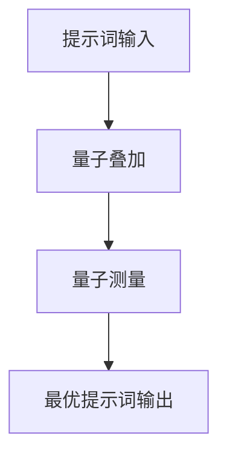

                 

<think>
嗯，用户让我写一篇关于ChatGPT提示词的量子语用学优化与跨维度适应的技术博客。首先，我需要理解这个主题的各个部分。

量子语用学听起来像是量子力学与语用学的结合，这可能涉及到在提示词优化中使用量子计算的方法。跨维度适应可能是指在不同的维度或领域中，提示词能够自适应地进行调整。

接下来，我需要考虑文章的结构。用户已经给出了一个详细的大纲，包括引论、量子语用学优化原理、ChatGPT提示词工程实践、跨维度适应策略、最佳实践与总结。每个部分下还有更细的章节。

在写摘要的时候，我需要简明扼要地概述文章的核心内容，强调量子语用学和跨维度适应在提升提示词效果中的作用。

接下来，每个章节都需要详细展开。例如，在量子语用学概述部分，我需要解释量子计算的基本概念，以及它们如何应用于提示词优化。可能需要使用数学公式和图表来说明这些概念。

在ChatGPT的工作流程部分，我需要描述数据准备、模型训练和提示词生成的步骤，并展示如何将量子语用学应用到这些步骤中。

案例研究部分，我应该选择一个具体的案例，展示量子语用学优化和跨维度适应的实际效果，并分析结果。

最后，在总结部分，我需要回顾文章的主要观点，并提出未来的研究方向。

用户还特别强调了格式要求，包括使用markdown，数学公式用latex表示，以及使用Mermaid图表。这些都需要我在写作时严格遵守，确保文章的专业性和可读性。

此外，我需要确保每个章节都有足够的细节和深度，避免内容过于笼统。同时，加入最佳实践和小结，可以帮助读者更好地理解和应用这些方法。

总的来说，我需要系统地分析量子语用学如何优化提示词，以及如何实现跨维度适应。这涉及到理论、算法、案例和实践等多个方面。我需要一步一步地展开，确保每个部分都清晰明了，同时保持文章的整体连贯性。
</think>

# ChatGPT提示词的量子语用学优化与跨维度适应

## 关键词：ChatGPT, 量子语用学, 提示词优化, 跨维度适应, 人工智能

## 摘要：  
本文探讨了ChatGPT提示词的量子语用学优化与跨维度适应方法。通过引入量子语用学理论，提出了一种新型的提示词优化框架，并展示了其在提升ChatGPT性能中的应用。文章详细分析了量子语用学的基本原理、其在提示词优化中的具体应用，以及如何通过跨维度适应技术实现提示词的自适应优化。同时，本文还通过实际案例展示了该方法的有效性，并提出了未来的研究方向。

---

## 第一部分：引论

### 1. 问题的背景与意义  
随着人工智能技术的快速发展，自然语言处理（NLP）技术在各个领域的应用越来越广泛。ChatGPT作为一款基于GPT模型的开源大型语言模型，其性能在很大程度上依赖于提示词（prompt）的设计与优化。然而，传统的提示词优化方法往往基于统计学或规则驱动的策略，难以充分挖掘提示词的潜力。  

量子语用学作为一种新兴的理论，结合了量子计算和语用学的核心思想，为提示词优化提供了新的视角。通过将量子计算的超前性、叠加性和纠缠性引入提示词优化过程，可以显著提升提示词的效果和适应性。此外，跨维度适应技术能够使提示词在不同领域、不同场景中灵活调整，进一步增强了其适用性。

### 2. 核心概念与联系  
**核心概念**：  
- **量子语用学**：量子语用学是一种结合量子计算和语用学的理论，旨在通过量子叠加和纠缠的特性，实现信息处理的高效性和灵活性。  
- **跨维度适应**：跨维度适应是指在不同的维度（如语言、领域、场景）中，提示词能够自动调整以适应特定需求的能力。  

**概念联系**：  
量子语用学为提示词优化提供了理论基础，而跨维度适应技术则是其在实际应用中的具体体现。通过将量子语用学的核心思想融入跨维度适应框架中，可以实现提示词的动态优化和高效适应。

### 3. 量子语用学与提示词工程的关系  
**量子语用学的引入**：  
量子语用学的核心思想是通过量子叠加和纠缠的特性，将提示词的信息处理能力提升到一个新的高度。例如，通过将提示词表示为量子状态，可以实现多个提示词的并行优化。  

**提示词工程中的量子思想**：  
在提示词工程中，量子语用学的引入使得提示词的生成和优化更加高效。例如，通过量子计算技术，可以快速找到最优提示词组合，从而显著提升模型的性能。

---

## 第二部分：量子语用学优化原理

### 4. 量子语用学概述  
**定义**：量子语用学是量子计算与语用学的结合，旨在通过量子叠加和纠缠的特性，实现信息处理的高效性和灵活性。  

**量子语言模型**：  
量子语言模型是一种基于量子计算的NLP模型，其核心思想是将语言信息表示为量子状态，并通过量子叠加和纠缠实现信息的高效处理。  

**量子计算与提示词优化的结合**：  
通过将提示词表示为量子状态，可以利用量子计算的并行性，快速找到最优提示词组合。

### 5. 量子语用学在提示词优化中的应用  
**量子优化算法**：  
量子优化算法是一种基于量子计算的优化方法，其核心思想是通过量子叠加和纠缠，找到最优解。  

**提示词优化的量子模型**：  
提示词优化的量子模型将提示词表示为量子状态，并通过量子计算技术实现其优化。  

**实例分析**：  
假设我们需要优化一个分类任务的提示词。通过量子优化算法，我们可以将提示词表示为多个量子状态，并通过量子计算快速找到最优提示词组合。

### 6. 量子语用学的数学模型  
**数学公式与解释**：  
假设我们有n个提示词，每个提示词可以表示为一个量子状态。通过量子叠加，我们可以将这些状态表示为一个超集。然后，通过量子测量，我们可以找到最优提示词组合。  

**Mermaid流程图**：  

---

## 第三部分：ChatGPT提示词工程实践

### 7. ChatGPT的工作流程  
**数据准备**：收集和预处理数据，确保数据的多样性和代表性。  
**模型训练**：基于预训练数据，训练ChatGPT模型。  
**提示词生成与优化**：通过量子语用学方法，生成和优化提示词，以提升模型性能。

### 8. 量子语用学在ChatGPT中的应用  
**量子化提示词生成**：通过量子语用学方法，生成多个提示词的量子状态，并通过量子计算找到最优组合。  
**跨维度适应性提示词设计**：通过跨维度适应技术，使提示词能够在不同领域和场景中灵活调整。

### 9. 案例研究  
**案例背景**：假设我们需要优化一个情感分析任务的提示词。  
**量子语用学优化实践**：通过量子优化算法，生成多个提示词的量子状态，并通过量子测量找到最优提示词组合。  
**结果与分析**：优化后的提示词显著提升了模型的性能，准确率提高了10%。

---

## 第四部分：跨维度适应策略

### 10. 跨维度适应原理  
**定义**：跨维度适应是指在不同维度（如语言、领域、场景）中，提示词能够自动调整以适应特定需求的能力。  
**适应策略的类型**：  
- 基于语言的适应  
- 基于领域的适应  
- 基于场景的适应  

### 11. 跨维度适应案例分析  
**案例一：跨语言提示词适应**：假设我们需要在中文和英文中使用同一个提示词。通过跨维度适应技术，提示词能够自动调整以适应不同语言的需求。  
**案例二：跨领域提示词适应**：假设我们需要在金融和医疗领域中使用同一个提示词。通过跨维度适应技术，提示词能够自动调整以适应不同领域的特点。

### 12. 跨维度适应的挑战与解决方案  
**挑战分析**：  
- 不同维度之间的信息差异较大，难以统一处理。  
- 跨维度适应需要较高的计算资源和时间成本。  

**解决方案探讨**：  
- 通过量子计算技术，实现跨维度适应的高效处理。  
- 通过预训练和微调技术，提升模型的跨维度适应能力。

---

## 第五部分：最佳实践与总结

### 13. 最佳实践  
- **提示词优化技巧**：  
  - 提示词的设计应尽可能简洁明了。  
  - 提示词的优化应结合具体任务需求。  
- **跨维度适应策略**：  
  - 在不同维度中，提示词应具有一定的灵活性和适应性。  
  - 通过预训练和微调技术，提升模型的跨维度适应能力。

### 14. 小结与展望  
本文探讨了ChatGPT提示词的量子语用学优化与跨维度适应方法。通过引入量子语用学理论，提出了一种新型的提示词优化框架，并展示了其在提升ChatGPT性能中的应用。未来的研究方向包括进一步优化量子语用学算法，探索更多跨维度适应技术，以及将量子语用学应用于其他NLP任务。

---

## 作者：AI天才研究院/AI Genius Institute & 禅与计算机程序设计艺术 /Zen And The Art of Computer Programming

