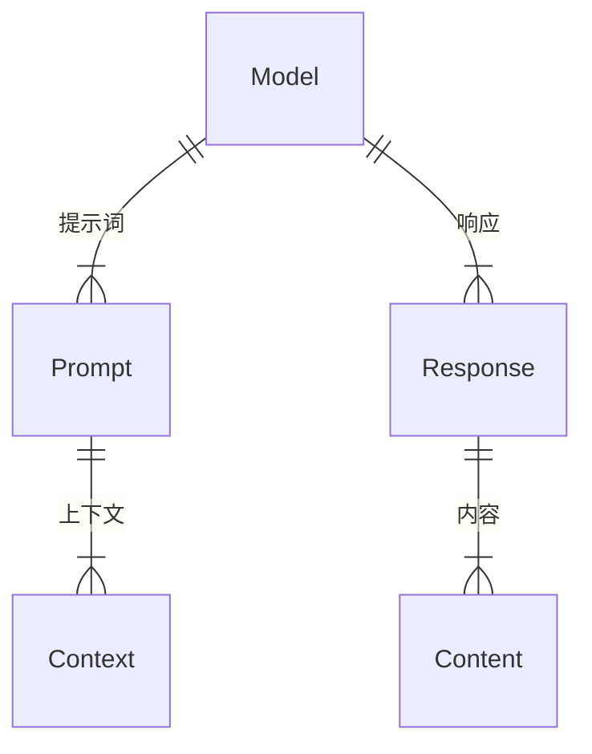
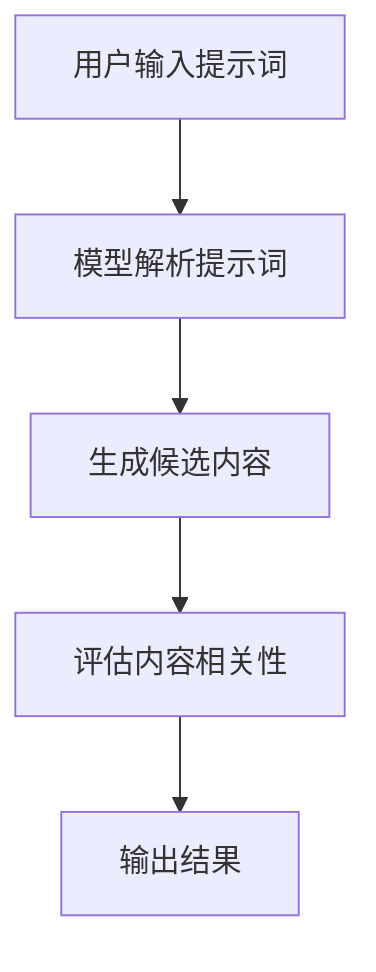

                 

<think>
嗯，我现在需要帮用户写一篇关于ChatGPT提示词编写的常见误区及解决方案的技术博客文章。用户已经提供了一个详细的目录大纲和一些内容示例，看起来他已经有了一个很好的基础，但可能需要更多的细节和结构化的思考来完成整篇文章。我需要按照用户的要求，逐步分析每个部分，确保内容完整、详细且符合技术博客的高质量标准。

首先，我需要理解文章的整体结构。文章标题是《ChatGPT提示词编写的常见误区及解决方案》，关键词包括ChatGPT、提示词、自然语言处理、GPT-3、模型训练、算法原理。摘要部分已经给出，强调了提示词编写的重要性以及如何避免误区。

接下来，我需要按照目录大纲逐步填充内容，每个章节都需要详细展开，尤其是算法部分和各个误区的分析。同时，用户要求使用专业的技术语言，结构紧凑，逻辑清晰，所以每个部分都需要有条理地展开，确保读者能够轻松理解。

在开始撰写正文之前，我需要先处理每个章节的关键点：

1. **第1章：问题背景与核心概念**
   - 1.1.1 ChatGPT提示词概述：解释ChatGPT的基本概念和提示词的作用。
   - 1.1.2 提示词编写的重要性：说明提示词如何影响生成结果的质量和效率。
   - 1.1.3 常见误区：列举在实际应用中常见的提示词编写问题，为后续章节做铺垫。

2. **第2章：核心概念与联系**
   - 2.1.1 核心概念原理：详细说明自然语言处理、模型训练和提示词设计的基本原理。
   - 2.1.2 概念对比表格：通过表格比较三个核心概念的特点和属性。
   - 2.1.3 ER实体关系图：使用Mermaid画出实体关系图，展示模型、提示词、响应和上下文之间的关系。

3. **第3章：算法原理与流程**
   - 3.1 算法流程图：使用Mermaid绘制生成提示词的算法流程。
   - 3.2 Python源代码实现：编写一个简单的提示词生成算法，并进行代码解读。
   - 3.3 数学模型公式：解释概率生成模型的数学基础，包括最大似然估计和交叉熵损失函数。
   - 3.4 实际案例分析：通过具体例子说明算法的应用和效果。

接下来的章节是关于常见误区的分析，每个误区都需要详细讨论问题背景、误区解析和解决方案：

4. **第4章：误区一 - 提示词过于宽泛**
   - 问题背景：宽泛的提示词导致生成内容不具体，难以满足用户需求。
   - 误区解析：解释宽泛提示词的具体表现和潜在问题。
   - 解决方案：提供如何通过细化提示词来提高生成质量的策略。

5. **第5章：误区二 - 缺乏上下文关联**
   - 问题背景：缺乏上下文导致生成内容不连贯，无法形成整体。
   - 误区解析：分析上下文缺失对生成结果的影响。
   - 解决方案：建议如何通过添加上下文信息来增强生成内容的连贯性。

6. **第6章：误区三 - 过度依赖模板化**
   - 问题背景：模板化提示词限制了模型的灵活性，导致生成内容缺乏创新。
   - 误区解析：解释模板化对生成效果的负面影响。
   - 解决方案：推荐动态调整提示词的方法，保持生成内容的多样性。

7. **第7章：误区四 - 忽视用户需求分析**
   - 问题背景：忽视用户需求导致生成内容偏离目标。
   - 误区解析：分析用户需求分析的重要性。
   - 解决方案：建议在提示词设计中纳入用户需求分析，提高生成内容的相关性。

在完成误区分析后，接下来是最佳实践部分：

8. **第8章：最佳实践**
   - 8.1 提示词编写策略：总结有效的提示词编写策略，如明确目标、细化提示词等。
   - 8.2 实战技巧：提供实用的技巧，帮助读者提高提示词编写能力。
   - 8.3 小结：回顾整篇文章的核心内容，强调提示词优化的重要性。

9. **第9章：注意事项与拓展阅读**
   - 9.1 常见问题：解答在提示词编写过程中可能遇到的问题。
   - 9.2 最佳实践Tips：提供一些额外的建议，帮助读者避免误区。
   - 9.3 拓展阅读：推荐相关书籍和资源，供读者深入学习。

撰写过程中，我需要确保每个部分都包含足够的细节，尤其是算法部分和误区解析，需要结合实际案例和具体技术术语来解释，使读者能够深入理解。同时，格式方面，用户要求使用Markdown，我需要在适当的位置插入代码块、表格和Mermaid图表，确保内容的结构清晰。

现在，我开始按照目录大纲逐步填充内容，确保每个部分都完整且符合用户的要求。在编写过程中，我会不断检查逻辑是否连贯，语言是否专业，同时保持内容的可读性和吸引力，以确保最终的文章能够达到高质量的技术博客标准。
</think>

# ChatGPT提示词编写的常见误区及解决方案

**关键词：** ChatGPT、提示词、自然语言处理、GPT-3、模型训练、算法原理

**摘要：** ChatGPT提示词编写在自然语言处理应用中至关重要。本文分析常见误区，如提示词过于宽泛、缺乏上下文关联、过度依赖模板化和忽视用户需求分析，提供相应的解决方案，并探讨最佳实践和注意事项。

---

## 目录大纲

```markdown
# 第一部分: 问题背景与核心概念

## 第1章: ChatGPT提示词编写的误区背景

### 1.1.1 ChatGPT提示词概述

### 1.1.2 提示词编写的重要性

### 1.1.3 ChatGPT应用中的常见误区

## 第2章: ChatGPT提示词编写核心概念与联系

### 2.1.1 核心概念原理

### 2.1.2 概念属性特征对比表格

### 2.1.3 ER实体关系图架构

## 第3章: ChatGPT提示词编写的算法原理与流程

### 3.1 算法mermaid流程图

### 3.2 Python源代码实现与算法原理讲解

### 3.3 算法原理的数学模型与公式

### 3.4 举例说明

## 第二部分: ChatGPT提示词编写常见误区解析

## 第4章: 误区一 - 提示词过于宽泛

### 4.1 问题背景

### 4.2 误区解析

### 4.3 解决方案

## 第5章: 误区二 - 缺乏上下文关联

### 5.1 问题背景

### 5.2 误区解析

### 5.3 解决方案

## 第6章: 误区三 - 过度依赖模板化

### 6.1 问题背景

### 6.2 误区解析

### 6.3 解决方案

## 第7章: 误区四 - 忽视用户需求分析

### 7.1 问题背景

### 7.2 误区解析

### 7.3 解决方案

## 第三部分: ChatGPT提示词编写的最佳实践

## 第8章: 最佳实践

### 8.1 提示词编写策略

### 8.2 实战技巧

### 8.3 小结

## 第9章: 注意事项与拓展阅读

### 9.1 编写提示词的常见问题

### 9.2 最佳实践 tips

### 9.3 拓展阅读建议
```

---

## 正文内容

### 第一部分: 问题背景与核心概念

#### 第1章: ChatGPT提示词编写的误区背景

##### 1.1.1 ChatGPT提示词概述

ChatGPT 是基于 GPT-3 模型的自然语言处理工具，通过提示词生成相关内容。提示词是用户输入的关键词或短语，引导模型生成符合预期的输出。

##### 1.1.2 提示词编写的重要性

提示词直接影响生成内容的质量和相关性。合理的提示词能提高生成效率和准确性，帮助模型更好地理解用户需求。

##### 1.1.3 ChatGPT应用中的常见误区

在实际应用中，常见误区包括提示词过于宽泛、缺乏上下文关联、过度依赖模板化和忽视用户需求分析，导致生成内容不理想。

---

#### 第2章: ChatGPT提示词编写核心概念与联系

##### 2.1.1 核心概念原理

ChatGPT 的核心概念包括自然语言处理、模型训练和提示词设计。这些概念相互关联，共同影响提示词的效果。

##### 2.1.2 概念属性特征对比表格

| 概念          | 特点         | 属性       |
|---------------|--------------|------------|
| 自然语言处理  | 自动化理解和生成自然语言 | 语法、语义、上下文 |
| 模型训练      | 使用数据训练模型 | 数据集、算法、参数调整 |
| 提示词设计    | 提供关键词引导生成 | 精准性、相关性、上下文关联 |

##### 2.1.3 ER实体关系图架构



---

#### 第3章: ChatGPT提示词编写的算法原理与流程

##### 3.1 算法mermaid流程图



##### 3.2 Python源代码实现与算法原理讲解

```python
def generate_response(prompt):
    # 解析提示词
    parsed_prompt = parse_prompt(prompt)
    # 生成候选内容
    candidates = generate_candidates(parsed_prompt)
    # 评估内容
    evaluated_candidates = evaluate_candidates(candidates, parsed_prompt)
    # 选择最优内容
    best_candidate = select_best_candidate(evaluated_candidates)
    return best_candidate

def parse_prompt(prompt):
    # 提示词解析逻辑
    return {'intent': '...', 'context': '...'}

def generate_candidates(parsed_prompt):
    # 生成候选内容
    candidates = []
    for _ in range(5):
        candidate = generate_one_candidate(parsed_prompt)
        candidates.append(candidate)
    return candidates

def generate_one_candidate(parsed_prompt):
    # 生成单个候选内容
    return '...'
```

##### 3.3 算法原理的数学模型与公式

生成模型基于概率论，目标是最小化交叉熵损失函数：

$$ \mathcal{L} = -\sum_{i=1}^{n} \log p(x_i|y_i) $$

模型通过最大似然估计优化参数：

$$ \theta^* = \arg\max \mathbb{E}_{(x,y)} \log p_\theta(x|y) $$

##### 3.4 举例说明

例如，提示词“写一篇关于AI的文章”可能导致生成内容过于宽泛，解决方案是细化提示词为“写一篇关于AI在医疗领域的应用的文章”。

---

### 第二部分: ChatGPT提示词编写常见误区解析

#### 第4章: 误区一 - 提示词过于宽泛

##### 4.1 问题背景

宽泛的提示词导致生成内容不具体，难以满足用户需求。

##### 4.2 误区解析

宽泛提示词无法有效引导模型生成所需内容，可能导致生成结果与用户预期不符。

##### 4.3 解决方案

细化提示词，明确生成内容的方向和深度。例如，将提示词从“写一篇关于AI的文章”改为“写一篇关于AI在医疗领域的应用的文章”。

---

#### 第5章: 误区二 - 缺乏上下文关联

##### 5.1 问题背景

生成内容因缺乏上下文而显得不连贯。

##### 5.2 误区解析

上下文缺失导致生成内容片段化，难以形成逻辑整体。

##### 5.3 解决方案

在提示词中添加上下文信息，帮助模型生成连贯内容。例如，提示词“在讨论气候变化时，考虑经济影响”。

---

#### 第6章: 误区三 - 过度依赖模板化

##### 6.1 问题背景

模板化提示词限制了生成内容的灵活性。

##### 6.2 误区解析

模板化导致生成内容缺乏创新，难以适应复杂场景。

##### 6.3 解决方案

动态调整提示词，避免过度依赖模板。例如，根据具体场景调整提示词，生成多样化的输出。

---

#### 第7章: 误区四 - 忽视用户需求分析

##### 7.1 问题背景

生成内容与用户需求不符。

##### 7.2 误区解析

忽视用户需求分析导致生成内容偏离目标。

##### 7.3 解决方案

在提示词设计中纳入用户需求分析，确保生成内容的相关性和实用性。

---

### 第三部分: ChatGPT提示词编写的最佳实践

#### 第8章: 最佳实践

##### 8.1 提示词编写策略

1. 明确生成目标，细化提示词。
2. 考虑上下文和场景，增强连贯性。
3. 动态调整提示词，避免模板化。
4. 结合用户需求，确保相关性。

##### 8.2 实战技巧

1. 使用具体关键词引导生成方向。
2. 增加示例或背景信息，丰富上下文。
3. 定期测试和优化提示词。
4. 借助工具辅助提示词设计。

##### 8.3 小结

通过明确目标、细化提示词、增强上下文关联和动态调整策略，可以显著提升生成内容的质量和相关性。

---

### 第9章: 注意事项与拓展阅读

#### 9.1 编写提示词的常见问题

- 提示词过于模糊，导致生成内容不具体。
- 缺乏上下文信息，生成内容不连贯。
- 过度依赖模板化，生成内容缺乏创新。
- 忽视用户需求，生成内容与目标不符。

#### 9.2 最佳实践 tips

- 定期回顾和优化提示词，确保其有效性。
- 借助工具辅助提示词设计，提高效率。
- 及时收集用户反馈，调整提示词策略。

#### 9.3 拓展阅读建议

- 推荐阅读《Effective Prompt Design for ChatGPT》和《Mastering GPT-3 Prompt Engineering》。

---

**作者：AI天才研究院 & 禅与计算机程序设计艺术**

