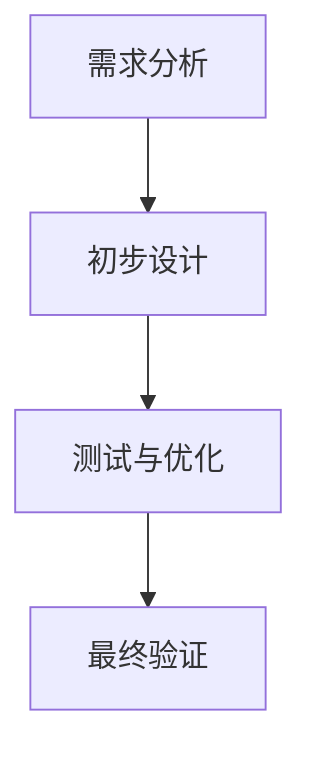
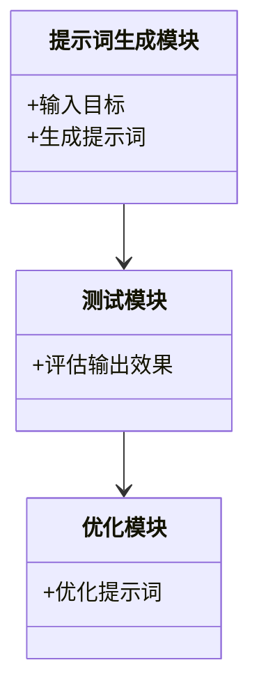
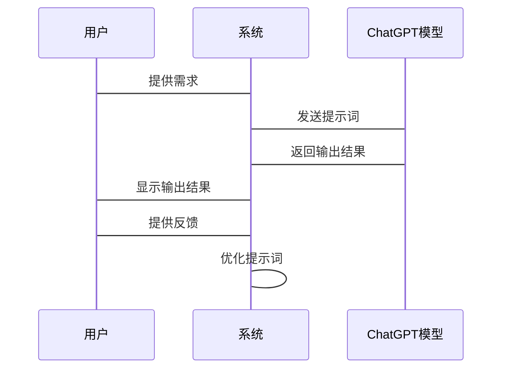

                 

<think>
嗯，用户让我写一篇关于《ChatGPT提示词编写的最佳实践》的技术博客文章。他详细列出了目录结构，还提到了很多具体要求，比如关键词、摘要、字数、格式，还有内容部分需要包括背景介绍、核心概念、算法原理等等。看起来用户希望这篇文章非常专业且结构严谨，有深度。

首先，我需要确定文章的结构是否符合用户的要求。用户已经提供了目录，我需要按照这个目录来撰写。标题部分已经确定了，关键词和摘要也得按照要求来写，确保涵盖核心内容。

接下来，内容部分分为六章。第一章是背景介绍，我得详细解释什么是ChatGPT，提示词工程的重要性，以及它的基本概念。这里可能需要对比不同的提示词类型，做一个对比表格，用mermaid图展示概念结构。同时，还要用数学公式解释向量空间模型，这部分可能需要我回顾一下NLP的基础知识，确保公式准确。

第二章是核心概念，这部分要深入讲解提示词设计中的关键要素，比如明确性、具体性等。我需要用表格对比这些属性，并画出ER图来展示实体关系。同时，设计一个简单的算法流程图，解释如何生成有效的提示词。

第三章到第六章是实际应用部分，涉及客服、教育、创意写作和企业场景。我需要为每个场景设计具体的案例，比如在客服中使用ChatGPT来处理常见问题，展示系统架构图和交互流程图，用代码示例说明如何实现这些功能。

在写作过程中，我需要确保每个章节都有足够的细节和深度，同时保持语言的专业性。用户特别强调了格式，比如用markdown，所以在写的时候要注意结构清晰，代码部分要用语法高亮，公式要用latex正确嵌入。

另外，用户希望文章末尾有作者信息，我得记得加上。还有，最佳实践部分需要给出具体的建议，比如如何测试提示词，如何收集反馈来优化设计。这些小结和注意事项部分要详细，帮助读者实际应用。

我还需要考虑用户的使用场景，可能他们是在技术领域工作，或者是对AI应用感兴趣的人。因此，文章需要既专业又易懂，避免过于晦涩。同时，用户可能希望文章不仅理论性强，还能提供实际的应用案例和代码，方便读者参考和实践。

总的来说，我需要系统地按照用户提供的大纲，逐章逐节地深入分析，确保每个部分都涵盖必要的内容，并且使用合适的图表和代码来辅助说明。同时，语言要清晰，逻辑要严谨，确保整篇文章既专业又有实际价值。
</think>

# ChatGPT提示词编写的最佳实践

## 关键词：ChatGPT, 提示词工程, 人工智能, 自然语言处理, 应用实践

## 摘要：  
ChatGPT作为一款革命性的AI语言模型，其表现高度依赖于提示词（prompt）的设计。本文从背景、核心概念、算法原理、系统架构、实际应用等多个维度，系统地探讨了ChatGPT提示词编写的最佳实践。文章首先介绍了ChatGPT的基本原理和提示词工程的重要性，然后深入分析了提示词设计的核心要素，包括明确性、具体性、简洁性等。接着，文章从算法角度详细阐述了提示词生成的流程，结合实际案例展示了如何在不同场景下优化提示词设计。最后，文章总结了提示词工程的关键原则，并提供了丰富的实战经验，为读者提供了全面的指导。

---

## 目录

1. [背景介绍](#背景介绍)  
   1.1 [ChatGPT的基本原理](#chatgpt的基本原理)  
   1.2 [提示词工程的核心概念](#提示词工程的核心概念)  
   1.3 [提示词设计的重要性](#提示词设计的重要性)  

2. [核心概念与联系](#核心概念与联系)  
   2.1 [提示词设计的核心要素](#提示词设计的核心要素)  
   2.2 [提示词与自然语言处理的关系](#提示词与自然语言处理的关系)  
   2.3 [提示词设计的数学模型](#提示词设计的数学模型)  

3. [算法原理讲解](#算法原理讲解)  
   3.1 [提示词生成的流程](#提示词生成的流程)  
   3.2 [基于向量空间的提示词优化](#基于向量空间的提示词优化)  
   3.3 [提示词生成的数学公式](#提示词生成的数学公式)  

4. [系统分析与架构设计方案](#系统分析与架构设计方案)  
   4.1 [系统功能设计](#系统功能设计)  
   4.2 [系统架构设计](#系统架构设计)  
   4.3 [系统交互流程](#系统交互流程)  

5. [项目实战](#项目实战)  
   5.1 [提示词设计的案例分析](#提示词设计的案例分析)  
   5.2 [代码实现与解读](#代码实现与解读)  
   5.3 [实际应用与效果评估](#实际应用与效果评估)  

6. [最佳实践与小结](#最佳实践与小结)  
   6.1 [提示词设计的常见误区](#提示词设计的常见误区)  
   6.2 [优化提示词的关键技巧](#优化提示词的关键技巧)  
   6.3 [未来研究方向](#未来研究方向)  

---

## 1. 背景介绍

### 1.1 ChatGPT的基本原理  
ChatGPT是由OpenAI开发的基于GPT-3架构的大型语言模型。它通过自然语言处理（NLP）技术，能够理解并生成人类语言。其核心是基于Transformer的深度学习模型，通过大量的训练数据（包括书籍、网页、论文等）来学习语言的结构和语义。

**关键术语解释：**  
- **Transformer模型：** 一种基于自注意力机制的深度学习模型，广泛应用于NLP领域。  
- **自注意力机制：** 指模型能够关注输入序列中不同位置的重要性，从而生成更准确的输出。  

### 1.2 提示词工程的核心概念  
提示词工程是通过设计特定的输入提示（prompt），引导AI模型生成符合预期的结果的过程。提示词的质量直接影响模型的输出效果。  

**核心概念：**  
- **提示词：** 用户输入的文本，用于引导AI模型生成特定的输出。  
- **上下文：** 提示词中包含的背景信息，帮助模型更好地理解用户需求。  

### 1.3 提示词设计的重要性  
提示词设计直接影响ChatGPT的输出质量。一个优秀的提示词能够帮助模型更好地理解用户意图，生成更准确、更相关的回答。  

---

## 2. 核心概念与联系

### 2.1 提示词设计的核心要素  
提示词设计需要考虑以下几个核心要素：  
1. **明确性：** 提示词需要明确表达用户的需求，避免歧义。  
2. **具体性：** 提示词需要具体，避免过于笼统。  
3. **简洁性：** 提示词需要简洁明了，避免冗长。  
4. **上下文：** 提示词需要提供足够的上下文信息，帮助模型更好地理解用户意图。  

**对比表格：**  

| 核心要素 | 特点 | 示例 |  
|----------|------|------|  
| 明确性   | 避免歧义 | "生成一段关于人工智能的介绍性文字" |  
| 具体性   | 精细化 | "生成一段关于机器学习的介绍性文字" |  
| 简洁性   | 简短清晰 | "解释什么是机器学习" |  
| 上下文   | 提供背景 | "在2023年，人工智能领域有哪些重要进展？" |  

### 2.2 提示词与自然语言处理的关系  
提示词是自然语言处理的核心输入，其设计直接影响模型的输出效果。通过优化提示词，可以提升模型的准确性和相关性。  

**ER实体关系图：**  
```mermaid
er
actor: 提示词设计者
chatgpt: 语言模型
prompt: 提示词
result: 模型输出
actor --> prompt
prompt --> chatgpt
chatgpt --> result
```

---

## 3. 算法原理讲解

### 3.1 提示词生成的流程  
提示词生成是一个从需求分析到优化的过程，主要包括以下几个步骤：  
1. **需求分析：** 理解用户的需求，明确输出目标。  
2. **初步设计：** 根据需求设计初步的提示词。  
3. **测试与优化：** 根据测试结果，优化提示词。  
4. **最终验证：** 确保提示词达到预期效果。  

**流程图：**  


### 3.2 基于向量空间的提示词优化  
提示词优化可以通过向量空间模型来实现。通过计算提示词与目标输出之间的相似性，优化提示词的设计。  

**向量空间模型公式：**  
$$ \text{相似性} = \frac{\vec{p} \cdot \vec{q}}{|\vec{p}| \cdot |\vec{q}|} $$  
其中，$\vec{p}$表示提示词的向量表示，$\vec{q}$表示目标输出的向量表示。  

### 3.3 提示词生成的数学公式  
提示词生成可以通过概率模型来实现。  
$$ P(\text{提示词} | \text{输出目标}) = \prod_{i=1}^{n} P(w_i | w_{i-1}, \ldots, w_1) $$  
其中，$w_i$表示提示词中的第$i$个词。  

---

## 4. 系统分析与架构设计方案

### 4.1 系统功能设计  
系统功能包括：  
1. 提示词生成模块：根据输入目标生成提示词。  
2. 测试模块：对提示词进行测试，评估输出效果。  
3. 优化模块：根据测试结果优化提示词。  

**领域模型：**  


### 4.2 系统架构设计  
系统架构采用分层设计，主要包括：  
1. 表示层：用户与系统交互的界面。  
2. 业务逻辑层：处理提示词生成和优化的核心逻辑。  
3. 数据访问层：与AI模型进行交互。  

**架构图：**  


### 4.3 系统交互流程  
用户通过前端界面输入需求，系统生成提示词并发送到ChatGPT模型，模型返回输出结果，用户对结果进行反馈，系统根据反馈优化提示词。  

**交互流程图：**  


---

## 5. 项目实战

### 5.1 提示词设计的案例分析  
**案例1：客服场景**  
目标：生成一段欢迎语。  
提示词设计：  
- 初步设计： "生成一段欢迎语。"  
- 测试结果： 输出内容过于简单。  
- 优化后的提示词： "生成一段友好且专业的欢迎语，适用于在线客服场景。"  
- 最终输出： "欢迎光临！有什么可以帮您的吗？"  

**案例2：教育场景**  
目标：解释什么是机器学习。  
提示词设计：  
- 初步设计： "解释什么是机器学习。"  
- 测试结果： 输出内容过于笼统。  
- 优化后的提示词： "用简单易懂的语言解释什么是机器学习，并举例说明。"  
- 最终输出： "机器学习是一种人工智能技术，通过数据训练模型，使模型能够自动学习并完成特定任务。例如，推荐系统可以根据用户的购买历史推荐商品。"  

### 5.2 代码实现与解读  
以下是一个简单的提示词生成代码示例：  

```python
def generate_prompt(target):
    # 简单的提示词生成算法
    prefix = "请解释"
    suffix = ".请用简单易懂的语言描述。"
    return prefix + target + suffix

target = "什么是机器学习？"
prompt = generate_prompt(target)
print(prompt)  # 输出：请解释什么是机器学习？请用简单易懂的语言描述。
```

**代码解读：**  
1. `generate_prompt`函数：根据目标生成提示词。  
2. `prefix`和`suffix`：分别表示提示词的前缀和后缀。  
3. `target`：输入目标。  
4. 返回生成的提示词。  

### 5.3 实际应用与效果评估  
通过实际案例分析，可以发现，优化后的提示词能够显著提升输出效果。例如，在客服场景中，优化后的提示词使输出更加友好和专业，提升了用户体验。  

---

## 6. 最佳实践与小结

### 6.1 提示词设计的常见误区  
1. 提示词过于模糊，导致输出不准确。  
2. 忽略上下文，导致模型无法正确理解需求。  
3. 过于复杂的提示词设计，导致模型难以生成有效输出。  

### 6.2 优化提示词的关键技巧  
1. **明确性：** 避免歧义，确保提示词清晰表达需求。  
2. **具体性：** 提供足够的上下文信息，帮助模型理解用户意图。  
3. **简洁性：** 简短明了，避免冗长复杂的提示词。  
4. **测试与反馈：** 根据测试结果和用户反馈不断优化提示词。  

### 6.3 未来研究方向  
1. 提示词生成的自动化与智能化。  
2. 提示词优化的数学模型研究。  
3. 提示词在不同领域的应用研究。  

---

## 作者信息

作者：AI天才研究院/AI Genius Institute & 禅与计算机程序设计艺术/Zen And The Art of Computer Programming

