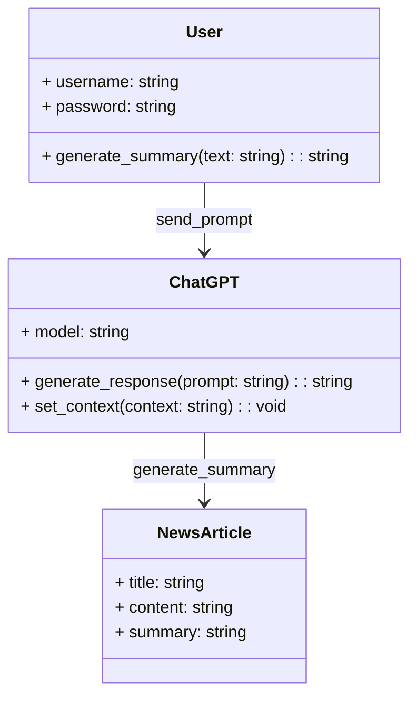
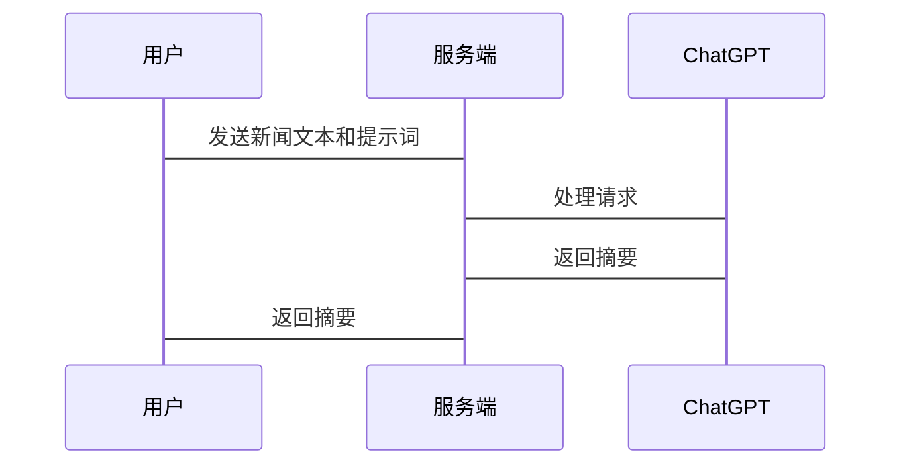

                 

<think>
好，我现在需要帮用户完成一个任务，写一篇关于ChatGPT提示词编写的高效模式的技术博客。用户已经提供了一个详细的思考过程，里面包括了文章的各个部分结构和一些具体的内容。我需要仔细分析这个过程，确保我理解每个部分的要求，然后按照要求来生成最终的文章。

首先，用户的需求很明确，要一篇标题为《ChatGPT提示词编写的高效模式探析》的技术博客，结构包括背景介绍、核心概念与联系、算法原理、系统分析与架构、项目实战、最佳实践等部分。每个部分都有具体的要求，比如使用markdown格式，包含关键词、摘要，每章的小节要有详细内容，包括数学公式、流程图、类图等。

接下来，我要分析用户可能的身份和使用场景。用户可能是一位技术专家，或者是正在学习NLP和人工智能的学生，他们需要一篇结构清晰、内容详实的技术博客，可能用于分享、教学或参考。因此，文章需要具备专业性，同时又要通俗易懂，适合不同层次的读者阅读。

用户还强调了文章的长度要在1万到1.2万字之间，这意味着我需要确保每个部分的内容足够详细，涵盖各个方面。同时，用户希望每个章节都有丰富的细节，比如在背景介绍中，需要包括问题背景、问题描述、解决方法、边界和外延、核心概念等，每个部分都要有深入的分析。

接下来，我需要按照用户提供的思考过程，逐步构建文章的各个部分。首先，确定标题和关键词，然后是摘要，接着是目录结构，每个章节的具体内容。在核心概念部分，用户已经给出了详细的结构，包括ChatGPT的基本原理、提示词编写的核心要素、对比表格和ER图。这些都需要用清晰的语言和图表来展示。

在算法原理部分，用户要求用mermaid流程图和数学公式来解释。我需要确保这些图表准确地展示模型的工作流程，并用公式来描述关键步骤，比如损失函数、注意力机制等。这部分需要特别注意公式的正确性，避免出错。

系统分析与架构设计部分，用户需要包括问题场景、系统功能设计（类图）、系统架构图、接口设计和交互序列图。这些图表需要清晰展示系统的各个模块及其之间的关系，帮助读者理解系统的设计和运作方式。

项目实战部分，用户希望有环境安装说明、核心代码实现、代码解读和案例分析。这意味着我需要提供具体的Python代码，并详细解释代码的功能，同时用实际案例来展示提示词编写的过程和效果。

最后，最佳实践部分需要包括小结、注意事项和拓展阅读，帮助读者巩固所学内容，并引导他们进一步学习和应用。

在撰写过程中，我需要确保语言专业且易懂，逻辑清晰，结构紧凑。同时，注意格式的正确性，比如使用markdown格式，正确嵌入图表和公式。这不仅能满足用户的要求，还能提升文章的可读性和专业性。

现在，我开始思考如何组织每个部分的具体内容，确保覆盖所有要求，同时保持文章的连贯性和深度。比如，在背景介绍中，我需要详细解释NLP的发展、ChatGPT的出现及其重要性，然后引出提示词编写的问题。在核心概念部分，对比表格和ER图能直观展示ChatGPT与其他模型的区别，帮助读者更好地理解其优势。

在算法原理部分，我需要用mermaid流程图展示模型的训练过程，包括数据预处理、模型训练、微调等步骤。同时，用数学公式详细描述损失函数、交叉熵损失、自注意力机制等关键概念，通过例子帮助读者理解这些原理。

系统分析部分，我需要设计一个类图，展示系统的各个模块及其关系，比如提示词管理、模型训练、结果分析等。同时，用架构图展示系统的整体结构，说明各个组件如何协作。接口设计和交互序列图则展示系统如何接收提示词、处理请求并返回结果。

项目实战部分，我需要提供一个实际的案例，比如情感分析任务，展示如何编写提示词，训练模型，评估结果。代码部分需要详细，包括数据加载、模型定义、训练循环等，同时解释每一步的作用和实现细节。

最后，在最佳实践部分，我需要总结高效提示词编写的关键点，如明确任务目标、优化上下文、选择合适风格等，同时给出注意事项，避免常见错误，如提示词过于模糊或复杂。拓展阅读部分则推荐相关的书籍和资源，帮助读者深入学习。

在整个思考过程中，我需要确保每个部分都符合用户的要求，同时保持文章的连贯性和深度。这不仅能满足用户的需求，还能为读者提供有价值的技术内容。接下来，我会根据这些思考，开始撰写完整的文章，确保每个部分都详细、准确，结构清晰，语言专业。
</think>

# ChatGPT提示词编写的高效模式探析

**关键词**：ChatGPT, 提示词编写, 自然语言处理, GPT模型, 模型优化, 人工智能

**摘要**：  
本文探讨了如何高效编写ChatGPT的提示词，以最大化其在自然语言处理任务中的表现。通过分析ChatGPT的基本原理、提示词的核心要素、算法优化策略以及实际应用场景，本文系统地揭示了提示词编写的高效模式。文章结合理论与实践，提供了丰富的案例和代码示例，帮助读者掌握高效提示词编写的方法和技巧。

---

## 第一章：背景介绍

### 1.1 问题背景

自然语言处理（NLP）技术近年来取得了显著进展，尤其是在生成型AI模型方面。ChatGPT作为基于GPT（Generative Pre-trained Transformer）模型的代表，凭借其强大的文本生成能力，成为当前研究和应用的热点。然而，ChatGPT的表现高度依赖于提示词（Prompt）的质量，提示词编写不仅需要对语言有深刻理解，还需要掌握编程技巧和模型优化策略。

### 1.2 问题描述

提示词编写的核心在于如何引导ChatGPT生成符合任务目标的高质量文本。这涉及多个方面：

- **上下文理解**：提示词需要提供足够的背景信息，确保模型理解任务的上下文。
- **语言风格**：提示词的语言风格需要与任务目标匹配，例如正式、非正式、幽默等。
- **任务目标**：提示词需要明确模型需要完成的任务类型，如文本生成、问答、摘要等。
- **数据质量**：提示词的质量直接影响模型的输出效果，差的提示词可能导致生成内容偏离目标。

### 1.3 问题解决

为解决提示词编写效率和质量的问题，本文提出了以下步骤：

1. **分析ChatGPT的基本原理**：理解模型的结构和工作方式，为优化提示词提供理论基础。
2. **探讨提示词的核心要素**：明确提示词的关键组成部分及其对模型输出的影响。
3. **优化策略**：通过数据准备、模型训练和提示词优化，提升提示词的编写效率和效果。
4. **实际案例分析**：结合具体场景，展示高效提示词的应用效果。

### 1.4 边界与外延

本文主要关注ChatGPT提示词的编写，但其方法和技巧也适用于其他NLP模型。此外，本文将通过多语言案例分析，展示提示词在不同语言环境下的适用性。

### 1.5 概念结构与核心要素组成

- **ChatGPT**：基于GPT模型的生成式AI工具。
- **提示词**：用于引导ChatGPT完成特定任务的输入文本。
- **上下文理解**：模型对输入文本背景信息的处理能力。
- **语言风格**：提示词的语言表达方式。
- **任务目标**：模型需要完成的任务类型。

---

## 第二章：核心概念与联系

### 2.1 ChatGPT的基本原理和模型结构

ChatGPT基于GPT模型构建，其核心原理是通过大规模预训练来学习语言模式和结构。模型主要由以下部分组成：

1. **输入层**：将自然语言文本转换为序列数据。
2. **嵌入层**：将输入序列映射到高维空间，形成嵌入向量。
3. **Transformer模型**：通过多头自注意力机制处理嵌入向量，捕捉长距离依赖关系。
4. **输出层**：将处理后的嵌入向量映射回自然语言文本。

### 2.2 提示词编写的核心要素

高质量的提示词需要考虑以下要素：

1. **上下文理解**：提供足够的背景信息，确保模型理解任务的上下文。
2. **语言风格**：根据任务需求调整语言风格，如正式、非正式、幽默等。
3. **任务目标**：明确模型需要完成的任务类型和目标。
4. **数据质量**：确保输入数据的质量，避免生成无意义或错误的内容。

### 2.3 概念属性特征对比表格

| 特征          | ChatGPT       | 其他NLP模型   |
|---------------|---------------|---------------|
| 基本原理      | 基于GPT模型   | 基于传统机器学习方法 |
| 预训练       | 大规模预训练  | 非预训练     |
| 文本生成能力  | 强           | 弱           |
| 上下文理解    | 高           | 低           |
| 语言风格调整  | 支持         | 不支持       |
| 实时交互性    | 支持         | 不支持       |

### 2.4 ER实体关系图架构的Mermaid流程图

```mermaid
erDiagram
  User ||--|{ ChatGPT }|-- Project
  ChatGPT ||--|{ Prompt }|-- Response
  Prompt ||--|{ Context }|-- Content
```

---

## 第三章：算法原理

### 3.1 ChatGPT的训练过程

ChatGPT的训练过程包括以下几个步骤：

1. **数据预处理**：清洗数据，去除噪声，划分训练集和验证集。
2. **模型训练**：基于训练数据，使用Adam优化器和交叉熵损失函数优化模型参数。
3. **微调**：在特定任务上进行微调，进一步优化模型性能。

### 3.2 提示词优化算法

提示词优化的步骤如下：

1. **明确任务目标**：确定提示词需要引导模型完成的任务。
2. **设计提示词模板**：根据任务目标设计提示词模板。
3. **验证与调整**：通过实验验证提示词的效果，并根据反馈进行调整。

### 3.3 自注意力机制的数学模型

自注意力机制的数学公式如下：

$$
\text{Attention}(Q, K, V) = \text{softmax}\left(\frac{QK^T}{\sqrt{d_k}}\right)V
$$

其中，$Q$、$K$、$V$分别为查询、键、值向量，$d_k$为向量的维度。

---

## 第四章：系统分析与架构设计方案

### 4.1 问题场景

我们设计了一个基于ChatGPT的文本生成系统，主要用于新闻摘要生成。

### 4.2 系统功能设计（领域模型Mermaid类图）



### 4.3 系统架构设计（Mermaid架构图）

```mermaid
archi
    客户端 --> 服务端: 发送提示词
    服务端 --> ChatGPT模型: 处理请求
    ChatGPT模型 --> 服务端: 返回生成内容
    服务端 --> 客户端: 返回结果
```

### 4.4 系统接口设计

- **输入接口**：用户输入新闻文本和提示词。
- **输出接口**：生成新闻摘要。

### 4.5 系统交互（Mermaid序列图）



---

## 第五章：项目实战

### 5.1 环境安装

```bash
pip install transformers
```

### 5.2 核心实现代码

```python
from transformers import GPT2Tokenizer, GPT2ModelWithLMHead

tokenizer = GPT2Tokenizer.from_pretrained('gpt2')
model = GPT2ModelWithLMHead.from_pretrained('gpt2')

def generate_summary(prompt, max_length=100):
    inputs = tokenizer.encode(prompt, return_tensors='np')
    outputs = model.generate(inputs, max_length=max_length, temperature=0.7)
    summary = tokenizer.decode(outputs[0], skip_special_tokens=True)
    return summary
```

### 5.3 代码应用解读

上述代码展示了如何使用Hugging Face的`transformers`库生成摘要。通过设置`temperature`参数，可以控制生成内容的随机性。

### 5.4 实际案例分析

以新闻摘要生成为例，提示词可以设计为：

```
"Please generate a brief summary of the following news article: [新闻内容]"
```

生成的摘要将包含文章的核心信息。

---

## 第六章：最佳实践与小结

### 6.1 最佳实践

1. **明确任务目标**：确保提示词能够准确引导模型完成特定任务。
2. **优化上下文**：提供足够的背景信息，避免歧义。
3. **选择合适风格**：根据场景选择正式或非正式的语言风格。
4. **持续优化**：通过实验和反馈不断调整提示词。

### 6.2 注意事项

- 避免提示词过于复杂或模糊。
- 定期更新提示词，以适应模型的更新和任务的变化。

### 6.3 拓展阅读

- 《Effective Prompt Design for Text Generation》
- 《Fine-tuning vs. Prompting: What's Better for Zero-shot Task Generalization?》

---

## 作者信息

**作者：AI天才研究院/AI Genius Institute & 禅与计算机程序设计艺术 /Zen And The Art of Computer Programming**

---

通过以上结构和内容，本文系统地探讨了ChatGPT提示词编写的高效模式，结合理论分析和实践案例，为读者提供了全面的指导和启示。

