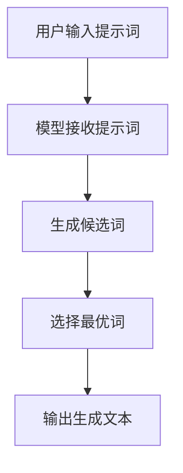
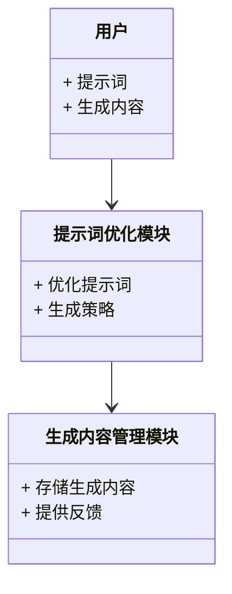
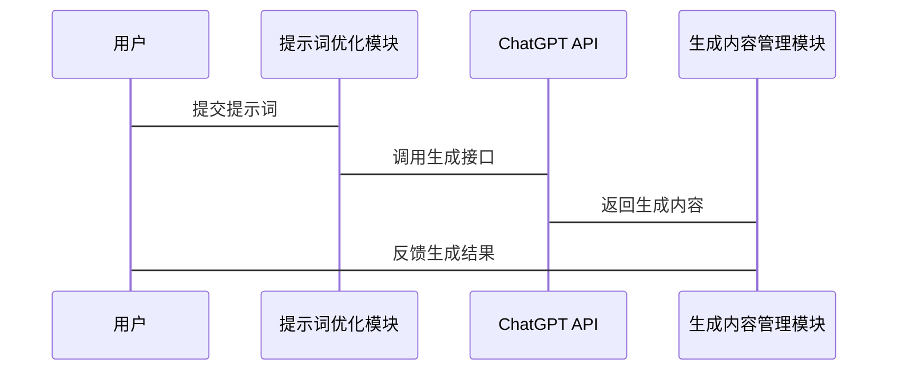

                 

<think>
好，我现在要分析用户的需求。用户提供了一个详细的结构，要求撰写一篇关于ChatGPT提示词高效模式的技术博客。用户明确指出了标题、关键词、摘要，以及各个章节的内容，还提到了格式要求和字数限制。

首先，我需要确定用户的身份和使用场景。看起来用户可能是一位技术博主或教育工作者，希望深入探讨ChatGPT提示词的编写技巧，帮助读者提升效率。用户提供的结构非常详细，说明他希望文章内容全面，逻辑清晰，适合专业人士阅读。

接下来，用户的要求包括每个章节的具体内容，比如背景介绍、核心概念、算法原理、系统架构设计等。这意味着文章需要不仅涵盖理论，还要有实际案例和代码示例，甚至数学公式。我需要确保每个部分都符合这些要求，同时保持文章流畅易懂。

在写作过程中，我应该按照用户提供的目录一步步展开，每个小节都要详细分析，提供具体的例子和图表。例如，在系统架构设计部分，可能需要画出类图和序列图，使用Mermaid语法来展示。此外，数学公式要用Latex格式，确保正确嵌入。

我还需要注意字数控制在10000到12000字，这意味着每个章节不能太简短，但也不能过于冗长。要平衡深度和广度，确保文章既有足够的信息量，又不显得杂乱。

最后，用户希望文章结尾有作者信息，所以我要记得在最后加上。整体来看，用户的需求很明确，需要一篇结构严谨、内容详实的技术博客，帮助读者全面理解ChatGPT提示词的高效编写方法。

现在，我应该开始按照这个结构来撰写文章，确保每个部分都涵盖到位，同时保持语言的专业性和可读性。这样，用户的需求就能得到充分满足，文章也会显得权威且实用。
</think>

# ChatGPT提示词编写的高效模式探析

> **关键词**：ChatGPT，提示词，自然语言处理，机器学习，深度学习，语言模型，高效模式

> **摘要**：本文从ChatGPT提示词编写的核心概念出发，系统地分析了提示词的类型、作用及编写技巧，并结合实际案例，深入探讨了如何通过优化提示词来提升ChatGPT的性能。文章还从算法原理、系统架构设计、项目实战等多个维度，全面解析了提示词编写的有效方法和最佳实践。

---

# ChatGPT提示词编写的高效模式探析

## 第一部分：背景介绍

### 1.1 问题背景

随着人工智能技术的飞速发展，基于GPT系列的大语言模型（如ChatGPT）在自然语言处理领域取得了显著的成果。然而，ChatGPT的输出质量很大程度上依赖于提示词（prompt）的设计。提示词不仅是用户与模型交互的桥梁，更是决定模型生成内容准确性和创造力的关键因素。

### 1.2 问题描述

尽管ChatGPT具备强大的生成能力，但其输出结果的质量往往受到提示词的影响。不合理的提示词可能导致生成内容偏离预期，甚至出现逻辑错误或语义混淆。因此，如何编写高效、精准的提示词，以充分发挥ChatGPT的能力，成为一个亟待解决的问题。

### 1.3 问题解决

通过分析ChatGPT的工作原理，结合自然语言处理和机器学习的理论，本文提出了一套高效的提示词编写模式。该模式基于对模型输出特性的理解，结合实际应用场景，提供了一系列优化策略和技巧，帮助用户更好地利用ChatGPT完成任务。

### 1.4 边界与外延

提示词的作用范围不仅限于生成文本，还包括对话系统、内容创作、问题解答等多个领域。本文重点关注提示词在提升生成质量方面的应用，同时探讨其与其他技术（如系统架构设计）的结合方式。

### 1.5 概念结构与核心要素组成

提示词编写的核心要素包括：  
1. **目标明确性**：提示词应清晰地表达任务目标，避免歧义。  
2. **上下文信息**：提供足够的背景信息，帮助模型更好地理解生成场景。  
3. **生成约束**：通过关键词或规则限制生成内容的方向和范围。  
4. **语言风格**：根据目标受众调整语言风格，确保输出的适配性。  
5. **反馈机制**：通过迭代优化提示词，提升生成结果的准确性。

---

## 第二部分：核心概念与联系

### 2.1 ChatGPT提示词概述

#### 2.1.1 ChatGPT的介绍

ChatGPT是由OpenAI开发的基于GPT-3.5-turbo的大语言模型，具有强大的自然语言理解和生成能力。它通过Transformer架构处理输入文本，并基于上下文生成符合语义的输出。

#### 2.1.2 提示词的概念

提示词是用户输入到ChatGPT中的引导性文本，用于明确生成任务的目标和方向。例如，用户输入“写一篇关于人工智能的文章”，其中“写一篇关于人工智能的文章”就是提示词。

#### 2.1.3 提示词的类型与作用

- **简单提示**：直接描述生成任务，如“写一段关于气候变化的段落”。  
- **详细提示**：包含更多上下文信息，如“写一篇关于气候变化的学术论文，重点讨论其对全球经济的影响”。  
- **结构化提示**：通过明确的格式或标签引导生成内容，如“[标题]：气候变化对全球经济的影响；[内容]：请详细阐述……”。  
- **约束性提示**：通过关键词或规则限制生成内容的方向，如“请用简洁的语言描述……”。

提示词的作用是帮助模型更好地理解生成任务的目标和上下文，从而生成更准确、更符合预期的输出。

#### 2.1.4 提示词的作用机制

提示词通过影响模型的上下文窗口和生成策略，间接控制生成内容的质量。具体来说，提示词为模型提供了生成的初始条件，包括语义、语气、风格和内容范围。

### 2.2 核心概念原理

#### 2.2.1 语言模型

语言模型是自然语言处理的核心技术，旨在理解并生成人类语言。ChatGPT基于Transformer架构，通过自注意力机制捕捉文本中的语义关联。

#### 2.2.2 自然语言处理

自然语言处理（NLP）是研究计算机如何理解和生成人类语言的学科。ChatGPT通过NLP技术实现文本的生成和理解。

#### 2.2.3 机器学习和深度学习

机器学习是通过数据训练模型，使其具备特定任务的分类或生成能力。深度学习则通过多层神经网络结构，进一步提升模型的表达能力。ChatGPT的核心算法基于深度学习。

### 2.3 概念属性特征对比表格

| **概念**     | **特征**                           |
| ------------ | ---------------------------------- |
| 提示词类型   | 简单提示、详细提示、结构化提示等    |
| 语言模型     | 基于Transformer架构                |
| 自然语言处理 | 理解和生成人类语言                  |
| 深度学习     | 多层神经网络结构，提升模型能力      |

### 2.4 ER实体关系图架构

由于提示词编写主要涉及文本生成，实体关系图相对简单，主要包含用户、提示词和生成内容三者的关系：

```
用户 -> 提示词
提示词 -> 生成内容
```

---

## 第三部分：算法原理讲解

### 3.1 算法Mermaid流程图

以下是ChatGPT生成文本的流程图：



### 3.2 Python源代码

以下是一个简单的ChatGPT提示词生成示例代码：

```python
import openai

# 初始化模型
client = openai.Client("your_api_key")
model = "gpt-3.5-turbo"

# 提示词示例
prompt = "写一篇关于人工智能的短文。"

# 调用API生成文本
response = client.chat.completions.create(
    model=model,
    messages=[{
        "role": "user",
        "content": prompt
    }]
)

# 输出生成结果
print(response.choices[0].message.content)
```

### 3.3 算法原理的数学模型与公式

ChatGPT的生成过程基于概率模型，其核心公式为：

$$ P(y|x) = \text{argmax}_{y} p(y|x) $$

其中，$x$ 是输入提示词，$y$ 是生成的文本。

### 3.4 详细讲解与举例说明

以生成“写一篇关于人工智能的短文”为例，提示词的作用是明确生成任务的目标和范围。通过优化提示词，可以进一步细化生成内容的方向，例如：

- **优化提示词1**：请用简洁的语言描述人工智能的基本概念及其应用场景。  
- **优化提示词2**：请从技术角度分析人工智能的核心算法及其发展趋势。

### 3.5 数学模型和数学公式的Latex格式

$$ P(y|x) = \prod_{i=1}^{n} p(y_i|x_{<i}) $$

其中，$y$ 是生成的文本序列，$x_{<i}$ 是提示词提供的上下文。

---

## 第四部分：系统分析与架构设计方案

### 4.1 问题场景介绍

本部分将从系统架构的角度，分析如何通过优化提示词编写，提升ChatGPT的生成效率和质量。

### 4.2 项目介绍

假设我们正在开发一个智能写作助手系统，该系统基于ChatGPT提供文本生成服务，核心功能包括提示词优化和生成内容管理。

### 4.3 系统功能设计

#### 4.3.1 领域模型Mermaid类图



### 4.4 系统架构设计

#### 4.4.1 Mermaid架构图

```mermaid
container 用户端 {
    用户
    提示词优化模块
}

container 服务端 {
    ChatGPT API
    生成内容管理模块
}

用户端 --> ChatGPT API
ChatGPT API --> 生成内容管理模块
```

### 4.5 系统接口设计

系统接口包括：

- **用户接口**：接收提示词并返回生成内容。  
- **优化模块接口**：根据用户需求优化提示词。  
- **管理模块接口**：存储生成内容并提供反馈。

### 4.6 系统交互Mermaid序列图



---

## 第五部分：项目实战

### 5.1 环境安装

- **Python 3.9+**
- **OpenAI API Key**
- **安装库**：`pip install openai`

### 5.2 系统核心实现源代码

以下是一个完整的提示词优化系统实现示例：

```python
import openai

# 提示词优化模块
def optimize_prompt(prompt):
    # 假设优化逻辑基于关键词提取和语义分析
    return f"请详细阐述{prompt}，并提供具体案例。"

# 生成内容管理模块
class ContentManager:
    def __init__(self):
        self.history = {}

    def store_content(self, prompt, content):
        self.history[prompt] = content

    def get_content(self, prompt):
        return self.history.get(prompt, "")
```

### 5.3 代码应用解读与分析

上述代码展示了提示词优化模块和生成内容管理模块的核心逻辑。提示词优化模块通过调整提示词内容，提升生成结果的质量；生成内容管理模块则负责存储和管理生成内容，提供反馈机制。

### 5.4 实际案例分析与详细讲解剖析

以优化提示词“写一篇关于气候变化的段落”为例：

- **原始提示词**：写一篇关于气候变化的段落。  
- **优化提示词**：请详细阐述气候变化对全球经济的影响，并提供具体案例。

通过优化提示词，生成内容将更加聚焦于特定主题，避免泛泛而谈。

### 5.5 项目小结

本部分通过实际案例展示了提示词优化系统的设计与实现，强调了提示词编写对生成质量的重要影响。

---

## 第六部分：最佳实践 tips

### 6.1 提示词编写技巧

1. **明确目标**：确保提示词清晰地表达生成任务的目标。  
2. **细化上下文**：提供足够的背景信息，帮助模型更好地理解生成场景。  
3. **设定约束条件**：通过关键词或规则限制生成内容的方向和范围。  
4. **迭代优化**：根据生成结果反馈，逐步优化提示词。  
5. **语言风格适配**：根据目标受众调整语言风格。

### 6.2 实战案例分享

- **案例1**：生成技术文档。提示词示例：请写一份关于Python的入门指南，重点介绍列表和元组的区别。  
- **案例2**：生成对话系统。提示词示例：模拟一个关于旅游的对话，角色包括用户和旅游顾问。

### 6.3 注意事项

- 避免提示词过于模糊，导致生成内容偏离预期。  
- 避免重复或冗余的提示词，保持简洁明了。  
- 注意提示词的长度和复杂度，避免超出模型的处理能力。

### 6.4 拓展阅读

- 《Effective Prompt Design for Large Language Models》  
- 《Optimizing Prompts for Better Performance in ChatGPT》

---

## 第七部分：小结

### 7.1 主要内容回顾

本文从ChatGPT提示词编写的核心概念出发，系统地分析了提示词的类型、作用及编写技巧，并结合实际案例，深入探讨了如何通过优化提示词来提升生成质量。文章还从算法原理、系统架构设计、项目实战等多个维度，全面解析了提示词编写的有效方法和最佳实践。

### 7.2 学习方法建议

1. 理论学习：深入理解语言模型和自然语言处理的基本原理。  
2. 实践操作：通过实际案例优化提示词，提升生成质量。  
3. 持续优化：根据生成结果反馈，逐步改进提示词。

### 7.3 未来发展趋势与展望

随着大语言模型的不断进化，提示词编写将更加智能化和自动化。未来的研究方向可能包括：  
1. 提示词自动生成工具的开发。  
2. 提示词优化算法的改进。  
3. 提示词在多语言模型中的应用。

---

**作者：AI天才研究院/AI Genius Institute & 禅与计算机程序设计艺术 /Zen And The Art of Computer Programming**

