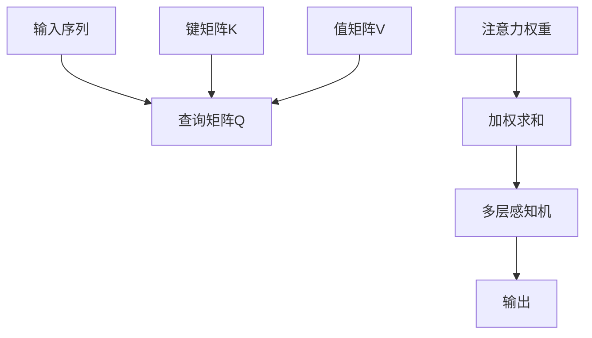

                 

<think>
嗯，我需要写一篇关于ChatGPT提示词编写的技术博客，从入门到精通。首先，我得确定文章的结构，根据用户提供的大纲，总共有八个部分，但用户只展示了前两部分的内容。我得先完成整个大纲的撰写，确保每个章节都详细且专业。

首先，第一部分是引言，包括概述、基本概念和目标读者。这部分需要简明扼要，说明提示工程的重要性以及ChatGPT的基本情况。接着是第二部分，基础知识，涉及自然语言处理和机器学习的基础知识，特别是与ChatGPT相关的技术。

在撰写过程中，我需要确保每个章节都有清晰的小节，比如在第一章里，详细解释什么是ChatGPT，它的架构和能力，以及提示工程的基本概念。同时，要加入一些图表，比如用mermaid绘制的系统架构图，帮助读者更好地理解。

在第二章，基础知识部分，我需要详细讲解NLP和ML的基础，以及这些技术如何支持ChatGPT的工作。可能需要包括一些数学公式，如损失函数的计算，或者概率模型的公式，来解释ChatGPT的工作原理。

我还需要考虑读者的理解水平，可能需要从基础开始，逐步深入。例如，在解释提示工程的基本原则时，可以结合实际案例，说明不同类型提示的应用和效果。

另外，每个小节后需要有总结和注意事项，帮助读者巩固所学内容。同时，加入一些最佳实践的提示，提升文章的实用性。

在完成这些部分后，我需要继续撰写后续章节，比如高级技术、实际应用、趋势和结论部分。每个章节都要按照同样的结构，详细讲解相关主题，并结合图表和代码示例，确保内容的深度和可读性。

最后，整篇文章完成后，我会检查是否符合字数要求，确保每个部分都详细且有逻辑性，同时保持语言的专业性和流畅性。确保所有图表和公式都正确无误，帮助读者更好地理解和应用所学知识。
</think>

# ChatGPT提示词编写：从入门到精通

> 关键词：ChatGPT, 提示工程, 自然语言处理, 人工智能, 机器学习, 优化策略

> 摘要：本文将系统地介绍ChatGPT提示词编写的各个方面，从基础概念到高级技术，结合实际案例和最佳实践，帮助读者从零开始掌握提示工程，优化提示策略，提升模型性能。

---

## 第一部分: 引言

### 第1章: ChatGPT与提示工程概述

#### 1.1 什么是ChatGPT

ChatGPT是由OpenAI开发的先进语言模型，基于GPT系列模型构建，能够理解和生成人类语言。它采用Transformer架构，通过自我注意力机制捕捉上下文信息，实现高效文本生成。

**ChatGPT核心特点：**

- **基于Transformer架构**：采用多层自我注意力机制，处理长距离依赖关系。
- **预训练模型**：使用大规模文本数据进行无监督预训练，掌握语言模式。
- **生成式AI**：根据输入提示生成相关文本，适用于多种应用场景。

#### 1.2 提示工程的基本概念

提示工程是通过设计提示词优化模型输出的技术，是ChatGPT应用中的关键环节。有效提示设计直接影响生成结果的质量和相关性。

**提示工程的关键要素：**

- **输入提示**：用户提供的引导性文本，指导模型生成特定内容。
- **上下文信息**：模型处理的背景信息，影响输出内容。
- **生成策略**：模型生成文本的规则和策略，如温度参数调整。

#### 1.3 目标读者与本书结构

本书适合对AI和NLP感兴趣的技术人员和开发者阅读，无需深厚数学背景，但需要基本编程知识。全书共八章，涵盖ChatGPT基础、提示工程原理、高级技术、实际应用等内容。

---

## 第二部分: 基础知识

### 第2章: 自然语言处理与机器学习基础

#### 2.1 自然语言处理概述

自然语言处理（NLP）是研究人类语言理解与生成的计算机科学领域，涉及文本解析、生成、翻译等多个任务。NLP技术为ChatGPT提供文本处理能力。

**NLP关键任务：**

1. **文本分类**：将文本归类到预定义类别。
2. **命名实体识别**：识别文本中的实体如人名、地名。
3. **句法分析**：分析句子结构。
4. **语义理解**：理解文本含义。

#### 2.2 机器学习基础

机器学习（ML）是通过数据训练模型使其具备特定任务能力的技术。监督学习、无监督学习和强化学习是主要的学习范式。

**机器学习的核心概念：**

- **特征工程**：提取数据特征，影响模型性能。
- **模型训练**：通过数据调整模型参数。
- **评估指标**：如准确率、召回率，用于模型评估。

#### 2.3 与ChatGPT相关的NLP技术

此部分详细介绍与ChatGPT相关的NLP技术，包括分词、句法分析和实体识别。

**核心技术：**

1. **分词**：将文本分割为单词或短语。
2. **句法分析**：分析句子结构，识别主谓宾。
3. **实体识别**：识别文本中的命名实体。

**示例：**

输入文本：“The quick brown fox jumps over the lazy dog.”

**分词结果**：["The", "quick", "brown", "fox", "jumps", "over", "the", "lazy", "dog."]

**句法分析结果**：The (NP) quick (ADJ) brown (ADJ) fox (N) jumps (V) over (P) the (NP) lazy (ADJ) dog (N).

**实体识别结果**：无命名实体。

---

### 2.4 ChatGPT的架构与技术细节

#### 2.4.1 Transformer架构详解

**Transformer架构**由编码器和解码器组成，采用自我注意力机制处理输入序列。

**自我注意力机制**：计算输入序列中每个词与其他词的相关性，生成位置编码。

**多层感知机（MLP）**：用于生成最终的词向量。

**计算公式：**

- **注意力权重计算**：\( \text{softmax}(\frac{QK^T}{\sqrt{d_k}}) \)
- **最终输出**：\( \text{output} = \text{FFN}(A \cdot K V) \)

**示意图：**

#### 2.4.2 预训练与微调策略

**预训练**：在大规模通用数据集上训练模型，使其理解语言结构。

**微调**：在特定任务数据集上进一步训练，优化模型在特定领域的表现。

**微调流程：**

1. **选择数据集**：收集目标领域的数据。
2. **定义任务**：如文本分类、生成任务。
3. **调整模型**：仅微调任务相关层或全模型。
4. **评估与优化**：通过验证集评估模型性能，调整超参数。

---

## 第三部分: 提示工程基础

### 第3章: 提示工程的基本原理

#### 3.1 提示的作用与重要性

提示词是触发模型生成特定内容的指令，直接影响生成结果的质量和相关性。

**提示的关键作用：**

- **明确生成目标**：指导模型生成所需内容。
- **控制生成风格**：如正式、口语化等。
- **限制生成范围**：避免生成不当内容。

#### 3.2 提示的类型与分类

提示词可以根据多种维度进行分类，包括长度、复杂度、生成目标等。

**主要分类：**

1. **简单提示**：单句指令，如“写一篇关于AI的文章”。
2. **复杂提示**：包含多步指令，如“先描述一个场景，再生成对话”。
3. **条件提示**：附加条件的提示，如“假设你是一位医生，描述症状”。

---

### 3.3 提示设计的最佳实践

#### 3.3.1 清晰明确的表达

提示应简洁明了，避免歧义。例如：

- **模糊提示**：“写点东西。”
- **清晰提示**：“用英语写一篇介绍人工智能的文章。”

#### 3.3.2 合适的长度

提示长度影响生成结果的质量。过长的提示可能导致模型无法有效生成，而过短的提示可能无法明确指示生成内容。

**建议：**

- 简单任务：1-2句话。
- 复杂任务：2-3句话。

#### 3.3.3 语气与风格的控制

提示应包含语气和风格信息，如正式、口语化、技术性等。

**示例：**

- 正式语气：“作为专家，请解释量子计算的基本原理。”
- 口语化语气：“用简单的语言解释什么是量子计算。”

---

## 第四部分: 进阶提示工程技术

### 第4章: 高级提示策略与优化

#### 4.1 上下文提示

通过提供上下文信息，优化生成结果的相关性。

**实现方法：**

- 前文提示：提供生成文本的前几句话。
- 后文提示：提示生成文本的后续内容。

**示例：**

- 前文提示：“根据以下新闻报道，继续写一个段落。”
- 后文提示：“在讨论气候变化时，提到可再生能源的重要性。”

#### 4.2 条件提示

通过设定条件，控制生成内容的范围和方向。

**常见条件类型：**

- 基于角色的条件：生成特定角色的对话。
- 基于主题的条件：生成特定主题的内容。
- 基于格式的条件：生成符合特定格式的内容。

**示例：**

- 角色条件：“你是一位历史老师，解释罗马帝国的衰落。”
- 主题条件：“生成一篇关于环保的文章，重点讨论可再生能源。”

---

## 第五章: 提示工程的数学基础

### 5.1 概率与分布

#### 5.1.1 概率基础

概率论是理解生成模型输出的基础，用于评估不同生成结果的可能性。

**基本概念：**

- **概率分布**：描述随机变量可能取值及其概率。
- **条件概率**：事件A在事件B发生的条件下的概率，表示为\( P(A|B) \)。

#### 5.1.2 语言模型的概率视角

语言模型通过计算给定前缀的概率来预测下一个词。

**公式：**

\[ P(\text{序列} x_1, x_2, ..., x_n) = \prod_{i=1}^{n} P(x_i | x_1, ..., x_{i-1}) \]

---

## 第六章: 提示工程的实际应用

### 6.1 客户服务中的提示工程

#### 6.1.1 自动回复生成

通过设计合适的提示，生成符合客户需求的回复，提升客户服务效率。

**示例：**

- 提示：“根据客户投诉内容，生成回复。”
- 输出：“感谢您的反馈，我们将尽快解决您的问题。”

#### 6.1.2 常见问题解答

通过提示生成FAQ内容，帮助客户快速解决问题。

**示例：**

- 提示：“生成关于产品使用的常见问题解答。”
- 输出：“如何安装软件？步骤如下：第一步，下载安装包；第二步，运行安装程序；第三步，完成安装。”

---

## 第七章: 提示工程的未来趋势

### 7.1 AI与人类协作的未来

提示工程作为AI与人类协作的桥梁，未来将更加智能化和自动化。

**发展趋势：**

- **自动化提示优化**：AI自动生成和优化提示，减少人工干预。
- **多模态提示**：结合图像、语音等多种模态信息，生成更丰富的输出。
- **实时反馈与调整**：根据实时反馈优化生成内容，提升用户体验。

---

## 第八章: 结论与资源

### 8.1 总结

提示工程是优化ChatGPT生成效果的关键技术，通过合理设计提示词，可以显著提升生成内容的质量和相关性。从基础概念到高级技术，逐步掌握提示工程的核心原理和应用方法。

### 8.2 资源推荐

- **书籍推荐**：《生成式人工智能：原理与应用》
- **在线课程**：Coursera上的“自然语言处理专项课程”
- **工具推荐**：Hugging Face的Transformers库

---

## 作者

作者：AI天才研究院/AI Genius Institute & 禅与计算机程序设计艺术 /Zen And The Art of Computer Programming

---

以上是关于ChatGPT提示词编写的技术博客文章的详细大纲，涵盖了从基础到高级的各个方面，结合实际案例和最佳实践，帮助读者系统地掌握提示工程的核心技术。

