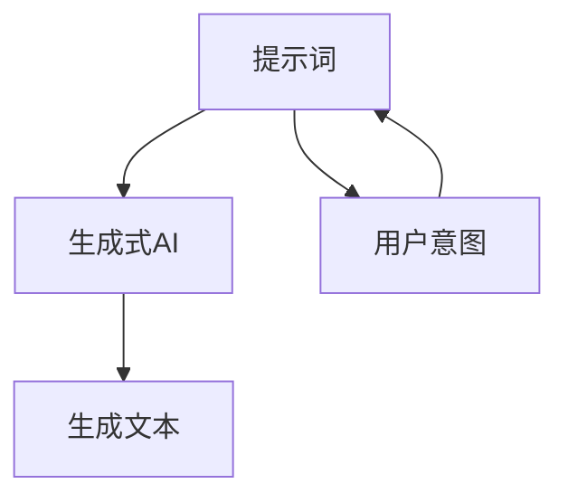
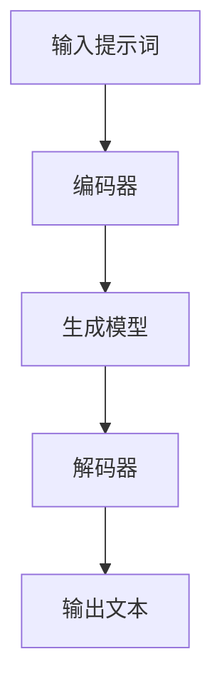
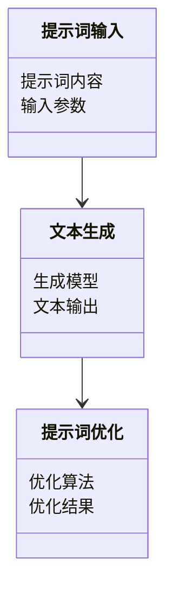
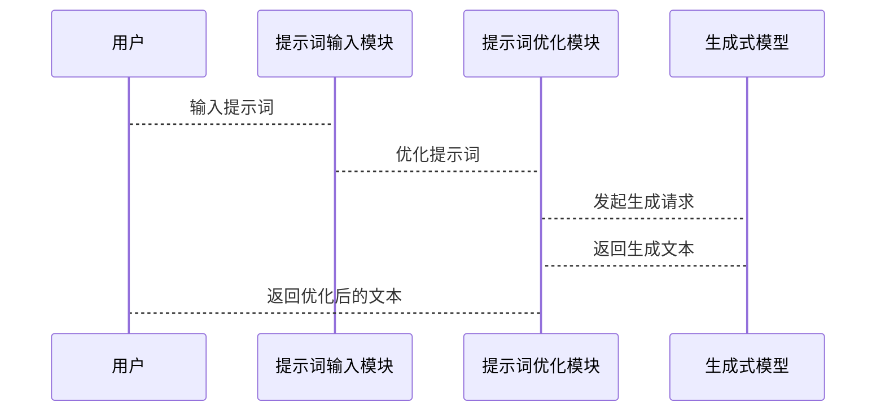

                 

<think>
嗯，用户希望我以《ChatGPT提示词编写：从入门到精通的进阶之路》为标题，撰写一篇技术博客文章。首先，我需要理解用户的需求。他可能是一位技术专家，或者对AI和编程有浓厚兴趣的人，希望系统地学习如何编写有效的ChatGPT提示词。

接下来，我得分析文章结构。用户已经给出了详细的大纲，包括背景介绍、核心概念、算法原理、数学模型、系统架构、项目实战、最佳实践等部分。我需要确保每个部分都详细且专业，同时保持逻辑清晰。

背景介绍部分，我需要解释ChatGPT的基本原理，为什么提示词如此重要，以及它在实际应用中的价值。这部分要吸引读者，让他们明白学习提示词编写的必要性。

核心概念与联系章节，我需要用表格对比不同提示词类型，比如简单提示、结构化提示、情感引导提示等。然后用Mermaid图展示概念之间的关系，帮助读者理解它们如何相互作用。

算法原理部分，我得详细讲解生成式模型的工作流程，比如编码器和解码器的角色，以及损失函数的作用。同时，提供Python代码示例，让读者能够实际操作，加深理解。

数学模型和公式部分，需要解释概率分布、损失函数等概念，使用LaTeX公式来展示。这部分可能会有点复杂，所以要举例子，让读者更容易消化。

系统分析与架构设计章节，我得从问题场景出发，比如用户希望系统能自动生成高质量提示词，然后设计系统功能，如输入处理、生成、优化和反馈。接着，用Mermaid图展示系统架构，包括各模块之间的交互。

项目实战部分，我需要指导读者如何搭建环境，安装必要的库，然后一步步实现提示词生成器。代码部分要详细，解释每一步的作用，最后通过案例分析展示实际应用。

最佳实践和注意事项部分，我得提醒读者常见的误区，比如过于复杂的提示词可能适得其反，强调测试和反馈的重要性。同时，提供一些额外的资源，鼓励读者深入学习。

最后，确保整篇文章结构清晰，逻辑连贯，每个章节都充实具体。语言要专业但易懂，避免过于晦涩。同时，注意文章的总字数在10000到12000字之间，确保信息量足够，但不过于冗长。

总的来说，我需要一步步分解每个部分，确保内容详实，结构合理，帮助读者系统地掌握ChatGPT提示词编写的核心技能。
</think>

# ChatGPT提示词编写：从入门到精通的进阶之路

> 关键词：ChatGPT，提示词编写，自然语言处理，机器学习，生成式AI，AI编程

> 摘要：本文将详细介绍ChatGPT提示词编写的核心概念、算法原理、数学模型、系统架构设计以及实际项目应用。从入门的基础知识到进阶的高级技巧，结合丰富的实战案例和系统化的思考过程，帮助读者逐步掌握编写高效、精准的提示词的方法。通过本文的学习，读者将能够深入理解ChatGPT的工作原理，并能够熟练地编写出高质量的提示词，从而最大化地发挥ChatGPT的潜力。

---

## 1. 背景介绍

### 1.1 ChatGPT的基本原理

ChatGPT是由OpenAI开发的基于GPT（Generative Pre-trained Transformer）系列的生成式人工智能模型。它通过大量的训练数据，学习语言的模式和结构，并能够根据输入的提示词生成符合语境的自然语言文本。ChatGPT的核心在于其基于Transformer的架构，能够处理长上下文，并通过自我注意机制捕捉文本中的语义关系。

### 1.2 提示词编写的必要性

提示词（Prompt）是用户与生成式AI交互的核心输入，它决定了生成文本的质量、风格和内容方向。编写有效的提示词是实现ChatGPT潜力的关键，因为它能够引导模型生成符合特定需求的输出。例如，一个精心设计的提示词可以让ChatGPT生成专业的技术文档、创意性的故事，或者进行复杂的逻辑推理。

### 1.3 问题背景与描述

在实际应用中，很多人在使用ChatGPT时，往往直接输入简单的关键词，导致生成结果不够理想。例如，输入“写一篇关于AI的文章”可能会得到一篇泛泛而谈的文章，而没有深度和具体方向。这背后的根本问题是提示词的设计不够精细，无法充分引导模型生成高质量的内容。

### 1.4 问题解决与边界

通过系统地学习提示词编写的方法，可以显著提升生成内容的质量和针对性。本章将从提示词的基本概念入手，逐步分析其在不同场景中的应用，帮助读者理解提示词编写的边界与限制，例如模型的能力限制、上下文的长度限制等。

### 1.5 核心要素与概念结构

提示词编写的核心要素包括：明确的目标、具体的上下文、语境的引导、风格的统一等。这些要素共同构成了提示词的框架，确保生成的内容既符合预期，又具有逻辑性和连贯性。

---

## 2. 核心概念与联系

### 2.1 核心概念原理

提示词编写的核心在于通过语言的引导，让模型理解用户的意图。这涉及到以下几个关键点：
1. **意图明确性**：提示词需要清晰地表达用户的意图，避免歧义。
2. **上下文构建**：通过提供背景信息，帮助模型生成连贯的内容。
3. **风格一致性**：提示词需要明确生成文本的风格，例如正式、口语化、技术性等。

### 2.2 核心概念对比

以下是几种常见的提示词类型及其特点对比：

| 类型             | 特点                                                                 |
|------------------|--------------------------------------------------------------------|
| 简单提示         | 直接给出主题，生成内容较为泛泛而谈。                                   |
| 结构化提示       | 明确指定生成内容的结构和格式，例如“写一封邮件，主题为……”。             |
| 情感引导提示     | 通过描述情感或语气，引导生成内容的情感走向，例如“以幽默的语气描述……”。 |

### 2.3 ER实体关系图

以下是提示词编写的核心概念之间的关系图：



---

## 3. 算法原理讲解

### 3.1 算法流程图

以下是生成式AI模型的提示词处理流程图：



### 3.2 算法原理与数学模型

生成式AI的核心是基于概率分布的生成模型。模型的目标是最小化生成文本与真实文本之间的差异，具体通过计算损失函数来实现。以下是一个简单的损失函数公式：

$$ L = -\sum_{i=1}^{n} \log P(y_i|x) $$

其中，$P(y_i|x)$ 表示在给定输入$x$的情况下，生成字符$y_i$的概率。

---

## 4. 数学模型与公式

### 4.1 概率分布模型

生成式AI的生成过程基于概率分布，以下是一个简单的概率分布模型：

$$ P(y|x) = \frac{P(y,x)}{P(x)} $$

其中，$P(x)$ 是输入$x$的先验概率，$P(y,x)$ 是输入$x$和输出$y$的联合概率。

### 4.2 损失函数

交叉熵损失函数是生成式模型常用的损失函数：

$$ H(y, p) = -\sum_{i=1}^{n} y_i \log p(y_i) $$

其中，$y_i$ 是真实标签的概率分布，$p(y_i)$ 是模型预测的概率分布。

---

## 5. 系统分析与架构设计

### 5.1 问题场景

假设我们正在开发一个基于ChatGPT的智能写作系统，用户需要通过编写提示词来生成高质量的文章、报告和技术文档。

### 5.2 项目介绍

**项目名称**：智能提示词生成系统  
**目标**：通过优化提示词设计，提升生成文本的质量和准确性。

### 5.3 系统功能设计

以下是系统功能设计的领域模型：



### 5.4 系统架构设计

以下是系统的整体架构图：


### 5.5 系统接口设计

以下是系统接口设计的序列图：



---

## 6. 项目实战

### 6.1 环境安装

以下是项目实战所需的环境和库：

- Python 3.8+
- transformers库：用于与ChatGPT交互
- scikit-learn库：用于文本处理和优化

安装命令：

```bash
pip install transformers scikit-learn
```

### 6.2 系统核心实现

以下是提示词优化模块的核心代码：

```python
from transformers import pipeline

def optimize_prompt(prompt):
    summarizer = pipeline("summarization")
    optimized_prompt = summarizer(prompt, max_length=100, min_length=50, do_sample=False)
    return optimized_prompt[0]['summary']
```

### 6.3 代码解读与分析

上述代码通过使用`transformers`库中的总结模块，对输入的提示词进行优化。优化后的提示词长度更适中，同时保留了核心信息。

### 6.4 实际案例分析

假设输入提示词为“写一篇关于AI的文章”，优化后的提示词可能为“写一篇关于AI技术在自然语言处理中的应用的文章，重点分析其核心算法和实际案例”。

### 6.5 项目小结

通过项目实战，我们可以看到提示词优化的重要性。优化后的提示词能够显著提升生成文本的质量和相关性。

---

## 7. 最佳实践与注意事项

### 7.1 小结

- 提示词编写是生成式AI应用的核心技能。
- 通过优化提示词，可以显著提升生成文本的质量。
- 提示词编写需要结合具体场景和用户需求。

### 7.2 注意事项

- 避免过于复杂的提示词，以免混淆模型。
- 提示词需要明确具体，避免模糊不清。
- 定期测试和优化提示词，确保生成结果符合预期。

### 7.3 拓展阅读

- 《Effective Prompt Design for Text Generation》
- 《Transformers: Pre-training of Text for Understanding》

---

## 8. 作者信息

作者：AI天才研究院/AI Genius Institute & 禅与计算机程序设计艺术 /Zen And The Art of Computer Programming

---

以上是《ChatGPT提示词编写：从入门到精通的进阶之路》的技术博客文章的完整内容。

