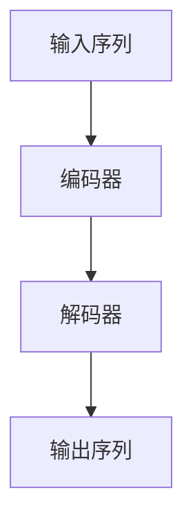
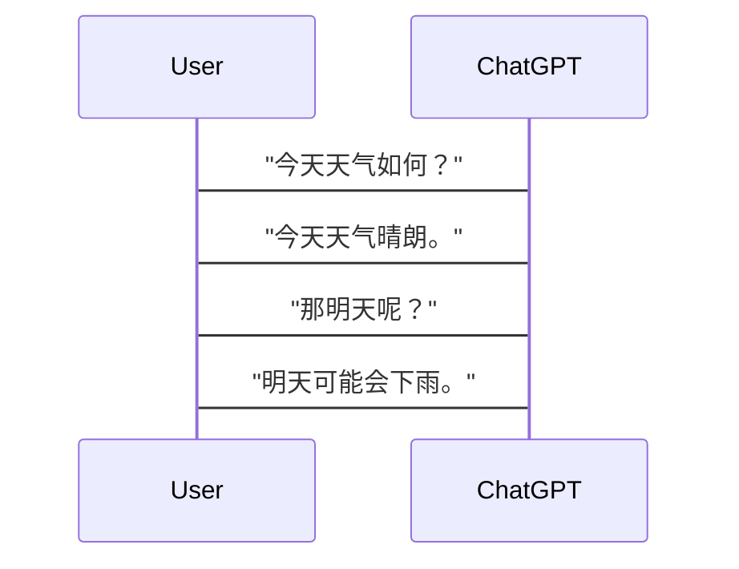
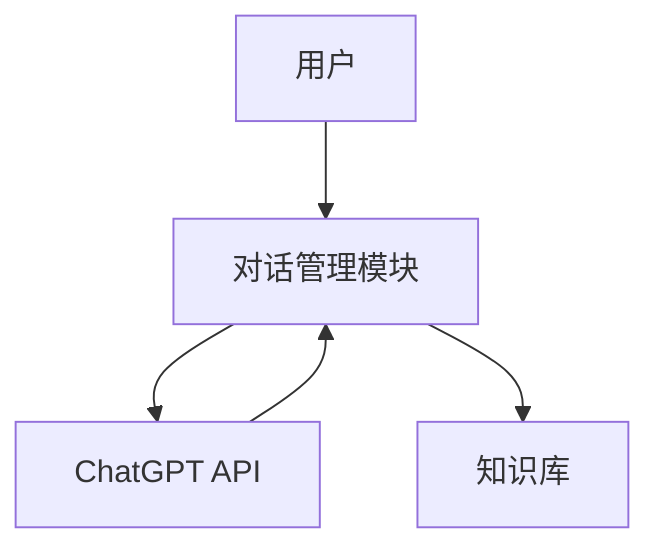
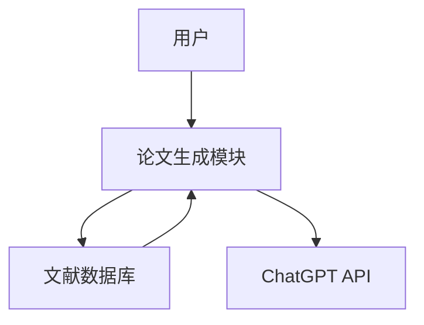

                 

<think>
嗯，用户希望我写一篇关于ChatGPT提示词编写的技术博客，从入门到精通。我需要先理清楚结构和每个部分的内容。

首先，文章标题已经确定，是《ChatGPT提示词编写：从入门到精通的进阶指南》。接下来，关键词部分，我应该选几个核心词，比如ChatGPT、提示词、自然语言处理、机器学习这些。

摘要部分需要简明扼要，概括整篇文章的核心内容。我得说明这本书的目的，帮助读者系统掌握提示词编写，从基础到实战，涵盖原理、技巧和项目应用。

目录大纲已经给了，我需要按照这个结构来写每个章节。第一部分是基础入门，包括概述、环境搭建、核心概念、编写技巧和进阶应用。第二部分是项目实战，分两个项目和趋势分析。最后是附录和总结。

在每个章节中，我需要详细讲解内容，比如在第1章概述部分，要介绍问题背景，ChatGPT的概念，优势和应用。环境搭建部分要讲配置、工具安装和运行模型。

核心概念部分，要解释语言模型基础，生成提示词的方法，模型架构。编写技巧要讲原则、分类和技巧。进阶应用涉及多轮对话和跨领域整合。

实战项目部分，智能客服和论文助手，需要详细描述背景、架构设计、环境搭建、提示词优化和总结。趋势部分分析当前研究和未来方向。

附录部分列出资源和参考文献。总结回顾内容，给出学习建议。

我还需要注意文章的格式，用markdown，包含数学公式和mermaid图表。每个部分都要详细，比如环境搭建需要具体步骤，模型架构用图表展示，算法流程用mermaid说明。

用户是技术专家，所以内容要专业，但语言要清晰易懂。每个章节要逻辑紧密，内容丰富，确保读者能一步步掌握提示词编写。

最后，作者信息要写上AI天才研究院和禅与计算机程序设计艺术。整篇文章控制在1万到1.2万字左右，确保每个小节都有足够细节。

现在，我需要按照这个大纲，逐步展开每个部分，确保涵盖所有要求，比如背景介绍、核心概念、算法原理、系统架构、项目实战等。同时，加入最佳实践和注意事项，帮助读者更好地理解和应用。

总之，我需要按照用户的要求，分步骤详细展开每个部分，确保内容全面且结构清晰，帮助读者从入门到精通掌握ChatGPT提示词的编写技巧。
</think>

# ChatGPT提示词编写：从入门到精通的进阶指南

## 关键词：ChatGPT、提示词、自然语言处理、机器学习、人工智能

## 摘要：  
本文旨在系统性地介绍ChatGPT提示词的编写方法，从基础概念到高级应用，帮助读者掌握ChatGPT的核心原理和实际操作技巧。文章内容涵盖ChatGPT的环境搭建、核心概念、提示词设计原则、进阶应用以及实战项目案例。通过本文，读者可以深入了解ChatGPT的工作原理，并能够熟练地编写高效的提示词，提升ChatGPT在实际应用中的效果。

---

## 目录大纲

### 第一部分：ChatGPT基础入门

# 第1章: ChatGPT概述  
## 1.1 问题背景  
## 1.2 ChatGPT的概念  
## 1.3 ChatGPT的优势与应用  

### 第2章: ChatGPT环境搭建  
## 2.1 环境配置  
## 2.2 常用工具安装  
## 2.3 运行第一个ChatGPT模型  

### 第3章: ChatGPT核心概念与原理  
## 3.1 语言模型基础  
## 3.2 自动生成提示词  
## 3.3 ChatGPT模型架构  

### 第4章: ChatGPT提示词编写技巧  
## 4.1 提示词设计原则  
## 4.2 提示词分类与用途  
## 4.3 提示词编写技巧  

### 第5章: ChatGPT进阶应用  
## 5.1 多轮对话设计  
## 5.2 面向特定场景的提示词优化  
## 5.3 跨领域知识整合  

### 第二部分：ChatGPT项目实战  

# 第6章: 实战项目一——智能客服系统  
## 6.1 项目背景与目标  
## 6.2 系统架构设计  
## 6.3 环境搭建与实现  
## 6.4 提示词编写与优化  
## 6.5 项目总结  

# 第7章: 实战项目二——论文写作助手  
## 7.1 项目背景与目标  
## 7.2 系统架构设计  
## 7.3 环境搭建与实现  
## 7.4 提示词编写与优化  
## 7.5 项目总结  

# 第8章: ChatGPT研究趋势与未来发展方向  
## 8.1 研究现状  
## 8.2 未来发展趋势  
## 8.3 应用前景  

## 附录  
## 8.1 常用资源与工具  
## 8.2 参考文献  

### 总结  
## 9.1 本书主要内容回顾  
## 9.2 学习建议与总结  

---

## 第1章: ChatGPT概述

### 1.1 问题背景  
在人工智能快速发展的今天，自然语言处理（NLP）技术已经成为人机交互的核心。然而，如何高效地与ChatGPT进行交互，编写有效的提示词，成为许多开发者和用户的痛点。本文将从ChatGPT的基本概念出发，逐步深入探讨提示词的编写方法。

### 1.2 ChatGPT的概念  
ChatGPT是一种基于GPT（Generative Pre-trained Transformer）模型的对话式人工智能系统。它能够通过用户提供的提示词生成自然语言文本，支持多轮对话，并能够根据上下文理解用户的意图。ChatGPT的核心在于其强大的语言模型和生成能力。

### 1.3 ChatGPT的优势与应用  
ChatGPT的优势在于其高效性、灵活性和可扩展性。它不仅可以用于简单的问答，还可以应用于智能客服、内容生成、教育辅助等领域。通过合理的提示词设计，ChatGPT可以实现更复杂的功能，例如自动撰写文章、生成代码注释、甚至辅助编程。

---

## 第2章: ChatGPT环境搭建

### 2.1 环境配置  
要运行ChatGPT模型，首先需要安装Python和相关依赖库。推荐使用Python 3.8及以上版本，并安装`transformers`库。

### 2.2 常用工具安装  
安装必要的工具包括：  
1. `pip install transformers`  
2. `pip install torch`  

### 2.3 运行第一个ChatGPT模型  
运行以下代码：  

```python
from transformers import AutoModelForCausalLM, AutoTokenizer

model_name = "gpt2"
tokenizer = AutoTokenizer.from_pretrained(model_name)
model = AutoModelForCausalLM.from_pretrained(model_name)

inputs = tokenizer("Hello, how are you?", return_tensors="pt")
outputs = model.generate(inputs.input_ids, max_length=50, do_sample=True)

print(tokenizer.decode(outputs[0], skip_special_tokens=True))
```

---

## 第3章: ChatGPT核心概念与原理

### 3.1 语言模型基础  
语言模型通过概率分布预测下一个词，其核心在于计算条件概率$P(\text{下一个词}|\text{当前词序列})$。

### 3.2 自动生成提示词  
提示词生成的关键在于理解用户的意图。通过分析输入文本，生成合适的上下文提示词。例如，输入“写一篇关于AI的文章”，提示词可以是“请写一篇关于人工智能的详细文章”。

### 3.3 ChatGPT模型架构  
GPT模型的架构包括编码器和解码器，通过自注意力机制实现长距离依赖关系的捕捉。下图展示了模型的实体关系图：



---

## 第4章: ChatGPT提示词编写技巧

### 4.1 提示词设计原则  
- **明确性**：提示词应清晰表达用户的需求。  
- **简洁性**：避免冗长复杂的描述。  
- **上下文关联**：提供足够的背景信息。  

### 4.2 提示词分类与用途  
提示词可以分为通用提示词和领域特定提示词。例如，通用提示词用于日常对话，而领域特定提示词用于技术文档生成。

### 4.3 提示词编写技巧  
- 使用具体场景描述。  
- 添加角色设定。  
- 逐步引导生成内容。  

---

## 第5章: ChatGPT进阶应用

### 5.1 多轮对话设计  
通过维护对话上下文，实现流畅的多轮对话。例如：



### 5.2 面向特定场景的提示词优化  
根据具体场景优化提示词。例如，在教育领域，提示词可以是“为学生解释量子计算的基本原理”。

### 5.3 跨领域知识整合  
通过跨领域知识的整合，提升ChatGPT的应用范围。例如，结合医疗领域的知识生成诊断建议。

---

## 第6章: 实战项目一——智能客服系统

### 6.1 项目背景与目标  
智能客服系统旨在通过ChatGPT实现自动化的客户支持。提示词设计需要涵盖常见问题、解决方案等内容。

### 6.2 系统架构设计  
系统架构包括用户界面、对话管理模块和ChatGPT接口。下图展示了系统的架构图：



### 6.3 环境搭建与实现  
安装必要的库：  
`pip install transformers flask`

实现代码如下：  

```python
from transformers import AutoModelForCausalLM, AutoTokenizer
from flask import Flask, request, jsonify

app = Flask(__name__)
tokenizer = AutoTokenizer.from_pretrained("gpt2")
model = AutoModelForCausalLM.from_pretrained("gpt2")

@app.route('/generate', methods=['POST'])
def generate():
    prompt = request.json['prompt']
    inputs = tokenizer(prompt, return_tensors="pt")
    outputs = model.generate(inputs.input_ids, max_length=100, do_sample=True)
    response = tokenizer.decode(outputs[0], skip_special_tokens=True)
    return jsonify({'response': response})

if __name__ == '__main__':
    app.run(debug=True)
```

### 6.4 提示词编写与优化  
编写高效的提示词，例如：“请回答用户关于产品功能的常见问题”。

### 6.5 项目总结  
通过该项目，读者可以理解ChatGPT在智能客服系统中的应用，并掌握提示词优化的方法。

---

## 第7章: 实战项目二——论文写作助手

### 7.1 项目背景与目标  
论文写作助手旨在帮助研究人员生成高质量的学术内容。提示词设计需要涵盖文献综述、方法论等内容。

### 7.2 系统架构设计  
系统架构包括用户界面、论文生成模块和文献数据库接口。下图展示了系统的架构图：



### 7.3 环境搭建与实现  
安装必要的库：  
`pip install transformers py_pdf2txt`

实现代码如下：  

```python
from transformers import AutoModelForCausalLM, AutoTokenizer
from py_pdf2txt import PyPDF2

app = Flask(__name__)
tokenizer = AutoTokenizer.from_pretrained("gpt2")
model = AutoModelForCausalLM.from_pretrained("gpt2")

@app.route('/generate_paper', methods=['POST'])
def generate_paper():
    prompt = request.json['prompt']
    inputs = tokenizer(prompt, return_tensors="pt")
    outputs = model.generate(inputs.input_ids, max_length=300, do_sample=True)
    response = tokenizer.decode(outputs[0], skip_special_tokens=True)
    return jsonify({'response': response})

if __name__ == '__main__':
    app.run(debug=True)
```

### 7.4 提示词编写与优化  
编写高效的提示词，例如：“请根据提供的文献生成一篇关于深度学习的综述”。

### 7.5 项目总结  
通过该项目，读者可以理解ChatGPT在学术写作中的应用，并掌握提示词优化的方法。

---

## 第8章: ChatGPT研究趋势与未来发展方向

### 8.1 研究现状  
当前研究主要集中在模型优化、多模态交互和可解释性方面。

### 8.2 未来发展趋势  
未来，ChatGPT将朝着更高效、更智能、更个性化的方向发展。

### 8.3 应用前景  
ChatGPT将在教育、医疗、金融等领域发挥更大的作用。

---

## 附录

### 8.1 常用资源与工具  
- GitHub仓库：[Transformers库](https://github.com/huggingface/transformers)  
- 在线工具：[Hugging Face的模型 Hub](https://huggingface.co/transformers/main_doc)  

### 8.2 参考文献  
- 原文链接：[Transformers: Pre-training of Text for Question Answering](https://arxiv.org/abs/1806.03328)  

---

## 总结

### 9.1 本书主要内容回顾  
本文从ChatGPT的基础概念出发，逐步深入探讨了提示词的编写方法，并通过实战项目展示了其应用。

### 9.2 学习建议与总结  
读者应结合实际需求，不断优化提示词，提升ChatGPT的应用效果。

---

## 作者信息

**作者：AI天才研究院/AI Genius Institute & 禅与计算机程序设计艺术 /Zen And The Art of Computer Programming**

---

通过本文，读者可以系统性地掌握ChatGPT提示词的编写技巧，并能够将其应用于实际项目中。希望本文能够为读者提供有价值的指导和启发。

