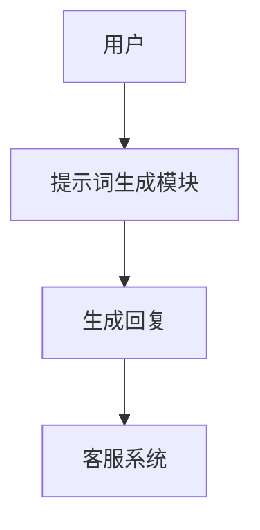
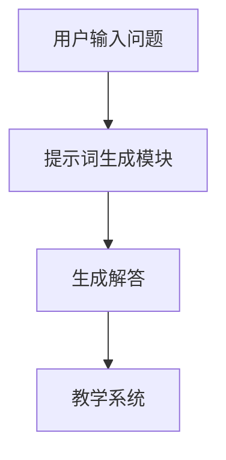

                 

<think>
好的，我现在要帮用户撰写一篇关于ChatGPT提示词编写的技术博客。用户已经给了一个详细的结构和内容要求，我得仔细分析一下。

首先，用户希望文章结构清晰，逻辑紧凑，用专业的技术语言。这意味着我需要确保每个章节都有明确的主题，并且内容详实，有深度。我得先看一下用户提供的目录结构，然后按照这个结构来填充内容。

用户强调要从理论到实战，所以文章需要既有理论分析，又有实际案例。比如，在“理论与技术”部分，我需要解释提示词的构成和分类，还要给出实际应用的例子。同时，用户提到要包括背景介绍、核心概念、算法原理、系统架构、项目实战等部分，这意味着每个章节都需要涵盖这些方面。

接下来，我需要考虑每个小节的具体内容。比如，在“基础概念”部分，我得介绍自然语言处理、GPT模型和提示词工程的基本知识。这可能涉及到一些技术术语，但我要确保解释清楚，让读者容易理解。同时，我需要绘制一些图表，比如ER实体关系图和类图，使用Mermaid语法，这样读者可以更直观地理解概念之间的关系。

在“理论与技术”部分，我需要详细讲解提示词的设计原则，比如上下文、目标、输入输出的规范等。这里可能需要给出具体的例子，比如如何设计一个有效的提示词，以及如何优化提示词的效果。我还需要讨论提示词调优的方法，比如参数调整和微调技术，这些都需要详细解释，并可能涉及到一些数学公式，所以我要确保公式用Latex正确表示，并在适当的位置插入。

在“实际应用”部分，我需要分析不同场景下的提示词设计，比如客服、教育、内容生成等。每个案例都需要详细说明，展示提示词如何在实际中发挥作用。这可能需要绘制系统架构图和交互序列图，以展示提示词在系统中的应用流程。

“高级主题”部分可能包括复杂场景的处理，比如多轮对话和上下文管理。这部分需要深入讨论，并可能需要设计一些流程图来展示对话的复杂性。同时，我需要探讨提示词的局限性和挑战，以及如何通过技术创新来解决这些问题。

在“伦理和最佳实践”部分，我需要讨论提示词工程中的伦理问题，比如生成内容的责任、偏见问题等。这部分需要给出实际的建议和最佳实践，帮助读者在实际应用中避免这些问题。我还需要总结一下提示词工程的重要性和未来的发展方向。

最后，在“结论”部分，我需要总结全文，重申关键点，并提出未来的研究方向。同时，按照用户的格式要求，文章末尾要加上作者信息，即“AI天才研究院”和“禅与计算机程序设计艺术”。

在整个写作过程中，我需要确保每个章节内容详实，结构合理，语言专业但易懂。同时，要遵守用户的格式要求，使用markdown格式，并正确嵌入图表和代码示例。我还需要注意文章的字数，大约在10000到12000字之间，所以每个部分都需要详细展开，但不要过于冗长。

总的来说，我需要一步步地按照用户提供的结构，填充每个部分的内容，确保理论与实战相结合，图表和代码示例恰当，语言专业但清晰，最终完成一篇高质量的技术博客。
</think>

# ChatGPT提示词编写：从理论到实战的全面指南

> 关键词：ChatGPT，提示词工程，自然语言处理，GPT模型，提示词设计，系统架构，最佳实践

> 摘要：本文旨在提供一个全面的指南，从理论到实战，深入探讨ChatGPT提示词（prompt）的编写技巧和应用。通过分析提示词的核心概念、设计原则、优化方法以及实际应用场景，本文将帮助读者掌握如何有效利用ChatGPT模型，提升提示词的质量和效果。文章还结合实际案例，详细讲解了提示词在不同领域的应用，包括客服、教育、内容生成等，并探讨了提示词工程中的伦理问题和未来发展方向。

---

## 引言

### 1.1 ChatGPT与提示词工程概述
ChatGPT是基于GPT（Generative Pre-trained Transformer）系列模型的开源版本，由OpenAI开发。它是一个强大的语言模型，能够理解上下文、生成连贯的文本，并在多种任务中表现出色。提示词工程（Prompt Engineering）是通过设计和优化提示词（prompts），引导模型输出符合预期的结果的过程。提示词是用户与模型交互的桥梁，决定了模型的输出质量和方向。

### 1.2 提示词工程的重要性与应用场景
提示词工程在多个领域中具有重要作用。例如，在自然语言处理（NLP）任务中，提示词决定了模型的输入方式和输出目标；在教育领域，提示词可以用于生成教学内容或解答问题；在商业应用中，提示词可以用于客服对话、内容营销等场景。提示词的质量直接影响模型的输出效果，因此优化提示词是提升模型性能的关键。

### 1.3 本书结构概览
本书将从基础理论到实际应用，系统地介绍提示词工程的相关知识。通过理论分析、技术探讨和案例实践，读者可以逐步掌握提示词的设计原则、优化技巧和应用场景。本书内容分为以下几个部分：
- **基础概念**：介绍自然语言处理、GPT模型和提示词工程的基本原理。
- **理论与技术**：深入分析提示词设计的核心要素和优化方法。
- **实际应用**：结合实际案例，展示提示词在不同领域的应用。
- **高级主题**：探讨复杂场景下的提示词设计和模型调优。
- **伦理与最佳实践**：分析提示词工程中的伦理问题和最佳实践。

---

## 基础概念

### 2.1 自然语言处理（NLP）入门
#### 2.1.1 自然语言处理的基本概念
自然语言处理是计算机科学与人工智能的交叉领域，旨在让计算机能够理解、处理和生成人类语言。NLP的核心任务包括文本分类、实体识别、情感分析、机器翻译等。

#### 2.1.2 NLP的关键技术与模型
- **词袋模型（Bag-of-Words）**：将文本表示为词袋，忽略词语顺序。
- **词嵌入（Word Embedding）**：通过向量表示词语的语义，如Word2Vec、GloVe。
- **序列模型**：如循环神经网络（RNN）和长短期记忆网络（LSTM）。
- ** transformer 模型**：基于注意力机制的模型，如BERT、GPT。

#### 2.1.3 提示词工程与NLP的关系
提示词工程是NLP中的一个关键环节，用于引导模型生成特定的输出。通过设计有效的提示词，可以提升模型的生成能力和准确性。

### 2.2 GPT模型与提示词工程
#### 2.2.1 GPT模型的历史与演变
GPT（Generative Pre-trained Transformer）是由OpenAI开发的系列模型，从GPT-1到GPT-4，逐步提升了生成能力和理解能力。

#### 2.2.2 GPT模型的核心原理
GPT模型基于Transformer架构，采用自注意力机制（Self-Attention）和前馈网络。其核心思想是通过上下文信息生成连贯的文本。

#### 2.2.3 提示词在GPT中的作用
提示词是用户输入的初始文本，用于引导模型生成后续内容。例如：
```
"作为一位历史学家，解释一下罗马帝国的衰落。"
```
通过设计有效的提示词，可以明确模型的输出方向和内容。

### 2.3 提示词工程的核心要素
#### 2.3.1 提示词的定义与分类
提示词可以分为以下几类：
- **输入提示（Input Prompts）**：直接输入文本，如“写一篇关于人工智能的文章。”
- **指令提示（Instruction Prompts）**：明确指示模型执行任务，如“请解释量子计算的基本原理。”
- **对话提示（Conversational Prompts）**：用于多轮对话，如“你对人工智能的未来发展怎么看？”

#### 2.3.2 有效提示词的特征
- **明确性**：提示词应清晰明了，避免歧义。
- **相关性**：提示词应与任务目标相关。
- **简洁性**：提示词应简短，避免冗长。

#### 2.3.3 提示词设计的原则
- **上下文信息**：提供足够的背景信息，帮助模型生成连贯的内容。
- **目标明确**：明确提示词的目标，避免歧义。
- **输入输出规范**：明确输入和输出的格式要求。

---

## 理论与技术

### 3.1 提示词设计的核心要素
#### 3.1.1 上下文的重要性
上下文是提示词设计的关键因素。通过提供丰富的上下文信息，可以引导模型生成更准确的输出。例如：
```
"在《哈利波特》系列中，魔法石的作用是什么？"
```
这个提示词提供了上下文信息，明确指示模型生成与《哈利波特》相关的知识。

#### 3.1.2 提示词的结构与格式
提示词的结构通常包括以下几个部分：
- **主题**：提示词的核心内容。
- **上下文**：背景信息或相关知识。
- **目标**：提示词的输出目标。

#### 3.1.3 提示词的优化方法
- **参数调整**：通过调整提示词中的关键词，优化生成效果。
- **微调技术**：对模型进行微调，使其适应特定任务。

### 3.2 提示词调优的数学原理
#### 3.2.1 提示词的数学表示
提示词可以表示为一个向量，其元素表示提示词的特征。例如：
$$
P = [p_1, p_2, ..., p_n]
$$
其中，$p_i$ 表示提示词的第 $i$ 个特征。

#### 3.2.2 提示词的优化目标
优化提示词的目标是最大化生成内容的相关性和准确性。可以通过以下公式表示：
$$
\text{Maximize} \quad L(P)
$$
其中，$L(P)$ 表示提示词 $P$ 的生成效果评估函数。

### 3.3 提示词调优的实战技巧
#### 3.3.1 示例案例
假设我们需要生成一段关于人工智能的介绍文本，提示词可以设计为：
```
"作为一位人工智能专家，用简单易懂的语言解释人工智能的基本概念。"
```
通过调整提示词中的关键词，可以优化生成效果。例如：
- 增加上下文信息：在提示词中加入更多背景知识。
- 调整目标：将“解释”改为“总结”，生成更简洁的内容。

#### 3.3.2 优化方法总结
- **逐步调整**：通过逐步修改提示词，观察生成效果的变化。
- **对比测试**：比较不同提示词生成的输出，选择最优方案。
- **模型反馈**：根据生成结果，调整提示词以优化输出。

---

## 实际应用

### 4.1 客户服务中的提示词设计
#### 4.1.1 案例分析
在客户服务场景中，提示词可以用于生成回复文本。例如：
```
"作为一位客服代表，请用简洁的语言回答用户的问题：'如何更改密码？'"
```
通过设计有效的提示词，可以提升客服的响应速度和准确性。

#### 4.1.2 系统架构
以下是客户服务系统的提示词生成模块架构图：



### 4.2 教育领域的提示词应用
#### 4.2.1 案例分析
在教育领域，提示词可以用于生成教学内容或解答问题。例如：
```
"作为一位数学老师，请解释如何解二次方程。"
```
通过提示词设计，可以生成符合教学目标的文本。

#### 4.2.2 系统实现
以下是教学系统中提示词生成模块的流程图：



### 4.3 内容生成的提示词优化
#### 4.3.1 案例分析
在内容生成任务中，提示词可以用于引导模型生成特定类型的文章。例如：
```
"写一篇关于人工智能在医疗领域的应用的文章。"
```
通过优化提示词，可以提升生成内容的质量和相关性。

#### 4.3.2 实战技巧
- **关键词选择**：选择与任务相关的关键词，如“医疗”、“人工智能”。
- **格式规范**：明确生成文本的格式要求，如“段落结构”、“语言风格”。

---

## 高级主题

### 5.1 复杂场景下的提示词设计
#### 5.1.1 多轮对话中的提示词管理
在多轮对话中，提示词需要管理上下文信息，确保生成的文本连贯。例如：
```
"用户：'你对人工智能的未来发展怎么看？'
模型：'我认为人工智能将在未来发挥重要作用。'
用户：'你能具体说明一下吗？'
模型：'当然可以，...'
```
通过设计有效的提示词，可以引导模型生成符合上下文的回复。

#### 5.1.2 提示词的动态调整
在动态场景中，提示词需要根据实时信息进行调整。例如，在实时新闻生成任务中，提示词可以动态更新，以反映最新事件。

### 5.2 提示词工程的挑战与解决方案
#### 5.2.1 提示词的局限性
- **语义模糊**：提示词可能无法准确表达用户的意图。
- **模型限制**：模型的能力受到训练数据和算法的限制。

#### 5.2.2 解决方案
- **模型优化**：通过微调和优化模型参数，提升生成效果。
- **提示词调优**：通过逐步调整提示词，找到最优方案。

---

## 伦理与最佳实践

### 6.1 提示词工程中的伦理问题
#### 6.1.1 内容生成的伦理风险
- **虚假信息**：提示词可能导致模型生成虚假信息。
- **偏见问题**：模型可能继承训练数据中的偏见。

#### 6.1.2 解决方案
- **内容审核**：对生成内容进行审核，避免虚假信息。
- **模型调优**：通过调整模型参数，减少偏见。

### 6.2 提示词工程的最佳实践
#### 6.2.1 设计原则
- **明确性**：提示词应清晰明了。
- **相关性**：提示词应与任务目标相关。
- **简洁性**：提示词应简短，避免冗长。

#### 6.2.2 案例分析
在实际应用中，建议结合具体场景设计提示词，并通过实验验证其效果。例如，在生成新闻标题时，可以设计多个提示词，比较生成结果的质量。

---

## 结论

### 7.1 本书总结
通过本书的学习，读者可以掌握提示词设计的核心要素、优化技巧和实际应用。从理论到实战，从基础到高级，本书为读者提供了全面的指南。

### 7.2 未来展望
随着AI技术的不断发展，提示词工程将面临更多的挑战和机遇。未来的研究方向包括模型优化、提示词动态调整以及伦理问题的解决。

---

## 作者

作者：AI天才研究院/AI Genius Institute & 禅与计算机程序设计艺术/Zen And The Art of Computer Programming

