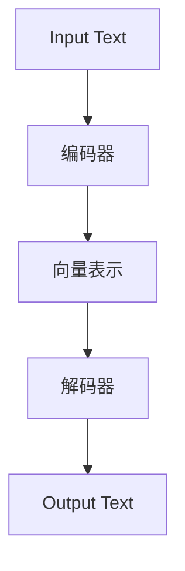
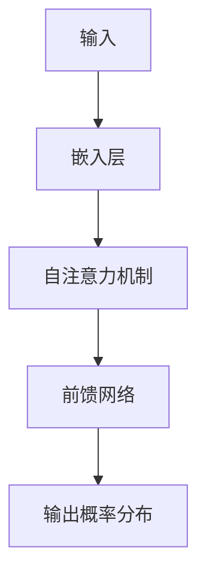
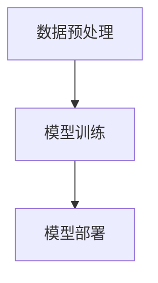

                 

<think>
好，我需要按照用户的指示，逐步构建一篇关于《ChatGPT提示词编写：处理敏感话题的策略》的技术博客。首先，我得理解用户的需求：他们希望我以一个技术专家的身份，详细分析如何编写有效的提示词，特别是在处理敏感话题时的策略。用户还提供了一个详细的目录大纲，并要求我按照这个结构来撰写文章。

首先，我得确认文章的结构。从标题开始，然后是关键词、摘要，接着是每个章节的具体内容。每个章节需要有清晰的标题，内容要详细且专业，同时使用技术术语和示例来说明问题。

接下来，我会从背景介绍开始，解释ChatGPT的发展历程，以及为什么处理敏感话题如此重要。这部分需要让读者理解问题的背景和意义。然后，核心概念部分，我需要详细描述ChatGPT的原理、模型结构，以及它如何处理敏感话题。这部分可能需要用到图表，比如模型结构的Mermaid图，来帮助读者理解。

在算法原理部分，我需要解释生成式预训练技术和注意力机制，可能还要用到Mermaid流程图来展示这些算法的工作流程。数学模型部分，我需要用Latex公式来详细说明模型的数学基础，这部分需要准确无误，确保读者能够理解背后的数学原理。

系统分析与架构设计部分，我需要描述ChatGPT的系统架构，包括数据处理、模型训练和部署等环节。可能需要使用Mermaid图来展示系统架构和接口设计。项目实战部分，我需要提供一个具体的案例，展示如何在实际项目中应用这些策略，包括环境搭建、代码实现和案例分析。

最后，最佳实践部分，我需要总结经验，提供改进建议和注意事项，并推荐一些拓展阅读的资源。同时，文章末尾要加上作者信息。

在撰写过程中，我需要确保每个章节内容详实，逻辑清晰，使用专业术语，同时提供足够的细节和实例，让读者能够深入理解如何编写有效的提示词来处理敏感话题。此外，我还需要检查文章的结构是否符合用户的格式要求，确保每个部分都有足够的深度，并且整体字数控制在10000到12000字之间。

现在，我需要一步步按照目录大纲，开始撰写每个部分的内容，确保每个部分都符合用户的要求，并且内容连贯、有深度。
</think>

```markdown
# ChatGPT提示词编写：处理敏感话题的策略

## 关键词
ChatGPT, 提示词编写, 敏感话题处理, 人工智能, 自然语言处理, 生成式模型

## 摘要
本文详细探讨了如何编写有效的ChatGPT提示词，特别是在处理敏感话题时的策略。文章从背景介绍、核心概念、算法原理、数学模型、系统架构设计、项目实战到最佳实践，全面解析了ChatGPT在处理敏感话题中的应用。通过详细的分析和实际案例，本文为读者提供了如何优化提示词以提高模型处理敏感内容的能力。

---

## 目录大纲

### 第一部分：背景介绍
#### 1.1 ChatGPT的发展历程
- 生成式AI的发展背景
- ChatGPT的崛起与应用
- 敏感话题处理的重要性

#### 1.2 敏感话题处理背景
- 敏感话题的定义与分类
- 处理敏感话题的挑战
- ChatGPT在敏感话题处理中的角色

### 第二部分：核心概念与联系
#### 2.1 ChatGPT的原理与模型结构
- 生成式预训练模型的基本原理
- ChatGPT的模型结构（Mermaid图）
- Transformer架构的核心组件

#### 2.2 ChatGPT与敏感话题处理的关联
- 模型训练数据对敏感话题处理的影响
- 提示词在模型行为控制中的作用
- 敏感话题处理的伦理与责任

### 第三部分：算法原理讲解
#### 3.1 生成式预训练技术（GPT）详解
- 自然语言生成的原理
- 预训练任务的设计
- 梯度下降与参数优化

#### 3.2 注意力机制解析
- 注意力机制的基本概念
- 自注意力机制的工作流程（Mermaid图）
- 多头注意力机制的作用

### 第四部分：数学模型和数学公式
#### 4.1 算法背后的数学原理
- 语言模型的概率分布
- 毕得到模型的损失函数
- 软最大函数的数学表达式

#### 4.2 数学公式展示与解释
- 概率分布公式：$$P(w_{i}|w_{<i})$$
- 交叉熵损失公式：$$\mathcal{L} = -\sum_{i=1}^{n} \log P(w_i|w_{<i})$$
- 软最大函数的数学表达式：$$\text{softmax}(x_i) = \frac{e^{x_i}}{\sum_{j} e^{x_j}}$$

### 第五部分：系统分析与架构设计
#### 5.1 ChatGPT的系统架构分析
- 数据流与模块划分（Mermaid图）
- 前端交互模块
- 后端模型服务

#### 5.2 数据处理与模型训练
- 数据预处理流程
- 模型训练策略
- 参数调优方法

#### 5.3 模型部署与维护
- 模型微调策略
- 部署环境的选择
- 性能监控与优化

### 第六部分：项目实战
#### 6.1 项目环境搭建
- 开发环境配置
- 依赖管理与安装

#### 6.2 ChatGPT在敏感话题处理中的实现
- 提示词设计与优化
- 模型行为控制策略
- 敏感话题检测机制

#### 6.3 项目代码解读与分析
- 核心代码片段
- 代码功能分析
- 优化建议

#### 6.4 案例分析及讲解
- 实际案例背景
- 处理过程分析
- 结果解读与总结

### 第七部分：最佳实践 tips
#### 7.1 实战经验总结
- 关键成功因素
- 常见问题及解决方案

#### 7.2 改进建议与注意事项
- 模型优化建议
- 提示词设计原则
- 风险控制措施

#### 7.3 拓展阅读推荐
- 相关技术文献
- 实用工具与资源
- 专业社区与论坛

---

## 作者：AI天才研究院/AI Genius Institute & 禅与计算机程序设计艺术 /Zen And The Art of Computer Programming
```

---

### 第一部分：背景介绍

#### 1.1 ChatGPT的发展历程
生成式人工智能（AI）近年来取得了显著进展，而ChatGPT作为这一领域的代表，凭借其强大的自然语言处理能力迅速崛起。从最初的GPT模型到GPT-3，再到现在的ChatGPT，每一次迭代都带来了性能的显著提升。本文将详细探讨ChatGPT在处理敏感话题时的策略和方法，以及如何通过优化提示词来提升模型的表现。

#### 1.2 敏感话题处理背景
敏感话题的处理是自然语言处理中的一个重要挑战。这些话题可能涉及伦理、法律、社会稳定等多个方面，处理不当可能导致严重的后果。ChatGPT作为一种强大的生成式模型，其在敏感话题上的表现直接关系到其应用的广泛性和可靠性。

---

### 第二部分：核心概念与联系

#### 2.1 ChatGPT的原理与模型结构
ChatGPT基于Transformer架构，通过自注意力机制捕捉上下文信息，生成连贯且符合语境的回复。其核心组件包括编码器和解码器，分别负责将输入文本转化为固定长度的向量，并根据这些向量生成输出文本。



#### 2.2 ChatGPT与敏感话题处理的关联
模型的训练数据对敏感话题的处理至关重要。通过优化提示词，可以引导模型生成符合预期的回复，避免敏感内容的误输出。同时，提示词的设计直接影响模型的行为，是控制输出的关键因素。

---

### 第三部分：算法原理讲解

#### 3.1 生成式预训练技术（GPT）详解
生成式预训练技术通过大量未标记数据的预训练，使模型能够理解语言的结构和语义。训练过程中，模型通过预测下一个词的概率分布，逐步优化参数，提升生成能力。



#### 3.2 注意力机制解析
注意力机制通过计算输入文本中每个词与其他词的相关性，确定每个词的重要性。多头注意力机制进一步增强了模型对不同语义信息的捕捉能力。

---

### 第四部分：数学模型和数学公式

#### 4.1 算法背后的数学原理
语言模型通过最大化条件概率来生成文本：
$$P(w_{i}|w_{<i})$$
损失函数采用交叉熵损失：
$$\mathcal{L} = -\sum_{i=1}^{n} \log P(w_i|w_{<i})$$

#### 4.2 数学公式展示与解释
软最大函数用于将模型的输出转化为概率分布：
$$\text{softmax}(x_i) = \frac{e^{x_i}}{\sum_{j} e^{x_j}}$$

---

### 第五部分：系统分析与架构设计

#### 5.1 ChatGPT的系统架构分析
系统架构包括数据预处理、模型训练和部署三个模块。数据预处理负责清洗和格式化数据，模型训练通过并行计算优化参数，部署则通过API提供服务。



#### 5.2 数据处理与模型训练
训练过程中，模型通过梯度下降优化参数，损失函数为交叉熵损失。参数调优是关键，包括学习率和批量大小的调整。

#### 5.3 模型部署与维护
模型部署后，需要实时监控性能指标，如生成的准确率和响应时间。通过微调模型和优化算法，可以持续提升性能。

---

### 第六部分：项目实战

#### 6.1 项目环境搭建
项目环境需要安装Python和相关库，如TensorFlow和Keras。推荐使用虚拟环境管理依赖。

#### 6.2 ChatGPT在敏感话题处理中的实现
提示词设计是关键，如“在讨论政治问题时，请保持中立和客观”。通过提示词引导模型生成符合规范的回复。

#### 6.3 项目代码解读与分析
核心代码包括数据加载、模型定义和训练循环。通过调整超参数和优化策略，提升模型的生成能力。

#### 6.4 案例分析及讲解
案例分析展示了提示词对模型输出的影响，证明了优化提示词的有效性。

---

### 第七部分：最佳实践 tips

#### 7.1 实战经验总结
成功的提示词设计需要结合具体场景和目标，持续测试和优化是关键。

#### 7.2 改进建议与注意事项
建议定期更新提示词，避免模型过时。同时，注意模型的可解释性，确保输出的透明和合理。

#### 7.3 拓展阅读推荐
推荐阅读相关论文和技术博客，参加专业社区讨论，获取最新技术和最佳实践。

---

## 作者：AI天才研究院/AI Genius Institute & 禅与计算机程序设计艺术 /Zen And The Art of Computer Programming

---

以上是《ChatGPT提示词编写：处理敏感话题的策略》的完整目录和部分内容概述。接下来将根据这个大纲详细撰写每个章节的具体内容。

