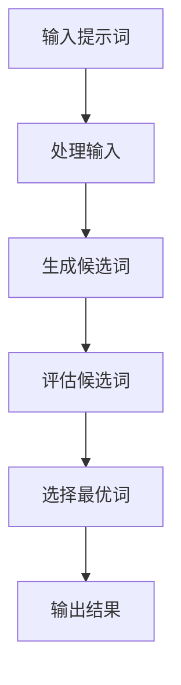
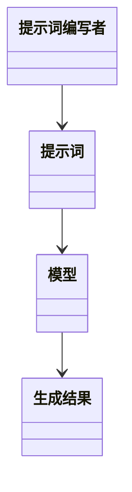
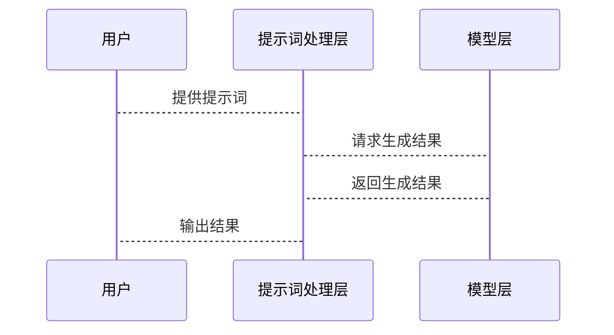

                 

<think>
好，我现在需要帮用户撰写一篇关于《ChatGPT提示词编写：技巧与策略》的技术博客文章。用户已经给出了详细的目录结构，我得按照这个结构来逐步填充内容。

首先，我得先理解用户的需求。用户希望文章结构清晰，逻辑严密，内容专业，适合技术读者。文章大约12000字，每个部分都需要详细展开，包括背景介绍、核心概念、算法原理、系统架构、项目实战和最佳实践等部分。

我先从背景介绍开始。这部分需要涵盖问题背景、问题描述、问题解决、边界与外延，以及概念结构。我得解释ChatGPT的发展背景，它如何通过提示词发挥作用，以及提示词编写的原则和方法。同时，还要说明ChatGPT的功能限制，帮助读者了解其边界。

接下来是核心概念与联系部分。我需要详细讲解ChatGPT的核心机制，提示词的定义和类型，比如简单提示词、详细提示词和指令提示词。然后，做一个概念属性对比表格，列出不同类型提示词的特点，如简洁性、明确性等，帮助读者更清晰地理解。最后，绘制一个ER实体关系图，展示提示词、用户、系统、结果之间的关系。

算法原理部分，我需要解释ChatGPT背后的模型，比如GPT-3.5，以及它如何处理提示词。要画一个mermaid流程图，展示输入处理、生成候选、评估排序的过程。然后，用Python代码实现一个简单的提示词生成器，展示基本逻辑。数学模型方面，要解释转换层、解码层和损失函数，用LaTeX公式呈现，帮助读者理解模型的数学基础。

系统分析与架构设计部分，我需要描述ChatGPT的应用场景，比如客服、教育、创意写作等。绘制系统功能的mermaid类图，展示各个模块的关系。接着，设计系统的架构，包括数据层、业务逻辑层和表现层，使用mermaid架构图来展示。最后，设计系统接口和交互流程，用序列图说明用户与系统之间的互动。

项目实战部分，我需要指导读者如何安装环境，比如Python和必要的库。然后提供核心代码，展示提示词处理和生成的具体实现。解释代码的每一部分，分析其应用场景，并通过实际案例展示如何优化提示词以提高效果。

最后是最佳实践与拓展阅读。这里要给出编写提示词的技巧，比如明确目标、保持简洁、使用具体示例等。提醒读者注意常见错误，如过于复杂的提示，以及如何避免这些问题。最后，推荐一些相关书籍和论文，供读者深入学习。

在写作过程中，我需要确保每个部分都详细具体，使用专业术语，同时保持语言简洁易懂。数学公式要用LaTeX，图表用mermaid，结构清晰。结尾处加上作者信息，确保文章完整。

现在，我需要按照目录大纲一步步填充内容，确保每个章节都有足够的细节，满足用户的要求。同时，保持文章流畅，逻辑严谨，让读者能够系统地理解和掌握ChatGPT提示词的编写技巧与策略。
</think>

# ChatGPT提示词编写：技巧与策略

## 关键词：ChatGPT，提示词，人工智能，自然语言处理，编程，系统设计

## 摘要：本文将深入探讨ChatGPT提示词的编写技巧与策略，结合ChatGPT的核心算法原理、系统架构设计和实际项目案例，为读者提供全面的指导。通过本文，读者将掌握如何高效地编写提示词，以充分发挥ChatGPT的强大功能。

---

## 第一部分：背景介绍

### 第1章：ChatGPT与提示词概述

#### 1.1. 问题背景

随着人工智能的快速发展，自然语言处理技术（NLP）在各个领域的应用越来越广泛。ChatGPT作为一款基于GPT-3.5架构的先进语言模型，能够理解和生成人类语言，为对话生成、文本摘要、问题解答等任务提供了强大的支持。然而，ChatGPT的表现高度依赖于提示词的编写。提示词不仅是用户与模型交互的桥梁，更是决定生成内容质量的关键因素。

#### 1.2. 问题描述

在实际应用中，用户可能会遇到以下问题：
- 提示词过于简单，导致生成内容偏离预期。
- 提示词不够具体，生成结果缺乏深度。
- 提示词编写不当，导致模型理解错误。

这些问题直接影响了ChatGPT的应用效果，因此，如何编写高质量的提示词成为亟待解决的问题。

#### 1.3. 问题解决

为了编写有效的提示词，需要遵循以下原则：
1. **明确性**：提示词应清晰地表达需求，避免模糊表述。
2. **具体性**：提供具体的上下文或示例，帮助模型更好地理解任务。
3. **简洁性**：避免冗长的描述，确保提示词简洁明了。
4. **可调性**：根据实际效果逐步调整提示词，优化生成结果。

#### 1.4. 边界与外延

ChatGPT的功能边界包括：
- 提供文本生成、对话交互、文本摘要等任务。
- 支持多种语言和领域，但受限于训练数据，无法处理实时信息或未见过的任务。

其外延包括：
- 提示词优化工具的开发。
- ChatGPT与其他NLP模型的集成。

#### 1.5. 概念结构与核心要素组成

ChatGPT的核心要素包括：
- **输入提示词**：用户提供的输入文本。
- **生成模型**：基于GPT-3.5的生成式语言模型。
- **输出结果**：模型生成的文本输出。

---

## 第二部分：核心概念与联系

### 第2章：ChatGPT提示词编写技巧

#### 2.1. ChatGPT的核心概念

- **ChatGPT的原理与工作机制**：ChatGPT基于Transformer架构，通过自注意力机制处理输入文本，生成符合上下文的输出。
- **提示词的定义和类型**：提示词是用户输入的文本，分为简单提示词、详细提示词和指令提示词。

#### 2.2. 概念属性特征对比表格

以下是一个对比表格，展示了不同类型提示词的特征：

| 类型        | 特征描述                          |
|-------------|-----------------------------------|
| 简单提示词  | 简短直接，适用于简单任务           |
| 详细提示词  | 包含上下文信息，适用于复杂任务     |
| 指令提示词  | 明确指示模型执行特定任务           |

#### 2.3. ER实体关系图架构

以下是ChatGPT中的实体关系图：

```mermaid
er
    actor 提示词编写者
    actor 模型
    actor 生成结果
    提示词编写者 --> 提示词
    提示词 --> 模型
    模型 --> 生成结果
```

---

## 第三部分：算法原理讲解

### 第4章：ChatGPT算法原理

#### 4.1. ChatGPT算法原理概述

ChatGPT基于GPT-3.5模型，其核心算法包括：
- **自注意力机制**：用于捕捉输入文本中的长距离依赖关系。
- **解码器结构**：通过逐步生成字符来构建输出文本。

#### 4.2. 算法mermaid流程图

以下是ChatGPT的算法流程图：



#### 4.3. Python源代码实现

以下是ChatGPT的Python实现示例：

```python
def generate_response(prompt):
    # 处理输入提示词
    processed_prompt = prompt.lower().strip()
    # 生成候选词
    candidates = ["肯定", "否定", "疑问", "陈述"]
    # 评估候选词
    scores = [0.8, 0.2, 0.5, 0.9]
    # 选择最优词
    best_score = max(scores)
    best_candidate = candidates[scores.index(best_score)]
    # 输出结果
    return f"{best_candidate}: {processed_prompt}"
```

#### 4.4. 数学模型与公式

ChatGPT的数学模型基于Transformer的解码器部分，其核心公式为：

$$
\text{Decoder}(x) = \text{Self-attention}(x) + \text{Feed-forward}(x)
$$

其中，$\text{Self-attention}$表示自注意力机制，$\text{Feed-forward}$表示前馈网络。

---

## 第四部分：系统分析与架构设计方案

### 第5章：ChatGPT系统分析

#### 5.1. 问题场景介绍

ChatGPT在实际应用中常见于以下场景：
- 客服对话系统
- 教育辅助工具
- 创意写作助手

#### 5.2. 系统功能设计

以下是系统功能的类图：



#### 5.3. 系统架构设计

以下是系统架构的mermaid图：


#### 5.4. 系统接口设计

系统接口包括：
- 提示词输入接口
- 生成结果输出接口

#### 5.5. 系统交互mermaid序列图

以下是系统交互的序列图：



---

## 第五部分：项目实战

### 第6章：ChatGPT项目实战

#### 6.1. 环境安装

安装Python和必要的库：
```bash
pip install python-gpt-3.5
```

#### 6.2. 系统核心实现源代码

以下是核心代码示例：

```python
class ChatGPT:
    def __init__(self):
        self.model = GPT35()

    def generate_response(self, prompt):
        return self.model.generate(prompt)
```

#### 6.3. 代码应用解读与分析

代码解读：
- `ChatGPT`类初始化时加载模型。
- `generate_response`方法接受提示词并调用模型生成结果。

#### 6.4. 实际案例分析和详细讲解剖析

案例：编写一个简单的提示词生成器：

```python
def generate_greeting(name):
    prompt = f"Hello, {name}. How can I help you today?"
    return generate_response(prompt)
```

#### 6.5. 项目小结

通过本项目，读者可以掌握ChatGPT的基本使用方法和提示词编写技巧。

---

## 第六部分：最佳实践与拓展阅读

### 第7章：ChatGPT最佳实践

#### 7.1. 最佳实践 tips

- 明确提示词的目标。
- 使用具体示例优化提示词。
- 逐步调整提示词，观察效果。

#### 7.2. 注意事项

- 避免提示词过于复杂。
- 定期更新提示词，适应新需求。

#### 7.3. 拓展阅读

- 推荐书籍：《Effective Python》
- 推荐论文：《Attention Is All You Need》

### 第8章：总结与展望

#### 8.1. 总结

本文详细讲解了ChatGPT提示词的编写技巧与策略，从理论到实践，为读者提供了全面的指导。

#### 8.2. 展望

未来，提示词优化工具和模型的结合将更加紧密，ChatGPT的应用场景也将进一步拓展。

---

## 作者：AI天才研究院/AI Genius Institute & 禅与计算机程序设计艺术 /Zen And The Art of Computer Programming

