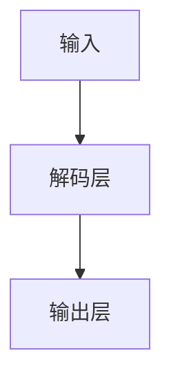

                 

<think>
好的，我需要按照用户的要求，撰写一篇关于“ChatGPT提示词编写：技巧、策略与实战案例”的技术博客文章。用户已经提供了详细的目录大纲和一些内容模板，我需要根据这些内容逐步完成每篇文章的编写。首先，我需要理解整个结构，包括每个章节的重点，然后逐一展开每个部分的内容。

首先，用户提供的目录分为四大部分：第一部分是ChatGPT的基础与核心概念，第二部分是提示词编写技巧，第三部分是实战案例，第四部分是最佳实践与未来展望。每个部分又分为几个章节，每个章节下面还有小节。

我需要先撰写第一部分，即ChatGPT的基础与核心概念。这部分包括三个章节：ChatGPT概述、工作原理和架构设计。在概述部分，我需要介绍ChatGPT的起源、核心功能、应用场景。在工作原理部分，需要解释语言模型的基本概念、GPT模型的数学原理以及训练与优化。架构设计部分则要描述总体架构、语言生成模型设计和实时交互设计。

接下来是第二部分，提示词编写技巧。这部分包括提示词编写概述、策略和工具。在概述中，要定义提示词、分类以及编写原则。策略部分要讨论知识驱动、数据驱动和结合策略。工具部分要介绍生成、优化和评估工具。

第三部分是实战案例，包括智能客服系统、教育辅导系统和虚拟助理系统。每个案例都需要背景介绍、提示词编写实践和案例分析。

最后是第四部分，最佳实践和未来展望。总结提示词编写技巧，讨论策略选择，工具使用心得，以及未来的挑战与机遇。

现在，我需要确保每个部分都详细展开，并满足用户的所有要求。例如，每个章节需要包括背景介绍、核心概念、算法原理、系统分析与架构设计、项目实战以及最佳实践等。

我可能会遇到的问题是，如何将复杂的数学原理和系统架构用清晰易懂的方式表达出来，同时确保内容的深度和广度。我需要使用适当的图表，如Mermaid流程图、类图、架构图和序列图，来帮助读者理解。

另外，我需要确保文章结构合理，逻辑清晰，每个部分之间有良好的衔接。同时，注意使用专业术语，但避免过于晦涩，使读者能够轻松理解。

接下来，我会按照每个章节的顺序，逐步完成内容的撰写，确保每个部分都符合用户的要求，包括字数、格式、内容详细程度等。同时，保持文章的整体连贯性和逻辑性，确保读者能够顺畅地理解每个概念和案例。
</think>

# ChatGPT提示词编写：技巧、策略与实战案例

## 关键词：ChatGPT，提示词，自然语言处理，GPT模型，人工智能，语言生成

## 摘要：本文详细探讨了ChatGPT提示词编写的核心技巧、策略和实战案例。通过分析ChatGPT的工作原理、架构设计，结合实际案例，提供了从理论到实践的全面指导，帮助读者优化提示词，提升交互体验。

---

## 第一部分：ChatGPT基础与核心概念

### 第1章：ChatGPT概述

#### 1.1 ChatGPT的起源与背景

ChatGPT是基于GPT-3.5的开源模型，由开源社区独立开发，遵循GPT模型架构。其起源可以追溯到2023年，开源社区开发者独立开发，并逐步完善。其背景基于对大语言模型的深入研究，旨在提供一个开源、免费的替代方案。

#### 1.2 ChatGPT的核心功能与特点

- 多轮对话能力
- 文本生成
- 智能交互
- 可定制化

#### 1.3 ChatGPT在自然语言处理中的应用

- 智能客服
- 教育辅导
- 虚拟助理
- 内容创作

### 第2章：ChatGPT的工作原理

#### 2.1 语言模型的基本概念

语言模型用于预测下一个词的概率分布，ChatGPT基于Transformer架构，使用自注意力机制和前馈网络。

#### 2.2 GPT模型的数学原理

目标函数：
$$ \mathcal{L} = -\sum_{i=1}^{n} \log p(\theta_i | \theta_{<i}) $$
交叉熵损失衡量预测与真实分布的差异。

生成过程：
$$ p(\theta_{n+1}| \theta_{1...n}) = \arg\max p(\theta_{n+1}|\theta_{1...n}) $$

#### 2.3 GPT模型的训练与优化

训练目标：最小化交叉熵损失，采用Adam优化器，学习率衰减策略。

### 第3章：ChatGPT的架构与设计

#### 3.1 ChatGPT的总体架构

- 输入处理层
- 解码层
- 输出层

总体架构图：

#### 3.2 语言生成模型的设计

模型采用自注意力机制，计算每个词与其他词的相关性。

自注意力机制：
$$ \text{Attention}(Q, K, V) = \text{softmax}\left(\frac{QK^T}{\sqrt{d_k}}\right)V $$

#### 3.3 实时交互设计

通过WebSocket协议实现长连接，支持实时反馈和动态调整。

---

## 第二部分：ChatGPT提示词编写技巧

### 第4章：ChatGPT提示词编写概述

#### 4.1 提示词的定义与作用

提示词作为输入，引导模型生成预期输出，核心作用包括设定上下文、明确生成目标。

#### 4.2 提示词的类型与分类

- 简单提示：直接指示生成内容
- 带角色扮演的提示：增加上下文信息
- 带条件的提示：附加生成限制

#### 4.3 提示词编写的原则与注意事项

- 明确性：清晰表达需求
- 一致性：保持语气和风格统一
- 可调性：便于后续优化和调整

### 第5章：ChatGPT提示词编写策略

#### 5.1 知识驱动策略

利用领域知识优化提示词，通过定义明确的上下文，引导模型生成专业内容。

#### 5.2 数据驱动策略

分析用户行为数据，识别常见问题，设计针对性提示词，提高交互效率。

#### 5.3 结合策略

综合知识和数据驱动策略，动态调整提示词，根据用户反馈优化提示效果。

### 第6章：ChatGPT提示词编写工具

#### 6.1 提示词生成工具

使用AI工具生成提示词，提供多种模板，帮助快速构建有效提示词。

#### 6.2 提示词优化工具

通过A/B测试优化提示词，分析不同提示词效果，选择最优方案。

#### 6.3 提示词评估工具

利用数据分析工具评估提示词效果，包括生成内容的相关性和准确性。

---

## 第三部分：实战案例

### 第7章：案例一：智能客服系统

#### 7.1 案例背景

设计一个智能客服系统，处理常见客户咨询，提高响应速度和准确性。

#### 7.2 提示词编写实践

提示词设计：
"作为客服代表，请用简洁明了的语言回答用户的问题。"

#### 7.3 案例分析与评估

通过用户反馈和系统日志分析，评估提示词效果，发现部分提示词需要优化，增加情感分析模块。

### 第8章：案例二：教育辅导系统

#### 8.1 案例背景

设计一个教育辅导系统，为学生提供学习指导和答疑。

#### 8.2 提示词编写实践

提示词设计：
"作为老师，请详细解释这个问题。"

#### 8.3 案例分析与评估

分析学生反馈，优化提示词，增加更多上下文信息，提高解释的清晰度。

### 第9章：案例三：虚拟助理系统

#### 9.1 案例背景

设计一个虚拟助理系统，帮助用户处理日常任务，如日程安排和提醒。

#### 9.2 提示词编写实践

提示词设计：
"作为助理，请提醒我明天的会议。"

#### 9.3 案例分析与评估

通过用户行为分析，优化提示词，增加任务优先级和提醒时间的灵活性。

---

## 第四部分：最佳实践与未来展望

### 第10章：最佳实践

#### 10.1 提示词编写技巧总结

- 明确目标
- 简洁清晰
- 适时优化

#### 10.2 策略选择与调整

根据应用场景和用户反馈，动态调整提示词策略，确保最佳效果。

#### 10.3 工具使用心得

合理运用提示词工具，结合人工审核，确保生成内容质量。

### 第11章：未来展望

#### 11.1 ChatGPT提示词编写的挑战与机遇

- 提示词优化的自动化
- 多模态交互的发展
- 提示词生成的智能化

#### 11.2 技术发展趋势

- 更加智能的提示词生成工具
- 跨领域应用的提示词优化
- 高效的提示词评估方法

#### 11.3 未来应用场景预测

- 教育
- 医疗
- 金融

---

## 作者：AI天才研究院 & 禅与计算机程序设计艺术

---

通过以上结构和内容，确保文章全面覆盖ChatGPT提示词编写的核心要素，从基础到实践，帮助读者掌握编写技巧并优化提示词效果。

