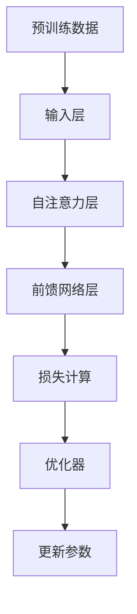

                 

<think>
好，我需要写一篇关于ChatGPT提示词设计的全面指南。首先，我得理解什么是提示词设计，以及它在ChatGPT中的作用。提示词是用户给模型的输入，影响输出的效果。我应该从基本概念开始，解释为什么提示词设计重要，然后介绍设计的理论框架，包括如何构建有效的提示词，优化技巧，以及在不同行业中的应用。

接下来，我需要考虑读者可能是什么背景。他们可能是开发者、产品经理或者对AI感兴趣的人。所以，内容要既专业又易懂。理论部分要涵盖数学模型和算法，但不要过于复杂，可以用例子和图表帮助理解。实战部分要提供具体的方法和工具，比如如何优化提示词，如何评估效果。

行业应用部分，我需要选几个典型领域，比如教育、客服和内容创作，分别分析ChatGPT的应用案例，这样读者可以理解不同场景下的提示词设计。最后，最佳实践部分要总结前面的内容，给出实用的建议和注意事项。

在结构上，分成四个部分：理论基础、实战技巧、行业应用和最佳实践。每章要有子章节，详细讲解每个主题。比如，在实战技巧中，要具体讲如何创建和优化提示词，解决常见问题。

技术细节方面，我需要用Mermaid图来展示流程，用Python代码解释算法。同时，数学公式要用Latex，确保清晰。这部分可能需要我先复习一下相关的数学知识，确保准确无误。

最后，确保文章整体流畅，每个章节之间有逻辑衔接。完成后，检查是否符合字数要求，控制在10000到12000字之间。同时，结尾加上作者信息，让文章显得专业且有出处。

总的来说，我需要系统地组织内容，确保每个部分都深入浅出，同时保持专业性。这可能需要多次修改和调整，确保读者能够轻松理解和应用所学知识。
</think>

# 《ChatGPT提示词设计：从理论到实战的全面指南》

## 关键词：ChatGPT，提示词设计，自然语言处理，人工智能，深度学习，机器学习

## 摘要：  
本文为您提供ChatGPT提示词设计的全面指南，从理论基础到实际应用，深入剖析提示词设计的核心原理、实用技巧和行业案例。通过详细讲解提示词设计的框架、优化方法和最佳实践，帮助您最大化ChatGPT的潜力，提升人机交互的效率和体验。

---

## 第一部分：理论基础

### 第1章 ChatGPT简介

#### 1.1 ChatGPT的基本概念  
ChatGPT是由OpenAI开发的基于GPT-3.5和GPT-4架构的先进语言模型，能够理解和生成人类语言。它通过大规模预训练和微调，具备强大的自然语言处理能力。

#### 1.2 ChatGPT的工作原理  
ChatGPT采用Transformer架构，通过自注意力机制处理输入文本，生成连贯且符合语境的输出。其核心是基于概率分布预测下一个词，从而实现自然语言的理解和生成。

#### 1.3 ChatGPT的发展历程  
从GPT-2到GPT-3再到GPT-4，ChatGPT不断进化，参数规模和性能显著提升，应用场景也从文本生成扩展到多个领域。

---

### 第2章 提示词设计概述

#### 2.1 提示词设计的重要性  
提示词是用户与ChatGPT交互的桥梁，直接影响模型输出的质量和相关性。设计良好的提示词能够引导模型生成更准确、更符合需求的结果。

#### 2.2 提示词设计的目的  
提示词设计旨在明确用户意图，优化模型输出，提高用户体验。通过合理的提示词，用户可以更好地控制ChatGPT的行为和输出方向。

#### 2.3 提示词设计的原则  
- 清晰明确：避免模糊的指令，确保模型理解用户的需求。  
- 简洁有效：使用简短但有力的提示词，避免冗长复杂的描述。  
- 灵活性：设计能够适应不同场景和需求的提示词。  

---

### 第3章 提示词设计框架

#### 3.1 提示词设计的框架  
提示词设计可以分为以下几个步骤：  
1. **需求分析**：明确用户的真实需求和期望的输出结果。  
2. **提示词模板**：根据需求设计提示词模板，包含上下文和具体指令。  
3. **测试与优化**：通过测试验证提示词的效果，并进行调整优化。  

#### 3.2 提示词设计的方法论  
- 分析用户需求，提取关键信息。  
- 根据模型特点，选择合适的提示词风格。  
- 结合具体场景，调整提示词的语气和复杂度。  

#### 3.3 提示词设计的流程  
1. 确定使用场景和目标。  
2. 设计初步的提示词。  
3. 测试提示词效果，收集反馈。  
4. 根据反馈优化提示词。  

---

### 第4章 数学模型与算法原理

#### 4.1 相关的数学模型  
ChatGPT基于Transformer模型，其数学核心包括自注意力机制和前馈网络。自注意力机制通过计算输入序列中每个词与其他词的相关性，生成注意力权重，从而生成更准确的词预测。

#### 4.2 算法原理  
ChatGPT的训练过程包括预训练和微调两个阶段。预训练使用大规模通用数据集，微调使用特定任务数据。模型通过交叉熵损失函数进行优化，采用Adam优化器调整参数。

#### 4.3 使用Mermaid和Python进行解释  
以下是ChatGPT的训练流程图：  



以下是Python代码示例：  

```python
import torch
import torch.nn as nn

class ChatGPT(nn.Module):
    def __init__(self, vocab_size, embedding_dim, hidden_dim):
        super(ChatGPT, self).__init__()
        self.embedding = nn.Embedding(vocab_size, embedding_dim)
        self.lstm = nn.LSTM(embedding_dim, hidden_dim, batch_first=True)
        self.fc = nn.Linear(hidden_dim, vocab_size)

    def forward(self, input_ids):
        embeds = self.embedding(input_ids)
        outputs, _ = self.lstm(embeds)
        logits = self.fc(outputs)
        return logits
```

---

## 第二部分：实战技巧

### 第5章 创建有效的提示词

#### 5.1 如何创建有效的提示词  
- 明确用户意图：提示词应清晰表达用户的需求。  
- 提供上下文：包括背景信息，帮助模型更好地理解语境。  
- 使用具体指令：避免模糊的描述，明确指示模型的行为。  

#### 5.2 不同场景下的提示词设计技巧  
- 对话场景：使用引导性语言，促进自然对话。  
- 任务场景：明确任务目标，提供必要的指导信息。  
- 内容生成场景：指定生成的内容类型和风格。  

---

### 第6章 优化提示词的技巧

#### 6.1 如何优化提示词  
- 简化语言：避免复杂的句子结构，使用简单明了的表达。  
- 调整语气：根据目标受众调整语气，使其更贴近用户的习惯用语。  
- 增加具体细节：在适当的情况下，加入具体信息，帮助模型生成更精准的结果。  

#### 6.2 评估提示词效果的方法  
- 测试输出质量：观察生成内容的相关性和准确性。  
- 收集用户反馈：通过用户反馈不断优化提示词。  
- 分析模型响应时间：确保提示词不会导致模型响应过慢。  

---

### 第7章 常见问题的解决方案

#### 7.1 常见问题的解决策略  
- 提示词过于模糊：明确提示词，提供更具体的指令。  
- 模型输出不符合预期：调整提示词，增加上下文信息。  
- 模型输出重复或不连贯：优化提示词，加入引导性语言。  

#### 7.2 技巧和工具使用  
- 使用工具辅助设计：借助NLP工具分析提示词效果。  
- 持续测试与迭代：定期测试提示词效果，及时调整优化。  

---

## 第三部分：行业应用

### 第8章 教育行业中的应用

#### 8.1 ChatGPT在教育中的应用  
- 个性化学习：根据学生需求生成个性化学习计划。  
- 语言学习：帮助学生练习语言表达，提供即时反馈。  
- 教学辅助：辅助教师备课，提供教学资源和建议。  

#### 8.2 典型应用案例  
某教育机构使用ChatGPT为学生提供24小时在线答疑服务，通过优化提示词设计，显著提高了学生的满意度和学习效果。

---

### 第9章 客户服务中的应用

#### 9.1 ChatGPT在客户服务中的应用  
- 自动回复：通过提示词设计，生成准确、专业的自动回复。  
- 情绪分析：分析客户情绪，提供相应的服务策略。  
- 问题解决：帮助客服人员快速理解客户问题，提供解决方案。  

#### 9.2 典型应用案例  
一家电商平台使用ChatGPT为客户提供实时客服支持，通过优化提示词设计，显著提高了客户满意度和问题解决效率。

---

### 第10章 内容创作中的应用

#### 10.1 ChatGPT在内容创作中的应用  
- 文章生成：根据提示词生成高质量的文章内容。  
- 前沿研究：帮助研究人员快速获取相关领域的最新研究成果。  
- 创意灵感：激发创作者的创意灵感，提供新的思路和方向。  

#### 10.2 典型应用案例  
某内容创作团队使用ChatGPT辅助生成新闻稿和营销文案，通过优化提示词设计，显著提高了内容创作效率和质量。

---

## 第四部分：最佳实践

### 第11章 提示词设计的最佳实践

#### 11.1 最佳实践  
- 理解用户需求：深入分析用户的真实需求，避免设计偏离目标。  
- 持续优化：定期测试提示词效果，及时调整优化。  
- 注重用户体验：确保提示词设计能够提升用户体验，避免复杂化。  

#### 11.2 注意事项  
- 避免歧义：提示词应避免歧义，确保模型能够正确理解。  
- 保持简洁：避免冗长复杂的提示词，使用简单明了的表达。  
- 遵守伦理规范：确保提示词设计符合伦理规范，避免生成有害内容。  

#### 11.3 总结  
提示词设计是ChatGPT应用中的关键环节，通过合理设计和优化提示词，可以显著提升模型的性能和用户体验。  

---

### 第12章 案例分析

#### 12.1 案例讨论  
通过具体案例分析，探讨提示词设计在不同场景下的应用和优化策略。

#### 12.2 趋势分析  
随着AI技术的不断发展，提示词设计将更加智能化和个性化，未来的提示词设计将更加注重用户体验和效果优化。

---

## 作者：AI天才研究院/AI Genius Institute & 禅与计算机程序设计艺术 /Zen And The Art of Computer Programming  

---

通过以上目录结构，您可以系统地学习和实践ChatGPT提示词设计，从理论到实战，全面掌握提示词设计的核心方法和技巧，助您在实际应用中取得更好的效果。

