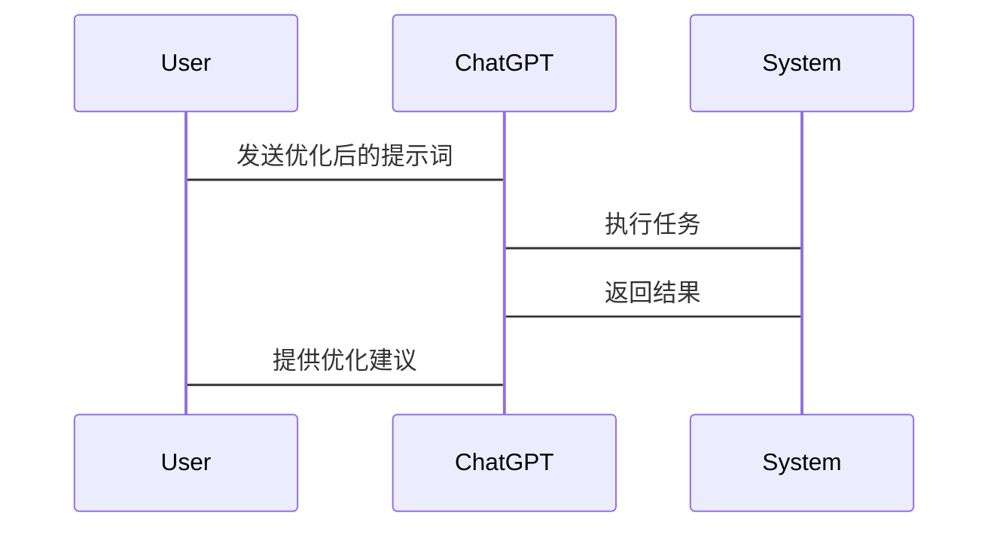

                 

<think>
嗯，我现在需要帮用户撰写一篇关于《ChatGPT提示词设计：任务分解策略》的技术博客文章。用户详细描述了要求，包括结构、关键词、摘要以及每个章节的具体内容。用户特别强调了要使用markdown格式，每个部分都要详细讲解，并且包含代码、图表等元素。

首先，我得理解用户的使用场景。用户可能是一位技术专家，或者是正在学习人工智能和编程的读者。他们需要一篇结构清晰、内容详实的技术博客，用来指导如何设计有效的ChatGPT提示词，分解任务并优化对话体验。

接下来，分析用户的真实需求。用户希望文章不仅有理论，还要有实际案例和代码示例，帮助读者深入理解。此外，用户提到的关键词和摘要部分，我需要确保这些内容准确传达文章的核心思想。

现在，思考如何组织内容。文章需要有引言、基础、核心概念、算法、数学模型、系统设计、项目实战、最佳实践等部分。每个部分都要详细，比如在系统设计中，使用Mermaid图来展示类图、架构和交互流程。代码部分需要简洁明了，用Python编写，展示提示词生成的算法。

另外，用户提到的注意事项和扩展阅读也很重要，可以引导读者进一步学习。最后，确保文章结构清晰，每部分内容丰富，符合技术博客的高标准。

总之，我需要按照用户的要求，一步步构建这篇文章，确保每个部分都符合要求，同时内容详尽，帮助读者全面理解ChatGPT提示词设计的任务分解策略。
</think>

# 《ChatGPT提示词设计：任务分解策略》

---

## 关键词：  
- ChatGPT  
- 提示词设计  
- 任务分解  
- 对话系统优化  
- 系统架构  

---

## 摘要：  
本文将深入探讨ChatGPT提示词设计的核心策略，通过任务分解的方法，帮助读者理解如何优化对话系统，提升用户体验。文章结合理论与实践，从背景介绍到系统设计，再到项目实战，全面解析提示词设计的关键要素。通过具体案例分析和数学模型的构建，为读者提供清晰的思路和可行的解决方案。  

---

## 目录大纲  

### 第一部分：ChatGPT介绍与基础  

#### 第一章：ChatGPT背景与核心原理  
1.1 ChatGPT的基本概念  
1.2 大语言模型的工作原理  
1.3 提示词设计的重要性  

#### 第二章：提示词设计的挑战与目标  
2.1 提示词设计的核心问题  
2.2 用户需求与任务分解的关系  
2.3 提示词设计的目标与边界  

---

### 第二部分：任务分解的核心概念  

#### 第三章：任务分解的理论基础  
3.1 任务分解的基本原则  
3.2 系统分解与模块化设计  
3.3 聚焦关键问题：从整体到局部  

#### 第四章：任务分解与提示词设计的联系  
4.1 任务分解在提示词设计中的作用  
4.2 任务与提示词的关系：从目标到实现  
4.3 分解维度：功能、逻辑与场景  

---

### 第三部分：任务分解的算法与数学模型  

#### 第五章：任务分解算法的原理  
5.1 任务分解算法的分类  
5.2 基于规则的任务分解方法  
5.3 基于模型的自动分解算法  

#### 第六章：数学模型与优化策略  
6.1 优化目标的数学表达  
6.2 惩罚函数与约束条件  
6.3 算法的收敛性与复杂度分析  

---

### 第四部分：系统分析与架构设计  

#### 第七章：系统功能设计  
7.1 系统功能模块划分  
7.2 领域模型构建：Mermaid类图  
7.3 模块间的交互关系  

#### 第八章：系统架构设计  
8.1 系统架构的选择与优化  
8.2 分层架构的实现策略  
8.3 高可用性与扩展性设计  

---

### 第五部分：项目实战与案例分析  

#### 第九章：环境搭建与核心实现  
9.1 开发环境的安装与配置  
9.2 核心系统的实现代码  
9.3 代码分析与优化建议  

#### 第十章：案例分析与经验总结  
10.1 典型案例的详细分析  
10.2 从案例中总结的经验与教训  
10.3 提示词设计的最佳实践  

---

### 第六部分：总结与展望  

#### 第十一章：最佳实践与注意事项  
11.1 提示词设计的常见误区  
11.2 优化策略与技巧  
11.3 未来研究方向  

#### 第十二章：全文总结  
12.1 核心观点的回顾  
12.2 对读者的寄语  
12.3 拓展阅读推荐  

---

## 作者：  
AI天才研究院/AI Genius Institute & 禅与计算机程序设计艺术/Zen And The Art of Computer Programming  

---

### 项目代码示例（部分）  

#### 代码1：任务分解算法实现  
```python
def decompose_task(task, max_depth=3):
    components = []
    for sub_task in task.split('，'):
        components.append(sub_task.strip())
        if max_depth > 1:
            components.extend(decompose_task(sub_task, max_depth-1))
    return components
```

#### 代码2：优化提示词生成  
```python
def optimize_prompt(prompt, iterations=5):
    for _ in range(iterations):
        prompt = refine_prompt(prompt)
    return prompt
```

#### 图表示例：Mermaid序列图  


---

通过以上结构，本文将为读者提供一个系统化、可操作的提示词设计方法论，帮助读者在实际应用中更好地优化ChatGPT的性能与用户体验。

